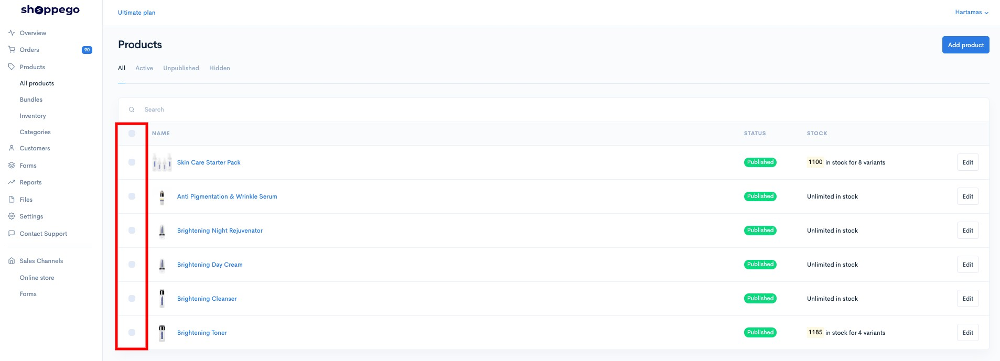
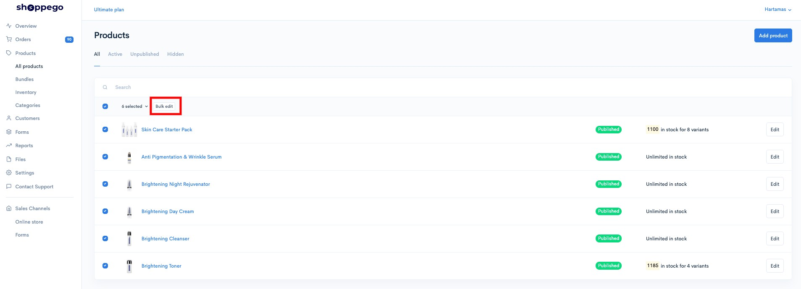
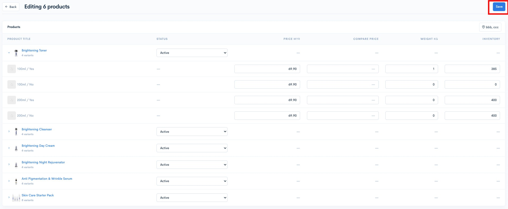

# Products

Menguruskan produk jualan anda bermula dengan memuat naik produk , produk variant, penetapan option dan sebagainya.

## Bulk Edit

Dari halaman dashboard Products juga, anda boleh lakukan perubahan penetapan variants produk anda secara bulk. Terdapat beberapa perubahan maklumat yang anda boleh lakukan iaitu, Variants Price, Compare at price, Weight dan Inventory.

Untuk menggunakan fungsi bulk edit itu, anda boleh:

1. Log masuk dalam akaun Shoppego

<figure><figcaption></figcaption></figure>

2. Klik pada **Products**

<figure><figcaption></figcaption></figure>

3. Tick pada produk yang anda ingin lakukan perubahan secara bulk itu.

<figure><figcaption></figcaption></figure>

4. Klik pada **Bulk edit**

<figure><figcaption></figcaption></figure>

5. Seterusnya, anda boleh lakukan perubahan seperti biasa dan klik **Save**

<figure><figcaption></figcaption></figure>

Anda juga boleh lihat penetapan untuk:


[Physical Product](products/physical-product.md)



[Digital Product](products/digital-product.md)



[Options](products/options.md)



[Variants](products/variants.md)



[Purchase Limit](products/purchase-limit.md)



[Wholesale](products/wholesale.md)



[SEO Snippet](products/seo-snippet.md)



[Bundles](products/bundles.md)



[Categories](products/categories.md)

