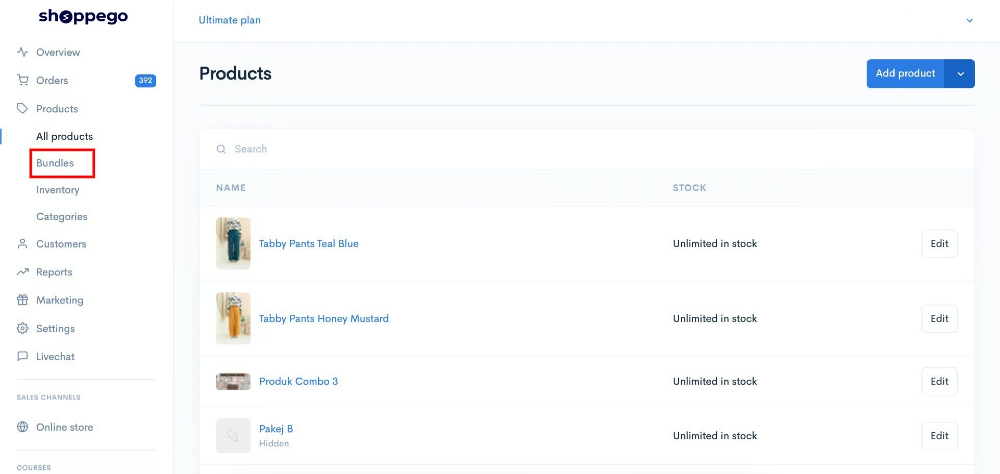
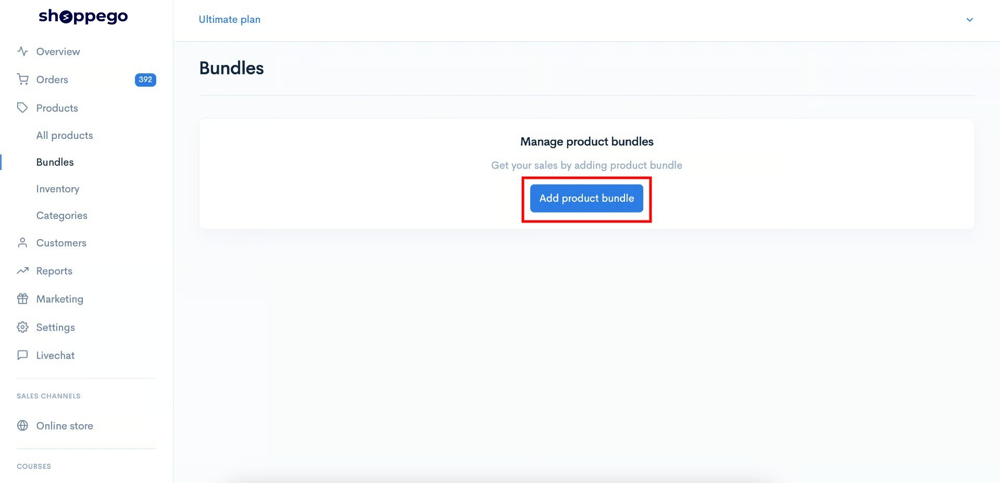
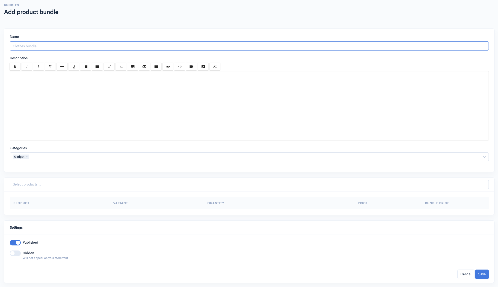
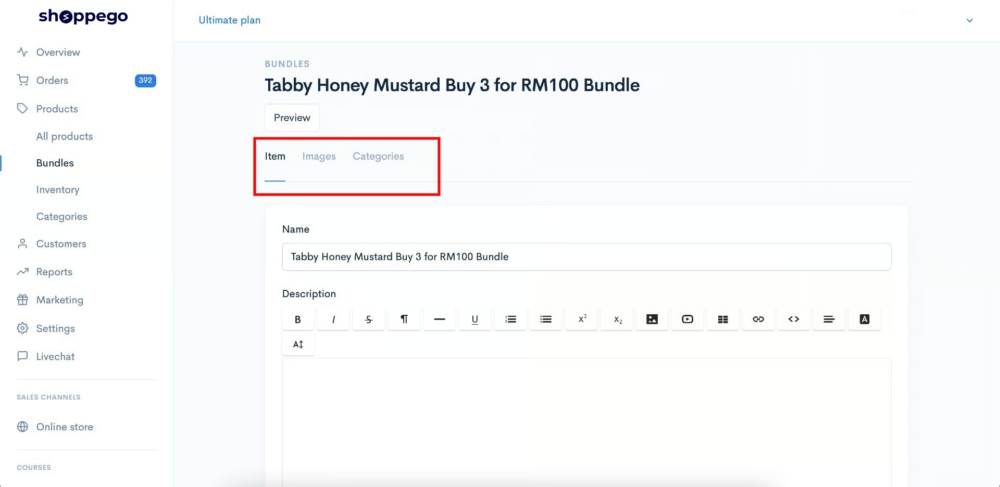

# Bundles


Penetapan produk bundle ini ianya hanya terdapat pada langganan **plan&#x20;**<mark style="color:blue;">**Ultimate**</mark> sahaja.



Fungsi ini boleh digunakan untuk **Themes Hartamas, Tampin** dan **Solaris** sahaja.


## &#x20;Penambahan Produk Bundle

Untuk memulakan penambahan produk bundle, anda boleh ikuti langkah dibawah:

1. Log masuk dalam akaun Shoppego -> Klik pada **Products** -> Klik pada **Bundles.**

<figure><figcaption></figcaption></figure>

2. Klik pada butang **Add product bundle.**

<figure><figcaption></figcaption></figure>

3. Selepas itu, anda boleh teruskan tetapkan penetapan produk bundle yang anda inginkan.

<figure><figcaption></figcaption></figure>

<table><thead><tr><th width="204">Tajuk</th><th>Penerangan</th></tr></thead><tbody><tr><td><strong>Name</strong></td><td>Nama produk bundle anda.</td></tr><tr><td><strong>Description</strong></td><td>Penerangan ringkas berkaitan produk bundle anda.</td></tr><tr><td><strong>Categories</strong></td><td>Kategori yang ditetapkan untuk produk bundle anda.</td></tr><tr><td><strong>Select products</strong></td><td>Produk yang akan berada dalam produk bundle anda.</td></tr><tr><td><strong>Product</strong></td><td>Paparan nama produk anda.</td></tr><tr><td><strong>Variant</strong></td><td>Paparan nama variants produk anda</td></tr><tr><td><strong>Quantity</strong></td><td>Paparan kuantiti produk bundle anda. Rujuk <a href="bundles.md#1-kuantiti">sini</a>.</td></tr><tr><td><strong>Price</strong></td><td>Paparan harga asal produk anda.</td></tr><tr><td><strong>Bundle Price</strong></td><td>Penetapan harga bundle untuk produk anda.</td></tr><tr><td><strong>Published</strong></td><td>Pastikan fungsi ini anda enable supaya produk anda akan dapat dilihat pada website anda.</td></tr><tr><td><strong>Hidden</strong></td><td>Jika anda ingin hide produk anda daripada customer dan hanya share produk tersebut kepada orang - orang tertentu anda boleh enable fungsi ini.</td></tr></tbody></table>

### 1: Kuantiti

Penetapan kuantiti dibahagikan kepada dua jenis iaitu **Fixed Quantity** dan **None (Kotak Fixed Quantity tidak ditanda).**

* **Fixed Quantity** - Kuantiti produk dengan **Fixed Quantity telah ditetapkan** dan **tidak boleh diubah**. Jika harga Bundle ditetapkan, kuantiti produk akan dijual dengan harga tersebut.\
  \
  Sebagai contoh, jika **kuantiti adalah 3** dan **harga Bundle ialah RM10**, maka **3 produk** akan dijual dengan **harga RM10**.&#x20;
* **None** - Kuantiti boleh diubah mengikut keperluan pelanggan.

## Bundles

Setiap produk bundle yang anda sudah cipta boleh diakses melalui:

1. Log masuk dalam akaun **Shoppego -> Klik pada Products -> Klik pada Bundles.**

<figure><figcaption></figcaption></figure>

Sekiranya anda klik pada mana-mana produk bundle, anda akan dapat lihat 3 tab penetapan, iaitu:

<figure><figcaption></figcaption></figure>

### 1 : Items

Didalam penetapan ini, anda boleh lakukan perubahan semula kepada penetapan produk bundle anda

### 2 : Images

Didalam penetapan ini, anda boleh masukkan gambar kedalam produk bundle anda.


**Fail imej yang disokong** adalah **jpg, jpeg, png, gif,** dan **webp** sahaja.


### 3 : Categories

Didalam penetapan ini, anda boleh lakukan perubahan/penambahan kategori produk bundle anda.

## Info tambahan

Dengan fungsi produk bundle ini, terdapat beberapa senario yang anda boleh lakukan, antaranya:


[Beli 3 untuk RM100](bundles/beli-3-untuk-rm100.md)



[Beli 2 Produk 1 Harga](bundles/beli-2-produk-1-harga.md)



[Beli 1 Bundle dan Clearance](bundles/beli-1-bundle-dan-clearance.md)

