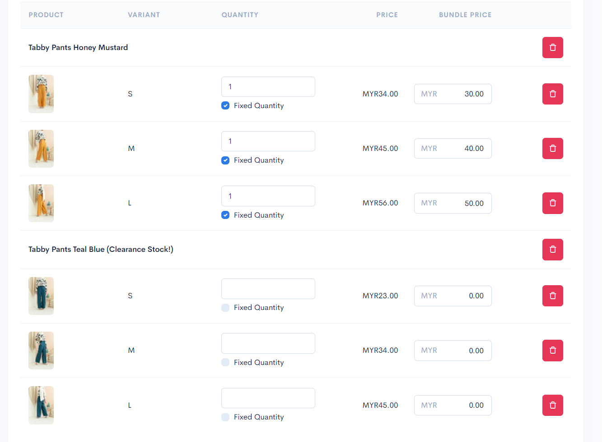
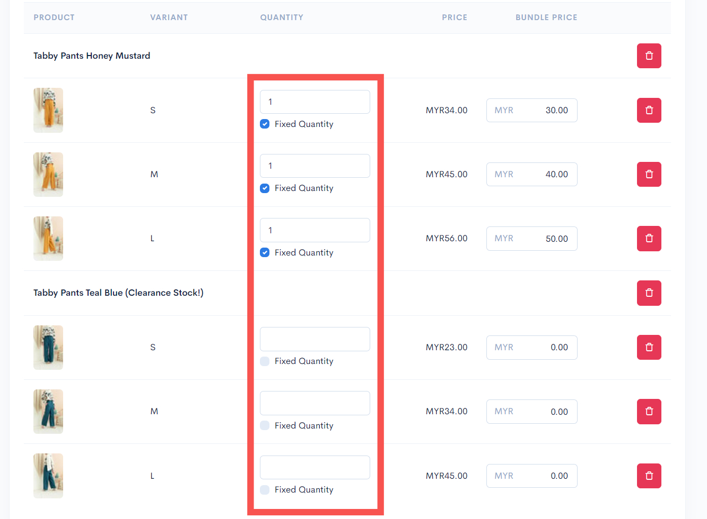
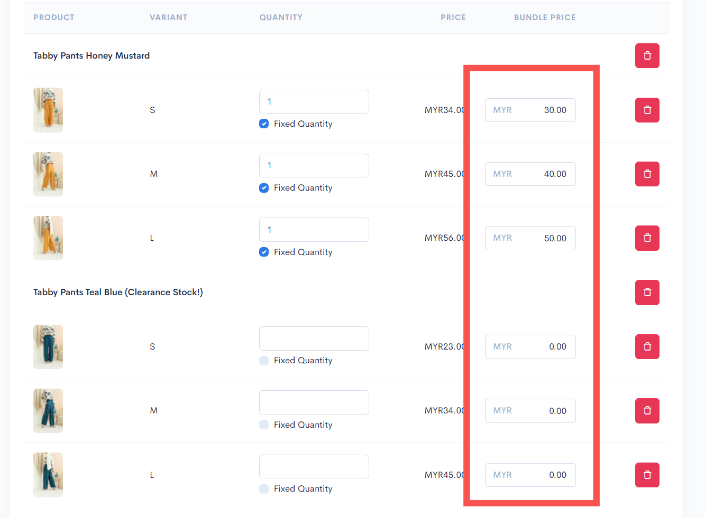
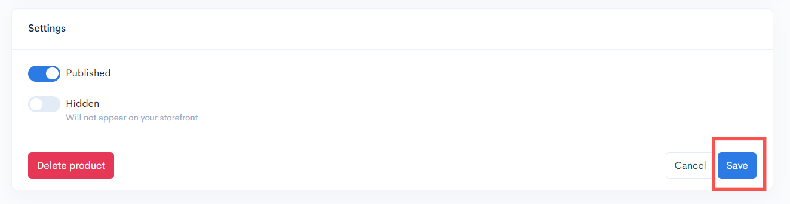
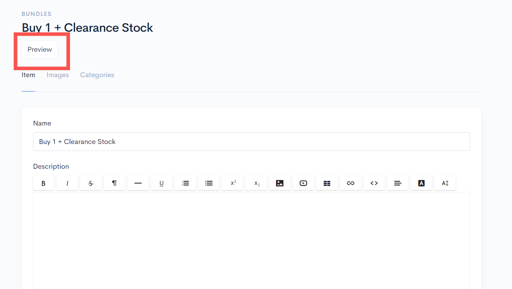
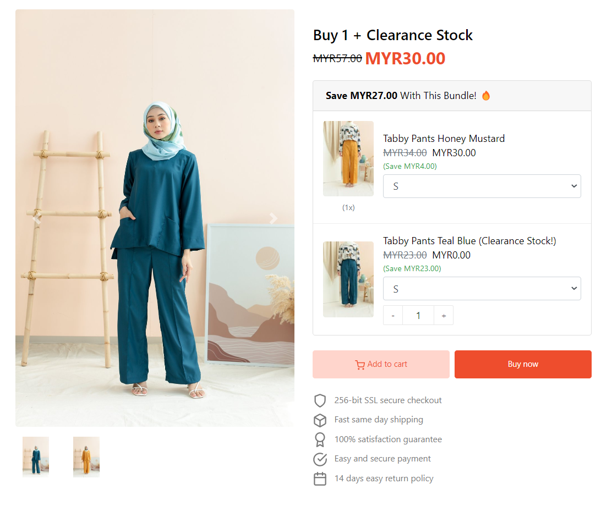

# Beli 1 Bundle dan Clearance

Pada tutorial senario ini, anda akan lakukan penetapan bagi **1 produk Bundle bersama stok penghabisan (clearance stock).**

Contoh produk yang akan digunakan didalam ini adalah **Tabby Pants Honey Mustard** dan **Tabby Pants Teal Blue**. Penetapan anda boleh rujuk langkah dibawah:

1. Masukkan produk yang anda ingin pelanggan beli seperti pada paparan dibawah :


Bagi Item Clearance anda boleh masukkan **nilai 0 (100% diskaun)** atau harga sendiri bagi stok penghabisan.


<figure><figcaption></figcaption></figure>

2. Kemudian, anda boleh tick pada checkbox **Fixed quantity** pada setiap penetapan produk itu dan masukkan **nilai 1** pada setiap ruangan kuantiti yang tersedia.&#x20;


Penetapan ini akan memastikan **pelanggan hanya boleh pilih 1 sahaja** bagi setiap produk ini.


<figure><figcaption></figcaption></figure>

3. Anda boleh masukkan **harga** untuk produk tersebut.

<figure><figcaption></figcaption></figure>

4. Setelah selesai, tekan butang **Save**.

<figure><figcaption></figcaption></figure>

5. Anda boleh klik pada butang **Preview** untuk cuba lihat produk bundle anda dan cuba lakukan pembelian.

<figure><figcaption></figcaption></figure>

Ini adalah paparan produk bundle tersebut di website(Themes Hartamas):

<figure><figcaption></figcaption></figure>
