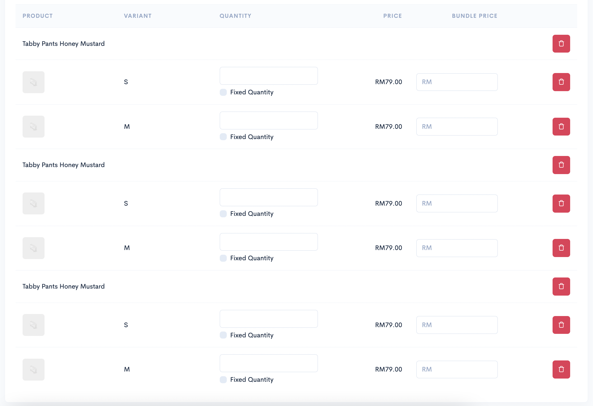
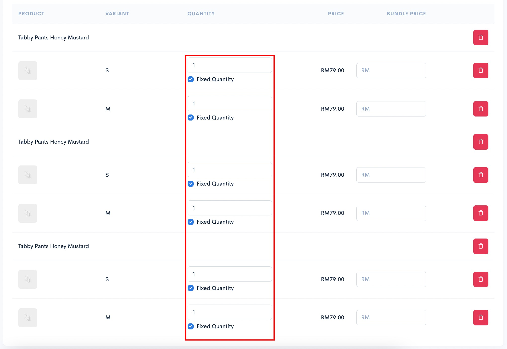
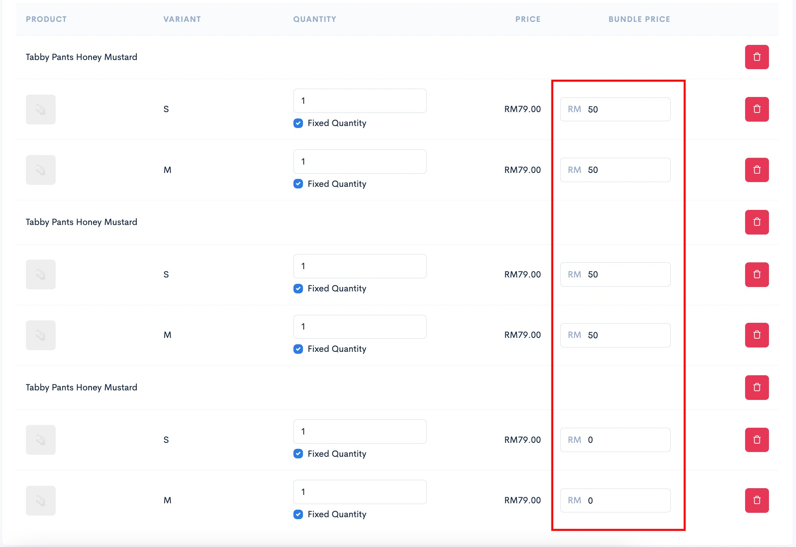
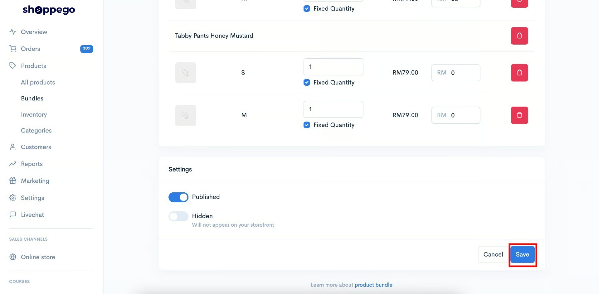
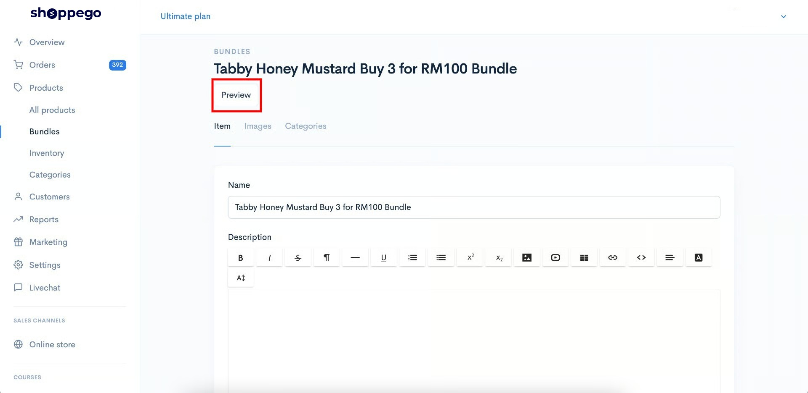
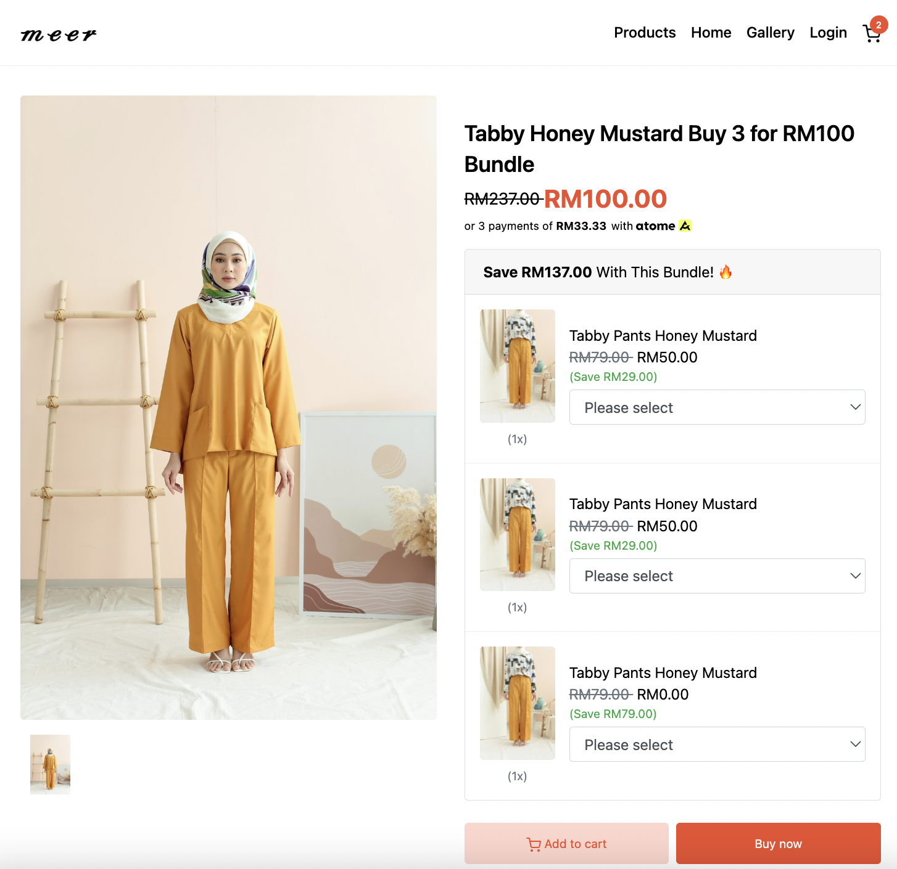

# Beli 3 untuk RM100

Untuk lakukan penetapan produk bundle bagi senario ini, anda boleh rujuk langkah dibawah:

1. Pertama sekali anda boleh masukkan produk yang anda ingin pelanggan beli sebanyak 3 kali tersebut. Pastikan anda telah masukkan produk itu sebanyak 3 kali seperti pada paparan dibawah:

<figure><figcaption></figcaption></figure>

2. Kemudian, anda boleh tick pada checkbox Fixed quantity pada setiap penetapan produk itu dan masukkan nilai 1 pada setiap ruangan kuantiti yang tersedia.&#x20;


Penetapan ini akan memastikan **pelanggan hanya boleh pilih 1 sahaja** bagi setiap ruangan produk ini.


<figure><figcaption></figcaption></figure>

3. Kemudian, anda boleh masukkan harga bagi setiap produk tersebut di ruangan Bundle price, untuk memastikan jumlah keseluruhan produk menjadi RM100 seperti yang anda inginkan. Ruang ini juga anda boleh isi dengan jumlah 0.

<figure><figcaption></figcaption></figure>

3. Setelah selesai klik **Save**.

<figure><figcaption></figcaption></figure>

Kini penetapan anda sudah selesai, anda boleh klik pada butang **Preview** untuk cuba lihat produk bundle anda dan cuba lakukan pembelian.

<figure><figcaption></figcaption></figure>

Ini adalah paparan produk bundle tersebut di website(Themes Hartamas):

<figure><figcaption></figcaption></figure>
