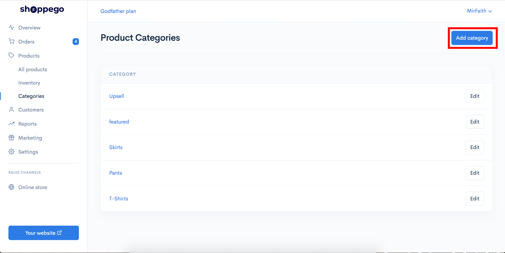
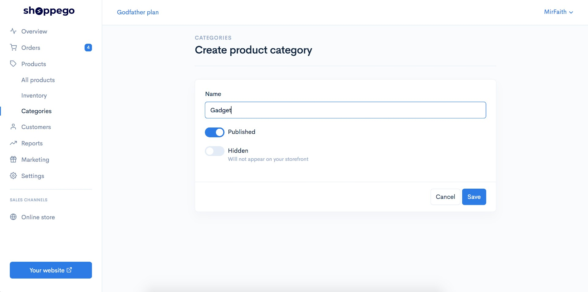
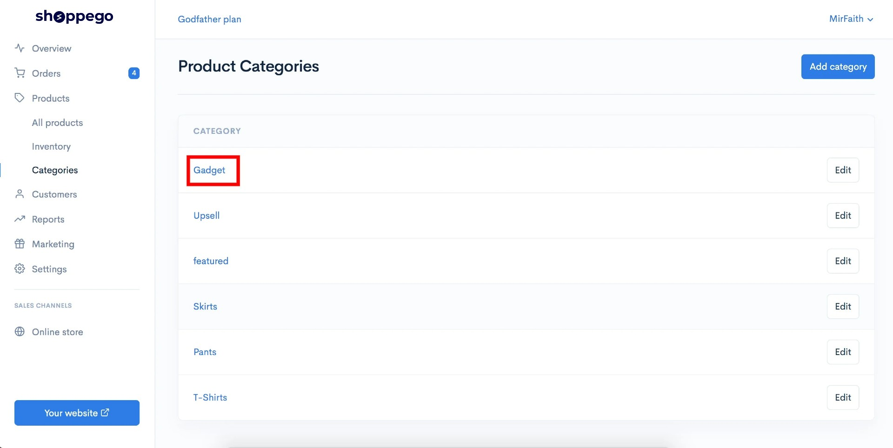
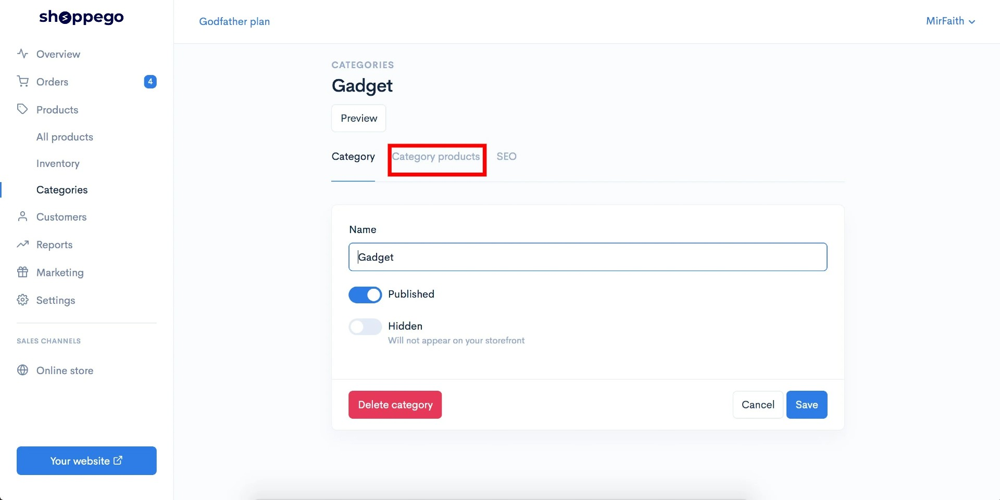
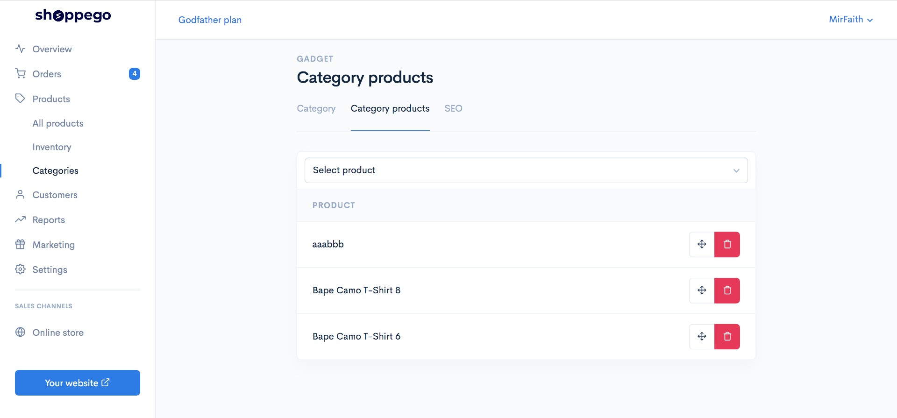
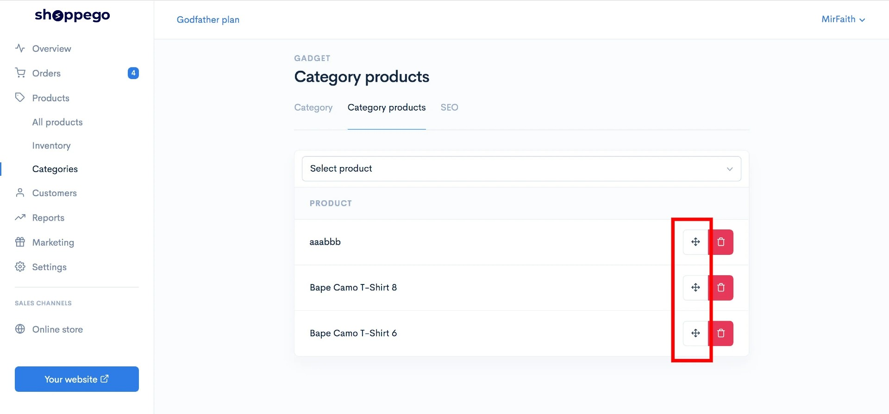

# Categories

Categories boleh digunakan untuk **mengasingkan produk** anda mengikut kategori masing - masing.


[Featured Category](categories/featured-category.md)


**Contohnya**: Di dalam website anda, anda **menjual barang gadget** dan juga **pakaian**. Jadi anda boleh **create categories Pakaian** dan juga **Gadget** didalam website anda.

**Categories** juga boleh digunakan untuk anda **susun produk anda pada homepage** website anda. Anda boleh rujuk tutorial di bawah ini :&#x20;


[Category Products](categories/category-products.md)


## Setup Categories

1\. Log masuk ke akaun Shoppego anda klik pada **Products** -> **Categories**

2\. Seterusnya klik pada button **Add category.**

3\. Nanti akan keluar paparan seperti dibawah dan anda boleh masukkan nama kategori yang anda inginkan. (Contoh : Gadget) Setelah selesai anda boleh klik button **Save**. (Pastikan category tersebut anda **Published**)

Selesai sudah setup categories pada website anda.

## Masukkan produk kedalam category.

Sebelum anda meneruskan tutorial ini pastikan anda telah menambahkan produk anda terlebih dahulu dan save produk tersebut.&#x20;

1\. Pada pages Categories tersebut anda klik pada category yang anda baru sahaja create tadi pada step sebelum ini.

2\. Seterusnya anda akan dibawa seperti paparan dibawah. Anda perlu klik pada **Category products**.

3\. Setelah anda klik Category products tersebut anda boleh klik **Select product** dan masukkan produk yang anda ingin berada didalam category tersebut.

## Susun produk

Jika anda ingin susun produk anda supaya kelihatan kemas. Anda perlu klik pada category yang anda set untuk ditunjukkan pada homepage anda serta yang mengandungi kesemua produk anda dan pergi ke bahagian **Category products**.

1\. Untuk susun produk anda boleh drag button anak panah tersebut untuk susun produk anda.

**Anda boleh lihat hasilnya pada homepage website anda.**
