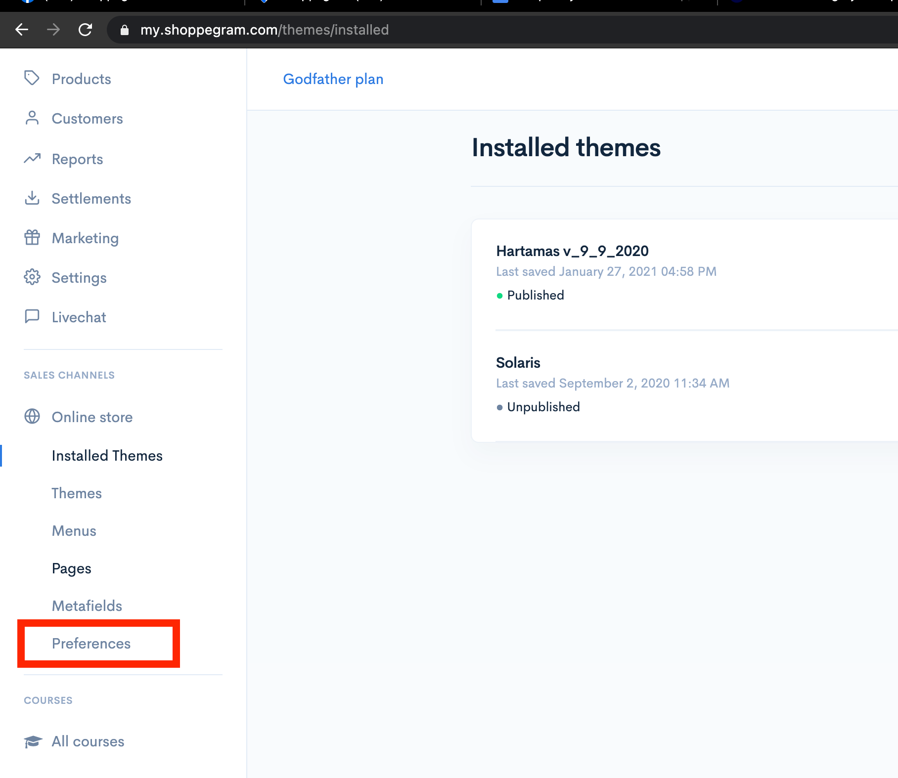
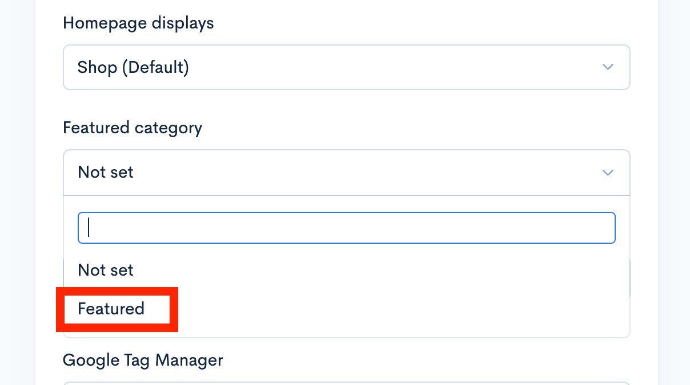
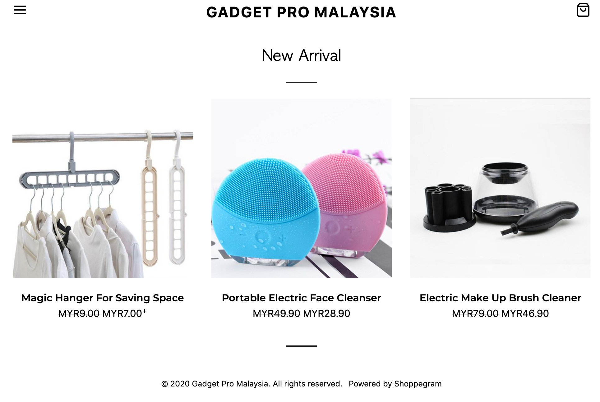

# Featured Category


\*\*<mark style="color:red;">**Perhatian**</mark>: **Featured products** adalah satu fungsi di mana hanya **produk yang ditetapkan sahaja** yang akan **dipaparkan pada homepage**.&#x20;


Anda tidak perlu mencipta **Featured Category** ini, kerana fungsi ini telah pun tersedia untuk terus digunakan.

## **Langkah 1: Tetapkan Featured categories di Preferences**

Pergi pada **Online store** -> **Preferences**&#x20;

\
Pada ruangan **Featured category** pastikan pilihan Featured dibuat dengan klik pada category tersebut. \
\
&#x20;**Featured** telah tersedia dan boleh dipilih terus.

Seterusnya klik butang **Save.**

Semak pada homepage anda dan paparan category yang telah ditetapkan tadi akan keluar.

