# Digital Product

Produk digital ialah produk yang tidak mempunyai rupa bentuk fizikal seperti E-book dan online course.

Untuk tambah produk digital anda pada sistem Shoppego, anda boleh masukkan produk anda terlebih dahulu dengan rujuk pada langkah dibawah.

## Bahagian 1 : Tambah Produk

1. Log in ke akaun Shoppego anda -> Klik pada **Products** -> **Add product**

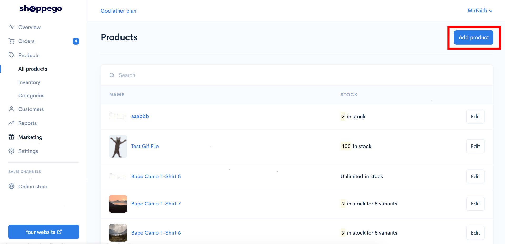

2. Anda akan dibawa ke pages product. Disitu anda perlu masukkan details produk anda seperti:

<table><thead><tr><th width="249">Tajuk</th><th>Penerangan</th></tr></thead><tbody><tr><td><strong>Name</strong> </td><td><strong>Nama produk anda</strong></td></tr><tr><td><strong>Description</strong> </td><td><strong>Huraian produk anda ( Seperti saiz, warna dan lain - lain )</strong></td></tr><tr><td><strong>Categories</strong> </td><td><strong>Kategori bagi produk tersebut ( By default sistem kami akan pilihkan kategori featured untuk setiap produk baru yang anda buat )</strong></td></tr><tr><td><strong>Price</strong></td><td><strong>Harga promo produk anda atau Harga yang pelanggan akan bayar semasa checkout</strong></td></tr><tr><td><strong>Compare at price</strong></td><td><strong>Harga asal produk anda</strong></td></tr><tr><td><strong>Manage stock</strong></td><td><strong>Anda perlu enable fungsi ini jika produk anda mempunyai kuantiti tertentu.</strong></td></tr><tr><td><strong>SKU(Stock Keeping Unit)</strong></td><td><strong>Anda boleh gunakan fungsi ini jika anda ingin pantau prestasi produk anda menggunakan SKU dan bukannya nama variants</strong></td></tr><tr><td><strong>Stock</strong></td><td><strong>Masukkan kuantiti produk anda pada location Default store anda(Jika anda enable fungsi Manage stock tersebut)</strong></td></tr><tr><td><strong>Edit locations</strong></td><td><strong>Anda boleh klik pada teks ini jika anda ingin matikan stock ini pada lokasi tertentu</strong></td></tr><tr><td><strong>Published</strong></td><td><strong>Pastikan fungsi ini anda enable supaya produk anda akan dapat dilihat pada website anda.</strong></td></tr><tr><td><strong>Require Shipping or Pickup</strong> </td><td><strong>Enable fungsi ini jika produk yang anda jual memerlukan penghantaran.</strong></td></tr><tr><td><strong>Hidden</strong> </td><td><strong>Jika anda ingin hide produk anda daripada customer dan hanya share produk tersebut kepada orang - orang tertentu anda boleh enable fungsi ini.</strong></td></tr></tbody></table>

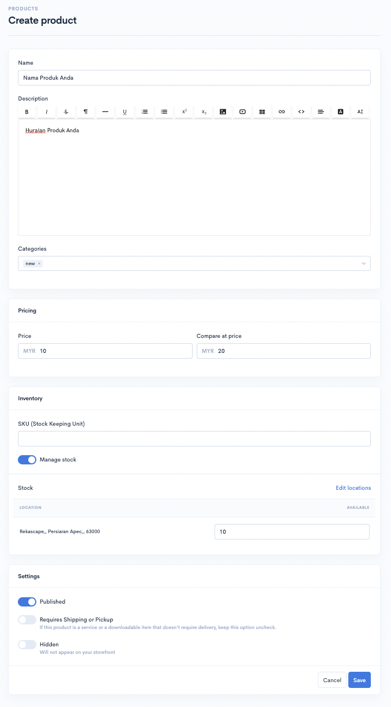

3. Setelah selesai anda boleh klik butang **Save.**

<figure>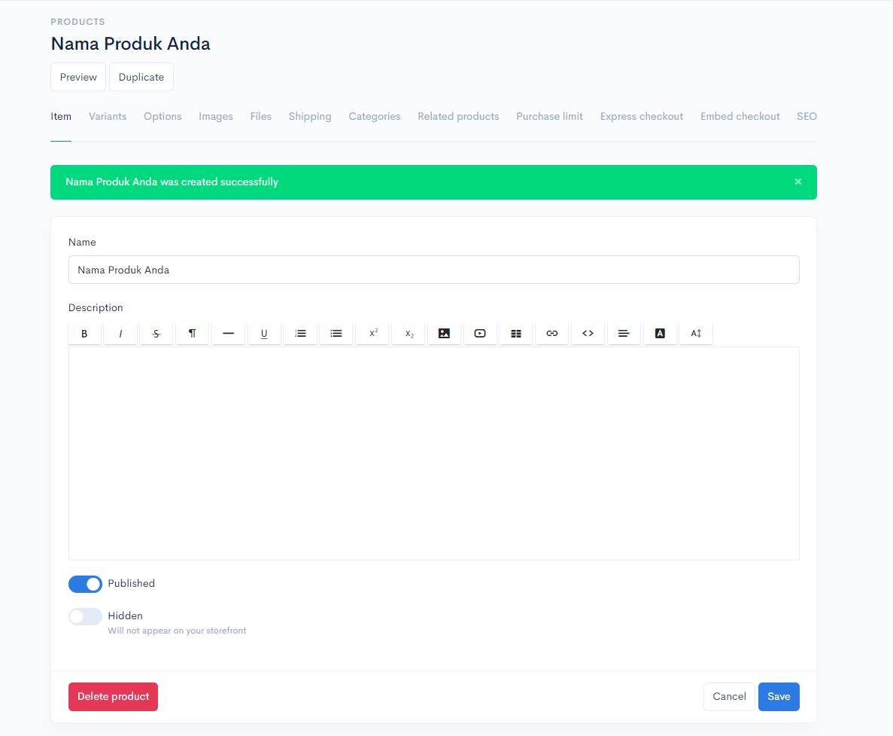<figcaption></figcaption></figure>

## Bahagian 2 : Inventori

### 1. View Inventory Logs


\*\*<mark style="color:red;">**Perhatian**</mark> : **Bahagian SKU** adalah untuk **memantau data bagi produk anda** dan <mark style="color:red;">**bukan**</mark>**&#x20;untuk kemaskini stok.**


Pada bahagian ini anda dapat melihat perubahan atau jejak kuantiti yang dilakukan pada bahagian stok produk.

1. Klik pada **View inventory logs**.

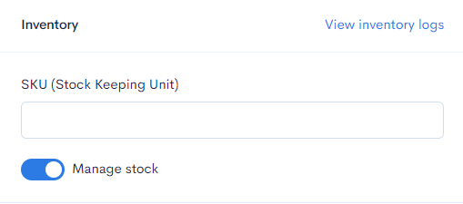

2. Pada ruangan ini akan tercatat segala perubahan yang dilakukan pada bahagian quantity stock produk.

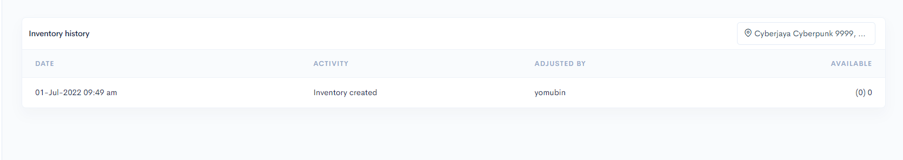

<table><thead><tr><th width="161">Tajuk</th><th>Penerangan</th></tr></thead><tbody><tr><td><strong>Alamat</strong> </td><td><strong>Anda boleh menukar alamat pada ruangan ini untuk melihat perubahan logs berdasarkan lokasi.</strong></td></tr><tr><td><strong>Date</strong> </td><td><strong>Tarikh setiap perubahan dilakukan.</strong></td></tr><tr><td><strong>Activity</strong> </td><td><strong>Merujuk pada perkara yang anda lakukan semasa mengubah quantity stock.</strong></td></tr><tr><td><strong>Adjusted by</strong></td><td><strong>Merujuk kepada penama yang melakukan perubahan kepada stock tersebut.</strong></td></tr><tr><td><strong>Available</strong> </td><td><strong>Merujuk kepada nilai terbaru stock.</strong></td></tr></tbody></table>

### 2 : Stok Produk

1. Untuk **lakukan penambahan stok produk**, anda perlu masukkan kedalam ruang yang telah disediakan. Anda hanya perlu tekan dropdown itu sahaja.

<figure>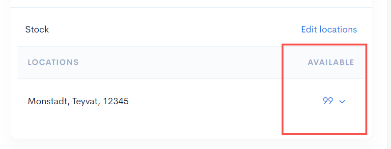<figcaption></figcaption></figure>

2. Selepas itu, anda boleh **pilih sebab atau maklumat yang berkaitan** dengan perubahan stok produk anda.

<figure>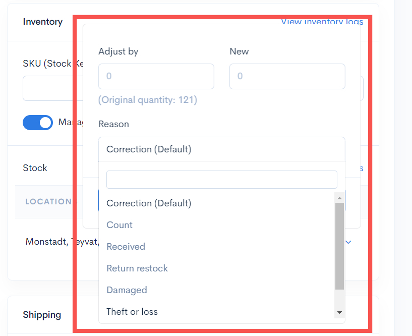<figcaption></figcaption></figure>

3. Anda akan lihat nilai kemaskini terbaru bagi stok produk anda.


Jika butang **Manage Stock&#x20;**<mark style="color:red;">**tidak**</mark>**&#x20;dihidupkan**, produk anda akan dikira mempunyai **stok tanpa had (**<mark style="color:blue;">**unlimited**</mark>**).**


<figure>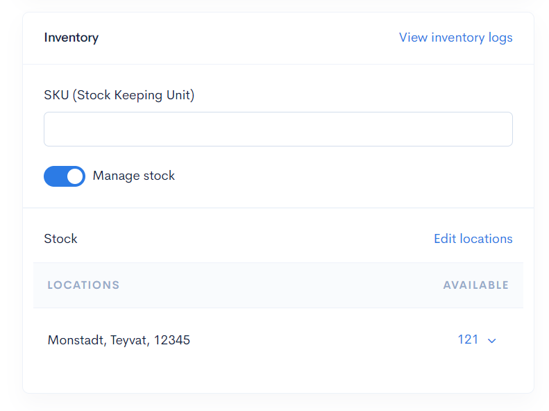<figcaption></figcaption></figure>

4. Jika anda menekan butang **View Inventory Logs**, anda akan lihat senarai maklumat bagi perubahan stok produk anda.

<figure>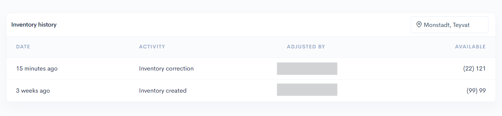<figcaption></figcaption></figure>

## Bahagian 3 : Imej Produk

Setelah selesai masukkan details produk anda, anda boleh masukkan gambar untuk produk tersebut.


**Fail imej yang disokong** adalah **jpg, jpeg, png, gif,** dan **webp** sahaja.


1\. Untuk masukkan gambar anda boleh klik pada **Images.**

<figure>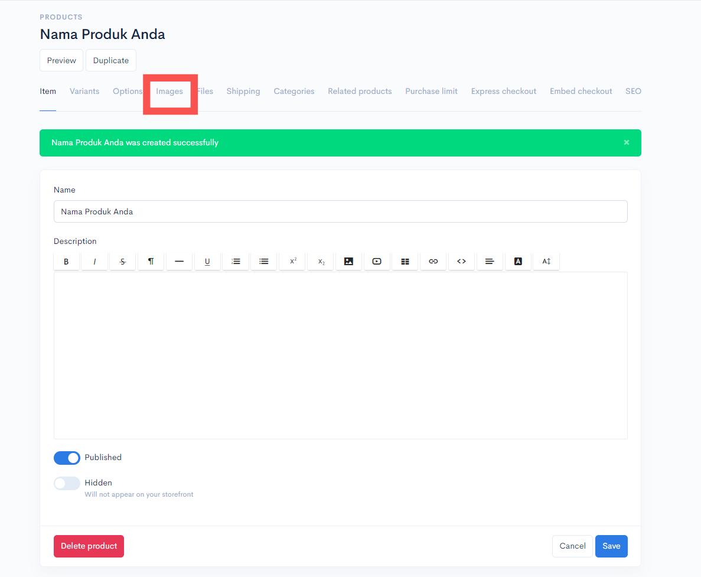<figcaption></figcaption></figure>

2\. Seterusnya, klik pada **Add image** dan masukkan gambar yang anda inginkan. Anda boleh masukkan seberapa banyak gambar yang anda inginkan.&#x20;


(**Saiz terbaik produk**: 1000px X 1000px | **Saiz gambar terbaik**: Kurang dari 200kb)


<figure>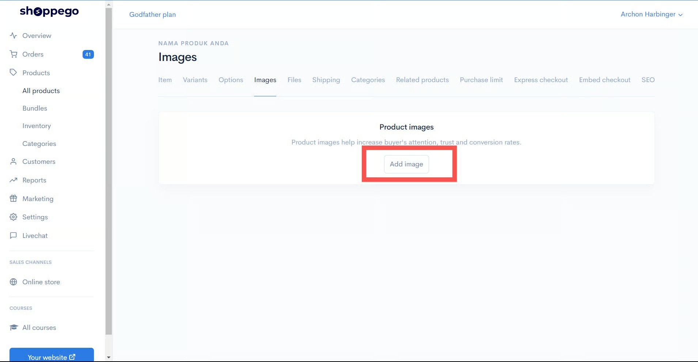<figcaption></figcaption></figure>

3\. Setelah anda berjaya upload gambar produk anda, popup Uploaded akan terpapar pada skrin tersebut.&#x20;


Jika anda ingin susun gambar produk tersebut anda boleh **drag button anak panah dan susun kedudukan gambar produk anda**.


<figure>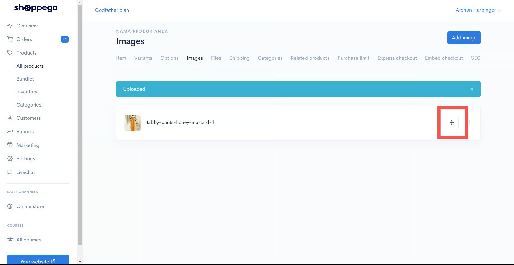<figcaption></figcaption></figure>

## Bahagian 4 : Tambah Files bagi Produk Digital

1\. Untuk masukkan files bagi buyer anda download produk digital anda, anda boleh klik pada **Files.**&#x20;

<figure>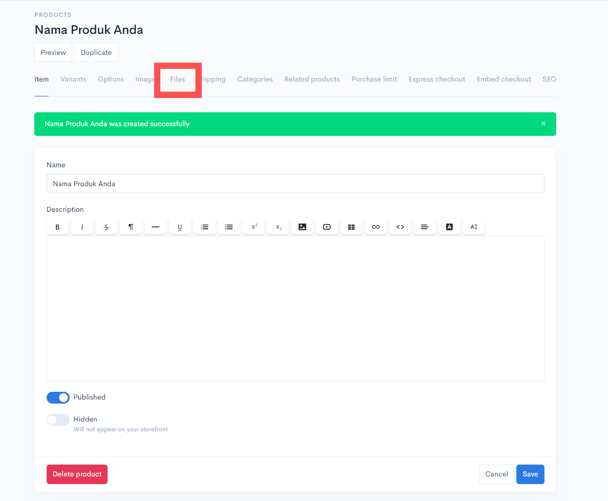<figcaption></figcaption></figure>

2\. Seterusnya anda boleh masukkan files tersebut dengan klik pada **Add file**.

<figure>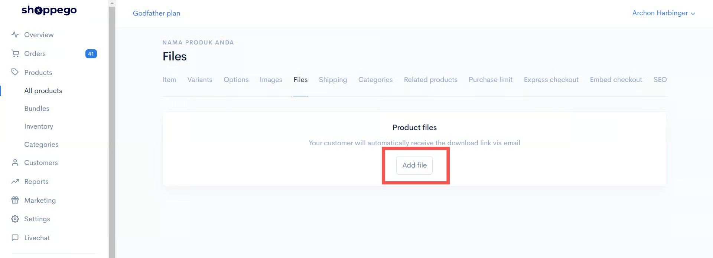<figcaption></figcaption></figure>

3\. Nanti akan keluar paparan seperti berikut. Anda perlu masukkan maklumat file tersebut:

* **File name :** Nama file tersebut.
* **File URL :** Link untuk files bagi Produk Digital anda.

<figure>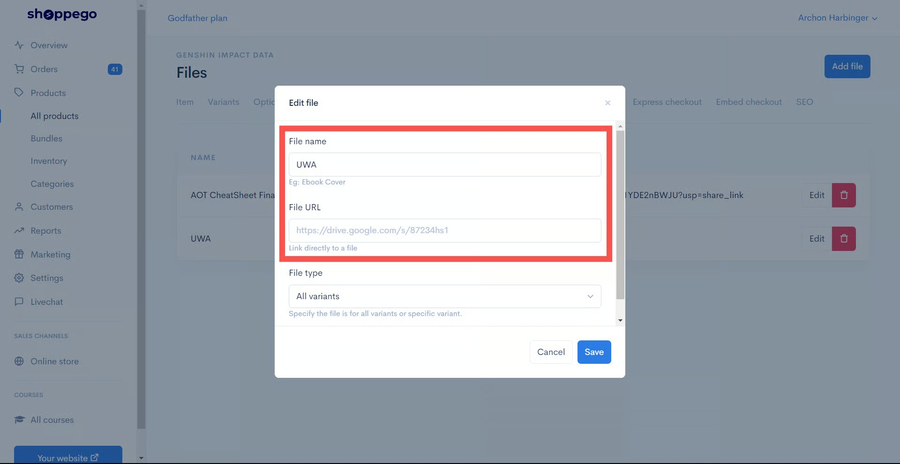<figcaption></figcaption></figure>

## Bahagian 5 : Varian Files Produk Digital


Anda boleh lakukan penetapan **Varians fail** pada **Produk Digital** anda.&#x20;


Jika anda menetapkan kepada :&#x20;

* **All Variants** : Pelanggan anda akan **menerima semua file** yang diletakkan pada ruangan Files ini.

<figure>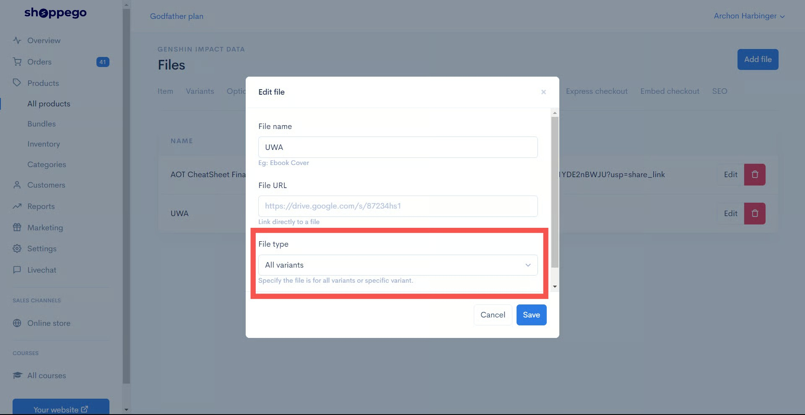<figcaption></figcaption></figure>

* **Specific Variant** : Files akan diberikan kepada **variants yang dipilih**.

<figure>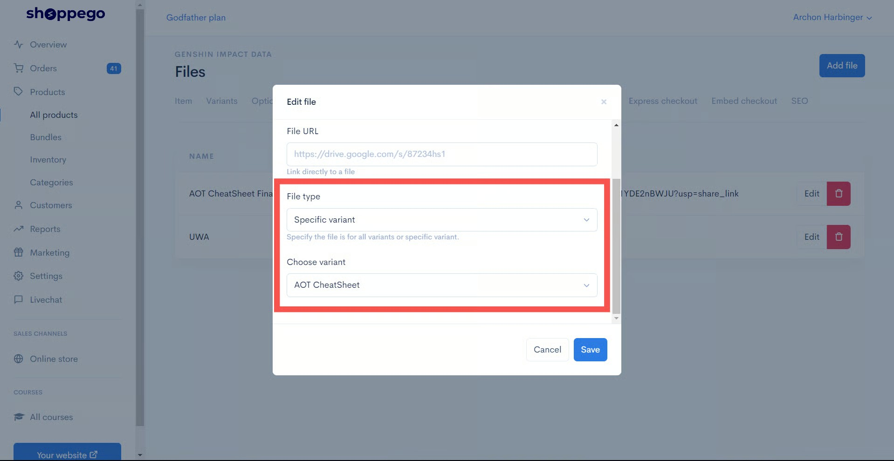<figcaption></figcaption></figure>

## &#x20;Bahagian  6 : Label Produk

Jika anda ingin mempunyai **label pada produk** anda (rujuk gambar dibawah), boleh rujuk tutorial dibawah :&#x20;


[Product Metafield](../online-store/metafield/product-metafield.md)


<figure><figcaption></figcaption></figure>

### 1 : Info Tambahan


**\*\*&#x20;**<mark style="color:red;">**Perhatian**</mark>**:** Sila **Enable Free Shipping** pada **Tab Shipping** kerana <mark style="color:red;">**item digital tidak memerlukan penghantaran**</mark>.

