# Options


\*\*<mark style="color:red;">**Perhatian**</mark>: Penetapan **maksimum Options** adalah **3 sahaja dalam 1 produk.**



**\*\***<mark style="color:red;">**Perhatian**</mark>**: Jika anda buang kesemua options jenis Button/Dropdown/Swatch dalam produk itu, sistem juga akan buang kesemua variatns yang anda sudah cipta dalam produk itu dan hanya tinggalkan Default variant sahaja.**


**Product Options** adalah bahagian untuk **membuat variasi** yang **mempunyai sub-variasi**.&#x20;

Contohnya satu design baju **mempunyai pelbagai saiz** dan **setiap saiz mempunyai banyak jenis lengan** atau **warna**.&#x20;

Lihat contoh di bawah :&#x20;

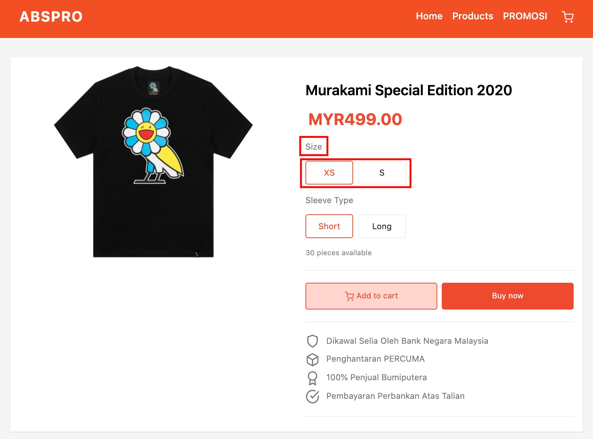

<mark style="color:blue;">**Size**</mark> dan <mark style="color:blue;">**Sleeve Type**</mark> merupakan Variasi(<mark style="color:blue;">**Options**</mark>), dan <mark style="color:green;">**XS, S, Short, Long**</mark> merupakan Sub-Variasi(<mark style="color:green;">**Variants**</mark>) di dalam <mark style="color:blue;">**Options**</mark>.

## **Penetapan Options**

1. Log masuk ke Dashboard **Products** -> **All Products** dan klik pada nama produk anda

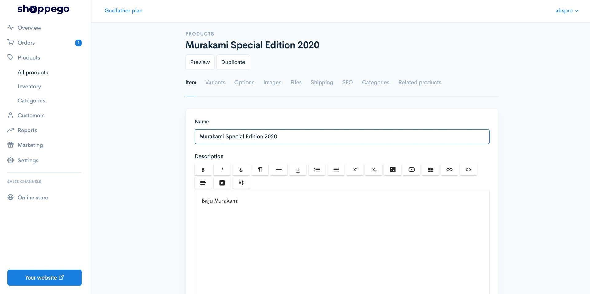

2. Klik pada tab **Options** dan **Add Option.** Masukkan option anda contohnya dalam kes baju ada option Size. Seterusnya, pada ruangan Type anda boleh lakukan jenis option yang anda ingin gunakan untuk produk ini. Setelah selesai klik butang **Add.**


Terdapat **7 jenis option** yang anda boleh pilih, iaitu: **Button, Dropdown, Date, Datetime, Swatch, Input(Teks)** dan **Textarea**.



Untuk jenis option **Button, Dropdown** dan **Swatch**, ianya akan ditetapkan sebagai **Required** dan <mark style="color:red;">**tidak boleh**</mark>**&#x20;diubah** kerana ianya adalah jenis option yang perlu ditentukan nilai variants nya. Manakala, untuk jenis option **Date, Datetime, Input(Teks)** dan **Textarea**, anda <mark style="color:red;">**boleh**</mark>**&#x20;diubah** sama ada anda mahukan ianya **required** atau **tidak**.


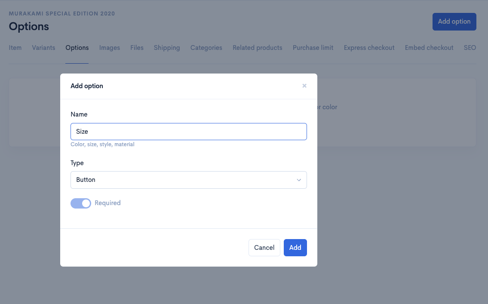

3. Paparan akan keluar seperti berikut. Ini bermaksud option pertama anda telah berjaya dicipta. \
   Seterusnya klik butang **Add option** lagi untuk menambah option Sleeve.

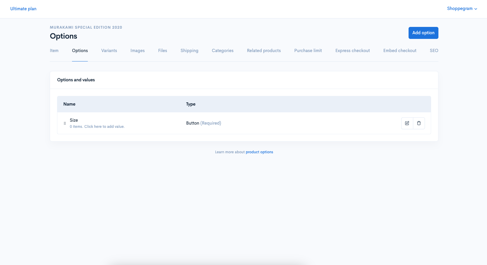

4. Dan apabila selesai menambah option yang kedua, paparan seperti berikut akan keluar. \
   Ini bermaksud anda telah berjaya mencipta dua option untuk 1 jenis produk anda.&#x20;

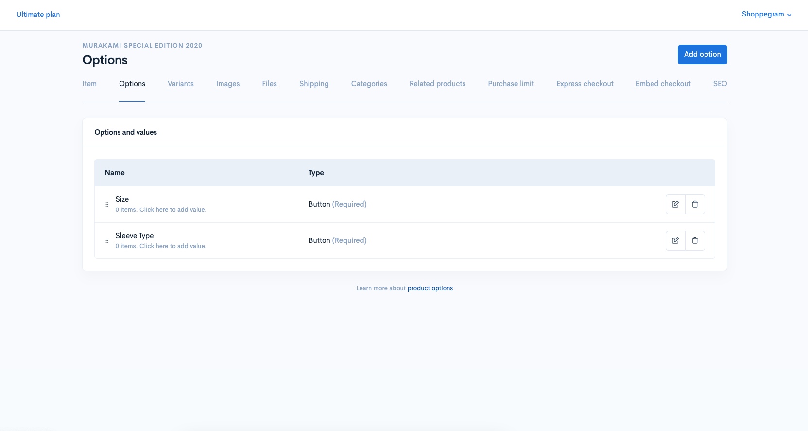

## Penetapan option value

1. Kemudian, anda boleh klik pada **Option Size** itu dan **masukkan value/teks dalam option** yang anda inginkan sebagai contoh untuk Option Size seperti **XS**, **S**, **M** dan **L** pada ruangan **Add new value**.

<figure>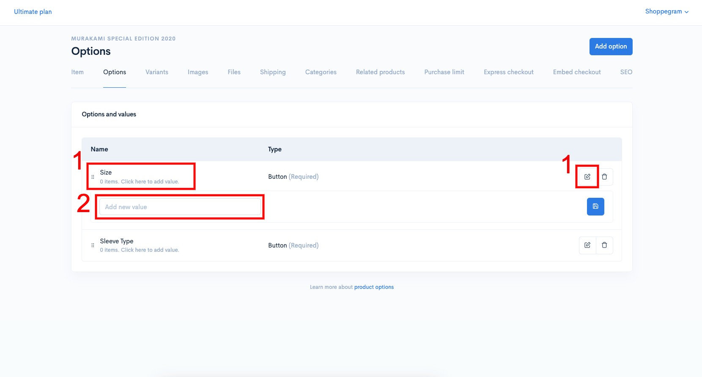<figcaption></figcaption></figure>

2. Pastikan **bagi setiap penambahan option value** itu, anda klik pada **butang Save** atau **klik Enter pada keyboard anda untuk simpan penetapan tersebut.**

<figure>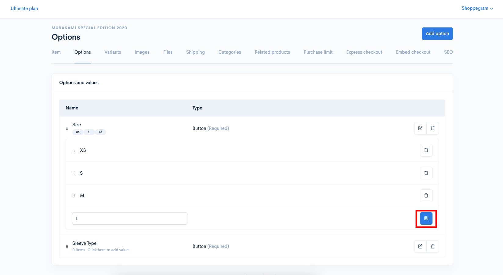<figcaption></figcaption></figure>

3. Seterusnya, anda boleh ulang langkah diatas untuk penambahan Option value untuk Option Sleeve Type pula.

<figure>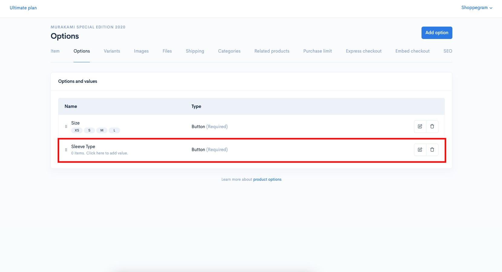<figcaption></figcaption></figure>

4. Setelah selesai penambahan Option dan Option Value yang anda inginkan, anda akan dapat paparan seperti dibawah.

<figure>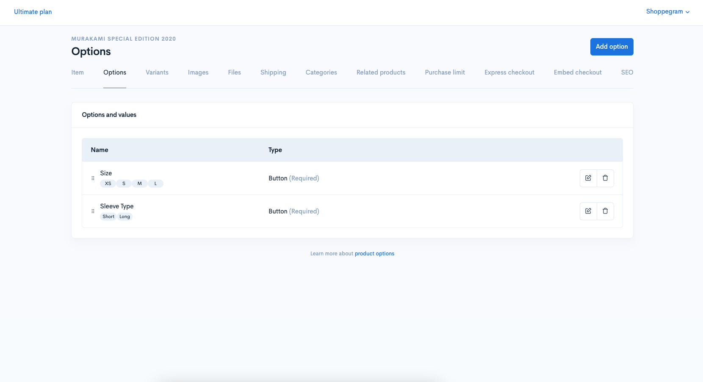<figcaption></figcaption></figure>

## Penetapan variants


[Variants](variants.md)



**Untuk makluman, setiap option value yang anda telah tambah didalam option itu, sistem akan automatik generate variants untuk value-value yang anda masukkan itu dalam option tersebut.**


Untuk perubahan harga, stok produk dan sebagainya anda perlu lakukan pada halaman di tab Variants.

1. Anda boleh pergi pada tab **Variants.**\
   \
   Anda akan dapat lihat kesemua variants yang telah automatik di generate melalui penetapan option value yang anda telah tetapkan sebelum ini.

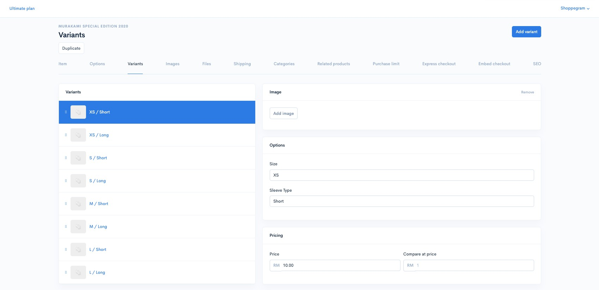

2. Anda boleh **klik pada mana-mana tab variants** itu untuk anda **ubah penetapan Price, Stock dan lain-lain bagi variants tersebut**.


Untuk penetapan **Inventori** boleh rujuk [di](options.md#inventori)[sini](options.md#inventori).


<figure>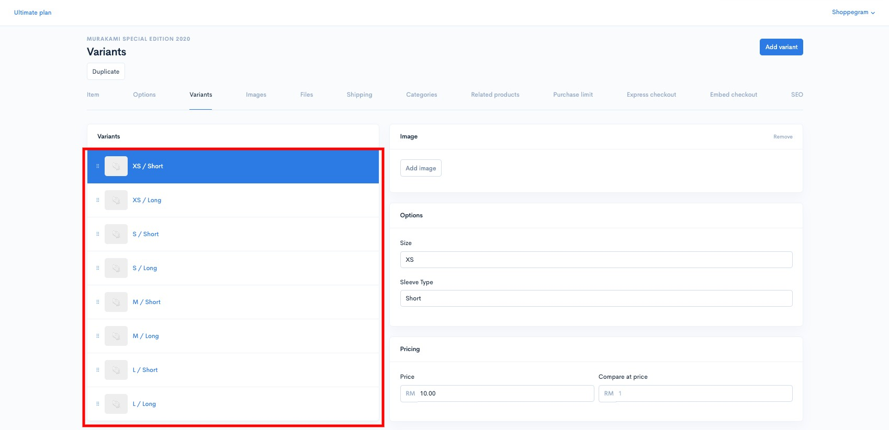<figcaption></figcaption></figure>

3. Setelah **anda selesai lakukan sebarang perubahan penetapan**, pastikan anda klik pada butang **Save** untuk simpan penetapan tersebut.

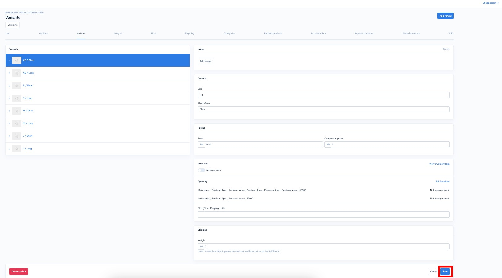

4. Paparan di **Product Page** akan jadi seperti ini.

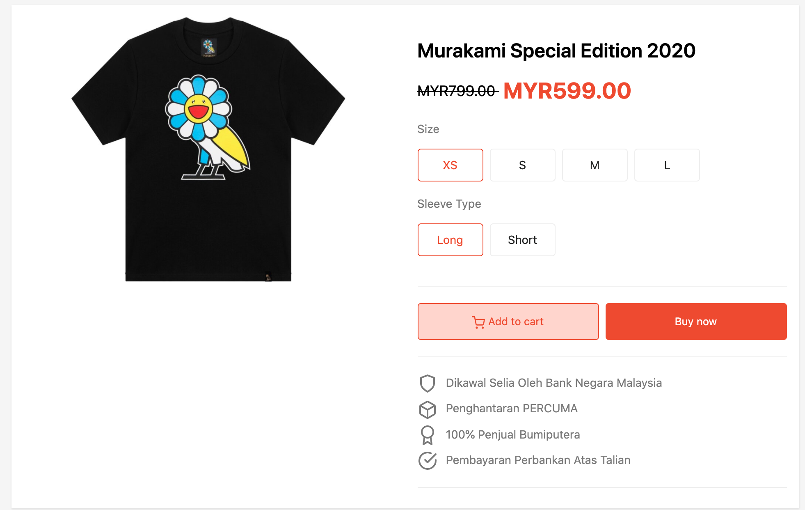

## Inventori

### 1 : View Inventory Logs


\*\*<mark style="color:red;">**Perhatian**</mark> : **Bahagian SKU** adalah untuk **memantau data bagi produk anda** dan <mark style="color:red;">**bukan**</mark>**&#x20;untuk kemaskini stok.**


Pada bahagian ini anda dapat melihat perubahan atau jejak kuantiti yang dilakukan pada bahagian stok produk.\
\
1\. Klik pada **View inventory logs**.

<figure><figcaption></figcaption></figure>

2\. Pada ruangan ini akan tercatat segala perubahan yang dilakukan pada bahagian quantity stock produk.

<figure><figcaption></figcaption></figure>

<table><thead><tr><th width="155">Tajuk</th><th>Penerangan</th></tr></thead><tbody><tr><td><strong>Alamat</strong> </td><td>Anda boleh menukar alamat pada ruangan ini untuk melihat perubahan logs berdasarkan lokasi.</td></tr><tr><td><strong>Date</strong> </td><td>Tarikh setiap perubahan dilakukan.</td></tr><tr><td><strong>Activity</strong> </td><td>Merujuk pada perkara yang anda lakukan semasa mengubah kuantiti stok</td></tr><tr><td><strong>Adjusted by</strong></td><td>Merujuk kepada penama/siapa yang melakukan perubahan kepada stock tersebut.</td></tr><tr><td><strong>Available</strong> </td><td>Merujuk kepada nilai terbaru stock </td></tr></tbody></table>

### 2: Stok Produk

1. Untuk **lakukan penambahan stok produk**, anda perlu masukkan kedalam ruang yang telah disediakan. Anda hanya perlu tekan dropdown itu sahaja.

<figure><figcaption></figcaption></figure>

2. Selepas itu, anda boleh **pilih sebab atau maklumat yang berkaitan** dengan perubahan stok produk anda.

<figure><figcaption></figcaption></figure>

3. Anda akan lihat nilai kemaskini terbaru bagi stok produk anda.


Jika butang **Manage Stock&#x20;**<mark style="color:red;">**tidak**</mark>**&#x20;dihidupkan**, produk anda akan dikira mempunyai **stok tanpa had (**<mark style="color:blue;">**unlimited**</mark>**).**


<figure><figcaption></figcaption></figure>

4. Jika anda menekan butang **View Inventory Logs**, anda akan lihat senarai maklumat bagi perubahan stok produk anda.

<figure><figcaption></figcaption></figure>

## Info Tambahan

1. **Sekiranya anda&#x20;**<mark style="color:red;">**delete/buang kesemua jenis option(Button/Dropdown/Swatch) yang ditentukan nilai variants nya**</mark>**&#x20;didalam produk anda itu,&#x20;**<mark style="color:red;">**kesemua penetapan variants anda akan di delete/buang**</mark>**&#x20;juga daripada produk tersebut dan&#x20;**<mark style="color:red;">**sistem**</mark> <mark style="color:red;">**hanya akan tinggalkan variants 'Default' sahaja**</mark>**&#x20;pada produk tersebut.**
2. **Anda boleh lakukan penyusunan paparan variants di website anda itu dengan menggunakan fungsi drag & drop sort pada halaman tab Options itu.**

<figure>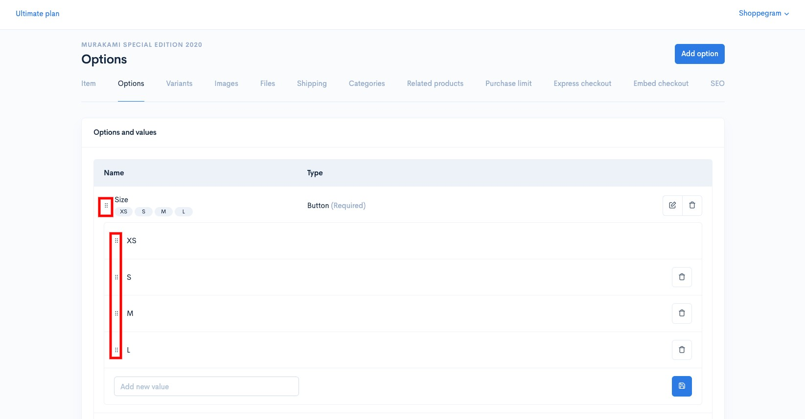<figcaption></figcaption></figure>
