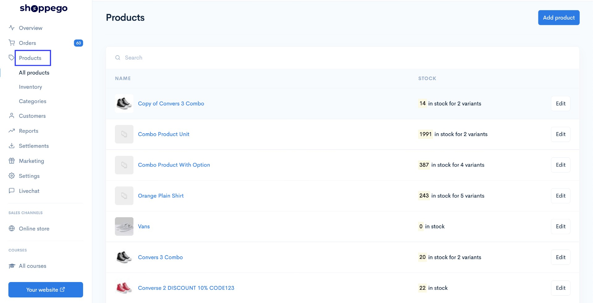
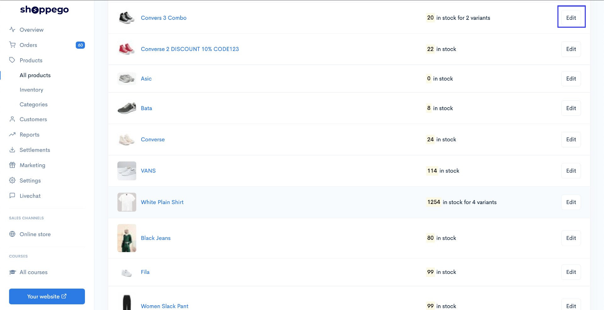
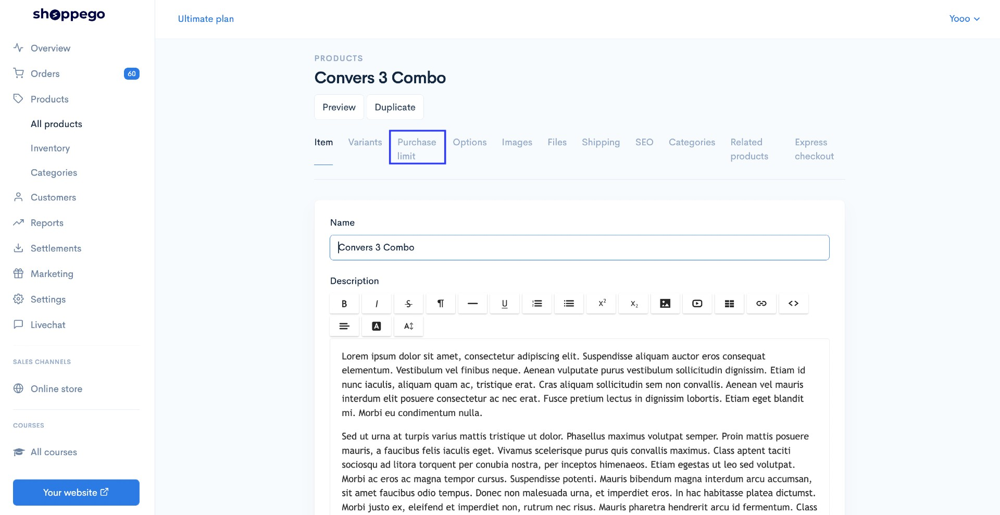
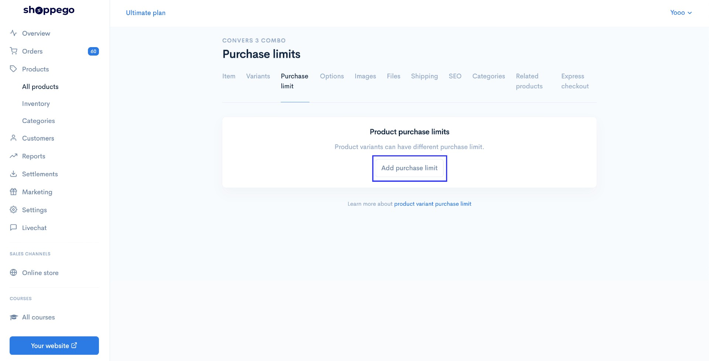
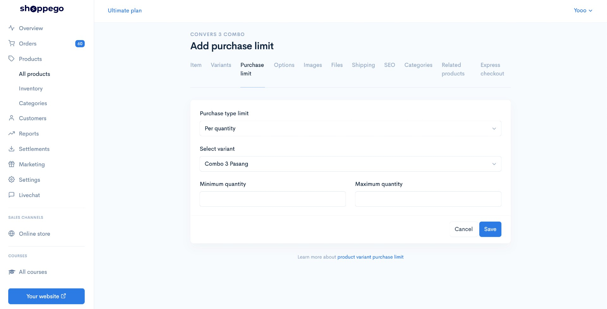
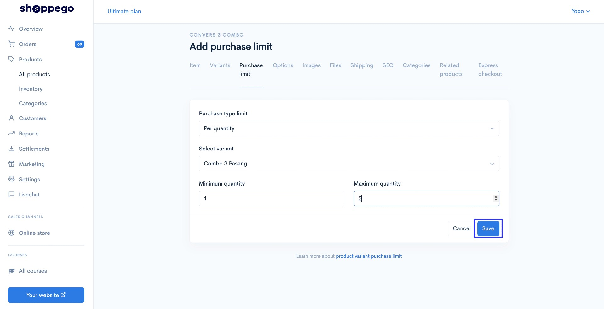
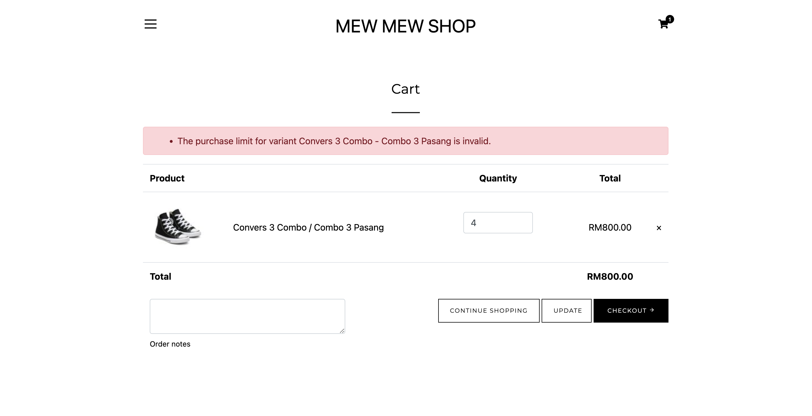

# Purchase Limit

**Purchase limit** merupakan satu fungsi untuk menghadkan pembelian sesuatu product mengikut variants.&#x20;


Fungsi ini hanya tersedia pada <mark style="color:red;">**plan Ultimate**</mark> sahaja.&#x20;


Berikut merupakan langkah langkah untuk penetapan **purchase limit.**

## Penetapan

1. Log masuk ke bahagian **Dashboard**.

2\. Klik pada bahagian **Products**

3\. Klik **Add product** untuk menggunakan produk yang baru atau anda boleh tekan butang **Edit** pada product yang sedia ada. Untuk tutorial ini akan menggunakan produk sedia ada.

4\. Klik pada tab **Purchase limit**

5\. Klik pada **Add purchase limit**

6\. Pada bahagian ini anda perlu tetapkan purchase type limit, variant dan quantity atau weight.

### Penerangan Parameter

<table><thead><tr><th width="327">Parameter</th><th>Penggunaan</th></tr></thead><tbody><tr><td><strong>Purchase type limit</strong></td><td>Anda boleh tetapkan sama ada, anda ingin hadkan mengikut kuantiti atau berat pada bahagian ini.</td></tr><tr><td><strong>Select variant</strong></td><td>Variant produk yang anda ingin hadkan pembelian untuk pelanggan.</td></tr><tr><td><strong>Minimum quantity/Minimum weight</strong></td><td>Minimum kuantiti/berat sesuatu variant.</td></tr><tr><td><strong>Maximum quantity/Maximum weight</strong></td><td>Maksimum kuantiti/berat sesuatu variant.</td></tr></tbody></table>

7\. Setelah penetapan dilakukan tekan butang **Save**

8\. Pada bahagian add to cart. Jika pelanggan memasukkan quantity lebih dari yang disetkan maka mereka tidak boleh teruskan ke halaman checkout kerana melebihi had kuantiti pembelian variant yang anda sudah tetapkan.

