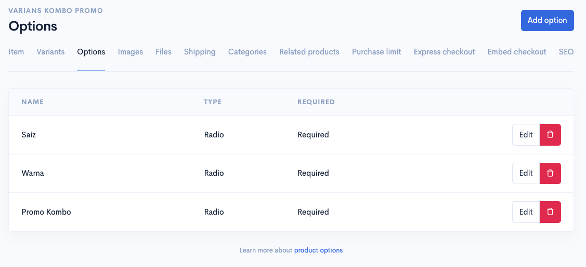
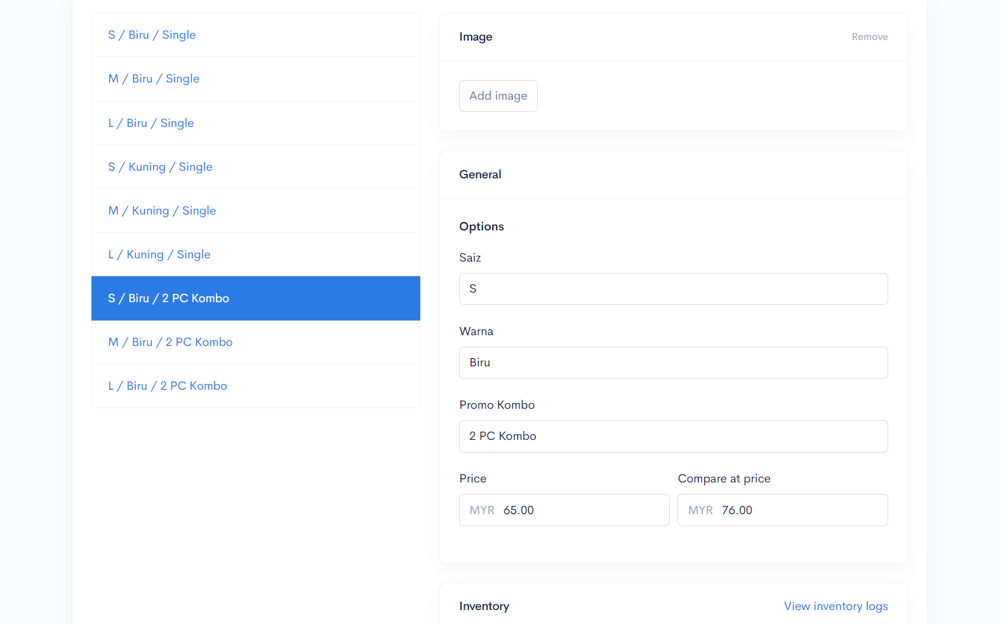
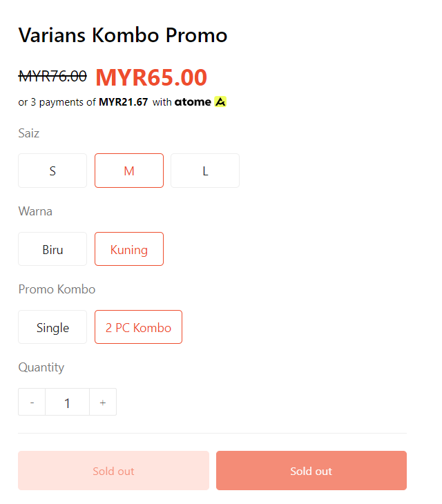

# Variants for Combo Promo

## Bahagian 1 : **Variants Combo Promo**

Proses yang sama juga seperti penetapan **options** dan **variant** untuk Product. Anda boleh rujuk contoh dibawah:


[options.md](../options.md)



[variants-setup.md](variants-setup.md)



\*\*<mark style="color:red;">**Perhatian**</mark>: Pada contoh ini, kita akan menggunakan **3 Options** iaitu **Saiz, Warna dan Promo Kombo.**


<figure><figcaption></figcaption></figure>

1. Klik butang yang **Add variant** untuk menambah variant combo yang lain, contohnya seperti di bawah.
2. Cuma pada bahagian **Name** itu anda boleh isikan nama seperti contoh di bawah.
3. Kita meletakkan nama **2 PC Kombo** pada ruangan **Promo Kombo** itu..

<figure><figcaption></figcaption></figure>

## Bahagian 2 : Inventori

### 1 : View Inventory Logs


\*\*<mark style="color:red;">**Perhatian**</mark> : **Bahagian SKU** adalah untuk **memantau data bagi produk anda** dan <mark style="color:red;">**bukan**</mark>**&#x20;untuk kemaskini stok.**


Pada bahagian ini anda dapat melihat perubahan atau jejak kuantiti yang dilakukan pada bahagian stok produk.\
\
1\. Klik pada **View inventory logs**.

 

2. Pada ruangan ini akan tercatat segala perubahan yang dilakukan pada bahagian quantity stock produk.

<table><thead><tr><th width="155">Tajuk</th><th>Penerangan</th></tr></thead><tbody><tr><td><strong>Alamat</strong></td><td>Anda boleh menukar alamat pada ruangan ini untuk melihat perubahan logs berdasarkan lokasi.</td></tr><tr><td><strong>Date</strong></td><td>Tarikh setiap perubahan dilakukan.</td></tr><tr><td><strong>Activity</strong></td><td>Merujuk pada perkara yang anda lakukan semasa mengubah kuantiti stok</td></tr><tr><td><strong>Adjusted by</strong></td><td>Merujuk kepada penama/siapa yang melakukan perubahan kepada stock tersebut.</td></tr><tr><td><strong>Available</strong></td><td>Merujuk kepada nilai terbaru stock</td></tr></tbody></table>

### 2 : Stok Produk

1. Untuk **lakukan penambahan stok produk**, anda perlu masukkan kedalam ruang yang telah disediakan. Anda hanya perlu tekan dropdown itu sahaja.

<figure><figcaption></figcaption></figure>

2. Selepas itu, anda boleh **pilih sebab atau maklumat yang berkaitan** dengan perubahan stok produk anda.

<figure><figcaption></figcaption></figure>

3. Anda akan lihat nilai kemaskini terbaru bagi stok produk anda.


Jika butang **Manage Stock&#x20;**<mark style="color:red;">**tidak**</mark>**&#x20;dihidupkan**, produk anda akan dikira mempunyai **stok tanpa had (**<mark style="color:blue;">**unlimited**</mark>**).**


<figure><figcaption></figcaption></figure>

4. Jika anda menekan butang **View Inventory Logs**, anda akan lihat senarai maklumat bagi perubahan stok produk anda.

<figure><figcaption></figcaption></figure>

## Maklumat Tambahan

Sekiranya anda mendapati bahawa, **Promo Kombo** anda <mark style="color:red;">**Sold Out**</mark>, anda perlu semak pada **Varians** anda, berkemungkinan anda :

* <mark style="color:red;">**tidak menambah**</mark>**&#x20;Varian Promo Kombo.**
* <mark style="color:red;">**tiada Stok**</mark> pada **Inventory**.

<figure><figcaption></figcaption></figure>

Selamat Mencuba!
