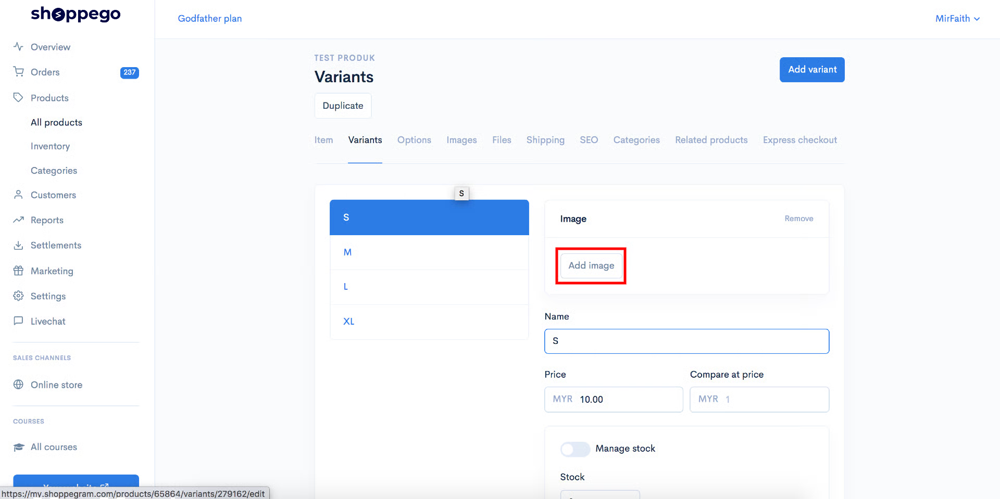
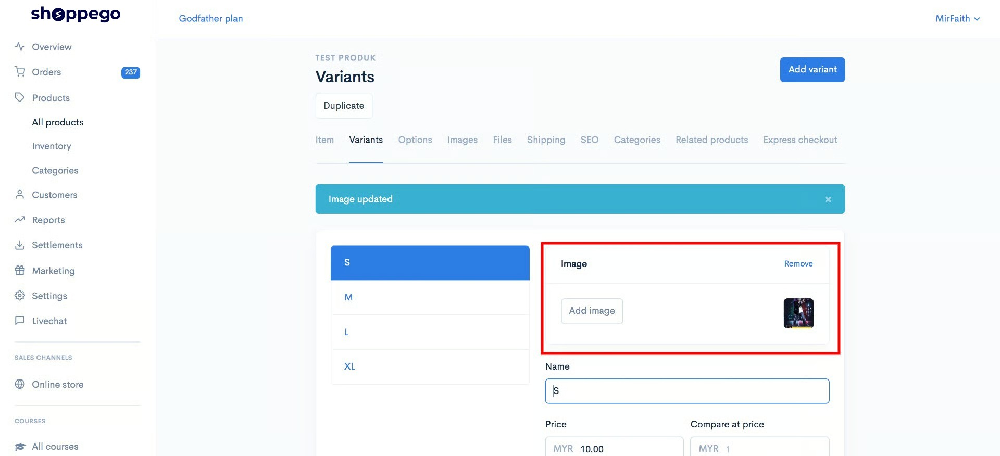

# Variants Imej

## Bahagian 1 : **Penambahan Images Variant**

Setelah anda cipta variant, anda boleh masukkan **gambar untuk variant** tersebut. Tab images ini hanya akan terpapar setelah anda **Save penetapan** variant anda.


**Fail imej yang disokong** adalah **jpg, jpeg, png, gif,** dan **webp** sahaja.


1\. Anda boleh klik pada butang **Add Images** pada variant yang anda ingin masukkan gambar tersebut.

Anda boleh pilih gambar yang anda ingin upload tersebut.


Pastikan **saiz image** tersebut <mark style="color:red;">**dibawah 5MB.**</mark>


2\. Setelah selesai, anda boleh lihat gambar tersebut diruangan images didalam tab variant anda.

## Bahagian 2 : Inventori

### 1 : View Inventory Logs


\*\*<mark style="color:red;">**Perhatian**</mark> : **Bahagian SKU** adalah untuk **memantau data bagi produk anda** dan <mark style="color:red;">**bukan**</mark>**&#x20;untuk kemaskini stok.**


Pada bahagian ini anda dapat melihat perubahan atau jejak kuantiti yang dilakukan pada bahagian stok produk.\
\
1\. Klik pada **View inventory logs**.

 

2. Pada ruangan ini akan tercatat segala perubahan yang dilakukan pada bahagian quantity stock produk.

<table><thead><tr><th width="155">Tajuk</th><th>Penerangan</th></tr></thead><tbody><tr><td><strong>Alamat</strong></td><td>Anda boleh menukar alamat pada ruangan ini untuk melihat perubahan logs berdasarkan lokasi.</td></tr><tr><td><strong>Date</strong></td><td>Tarikh setiap perubahan dilakukan.</td></tr><tr><td><strong>Activity</strong></td><td>Merujuk pada perkara yang anda lakukan semasa mengubah kuantiti stok</td></tr><tr><td><strong>Adjusted by</strong></td><td>Merujuk kepada penama/siapa yang melakukan perubahan kepada stock tersebut.</td></tr><tr><td><strong>Available</strong></td><td>Merujuk kepada nilai terbaru stock</td></tr></tbody></table>

### 2 : Stok Produk

1. Untuk **lakukan penambahan stok produk**, anda perlu masukkan kedalam ruang yang telah disediakan. Anda hanya perlu tekan dropdown itu sahaja.

<figure><figcaption></figcaption></figure>

2. Selepas itu, anda boleh **pilih sebab atau maklumat yang berkaitan** dengan perubahan stok produk anda.

<figure><figcaption></figcaption></figure>

3. Anda akan lihat nilai kemaskini terbaru bagi stok produk anda.


Jika butang **Manage Stock&#x20;**<mark style="color:red;">**tidak**</mark>**&#x20;dihidupkan**, produk anda akan dikira mempunyai **stok tanpa had (**<mark style="color:blue;">**unlimited**</mark>**).**


<figure><figcaption></figcaption></figure>

6. Jika anda menekan butang **View Inventory Logs**, anda akan lihat senarai maklumat bagi perubahan stok produk anda.

<figure><figcaption></figcaption></figure>
