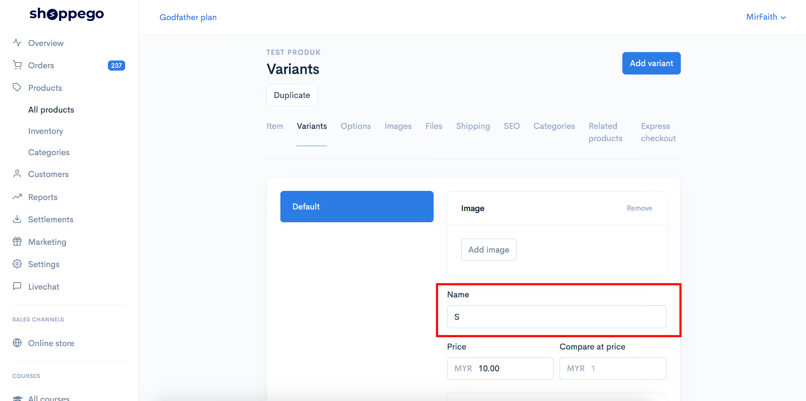
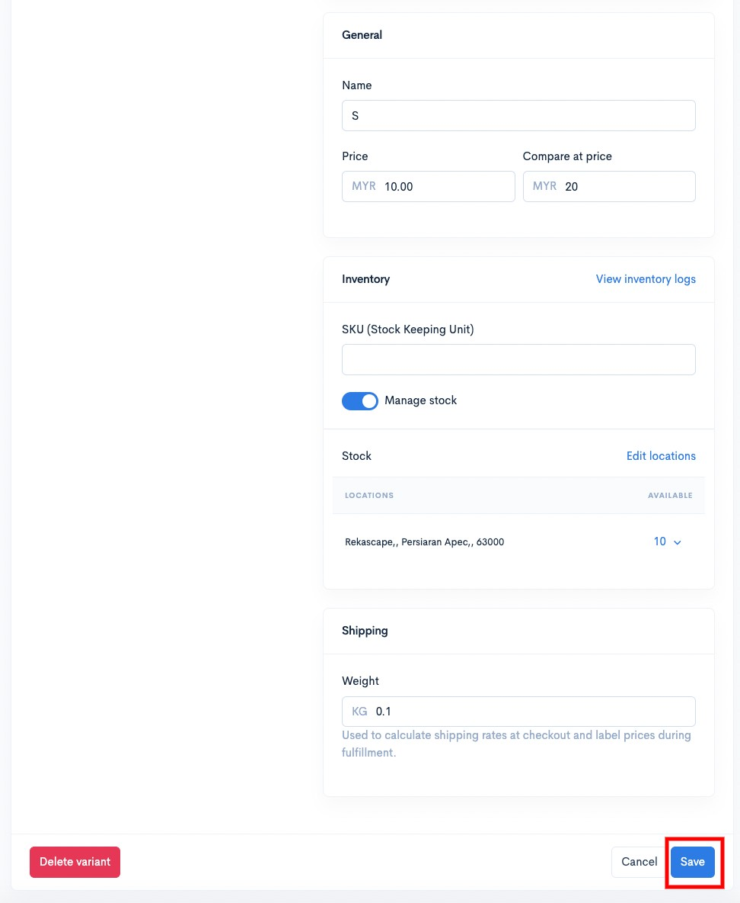
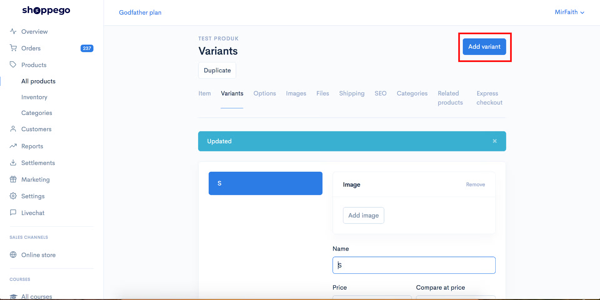
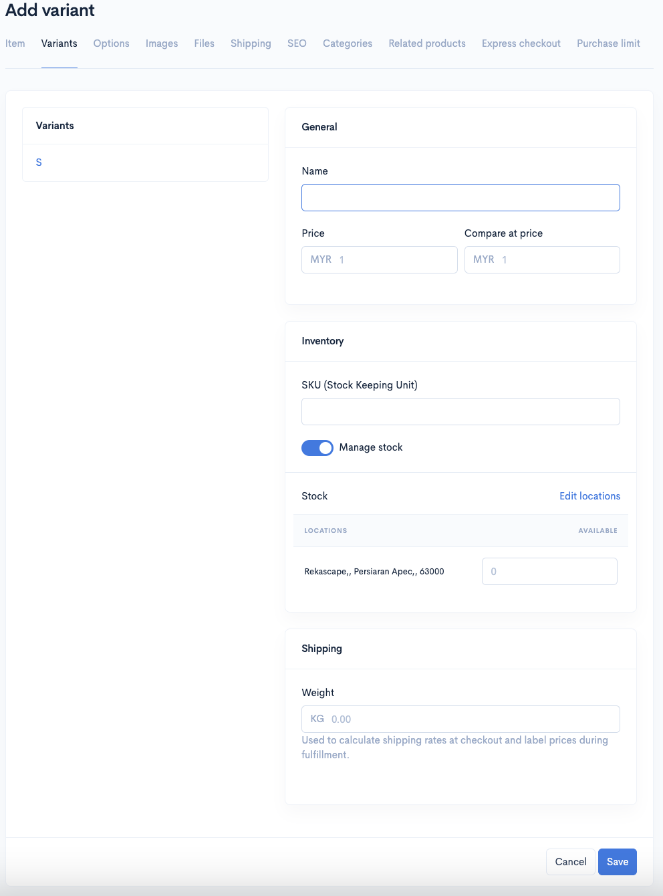
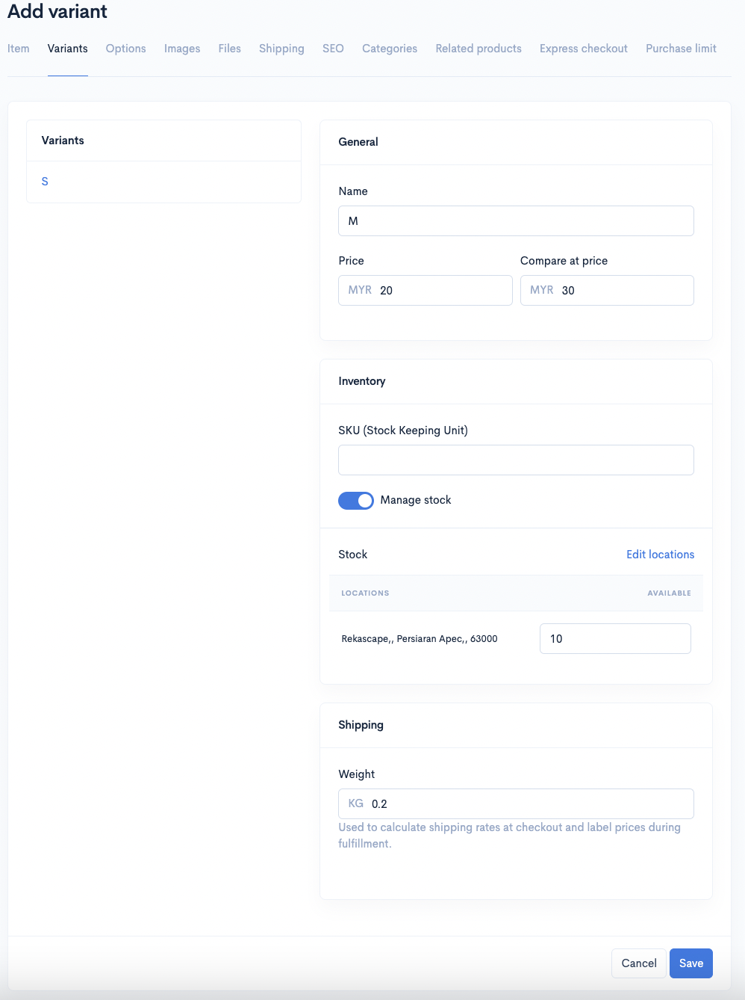
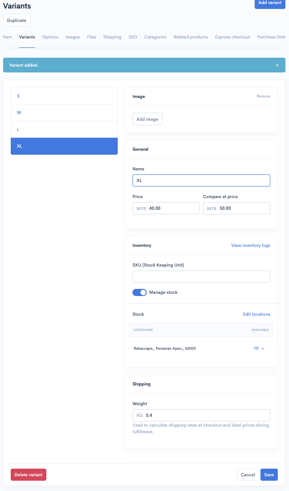
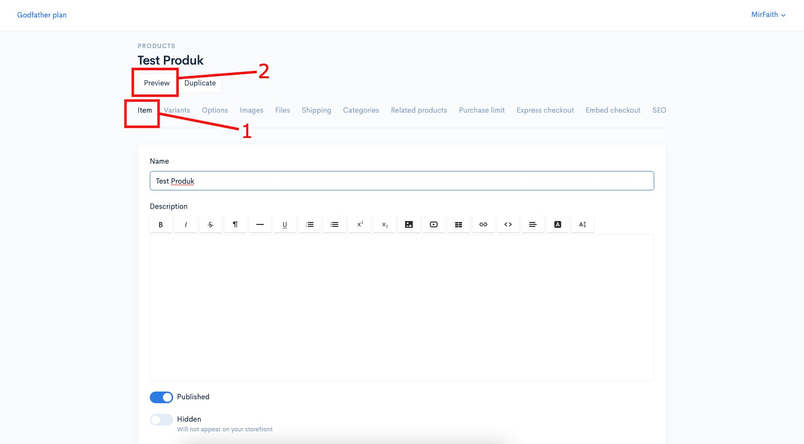
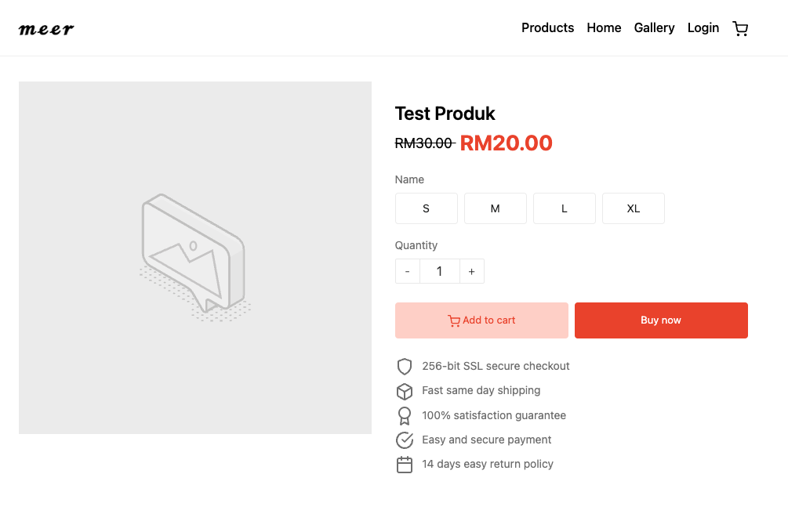
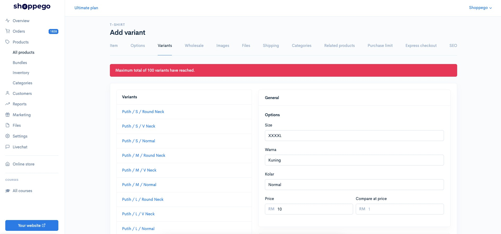

# Variants Setup


\*\*<mark style="color:red;">**Penting**</mark>: **Sebelum anda meneruskan penetapan ini, pastikan anda telah lakukan penambahan options pad produk anda terlebih dahulu.**



[Options](../options.md)


## Bahagian 1 : **Penetapan Variants**

1\. Masukkan nama Variant yang pertama pada perkataan **Default** contohnya **saiz S**.

2\. Klik butang **Save** (Skrol kebawah untuk lihat butang tersebut)**.**

3\. Seterusnya untuk tambah lagi variant hanya perlu klik butang **Add variant.**

4\. Masukkan maklumat bagi variant kedua untuk produk tersebut.

### 1 : Penerangan bagi Maklumat Varians

<table><thead><tr><th width="207">Nama</th><th>Penerangan</th></tr></thead><tbody><tr><td><strong>Name</strong></td><td>Nama <strong>variant untuk produk</strong> anda</td></tr><tr><td><strong>Price</strong></td><td>Harga yang <strong>pelanggan perlu bayar</strong> untuk variant ini</td></tr><tr><td><strong>Compare at price</strong></td><td><strong>Harga asal sebelum diskaun</strong> dan sebagainya. Pastikan nilainya lebih tinggi dengan nilai price anda.</td></tr><tr><td><strong>Manage stock</strong></td><td>Anda boleh aktifkan toggle ini sekiranya <strong>variant ini mempunyai stok.</strong>  <strong>**</strong>Jika <mark style="color:red;"><strong>tidak dihidupkan</strong></mark>, stock product anda dikira <mark style="color:red;"><strong>Unlimited</strong></mark>.</td></tr><tr><td><strong>Stock</strong></td><td>Anda boleh masukkan stok untuk variant ini sekiranya anda aktifkan toggle <strong>Manage stock</strong> tersebut. Pastikan anda masukkan <strong>kuantiti stok pada lokasi default store</strong> anda.</td></tr><tr><td><strong>SKU</strong></td><td>SKU ialah ringkasan untuk Stock Keeping Unit. Anda boleh masukkan text/nombor yang anda inginkan sekiranya <strong>anda ingin lihat data sales anda mengikut SKU ini</strong> dan bukannya nama variant anda.</td></tr><tr><td><strong>Weight</strong></td><td>Anda perlu <strong>masukkan berat untuk variant ini untuk proses penghantaran</strong> nanti</td></tr></tbody></table>

Ulang proses ini untuk variant yang seterusnya.&#x20;

## Bahagian 2 : Inventori

### 1 : View Inventory Logs


\*\*<mark style="color:red;">**Perhatian**</mark> : **Bahagian SKU** adalah untuk **memantau data bagi produk anda** dan <mark style="color:red;">**bukan**</mark>**&#x20;untuk kemaskini stok.**


Pada bahagian ini anda dapat melihat perubahan atau jejak kuantiti yang dilakukan pada bahagian stok produk.\
\
1\. Klik pada **View inventory logs**.

 

2. Pada ruangan ini akan tercatat segala perubahan yang dilakukan pada bahagian quantity stock produk.

<table><thead><tr><th width="155">Tajuk</th><th>Penerangan</th></tr></thead><tbody><tr><td><strong>Alamat</strong> </td><td>Anda boleh menukar alamat pada ruangan ini untuk melihat perubahan logs berdasarkan lokasi.</td></tr><tr><td><strong>Date</strong> </td><td>Tarikh setiap perubahan dilakukan.</td></tr><tr><td><strong>Activity</strong> </td><td>Merujuk pada perkara yang anda lakukan semasa mengubah kuantiti stok</td></tr><tr><td><strong>Adjusted by</strong></td><td>Merujuk kepada penama/siapa yang melakukan perubahan kepada stock tersebut.</td></tr><tr><td><strong>Available</strong> </td><td>Merujuk kepada nilai terbaru stock </td></tr></tbody></table>

### 2 : Stok Produk

1. Untuk **lakukan penambahan stok produk**, anda perlu masukkan kedalam ruang yang telah disediakan. Anda hanya perlu tekan dropdown itu sahaja.

<figure><figcaption></figcaption></figure>

2. Selepas itu, anda boleh **pilih sebab atau maklumat yang berkaitan** dengan perubahan stok produk anda.

<figure><figcaption></figcaption></figure>

3. Anda akan lihat nilai kemaskini terbaru bagi stok produk anda.


Jika butang **Manage Stock&#x20;**<mark style="color:red;">**tidak**</mark>**&#x20;dihidupkan**, produk anda akan dikira mempunyai **stok tanpa had (**<mark style="color:blue;">**unlimited**</mark>**).**


<figure><figcaption></figcaption></figure>

4. Jika anda menekan butang **View Inventory Logs**, anda akan lihat senarai maklumat bagi perubahan stok produk anda.

<figure><figcaption></figcaption></figure>

## Paparan Varians Produk

Lihat hasil variant anda dengan klik butang **Preview** pada tab **Item**

### Contoh paparan produk pada halaman website anda

## **Info Tambahan**

1. **Minimum varians&#x20;**<mark style="color:red;">**adalah 1**</mark> dan **maksimum bagi varians didalam 1 produk&#x20;**<mark style="color:red;">**adalah 100**</mark>**.**

2. Sekiranya anda lakukan penetapan Manage stock pada variants anda, pastikan anda masukkan kuantiti stok pada locations default store anda.\
   \
   Jika tidak pelanggan masih tidak boleh lakukan pembelian pada store anda kerana kuantiti stok pada lokasi default store anda tidak di isi.
