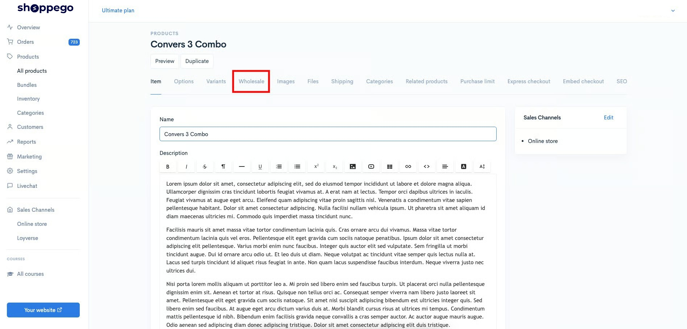
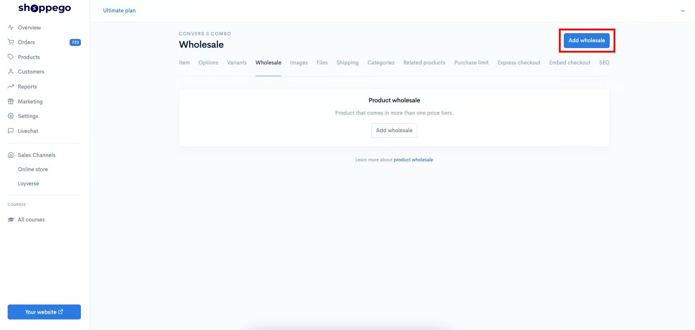
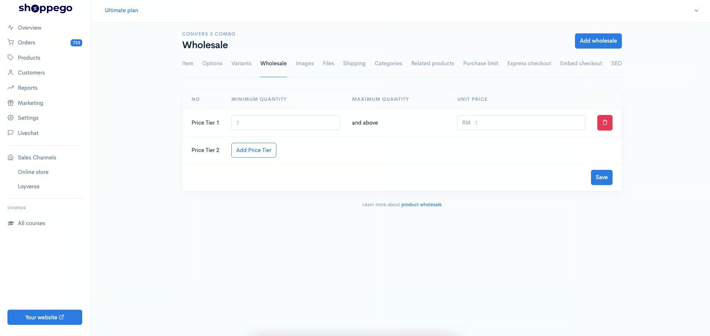
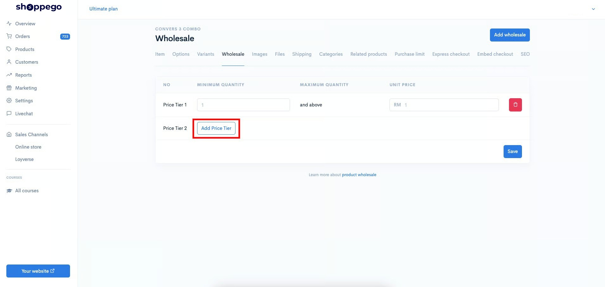
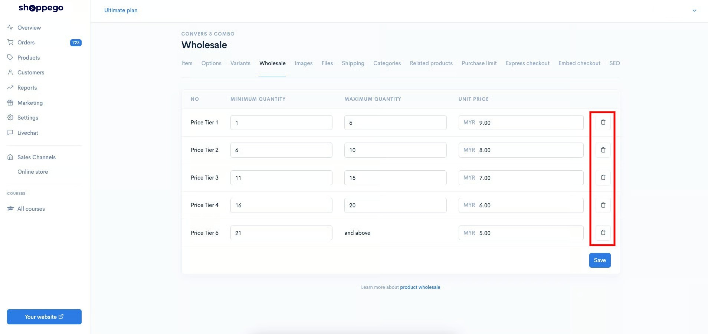
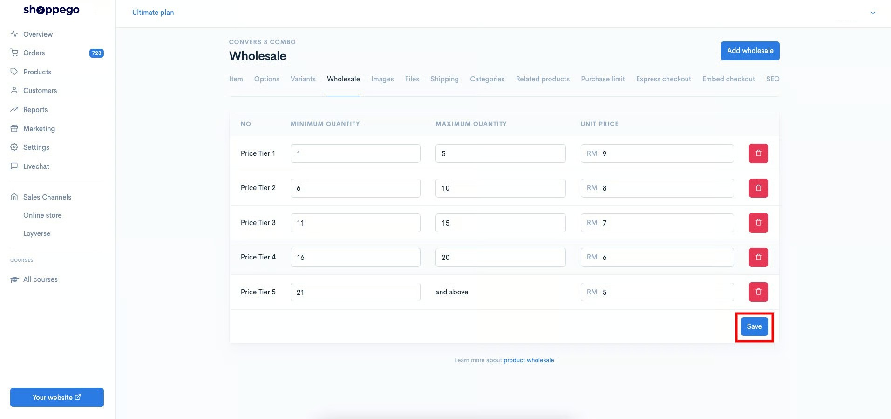
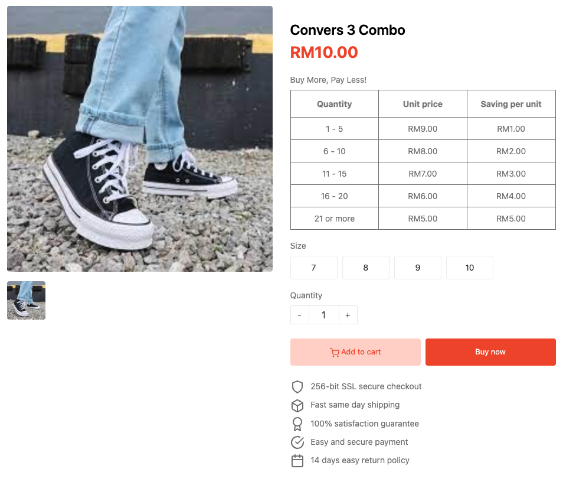

# Wholesale

**Wholesale** merupakan satu fungsi untuk anda cipta promosi harga yang lebih murah jika pelanggan lakukan pembelian produk itu mengikut kuantiti yang anda tetapkan nilainya.&#x20;


Fungsi ini hanya tersedia pada <mark style="color:red;">**plan Ultimate**</mark> sahaja.&#x20;



**Anda perlu pastikan setiap harga variants produk anda itu adalah sama untuk membolehkan anda lakukan penetapan promo Wholesale ini.**


Berikut merupakan langkah-langkah penetapan **fungsi Wholesale ini.**

## Penetapan

1. Log masuk ke bahagian **Dashboard**.

2\. Klik pada bahagian **Products**

3\. Klik **Add product** untuk menggunakan produk yang baru atau anda boleh tekan butang **Edit** pada produk yang sedia ada. Untuk tutorial ini, kami akan menggunakan produk sedia ada.

4\. Klik pada tab **Wholesale**

5\. Klik pada butang **Add wholesale**

6\. Pada bahagian ini anda perlu tetapkan promo Wholesale yang anda inginkan untuk produk ini.

### Penerangan Parameter


**Penetapan harga Wholesale ini hanya boleh merangkumi sebanyak 5 peringkat/tier sahaja dalam 1 produk.**


<table><thead><tr><th width="327">Parameter</th><th>Penggunaan</th></tr></thead><tbody><tr><td><strong>NO</strong></td><td>Paparan tier harga promosi Wholesale anda.</td></tr><tr><td><strong>MINIMUM QUANTITY</strong></td><td>Kuantiti minimum yang pelanggan perlu beli untuk dapatkan harga promosi Wholesale anda.</td></tr><tr><td><strong>MAXIMUM QUANTITY</strong></td><td>Kuantiti maksimum yang pelanggan perlu beli untuk dapatkan harga promosi Wholesale anda.</td></tr><tr><td><strong>UNIT PRICE</strong></td><td>Harga yang pelanggan akan dapat untuk kuantiti 1 produk jika beli dalam lingkungan kuantiti yang anda tetapkan.</td></tr></tbody></table>

7. Untuk penambahan price tier, anda boleh klik pada butang **Add Price Tier**

<figure><figcaption></figcaption></figure>

8. Jika anda ingin delete price tier yang anda sudah cipta, anda boleh klik pada butang **ikon tong sampah.**

<figure><figcaption></figcaption></figure>

9. Setelah penetapan dilakukan tekan butang **Save**

10. Setelah selesai, ia bermakna pelanggan akan automatik dapat beli produk itu dengan harga yang anda tetapkan jika kuantiti pembelian produk itu dalam lingkungan yang anda tetapkan.\
    \
    Untuk **themes Hartamas, Solaris** dan **Tampin**, paparan table Wholesale ini akan dapat dilihat dalam halaman produk itu sendiri.

