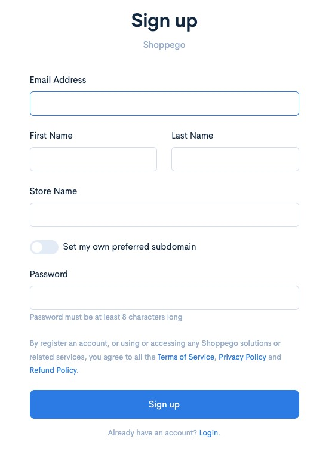

# Registration

Maklumat-maklumat yang diperlukan semasa pendaftaran anda di Shoppego:

<table data-header-hidden><thead><tr><th width="217"></th><th></th></tr></thead><tbody><tr><td><strong>Email Address</strong></td><td>Alamat email yang anda ingin gunakan untuk log in kedalam akaun Shoppego anda.</td></tr><tr><td><strong>First Name</strong></td><td>Nama anda</td></tr><tr><td><strong>Last Name</strong></td><td>Nama anda/Nama bapa anda</td></tr><tr><td><strong>Store Name</strong></td><td>Nama yang anda ingin gunakan sebagai nama website/kedai anda</td></tr><tr><td><strong>Set my own preferred subdomain</strong></td><td>Sub domain dengan kata mudah faham adalah URL utama website anda. Sebagai contoh setelah anda daftar dengan Shoppego, URL website anda ialah https://mirfaith.myshoppegram.com</td></tr><tr><td><strong>Password</strong></td><td>Kata laluan yang anda ingin gunakan untuk log in kedalam akaun Shoppego anda</td></tr></tbody></table>

 
