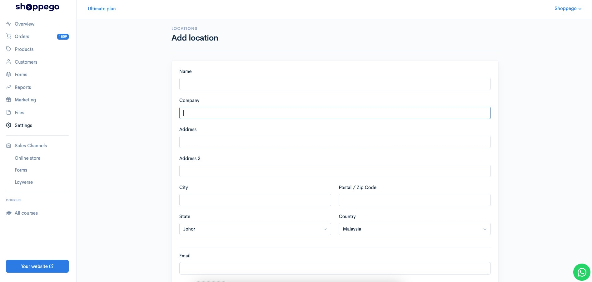

# Store Location

Di dalam Shoppego mempunyai **Shipping Provider** yang boleh digunakan untuk menempah perkhidmatan courier tanpa perlu copy paste alamat untuk digunakan pada **Shipping Provider**.

## Shipping Provider

**Shipping Providers** adalah syarikat yang menawarkan platform servis untuk **menempah kutipan** dan **penghantaran parcel-parcel anda**. Di dalam Shoppego mempunyai beberapa Shipping Provider, anda boleh rujuk pada [**link ini**](https://docs.shoppego.com/commerce/ms/settings/shipping-provider). \
\
Klik pada **Settings** -> **Location -> Add Location**

* Isikan maklumat mengenai alamat kutipan parcel anda pada ruangan yang telah disediakan.&#x20;
* Perlu diingat bahawa, <mark style="color:red;">**sebarang kesalahan**</mark> pada ruangan ini akan **menyebabkan parcel anda** mungkin <mark style="color:red;">**tidak dapat ambil oleh pihak Shipping Provider**</mark>.&#x20;
* Setelah selesai diisi, klik butang **Update.**
* Kini proses **menetapkan lokasi telah pun selasai.**&#x20;
