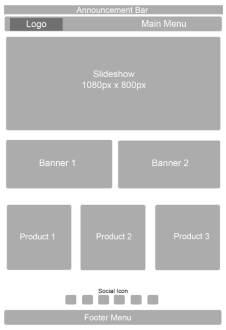

# Storefront

Storefront atau biasanya disebut sebagai homepage adalah dimana semua orang boleh lawati dan membuat pembelian. Sebagai contoh <https://hartamas.myshoppegram.com>

## **Struktur Layout**

Struktur layout ini boleh digunakan sebagai rujukan untuk pengguna membuat konfigurasi di bahagian **Dashboard Shoppego -> Online store** -> **Themes** -> **Customize** dan juga sebagai panduan untuk menambah Menu.

