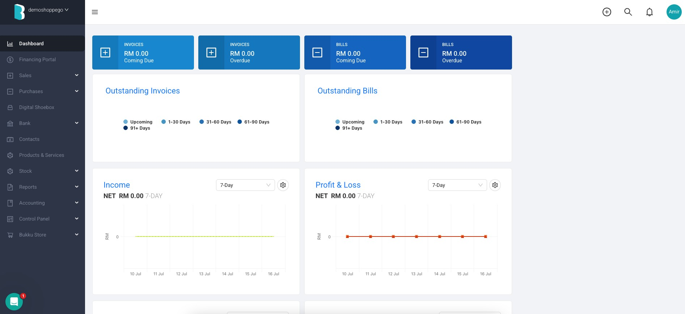
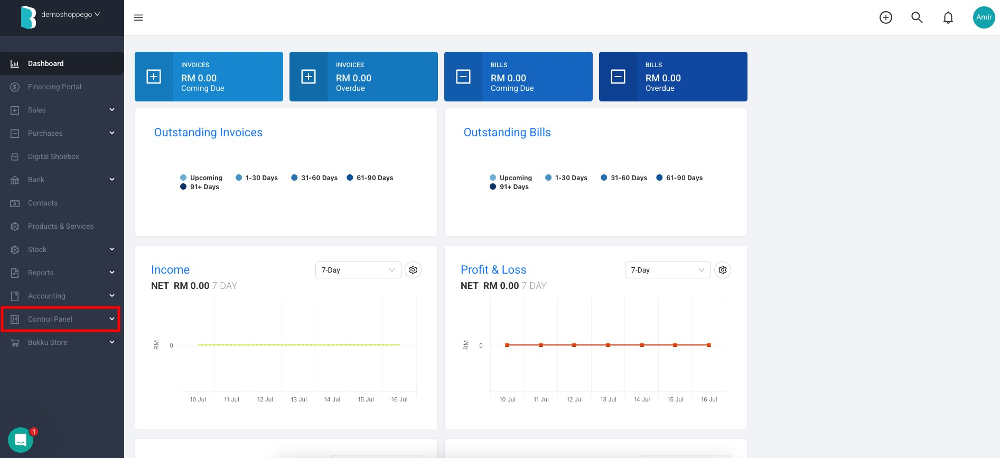
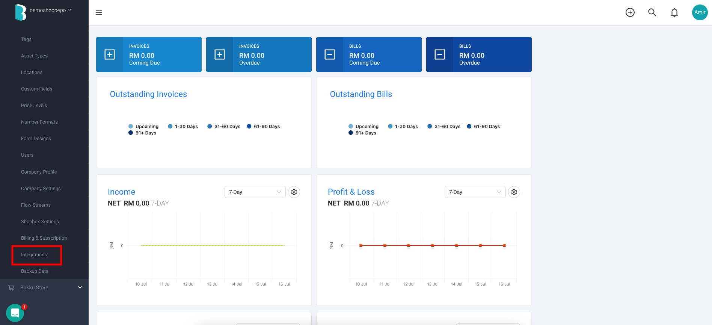
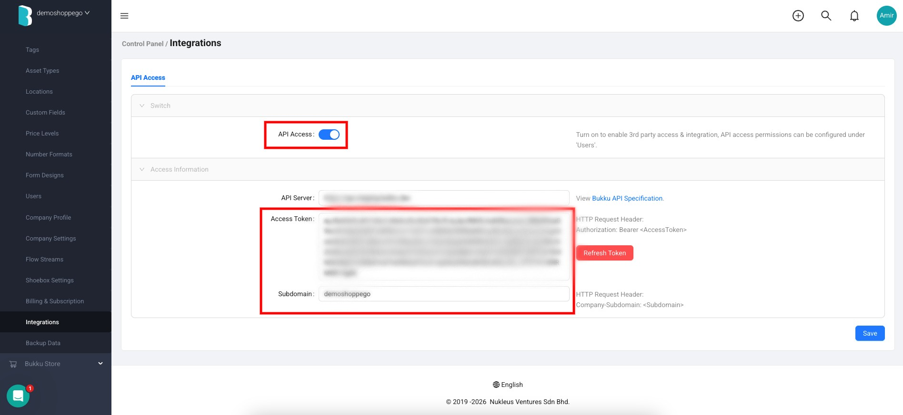
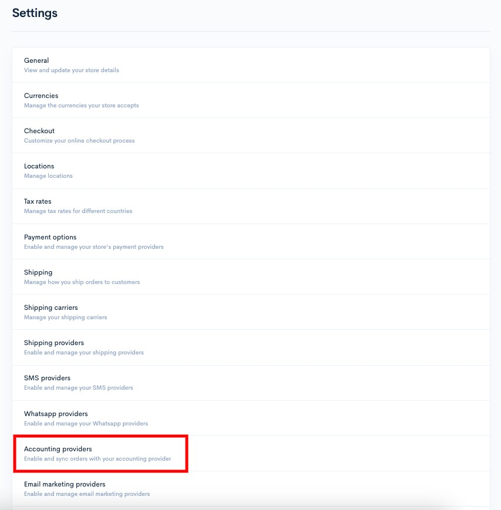
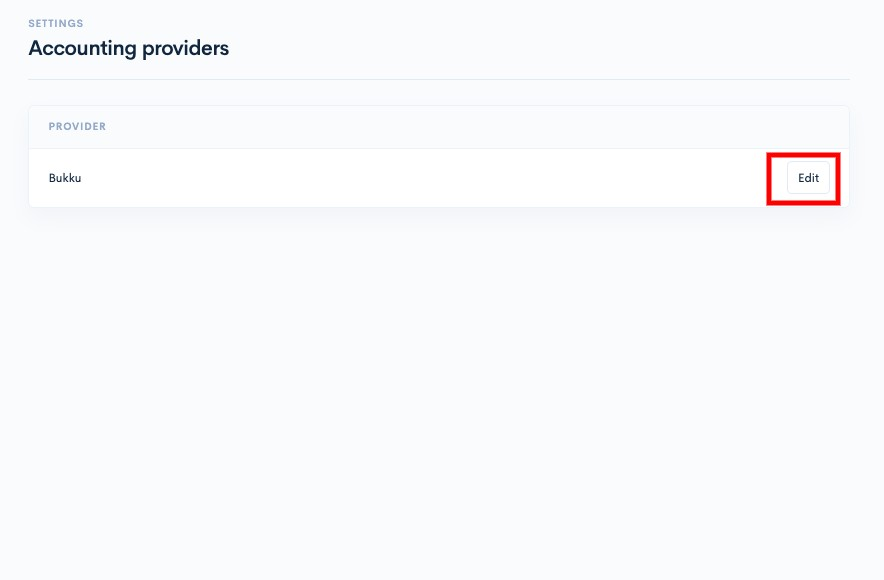
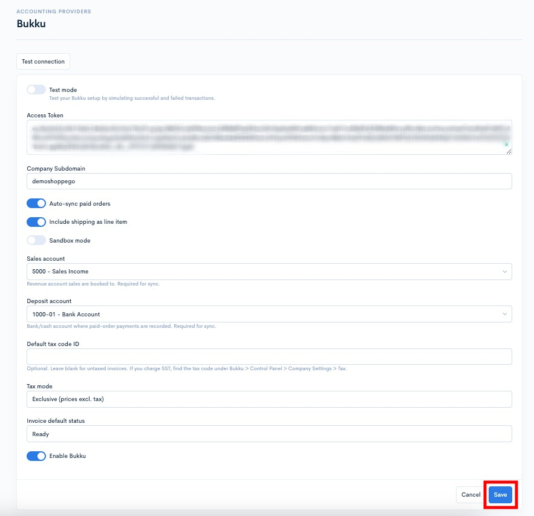
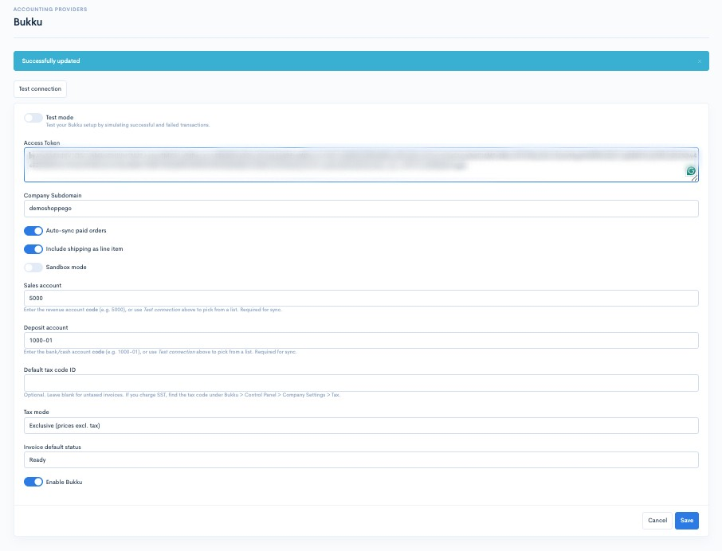
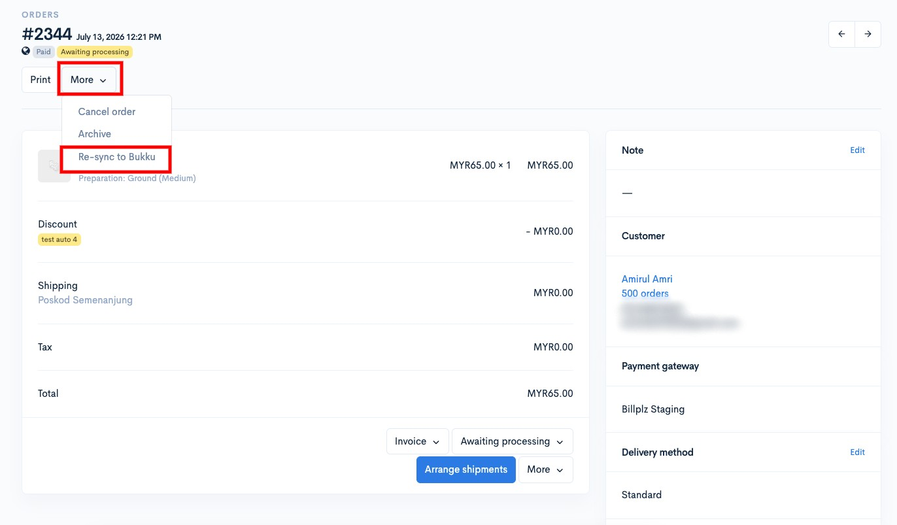
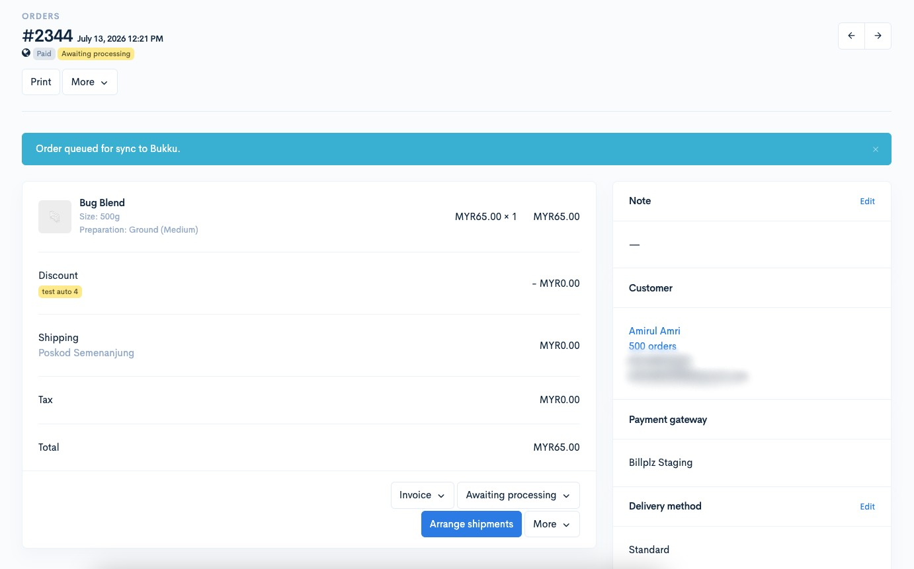

# Bukku


Fungsi ini tersedia untuk **plan** **Ultimate** sahaja.


## Pada halaman ini:

* [Penetapan yang perlu dilakukan](bukku.md#penetapan-yang-perlu-dilakukan)
* [Penetapan di Bukku](bukku.md#penetapan-di-bukku)
* [Penetapan di Shoppego](bukku.md#penetapan-di-shopppego)
* [Cara Manual Sync](bukku.md#cara-manual-sync)

## Penetapan yang perlu dilakukan:

* Lengkapkan maklumat anda di dalam akaun Bukku anda.
* Pastikan anda telah masukkan maklumat TIN dan SSM pada penetapan Locations store anda
* Pastikan pelanggan anda juga telah mempunyai maklumat TIN
* [Dapatkan **Access Token** dan **Company Subdomain** akaun Bukku anda](bukku.md#penetapan-di-bukku)
* [Lakukan penetapan di dashboard Shoppego](bukku.md#penetapan-di-shopppego)


**Sekiranya anda atau pelanggan tidak mempunyai maklumat TIN dan SSM, data pembelian tersebut tidak akan dibawa ke dashboard Bukku anda.**



**Kesemua maklumat dan penetapan diatas ini anda boleh dapatkan dengan berhubung dengan pihak Bukku.**


## Penetapan di Bukku

1. Log masuk akaun Bukku anda

<figure><figcaption></figcaption></figure>

2. Klik pada "**Control panel"**

<figure><figcaption></figcaption></figure>

3. Klik pada "**Integrations"**

<figure><figcaption></figcaption></figure>

4. Anda boleh tick pada "**API Access**". Seterusnya, anda akan dapat lihat "**Access token**" dan "**Subdomain**" untuk akaun Bukku anda. Simpan "**Access token**" dan "**Subdomain**" tersebut untuk dimasukkan kedalam ruang penetapan di dashboard Shoppego.

<figure><figcaption></figcaption></figure>

## Penetapan di Shopppego

Setelah anda mempunyai kesemua maklumat yang diperlukan untuk integration tersebut, anda boleh ikuti langkah dibawah untuk tetapkan ia di akaun Shoppego anda.

1. Log masuk akaun Shoppego anda.

<figure><figcaption></figcaption></figure>

2. Klik pada **Settings**

<figure><figcaption></figcaption></figure>

3. Klik pada **Accounting providers**

<figure><figcaption></figcaption></figure>

4. Klik **Edit/Activate** pada **Accounting provider Bukku**

<figure><figcaption></figcaption></figure>

5. Kemudian, anda boleh masukkan kesemua maklumat itu diruangan yang tersedia dan klik **Save**.

**Setelah anda masukkan maklumat "Access Token" dan "Company Subdomain" anda boleh klik pada butang "Test connection" terlebih dahulu untuk sistem dapatkan maklumat "Sales account" dan "Depost account" anda.**

<table><thead><tr><th width="193">Ruang</th><th>Penerangan</th></tr></thead><tbody><tr><td><strong>Test mode</strong></td><td>Anda boleh aktifkan toggle ini sekiranya anda menggunakan akaun developer dari pihak Bukku sendiri.</td></tr><tr><td><strong>Access Token</strong></td><td>Anda boleh masukkan <strong>Access Token</strong> untuk akaun Bukku anda.</td></tr><tr><td><strong>Company Subdomain</strong></td><td>Anda boleh masukkan <strong>Subdomain</strong> untuk akaun Bukku anda.</td></tr><tr><td><strong>Auto-sync paid orders</strong></td><td>Anda boleh tick pada toggle ini sekiranya anda ingin setiap order paid yang melalui website anda terus dibawa ke akaun Bukku anda.</td></tr><tr><td><strong>Include shipping as line item</strong></td><td>Anda boleh tick pada toggle ini sekiranya anda ingin bawa maklumat shipping order pelanggan kedalam akaun Bukku anda.</td></tr><tr><td><strong>Sandbox mode</strong></td><td>Anda boleh tick pada toggle ini sekiranya anda ingin lakukan test pada integration anda.</td></tr><tr><td><strong>Sales account</strong></td><td>Anda boleh lakukan pemilihan Sales akaun untuk akaun Bukku anda.</td></tr><tr><td><strong>Deposit account</strong></td><td>Anda boleh lakukan pemilihan Deposit akaun untuk akaun Bukku anda.</td></tr><tr><td><strong>Default tax code ID</strong></td><td>Anda boleh masukkan kod tax anda(Jika ada)</td></tr><tr><td><strong>Tax mode</strong></td><td>Anda boleh lakukan pemilihan mode tax anda</td></tr><tr><td><strong>Invoice default status</strong></td><td>Anda boleh tetapkan status invoice anda yang akan dibawa masuk kedalam akaun Bukku anda.</td></tr><tr><td><strong>Enable Bukku</strong></td><td>Anda perlu aktifkan toggle ini untuk pastikan anda boleh gunakan integration Bukku ini.</td></tr></tbody></table>

<figure><figcaption></figcaption></figure>

6. Setelah selesai kini proses penetapan integration dengan platform Bukku anda kini sudah berjaya.

<figure><figcaption></figcaption></figure>

## **Cara Manual Sync**

Tutorial penetapan pada bahagian ini adalah untuk anda lakukan manual sync untuk mana-mana order yang anda inginkan ke platform Bukku

1. Log masuk ke **Dashboard Shoppego** -> **Orders** di panel kir&#x69;**.**&#x20;

<figure><figcaption></figcaption></figure>

2. Pilih dan **klik** pada **order** yang anda ingin lakukan manual sync tersebut

3. Tekan butang **More dan pilih Re-sync to Bukku**

4\. Setelah selesai, order anda itu sepatutnya akan dapat dilihat didalam platform Bukku

Setiap order yang masuk dari Shoppego ke platform Bukku, anda akan dapat lihat pada bahagian:

**Dashboard Bukku > Sales > Invoice > All**
