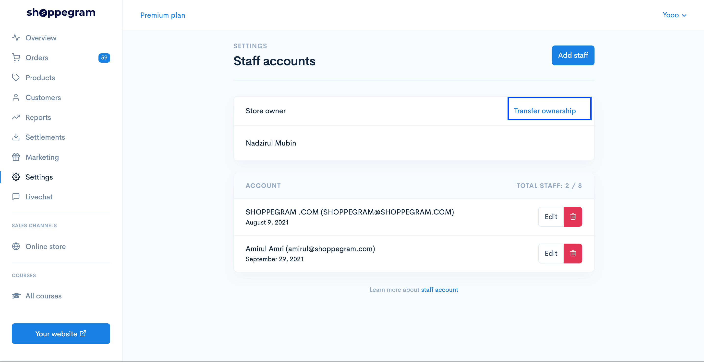

# Transfer Ownership

**Transfer ownership** adalah **features** untuk :&#x20;

* Menukar pemilikan store asal kepada pemilik store baru.
* Atau tukar emel pemilik kedai dari yang lama ke yang baru.


Selepas **proses transfer**, akaun lama anda akan <mark style="color:red;">**kehilangan akses**</mark> kepada store anda.


1. Klik pada butang transfer ownership.

2\. Masukkan maklumat yang diperlukan dan klik transfer store owner. Oleh itu, proses penukaran owner store telah pun selesai.

