# Cloudflare Turnstile

Sebelum anda ikuti langkah di bawah, pastikan anda telah mempunyai akaun Cloudflare Turnstile. Jika anda masih belum mempunyai akaun tersebut, anda boleh lakukan pendaftaran pada link dibawah:



Terdapat 2 data yang anda perlukan untuk integration Cloudflare Turnstile ini dengan sistem Shoppego:

* Site key
* Secret key

## Penetapan di Cloudflare Turnstile

1. Anda boleh log masuk kedalam dashboard Cloudflare anda terlebih dahulu

<figure>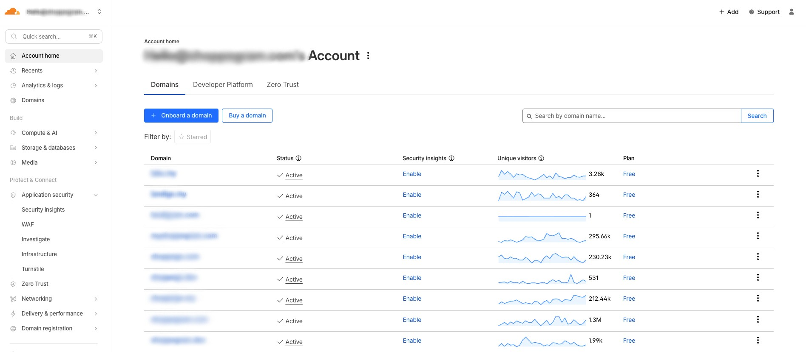<figcaption></figcaption></figure>

2. Klik pada **Application security** dan **Turnstile**

<figure>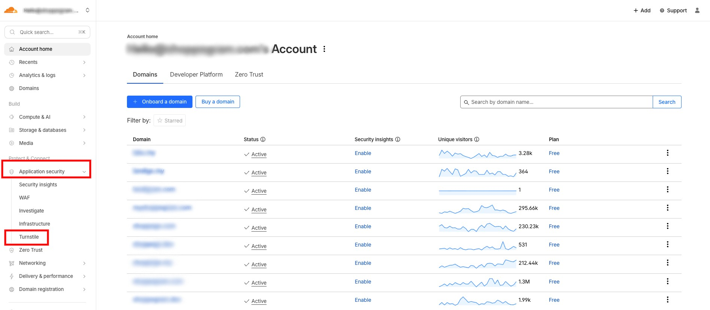<figcaption></figcaption></figure>

3. Kemudian, anda boleh klik **Add widget**

<figure>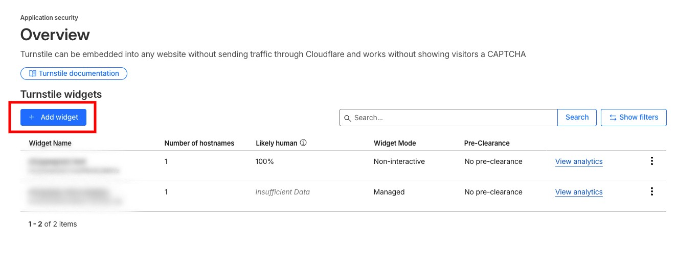<figcaption></figcaption></figure>

4. Nanti anda akan dapat lihat penetapan yang anda perlu lakukan. Untuk "**Widget name**" anda boleh masukkan teks nama untuk rujukan anda nanti.

<figure>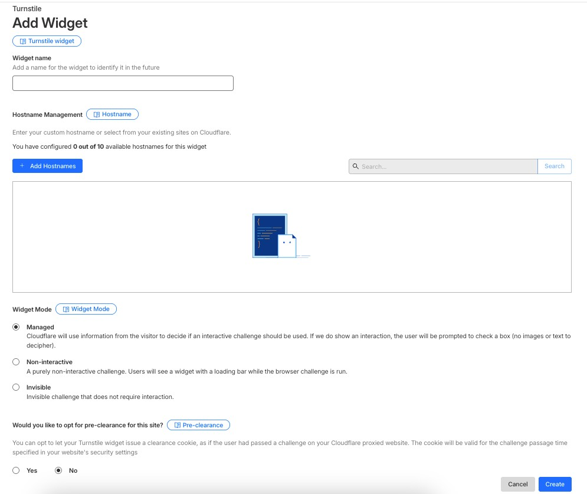<figcaption></figcaption></figure>

5. Kemudian, anda perlu lakukan penetapan Hostnames dengan klik pada butang "**Add Hostnames**"

<figure>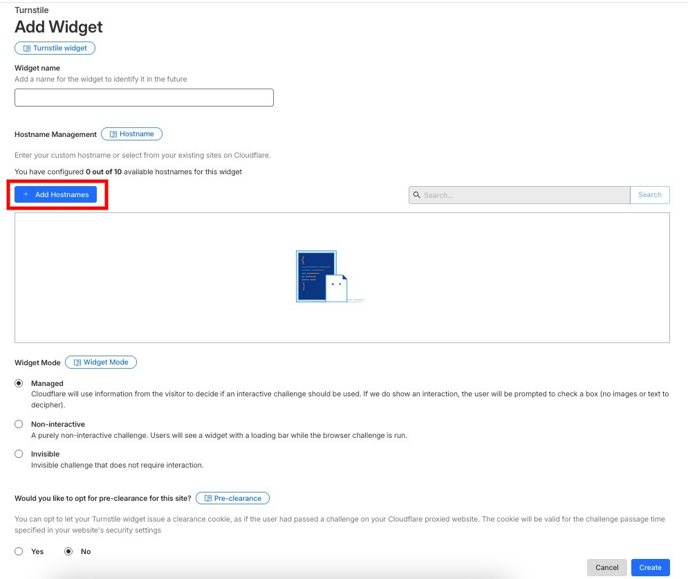<figcaption></figcaption></figure>

Jika anda **tidak ada penetapan hostname/domain di dalam akaun Cloudflare**, anda boleh **masukkan hostname/domain anda itu di bahagian Custom hostname(Highlight kuning)**.

Jika **hostname/domain anda itu sudah berada di dalam akaun Cloudflare** anda ini, anda boleh terus **lakukan pemilihan seperti yang telah dipaparkan(Highlight hijau)**.

Setelah selesai klik **Add**

<figure>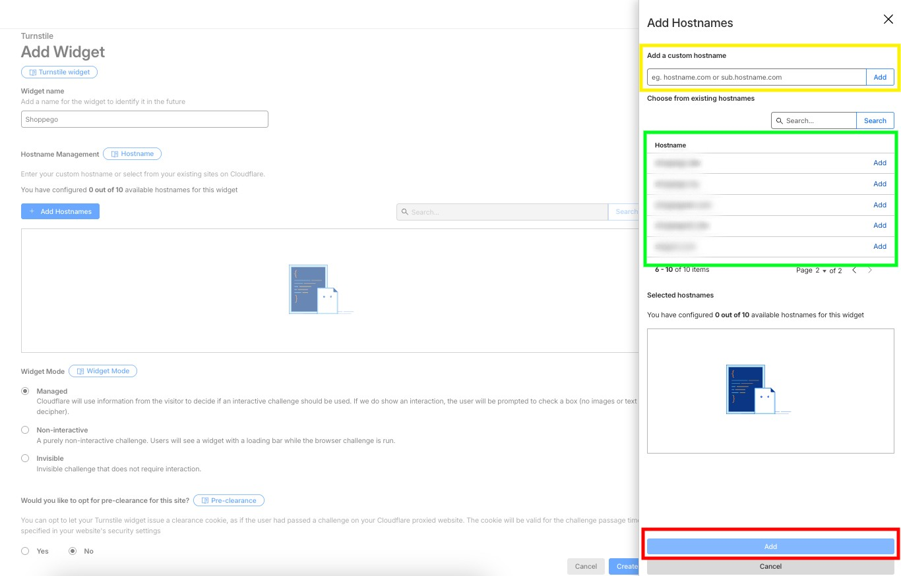<figcaption></figcaption></figure>

6. Seterusnya, untuk penetapan "**Widget Mode**", anda boleh tetapkan ikut penetapan yang anda inginkan. Pihak kami syorkan anda tetapkan kepada "**Invisible**".

<figure>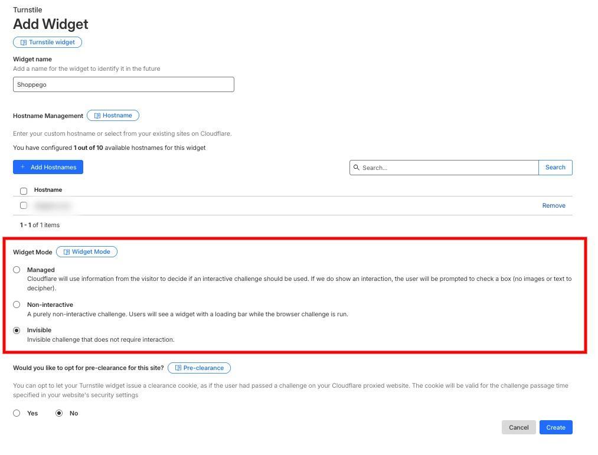<figcaption></figcaption></figure>

7. Setelah selesai klik **Create**

<figure>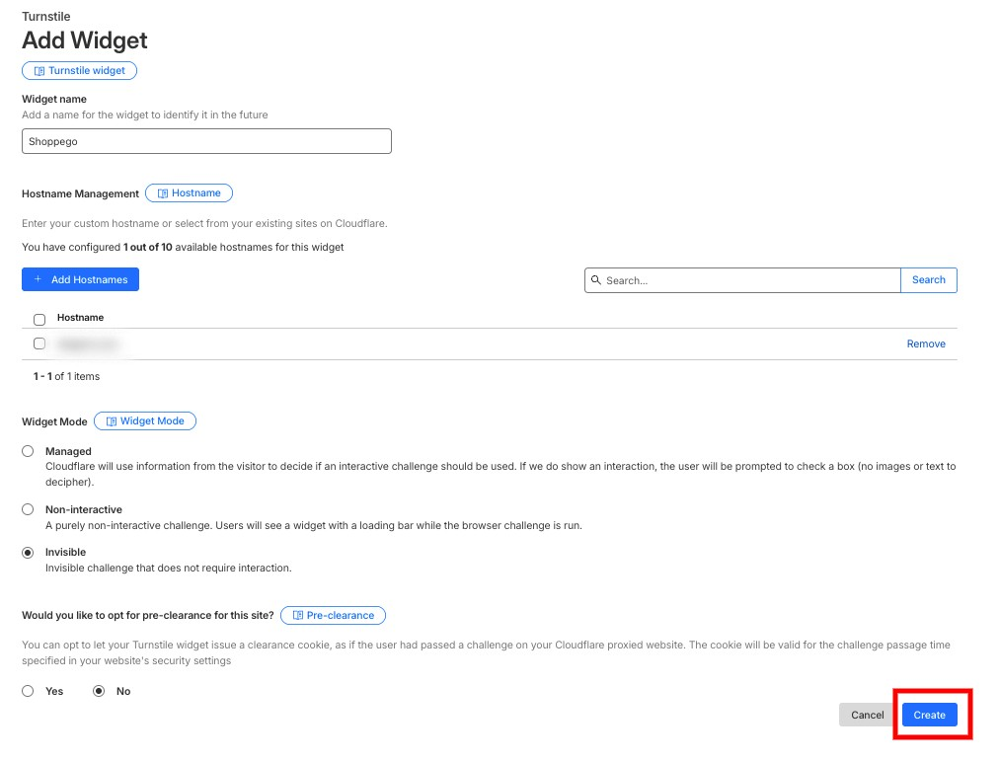<figcaption></figcaption></figure>

Kini, anda sudah boleh dapat lihat "**Site key**" dan "**Secret key**" yang anda perlu masukkan pada penetapan di dashboard Shoppego nanti.

<figure>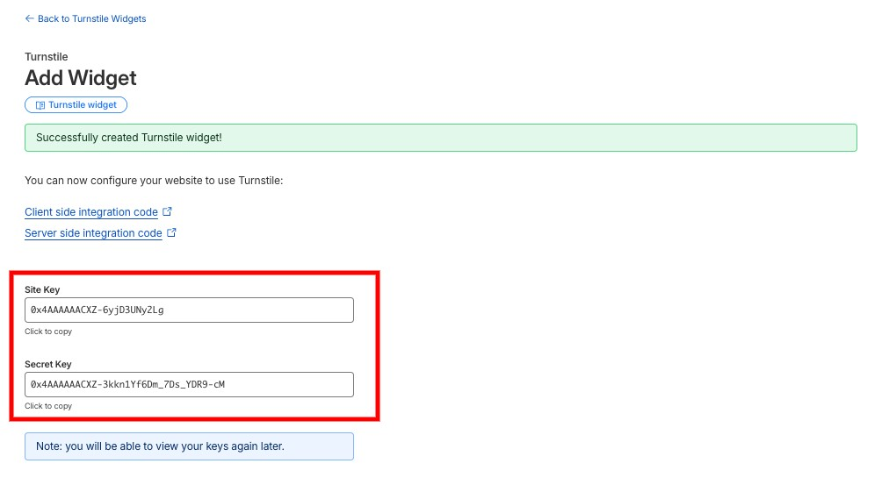<figcaption></figcaption></figure>

## Penetapan di Shoppego

1. Log masuk kedalam akaun Shoppego anda

<figure><figcaption></figcaption></figure>

2. Klik pada **Settings**

<figure><figcaption></figcaption></figure>

3. Klik pada **Captcha providers**

<figure>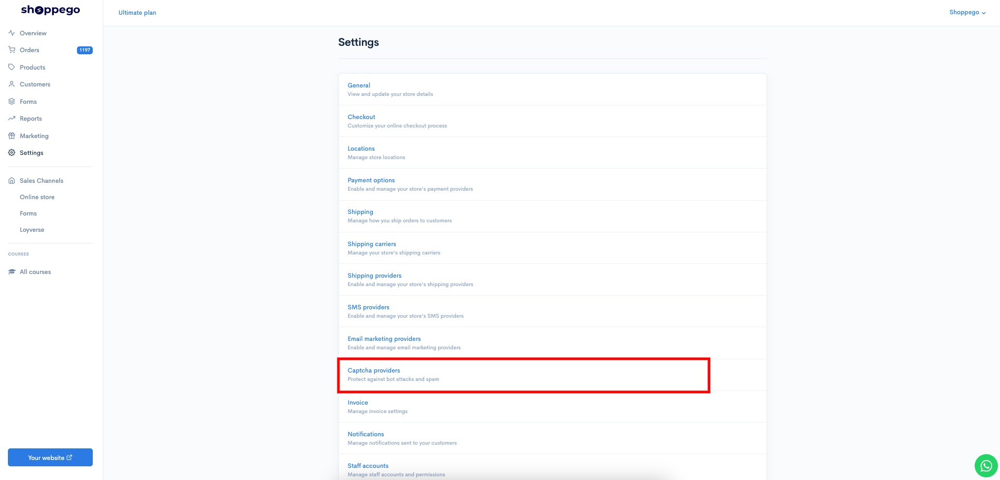<figcaption></figcaption></figure>

4. Klik pada butang **Activate/Edit** untuk jenis provider "**Cloudflare Turnstile**"

<figure>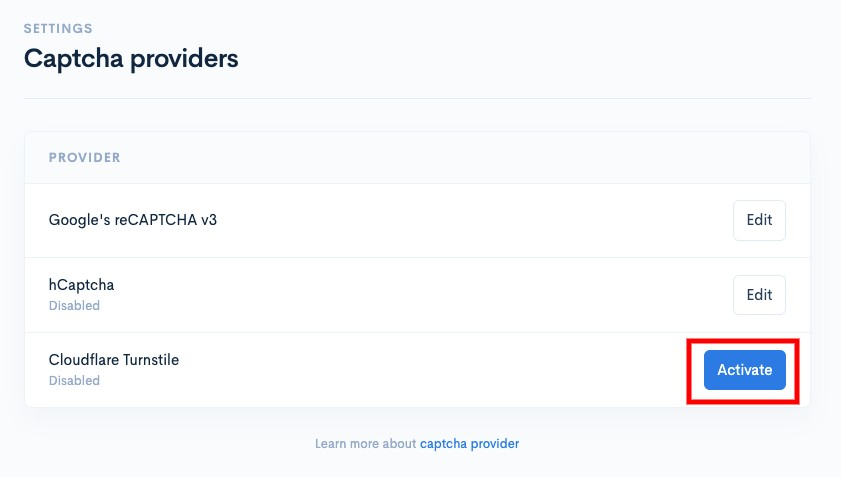<figcaption></figcaption></figure>

5. Kemudian, anda boleh **masukkan Site key** dan **Secret key** **Cloudflare Turnstile anda itu pada ruangan yang disediakan**. Pastikan **tick pada toggle Enable** dan klik **Save**

<figure>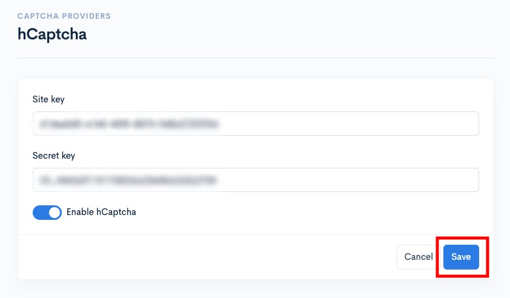<figcaption></figcaption></figure>

Kini penetapan anda sudah selesai. Anda sepatutnya dapat lihat paparan logo Cloudflare(Jika anda menggunakan "Widget mode" "Manage") itu nanti pada halaman yang mempunyai "Forms" dan juga halaman "Log masuk" website anda itu.

<figure>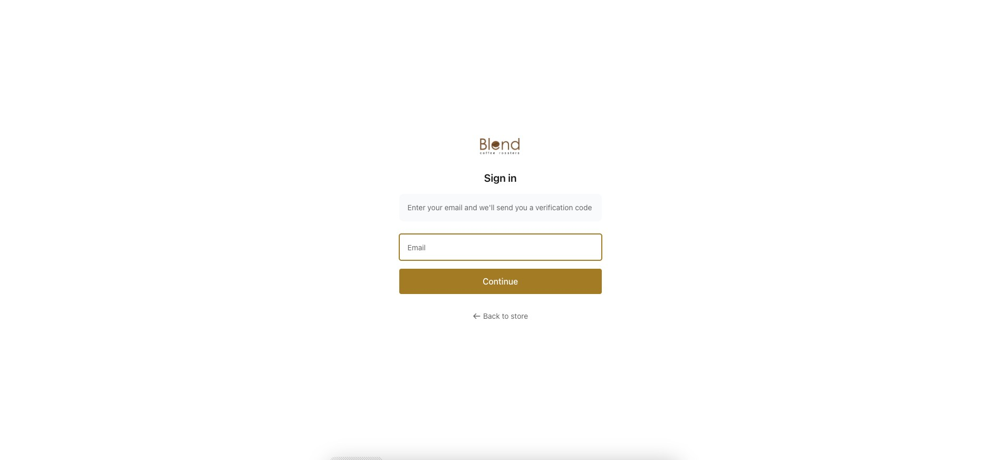<figcaption></figcaption></figure>
