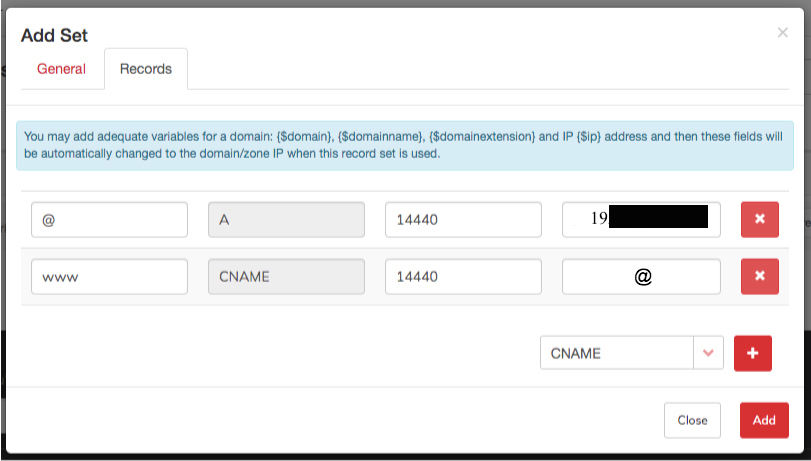

# Custom Domain


Setiap kedai di dalam Shoppego akan dapat **hosting dan subdomain secara percuma (**<mark style="color:red;">**tidak boleh diubah setelah lakukan pendaftaran**</mark>**)** yang berbentuk : [https://kedaianda.myshoppegram.com](https://kedaianda.myshoppegram.com./)


Namun begitu sekiranya pengguna ingin menggunakan domain mereka yang tersendiri juga dibenarkan oleh Shoppego dengan hanya perlu **setup DNS pada CNAME** record dari domain provider kepada maklumat DNS Shoppego.

**Bermula 26 Februari 2026 setiap pengguna Shoppego hanya perlu lakukan CNAME record sahaja dan setiap store/website akan mempunyai value/penetapan CNAME record yang sama.**

## Senarai Domain dan Tutorial penetapan

Berikut dibawah merupakan nama nama domain dan tutorial penetapan :


[Shinjiru](custom-domain/shinjiru.md)



[Godaddy](custom-domain/godaddy.md)



[Namecheap](custom-domain/namecheap.md)



[Cloudflare](custom-domain/cloudflare.md)



[CPanel](custom-domain/cpanel.md)



[Exabytes](custom-domain/exabytes.md)



[Domain Migration](custom-domain/domain-migration.md)



**Pastikan nama domain anda&#x20;**<mark style="color:red;">**tidak mempunyai simbol hyphen ( - )**</mark>

* Domain yang mempunyai simbol hyphen ( - ) selalunya **disimbolkan/dikategorikan** sebagai **spam domain**.&#x20;
* Domain yang mempunyai simbol ini juga akan selalu **berlaku&#x20;**<mark style="color:red;">**typo**</mark> semasa customer/buyer menaip.
  


**Pastikan anda&#x20;**<mark style="color:red;">**menggunakan domain .com**</mark>

* domain .com memudahkan untuk customer/buyer anda **mencari website anda.** &#x20;
* Setiap telefon bimbit juga mempunyai **button .com** dan ia dapat memudahkan customer/buyer anda menaip url website anda.
* Jika <mark style="color:red;">**tiada**</mark>**&#x20;domain .com**, anda boleh menggunakan **domain .com.my.**
  


**Pastikan anda&#x20;**<mark style="color:red;">**menggunakan domain .com**</mark>

* Domain yang pendek dan mudah diingat dapat mengurangkan typo yang ditaip oleh customer/buyer.&#x20;
* Kami cadangkan nama domain anda <mark style="color:red;">**tidak**</mark>**&#x20;melebihi 15 patah perkataan.**
  


**Pastikan nama domain anda&#x20;**<mark style="color:blue;">**unique**</mark>**&#x20;dan mempunyai&#x20;**<mark style="color:blue;">**jenama yang tersendiri**</mark>

* Domain yang menarik dapat <mark style="color:blue;">**menarik**</mark> orang untuk datang ke website anda.&#x20;
* Sebagai contoh Amazon.com kelihatan <mark style="color:blue;">**lebih menarik**</mark> daripada BuyBooksOnline.com.
  

## **Custom Domain**

Untuk menggunakan domain anda yang tersendiri, anda boleh dapatkan dari mana-mana **Domain Name provider** mengikut keselesaan anda **antaranya** adalah di :&#x20;

* Shinjiru.com.my
* Exabytes.my
* Namecheap.com.&#x20;

Untuk **domain .com** biasanya selepas pembelian ianya akan serta merta boleh digunakan bagi penetapan DNS.&#x20;

### Penetapan Domain Malaysia&#x20;

Untuk **domain Malaysia contohnya seperti .my, .com.my, .net.my** <mark style="color:red;">**perlu tunggu sekurang-kurangnya 72jam waktu bekerja**</mark> sebelum ianya boleh digunakan dan anda juga perlu lakukan **penetapan DNS records dalam akaun MYNIC** anda


Anda boleh **hubungi pihak domain provider anda** untuk lakukan **penetapan** tersebut.


Pada Domain provider anda, setelah sudah mempunyai domain yang tersendiri, anda boleh masuk kepada **bahagian DNS Manager** dan **edit DNS rekod** supaya point kepada DNS Shoppego dengan cara:-

1. Bina dua **CNAME** record untuk **www** dan tanpa www dan point kepada **shops.shoppego.my**


**\*CNAME rekod tanpa www itu adalah&#x20;**<mark style="color:red;">**penting**</mark>**&#x20;dan&#x20;**<mark style="color:red;">**wajib dibuat.**</mark>**&#x20;Manakala, CNAME record dengan www itu adalah tidak diwajibkan.**


Jadi rekod yang telah anda buat sepatutnya kelihatan lebih kurang seperti gambar dibawah.  


**Sekiranya domain provider anda ini tidak boleh lakukan penetapan CNAME record untuk host ke main domain atau @ anda boleh lakukan pemindahan pengurusan DNS ke sistem Cloudflare. Boleh rujuk di link ini untuk contoh penetapan:** [**https://docs.shoppego.com/ms/settings/custom-domain/cloudflare**](custom-domain/cloudflare.md)


### Subdomain

**Situasi** : Saya mempunyai domain **websitesaya.com** dan saya mahu **tambah subdomain**.

**Jawapan** : Anda hanya perlu **tambahkan CNAME Record yang baru** bagi subdomain anda.&#x20;

**Sebagai Contoh** :&#x20;

* Domain utama : websitesaya.com
* Host : @&#x20;
* Value : shops.shoppego.my

Untuk menggunakan **subdomain dari domain utama**, anda hanya perlu **tambah CNAME record**, iaitu.

* CNAME record
* Host : kedai
* Value : shops.shoppego.my

Maka, domain bagi kedai baru anda adalah **kedai.websitesaya.com.**


Untuk menggunakan **subdomain dari domain utama**, hanya perlu **tambah CNAME Record sahaja.**


## IP Address untuk CNAME Record

1. Pada Dashboard Shoppego, anda boleh tekan **Settings (1)** dan skrol ke bawah sehingga ke **Custom Domain (2).**

<figure><figcaption></figcaption></figure>

2. Selepas itu, tekan **Add Existing Domain**.

<figure><figcaption></figcaption></figure>

3. Anda akan lihat paparan yang mempunyai **nilai CNAME Record anda**.


**Penetapan CNAME di dalam domain provider.**

**1 :** Jika **nilai CNAME** adalah **@**, masukkan **nama domain anda** atau "**@**" didalam **ruang CNAME** dalam domain provider.


## **Info Tambahan**

Bagi memastikan DNS anda telah dituju ke Shoppego anda boleh [Semak DNS anda Disini](https://www.whatsmydns.net/) dan pastikan DNS yang terpapar ialah **penetapan yang anda telah tetapkan**

Bagi menyemak DNS anda:

1. Anda boleh klik Link ini : [Semak DNS anda Disin](https://www.whatsmydns.net/) atau <https://www.whatsmydns.net/>


Anda boleh **masukkan nama domain anda** (**beserta www** dan tanpa www) ke dalam ruangan yang disediakan. Pastikan anda telah lakukan perubahan kepada semakan CNAME record.


<figure><figcaption></figcaption></figure>

## Tempoh propagation

Anda hanya perlu <mark style="color:red;">**tunggu dalam tempoh 48 jam**</mark> untuk penetapan tersebut dapat dibaca dan domain anda boleh digunakan sebelum anda lakukan penetapan Custom domain di Shoppego.


**Tempoh paling cepat** domain anda boleh digunakan ialah **dalam 1 jam**. Jika tidak, anda perlu tunggu dalam <mark style="color:red;">**tempoh 48 jam hingga ke 72 jam**</mark> tersebut.


Anda boleh semak status propagation domain anda melalui link yang telah kami berikan (<https://www.whatsmydns.net/>)

## **Penetapan Custom Domain di Shoppego**

1. Log masuk ke **Dashboard Shoppego** -> **Settings** -> **Custom Domain** -> **Add existing domain**

<figure><figcaption></figcaption></figure>

2. Masukkan **nama domain** <mark style="color:red;">**tanpa www**</mark>, dan klik butang **Connect.**

<figure><figcaption></figcaption></figure>

3. Apabila anda telah berjaya masukkan domain anda, paparan akan bertukar seperti di bawah :&#x20;

 <mark style="color:red;">\*\*Perhatian</mark>: Jika **tiada isu**, sistem hanya akan mengambil masa **5-10 minit** untuk mengaktifkan domain anda. Jika domain anda masih tidak diaktifkan dalam tempoh masa ini, sila hubungi kami.


<figure><figcaption></figcaption></figure>

4. Sekiranya **Custom Domain** anda telah sedia dan boleh digunakan, paparan contoh seperti berikut akan keluar.&#x20;


Perkataan **Connected** dan **SSL activated** akan menjadi <mark style="color:green;">**hijau**</mark> jika segala tetapan yang telah dilakukan di atas adalah betul.&#x20;


<figure><figcaption></figcaption></figure>

### **Automatik SSL**

Setiap **custom domain juga akan diberikan SSL secara automatik** tanpa perlu membeli di domain provider. Hanya perlu membeli domain biasa sahaja dan **pihak Shoppego** akan **bekalkan SSL certificate** untuk setiap domain.

Bila SSL telah berjaya dimasukkan kepada Custom domain anda , protokol HTTP akan bertukar kepada HTTPS secara automatik.&#x20;


**'S'** bermaksud **'secure'** iaitu **selamat**, dan kini akan muncul satu ikon **'padlock'** pada browser yang menunjukkan website anda adalah selamat kepada semua pembeli. seperti di dalam gambar.


