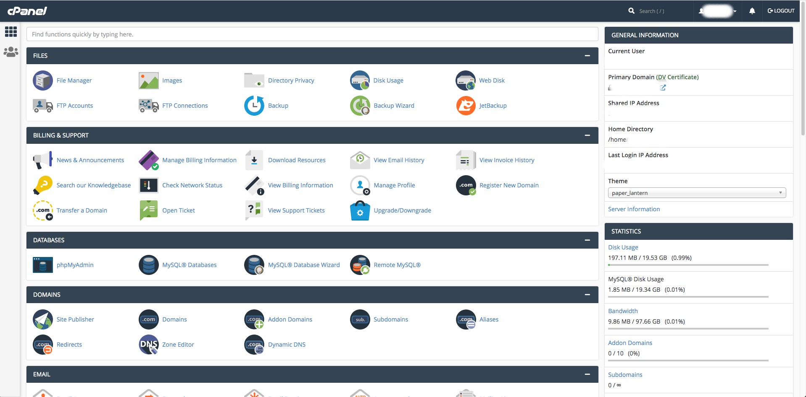
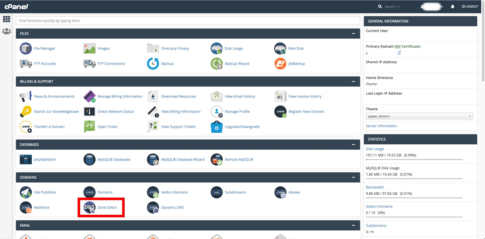
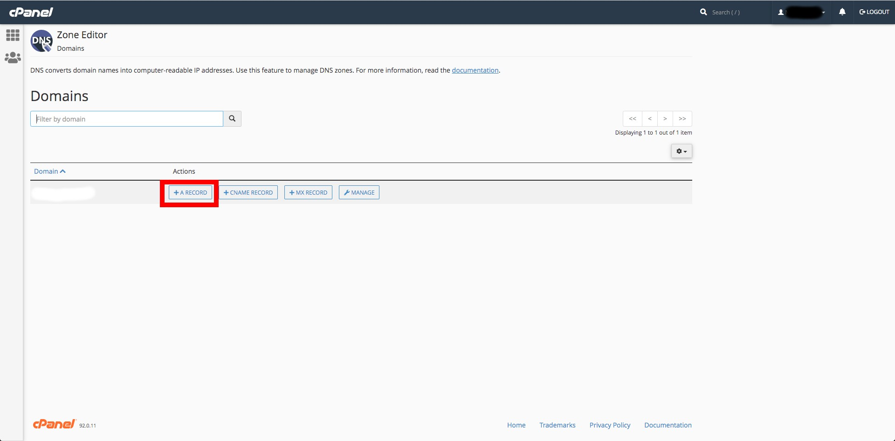
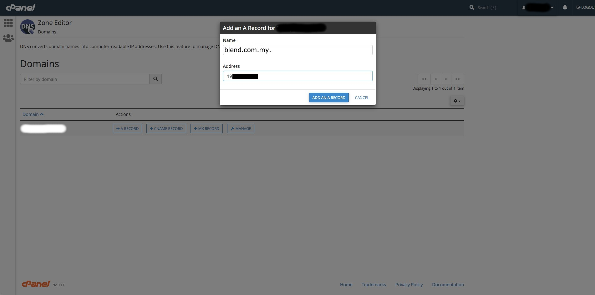
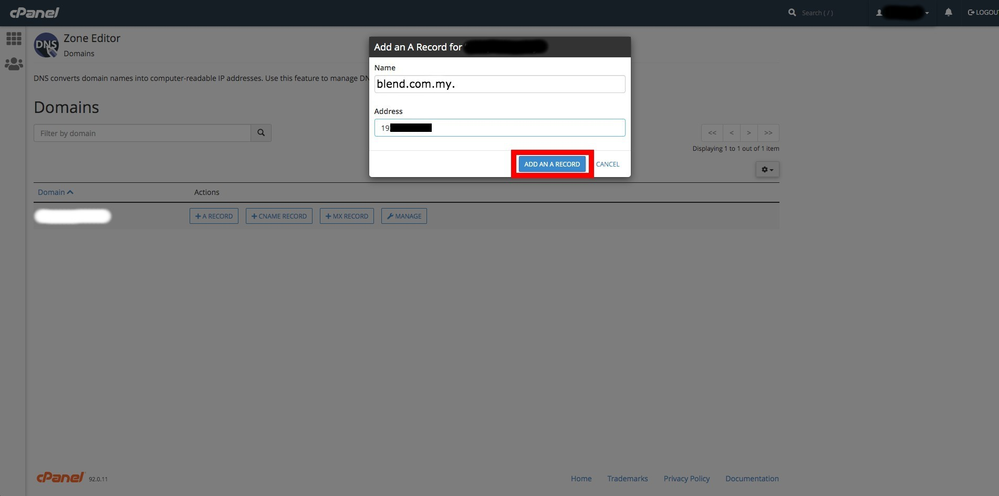
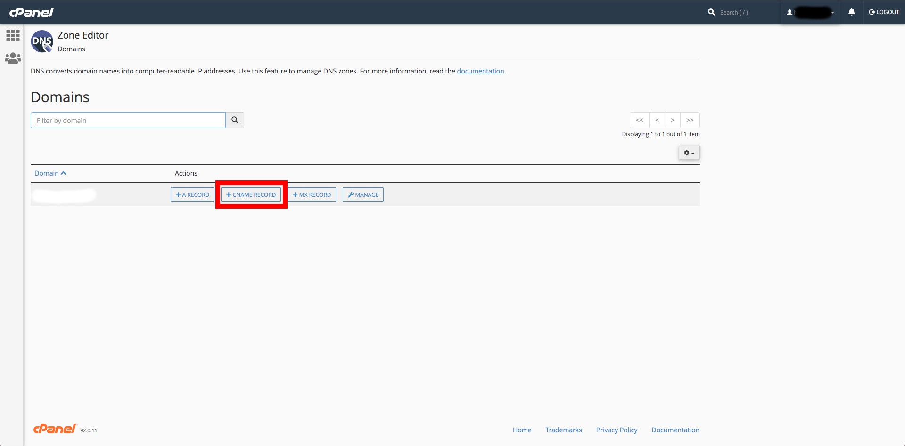
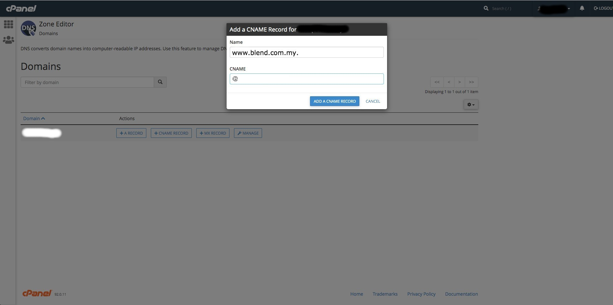
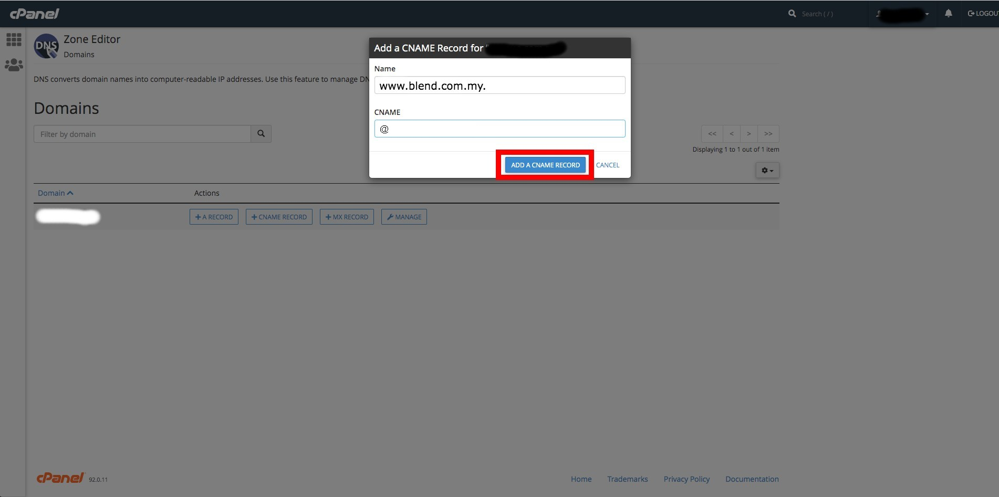
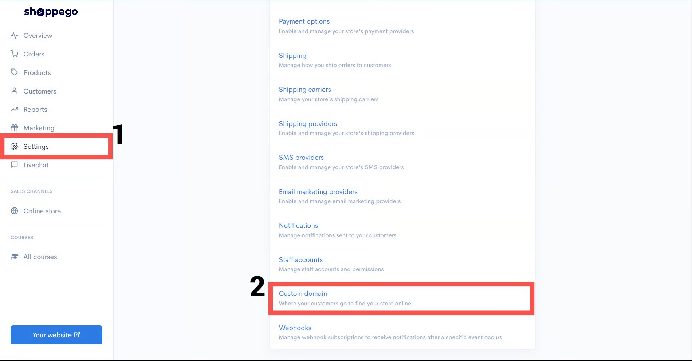

# CPanel

* **Bahagian 1** : Dapatkan value untuk **CNAME record**
* **Bahagian 2** : Penetapan di CPanel
* **Bahagian 3** : Penetapan di Shoppego

 <mark style="color:red;">**Peringatan**</mark> : Pastikan **domain anda sudah dibeli dan sudah boleh digunakan untuk setup**. Jika anda **membeli domain ".com", anda boleh terus ikut tutorial ini**.&#x20;


Jika **domain Malaysia** seperti **".my, .com.my, .net.my"** anda perlu lakukan penetapan **DNS records** ini didalam akaun **MYNIC** anda yang tersendiri atau anda boleh hubungi pihak **domain provider** anda untuk lakukan penetapan tersebut.

**Bermula 26 Februari 2026 setiap pengguna Shoppego hanya perlu lakukan CNAME record sahaja dan setiap store/website akan mempunyai value/penetapan CNAME record yang sama.**

## **Bahagian 1 :** Nilai CNAME Record 

1\. Anda boleh log masuk kedalam Dashboard Shoppego.

2\. Klik pada **Settings**

3\. Klik pada **Custom domain**

4\. Klik pada **Add existing domain**

5\. Nanti anda akan dapat lihat popup yang mempunyai **value untuk CNAME record anda**.


**Penetapan CNAME di dalam domain provider.**

**1 :** Jika **nilai CNAME** adalah **@**, masukkan **nama domain anda** atau "**@**" didalam **ruang CNAME** dalam domain provider.


## Bahagian 2 : Penetapan di CPanel

1\. Log masuk pada akaun CPanel anda.

2\. Pada dashboard CPanel, anda boleh klik pada bahagian **Zone Editor**


**Sekiranya domain provider anda ini tidak boleh lakukan penetapan CNAME record untuk host ke main domain atau @ anda boleh lakukan pemindahan pengurusan DNS ke sistem Cloudflare. Boleh rujuk di link ini untuk contoh penetapan:** [**https://docs.shoppego.com/ms/settings/custom-domain/cloudflare**](cloudflare.md)


3\. Seterusnya, untuk masukkan CNAME record anda boleh klik pada butang **+CNAME RECORD**

4. Setelah anda klik pada butang tersebut anda boleh masukkan yang diminta.
   * **Name** : Nama domain anda.
   * **Value** : shops.shoppego.my

5\. Setelah anda masukkan maklumat tersebut, anda boleh klik pada butang **ADD AN CNAME RECORD**

6\. Seterusnya untuk masukkan CNAME record www(tidak diwajibkan), anda boleh klik pada butang **+CNAME RECORD**

7. Setelah anda klik pada butang tersebut anda boleh masukkan maklumat yang diminta.
   * **Name**: **Nama domain** anda beserta **www**.
   * **Value** : **shops.shoppego.my**

8\. Setelah anda masukkan maklumat tersebut, anda boleh klik pada butang **ADD AN CNAME RECORD**


Domain anda akan mengambil masa **24-48 jam** untuk ianya boleh digunakan dan dimasukkan didalam penetapan di Shoppego. Boleh rujuk [**Tempoh Propagation**](cpanel.md#tempoh-propagation)**.**


## Tempoh propagation

Anda hanya perlu <mark style="color:red;">**tunggu dalam tempoh 48 jam**</mark> untuk penetapan tersebut dapat dibaca dan domain anda boleh digunakan sebelum anda lakukan penetapan Custom domain di Shoppego.

**Tempoh paling cepat** domain anda boleh digunakan ialah **dalam 1 jam**. Jika tidak, anda perlu tunggu dalam **tempoh 48 jam hingga ke 72 jam** tersebut.

Anda boleh semak status propagation domain anda melalui link yang telah kami berikan (<https://www.whatsmydns.net/>).

## **Info Tambahan**

Bagi memastikan DNS anda telah dituju ke Shoppego anda boleh [Semak DNS anda Disini](https://www.whatsmydns.net/) dan pastikan DNS yang terpapar ialah **penetapan yang anda telah tetapkan**

Bagi menyemak DNS anda:

1. Anda boleh klik Link ini : [Semak DNS anda Disini](https://www.whatsmydns.net/) atau <https://www.whatsmydns.net/>


Anda boleh **masukkan nama domain anda** (**beserta www** dan tanpa www) ke dalam ruangan yang disediakan. Pastikan anda telah lakukan perubahan kepada semakan CNAME record.


<figure><figcaption></figcaption></figure>

## Bahagian 3 : Penetapan di Shoppego

1. Log masuk ke dashboard Shoppego -> **Settings** dan klik **Custom Domain**

\
2\. Di halaman Domains ini klik **Add existing domain**

3\. Pop up Add existing domain akan keluar. Isikan nama website anda pada ruangan **Custom Domain** dan klik butang **Connect**


Tidak perlu tambah “**www**” untuk nama domain anda kerana banyak website-website besar seperti facebook dan lain-lain sudah tidak lagi menggunakan **www** pada nama domain mereka.


 <mark style="color:red;">\*\*Perhatian</mark>: Jika **tiada isu**, sistem hanya akan mengambil masa **5-10 minit** untuk mengaktifkan domain anda. Jika domain anda masih tidak diaktifkan dalam tempoh masa ini, sila hubungi kami.

