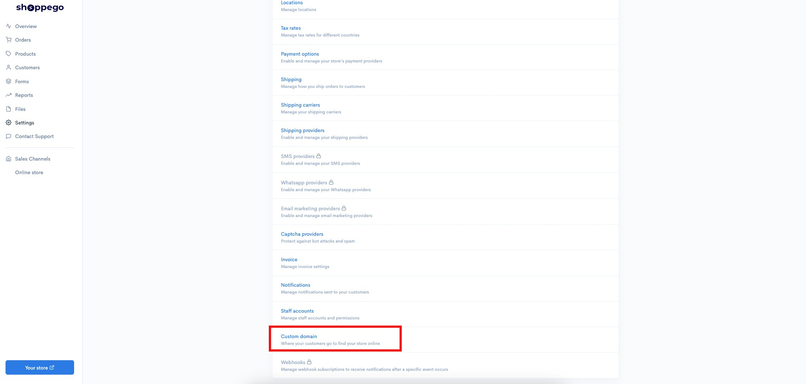
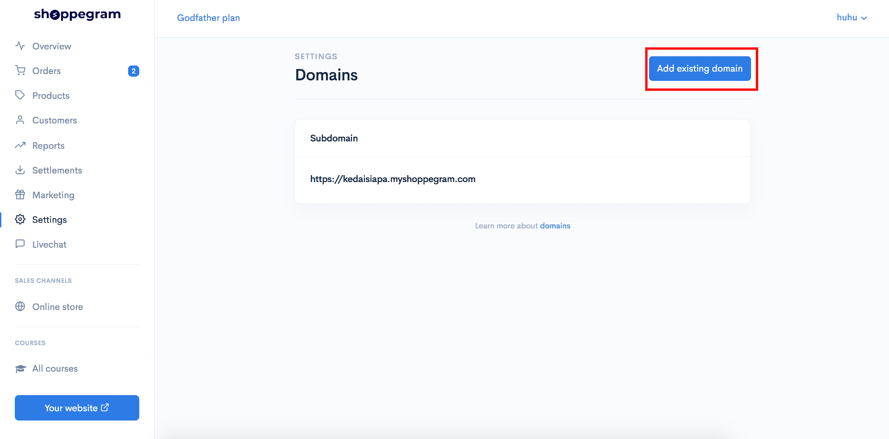
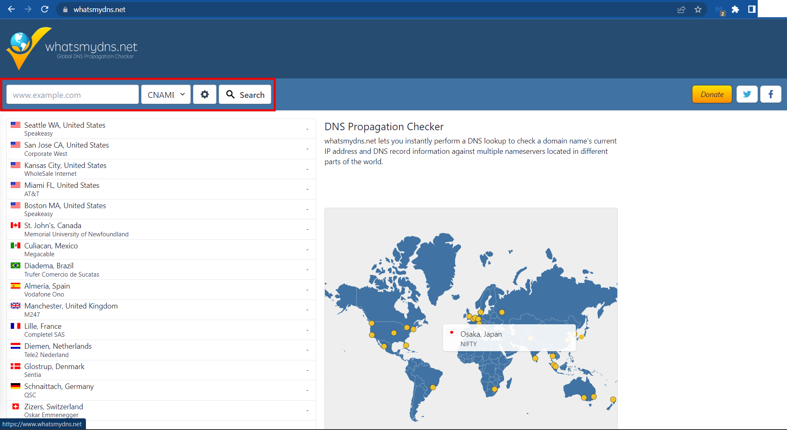
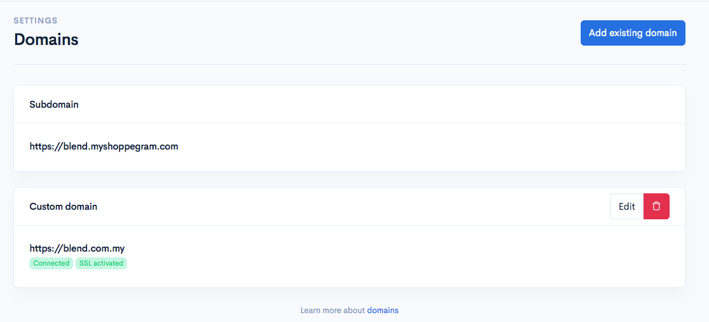

# Domain Migration


Untuk menyediakan domain migrasi anda daripada pelayan Shoppego lama (IP anda sendiri) ke pelayan Shoppego baharu (shops.shoppego.my) anda boleh merujuk tutorial di bawah:


**Mulai 26 Februari 2026, setiap pengguna Shoppego hanya perlu melakukan rekod CNAME dan setiap kedai/tapak web akan mempunyai nilai/tetapan rekod CNAME yang sama.**

## **Sebelum Anda Memulakan:**

Untuk melengkapkan sambungan, anda perlu mempunyai maklumat berikut:

* Maklumat log masuk kedalam akaun domain provider anda(Platform anda membeli domain)
* Akses penetapan DNS record untuk akaun domain provider anda
* Nilai CNAME record Shoppego iaitu `shops.shoppego.my`
* Nilai CNAME record www(tidak wajib) Shoppego iaitu `shops.shoppego.my`

Terdapat beberapa platform domain provider seperti Godaddy, Shinjiru dan Exabyte yang tidak benarkan penetapan CNAME record untuk domain utama anda. Untuk isu ini, anda perlu lakukan [pemindahan Nameserver ke Cloudflare](cloudflare.md) dan lakukan pengurusan/penetapan DNS record anda di situ.

Anda juga perlu pastikan tiada penetapan A record pada domain utama anda itu dan hanya value `shops.shoppego.my` sahaja yang ditetapkan pada CNAME record anda.

## Bahagian 1: Rekod CNAME

1. Anda boleh log masuk ke dashboard Shoppego

2. Klik pada **Settings**

3. Klik pada **Custom domain**

4\. Jika anda masih mempunyai tetapan custom domain anda, anda perlu mengklik pada butang **ikon tong sampah** untuk memadamkan tetapan domain sedia ada anda terlebih dahulu.

<figure><figcaption></figcaption></figure>

5. Klik pada **Add existing domain**

5\. Kemudian, anda akan dapat melihat pop timbul yang mempunyai nilai untuk rekod CNAME anda.

Anda perlu menyimpan Nilai untuk rekod CNAME untuk anda masukkan dalam rekod DNS domain anda dalam sistem pembekal domain kemudian.

## Bahagian 2: Buat tetapan dalam akaun domain penyedia


**Sekiranya domain provider anda ini tidak boleh lakukan penetapan CNAME record untuk host ke main domain atau @ anda boleh lakukan pemindahan pengurusan DNS ke sistem Cloudflare. Boleh rujuk di link ini untuk contoh penetapan:** [**https://docs.shoppego.com/ms/settings/custom-domain/cloudflare**](cloudflare.md)


1\. Anda perlu **log masuk ke akaun penyedia Domain anda** dan **pergi ke bahagian Pengurus DNS** untuk mengedit rekod DNS untuk menunjuk ke DNS Shoppego baharu dengan cara berikut:-

* Pada **rekod CNAME**, anda boleh **menggantikan nilai dengan nilai @ atau nama domain anda sendiri**
* Untuk rekod CNAME www, itu ianya tidak diwajibkan.


**Pastikan** tetapan rekod DNS anda **mempunyai rekod CNAME anda sahaja**. Jika anda **mempunyai rekod A**, **padamkan rekod DNS** untuk **memastikan tiada isu dengan konfigurasi anda**.


Jadi rekod yang anda telah buat sepatutnya kelihatan lebih kurang seperti gambar di bawah.

## Maklumat Tambahan

Bagi memastikan DNS anda telah dituju ke Shoppego anda boleh [Semak DNS anda Disini](https://www.whatsmydns.net/) dan pastikan DNS yang terpapar ialah **penetapan yang anda telah tetapkan**

1. Untuk menyemak DNS anda: Anda boleh klik pautan ini: Semak [**DNS disini**](https://www.whatsmydns.net/) atau <https://www.whatsmydns.net/>&#x20;

Merujuk kepada imej di bawah, untuk menyemak sama ada domain anda telah disebarkan


Anda boleh **masukkan nama domain anda** (**beserta www** dan tanpa www) ke dalam ruangan yang disediakan. Pastikan anda telah lakukan perubahan kepada semakan CNAME record.


<figure><figcaption></figcaption></figure>

### Tempoh propagation

Anda hanya perlu menunggu dalam tempoh <mark style="color:red;">**48 jam**</mark> untuk tetapan dibaca dan domain anda boleh digunakan sebelum anda membuat **tetapan Custom domain** dalam Shoppego.

Masa **paling singkat** domain anda boleh digunakan ialah dalam masa **1 jam**. Jika tidak, anda perlu menunggu dalam tempoh <mark style="color:red;">**48 jam hingga 72 jam**</mark>. Anda boleh menyemak status propagation domain anda melalui pautan yang kami sediakan (<https://www.whatsmydns.net/>)

## Penetapan domain dalam Shoppego

Jadi apabila DNS sudah di pointkan ke Shoppego dan ia sudah propagate.

1\. Log masuk ke papan pemuka Shoppego

<figure><figcaption></figcaption></figure>

2. Klik pada **Settings**

<figure><figcaption></figcaption></figure>

3. Klik pada **Custom domain**

<figure><figcaption></figcaption></figure>

2\. Kemudian anda boleh klik pada **Add existing domain** dan **masukkan nama domain anda tanpa www**, dan klik butang **Connect**

 <mark style="color:red;">\*\*Perhatian</mark>: Jika **tiada isu**, sistem hanya akan mengambil masa **5-10 minit** untuk mengaktifkan domain anda. Jika domain anda masih tidak diaktifkan dalam tempoh masa ini, sila hubungi kami.


Jika custom domain anda sedia dan boleh digunakan, paparan contoh berikut akan dipaparkan.


Perkataan **Connected** dan **SSL activated** akan berwarna <mark style="color:green;">hijau</mark>. Keadaan ini hanya akan berlaku jika semua tetapan yang telah dilakukan di atas adalah betul.

