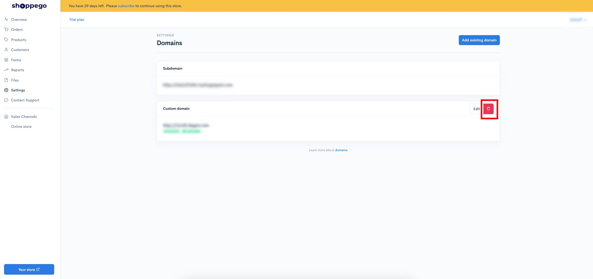
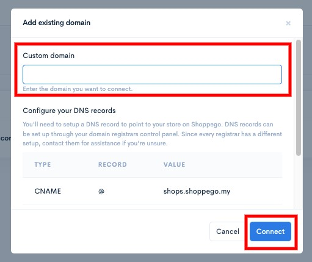
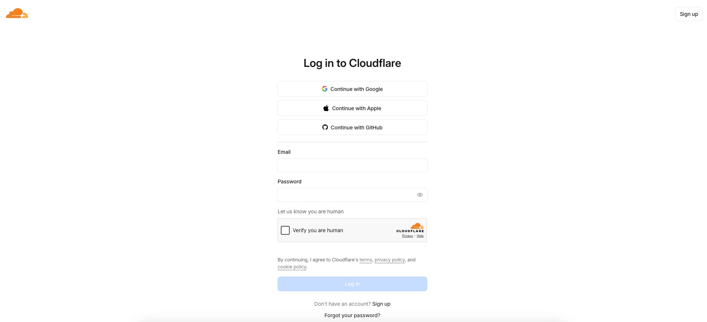
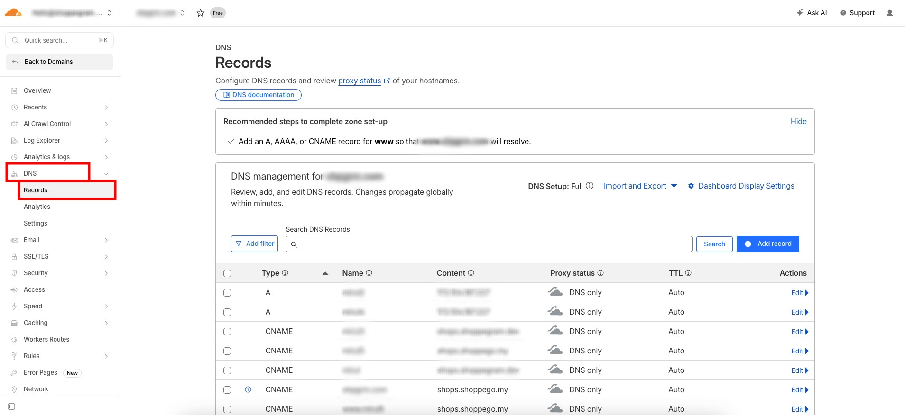
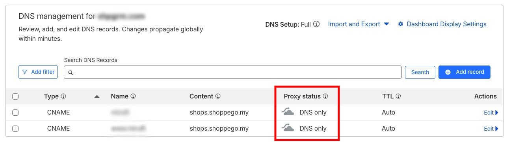

# Domain Troubleshoot

Sekiranya, domain anda mempunyai sebarang isu atau memaparkan error Error 1014, CNAME Cross-User Banned atau lain-lain, anda perlu lakukan semakan semula terhadap penetapan domain anda itu. Terdapat 3 perkara yang anda perlu lakukan semakan:

## Anda perlu pastikan anda sudah lakukan penambahan semula Custom domain tersebut pada penetapan Custom domain di store anda.

Untuk ini, anda boleh pergi pada bahagian:

1. Log masuk akaun Shoppego

<figure><figcaption></figcaption></figure>

2. Klik pada **Settings**

<figure><figcaption></figcaption></figure>

3. Klik pada **Custom domain**

<figure><figcaption></figcaption></figure>

4. Klik pada **ikon tong sampah** untuk padam penetapan domain anda itu

<figure><figcaption></figcaption></figure>

5. Setelah anda padam penetapan domain itu, anda boleh klik pada butang **Add existing domain**

<figure><figcaption></figcaption></figure>

6. Kemudian, anda boleh **masukkan semula nama domain** anda itu dan klik **Connect**

<figure><figcaption></figcaption></figure>

## Sekiranya anda menguruskan DNS anda di platform Cloudflare, anda perlu pastikan penetapan Proxy status anda itu ditetapkan kepada DNS Only

Untuk ini, anda boleh semak pada bahagian:

1. Log masuk akaun Cloudflare anda

<figure><figcaption></figcaption></figure>

2. Klik pada domain anda itu dan akses semula penetapan DNS record domain anda

<figure><figcaption></figcaption></figure>

3. Pastikan penetapan Proxy status CNAME record anda itu ditetapkan kepada `DNS Only` dan bukannya `Proxied`

<figure><figcaption></figcaption></figure>

## Jika penetapan anda itu baru sahaja dilakukan, anda perlu tunggu sehingga ia propagate sepenuhnya.

Untuk situasi ini, penetapan domain itu selalunya akan ambil masa dalam 24-48 jam untuk ia propagate sepenuhnya. Sekiranya, penetapan anda itu baru sahaja dilakukan anda perlu tunggu dalam tempoh yang dimaklumkan itu.
