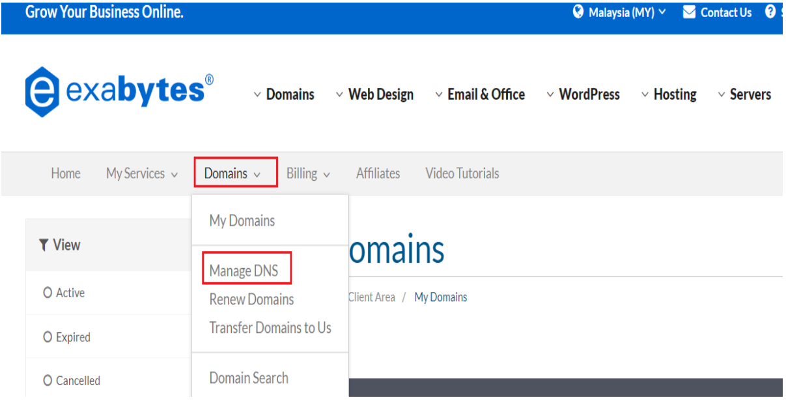
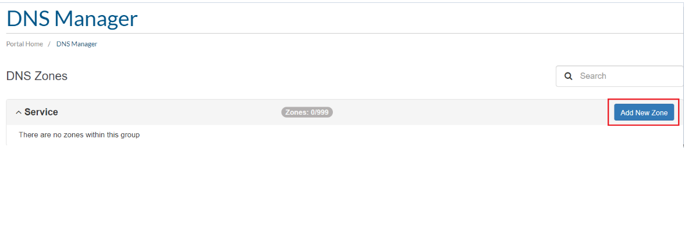
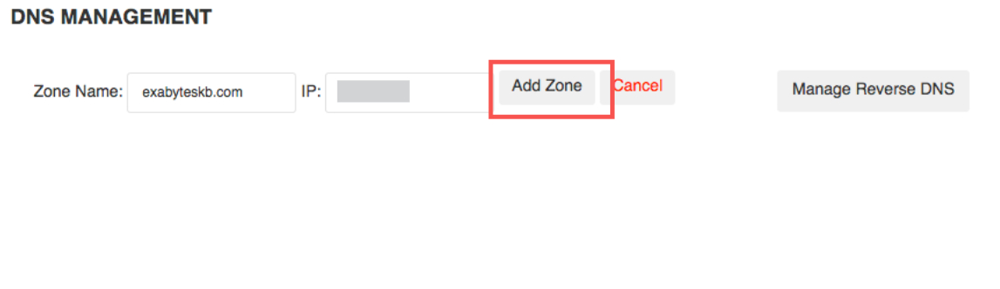
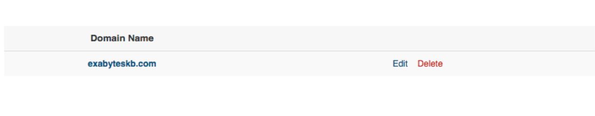
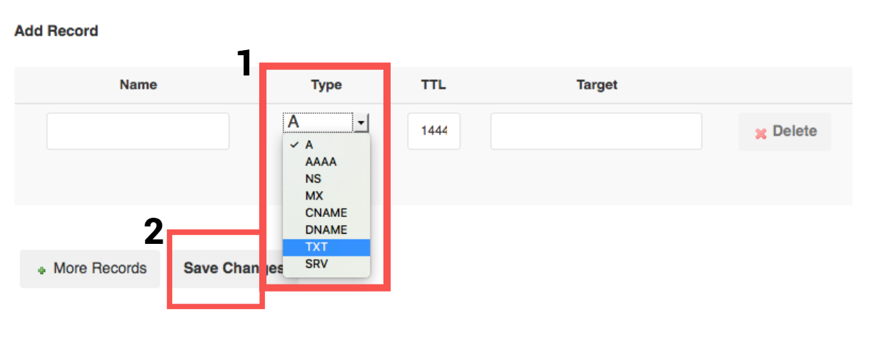
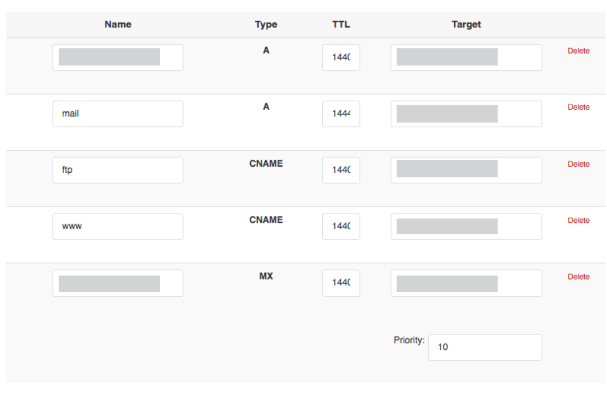

# Exabytes

Terdapat 3 bahagian untuk setup ini:

* **Bahagian 1** : Dapatkan value untuk CNAME record
* **Bahagian 2** : Penetapan di **Exabytes**
* **Bahagian 3** : Penetapan di Shoppego


\*\*<mark style="color:red;">**Peringatan**</mark> : Pastikan **domain anda sudah dibeli dan sudah boleh digunakan untuk setup**. Jika anda **membeli domain ".com", anda boleh terus ikut tutorial ini**.&#x20;


Jika **domain Malaysia** seperti **".my, .com.my, .net.my"** anda perlu lakukan penetapan **DNS records** ini didalam akaun **MYNIC** anda yang tersendiri atau anda boleh hubungi pihak **domain provider** anda untuk lakukan penetapan tersebut.

**Bermula 26 Februari 2026 setiap pengguna Shoppego hanya perlu lakukan CNAME record sahaja dan setiap store/website akan mempunyai value/penetapan CNAME record yang sama.**

## **Bahagian 1 :** Nilai CNAME Record

1\. Anda boleh log masuk kedalam **Dashboard Shoppego**.

2\. Klik pada **Settings.**

3\. Klik pada **Custom domain.**

4\. Klik pada **Add existing domain.**

5\. Nanti anda akan dapat lihat popup yang mempunyai **value untuk CNAME record anda**.


**Penetapan CNAME di dalam domain provider.**

**1 :** Jika **nilai CNAME** adalah **@**, masukkan **nama domain anda** atau "**@**" didalam **ruang CNAME** dalam domain provider.


## **Bahagian 2 : Penetapan di Exabytes**

1\. Log masuk kedalam akaun **Exabytes** anda.\
\
2\. Klik pada **Domains** -> **Manage DNS**

<figure><figcaption></figcaption></figure>

3\. Setelah itu, anda perlu tekan butang **Add New Zone**.

<figure><figcaption></figcaption></figure>


**Sekiranya domain provider anda ini tidak boleh lakukan penetapan CNAME record untuk host ke main domain atau @ anda boleh lakukan pemindahan pengurusan DNS ke sistem Cloudflare. Boleh rujuk di link ini untuk contoh penetapan:** [**https://docs.shoppego.com/ms/settings/custom-domain/cloudflare**](cloudflare.md)


4. Pada ruangan **DNS Management**, anda boleh masukkan Zone Name menggunakan di bawah :

   * **Zone Name** : Nama Domain anda
   * **IP** : **shops.shoppego.my**

   Selepas itu, anda perlu tekan **Add Zone** untuk menyimpan penetapan anda.

<figure><figcaption></figcaption></figure>

5. Selepas Zone telah ditambah, anda boleh **tambah A Record** dan **CNAME Record**, hanya perlu tekan butang **Edit**.

<figure><figcaption></figcaption></figure>

5. Pada ruangan **Add Record** anda boleh klik pada **dropdown** dan **pilih CNAME (1)**, maklumat bagi CNAME **Record** adalah seperti di bawah :&#x20;

### 1 : Penetapan CNAME Record

1. **CNAME Record :**&#x20;
   * **Name** : @&#x20;
   * **Type** : CNAME
   * **TTL** : Default
   * **Target** : **shops.shoppego.my**

### 2 : Penetapan CNAME Record www(tidak diwajibkan)

1. **CNAME Record** :&#x20;
   * **Name** : www
   * **Type** : CNAME
   * **TTL** : Default
   * **Target** : **shops.shoppego.my**

<figure><figcaption></figcaption></figure>

7. Paparan senarai domain anda akan menjadi seperti berikut :&#x20;

<figure><figcaption></figcaption></figure>

Setelah domain anda sudah boleh digunakan baru anda boleh masukkan domain anda didalam penetapan di Shoppego.


Setelah selesai anda boleh klik **Save All Changes.** Setelah itu anda boleh rujuk [**Tempoh Propagation**](exabytes.md#tempoh-propagation).


## Tempoh propagation

Anda hanya perlu <mark style="color:red;">**tunggu dalam tempoh 48 jam**</mark> untuk penetapan tersebut dapat dibaca dan domain anda boleh digunakan sebelum anda lakukan penetapan Custom domain di Shoppego.

**Tempoh paling cepat** domain anda boleh digunakan ialah **dalam 1 jam**. Jika tidak, anda perlu tunggu dalam **tempoh 48 jam hingga ke 72 jam** tersebut.

Anda boleh semak status propagation domain anda melalui link yang telah kami berikan (<https://www.whatsmydns.net/>)

## **Info Tambahan**

Bagi memastikan DNS anda telah dituju ke Shoppego anda boleh [Semak DNS anda Disini](https://www.whatsmydns.net/) dan pastikan DNS yang terpapar ialah **penetapan yang anda telah tetapkan**

Bagi menyemak DNS anda:

1. Anda boleh klik Link ini : [Semak DNS anda Disini](https://www.whatsmydns.net/) atau <https://www.whatsmydns.net/>


Anda boleh **masukkan nama domain anda** (**beserta www** dan tanpa www) ke dalam ruangan yang disediakan. Pastikan anda telah lakukan perubahan kepada semakan CNAME record.


<figure><figcaption></figcaption></figure>

## Bahagian 3 : Penetapan Shoppego

1. Log masuk ke Dashboard Shoppego -> **Settings(1)** dan klik **Custom Domain(2).**

<figure><figcaption></figcaption></figure>

\
2\. Di halaman Domains ini klik pada butang **Add existing domain.**

<figure><figcaption></figcaption></figure>

3\. Pop up Add existing domain akan keluar. Isikan nama website anda pada ruangan **Custom Domain** dan klik butang **Connect.**


Dalam ruang dibawah, anda **perlu masukkan nama domain** anda <mark style="color:red;">**tanpa**</mark>**&#x20;[www](http://www).**


<figure><figcaption></figcaption></figure>

4. Apabila anda telah berjaya masukkan domain anda, paparan akan bertukar seperti di bawah :&#x20;

 <mark style="color:red;">\*\*Perhatian</mark>: Jika **tiada isu**, sistem hanya akan mengambil masa **5-10 minit** untuk mengaktifkan domain anda. Jika domain anda masih tidak diaktifkan dalam tempoh masa ini, sila hubungi kami.


<figure><figcaption></figcaption></figure>

5. Sekiranya **Custom Domain** anda telah sedia dan boleh digunakan, paparan contoh seperti berikut akan keluar.&#x20;


Perkataan **Connected** dan **SSL activated** akan menjadi <mark style="color:green;">**hijau**</mark> jika segala tetapan yang telah dilakukan adalah betul.&#x20;


<figure><figcaption></figcaption></figure>
