# Shinjiru (Domain.my)

Terdapat 6 Bahagian yang diperlukan untuk **penetapan domain .com.my**

* **Bahagian 1** : Nilai CNAME Record
* **Bahagian 2** : Beli Domain di Shinjiru
* **Bahagian 3** : Pengesahan Identiti
* **Bahagian 4** : Pendaftaran Cloudflare
* **Bahagian 5** : Penetapan **Nameserver Cloudflare** ke **Mynic**
* **Bahagian 6 :** Penetapan pada Shoppego

**Bermula 26 Februari 2026 setiap pengguna Shoppego hanya perlu lakukan CNAME record sahaja dan setiap store/website akan mempunyai value/penetapan CNAME record yang sama.**

## Bahagian 1 : Nilai CNAME Record

1. Untuk dapatkan **nilai A dan CNAME Record** dalam Shoppego, anda hanya perlu pergi ke :&#x20;

**Dashboard Overview -> Settings -> Custom Domain -> Add Existing Domain.**

<figure>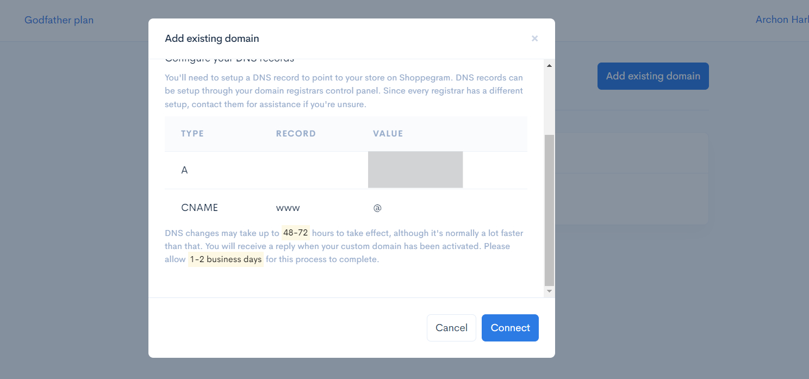<figcaption></figcaption></figure>

## Bahagian 2 : Beli Domain di Shinjiru

1. Untuk **pembelian domain Shinjiru,** boleh pergi ke link : <https://www.shinjiru.com.my/>.

<figure>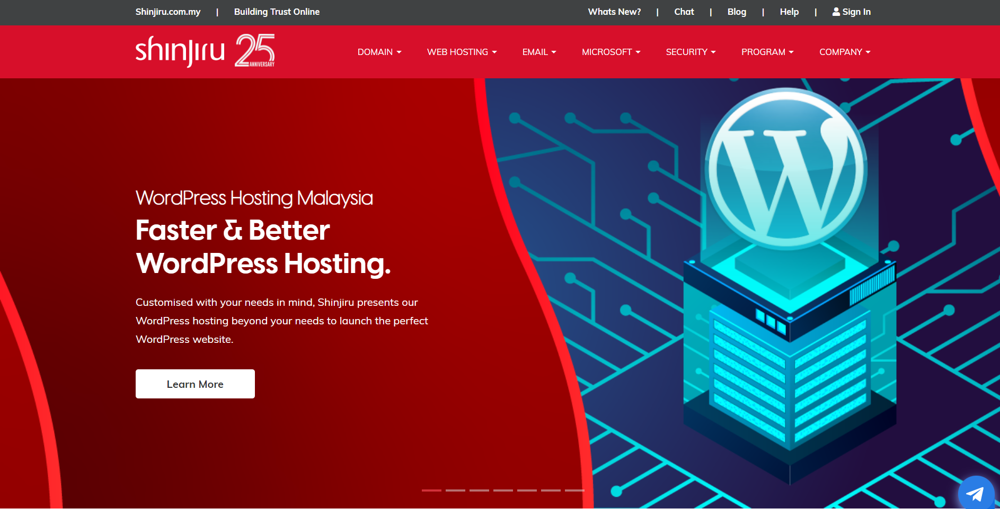<figcaption></figcaption></figure>

## Bahagian 3 : Pengesahan Identiti&#x20;

1. Setelah lakukan pembelian domain, pihak Shinjiru akan menghantar satu emel kepada anda bertujuan untuk **dapatkan pengesahan** seperti **gambar kad pengenalan (I.C)**.

<figure>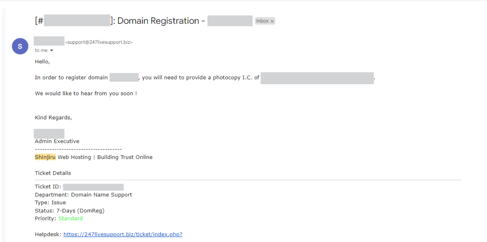<figcaption></figcaption></figure>

 <mark style="color:red;">**Perhatian**</mark> : Selepas anda membalas emel mereka, anda **perlu tunggu dalam 1\~2 hari** untuk pengaktifan bagi **pendaftaran nama domain MYNIC**.&#x20;


2. Selepas pengaktifan telah berjaya dilakukan, anda akan menerima maklumat untuk log masuk ke **akaun MYNIC** anda.

<figure>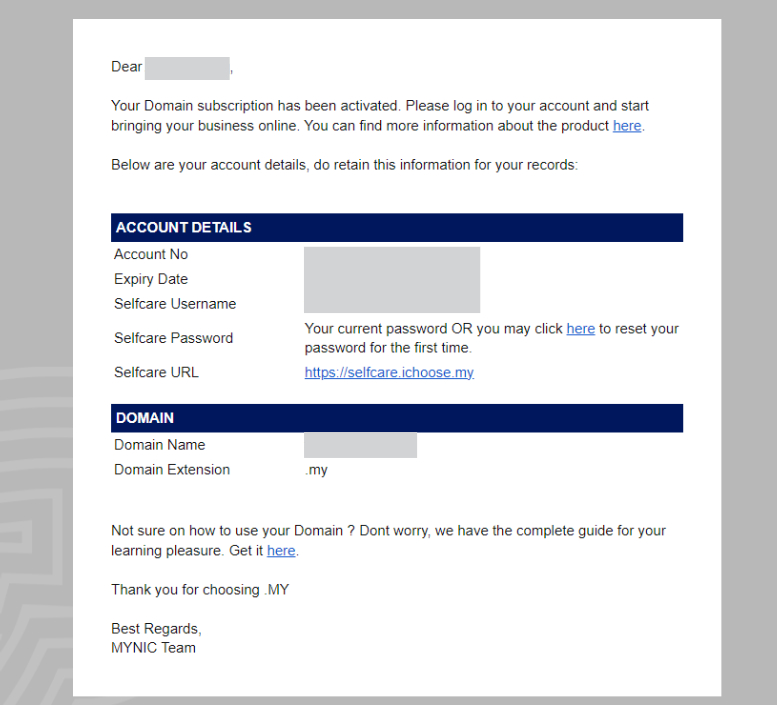<figcaption></figcaption></figure>

3. Selepas pengaktifan telah berjaya dilakukan, anda **perlu log masuk** kedalam <https://selfcare.ichoose.my/login> menggunakan maklumat yang telah diberi.

<figure>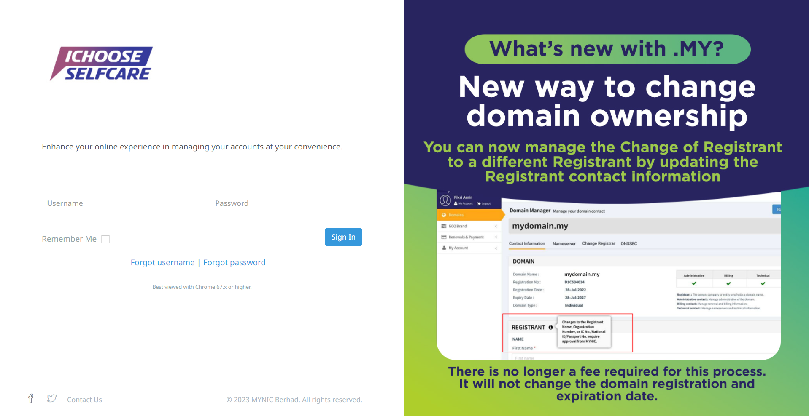<figcaption></figcaption></figure>

## Bahagian 4 : Pendaftaran Cloudflare&#x20;

1. Untuk lakukan **pendaftaran Cloudflare**, boleh pergi ke link ini : <https://www.cloudflare.com/> dan **tekan butang Sign Up**.

<figure>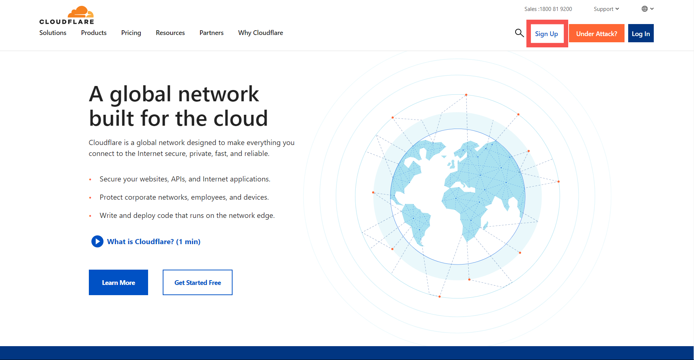<figcaption></figcaption></figure>

2. Selepas itu, anda boleh masukkan **Email Address** dan **Password**, selepas itu tekan butang **Sign Up.** Setelah itu, anda boleh **log masuk** kedalam akaun Cloudflare anda.

<figure>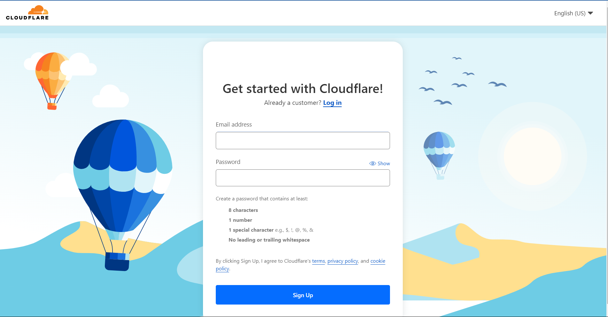<figcaption></figcaption></figure>

3. Selepas itu, anda tekan butang **Add Site**.

<figure>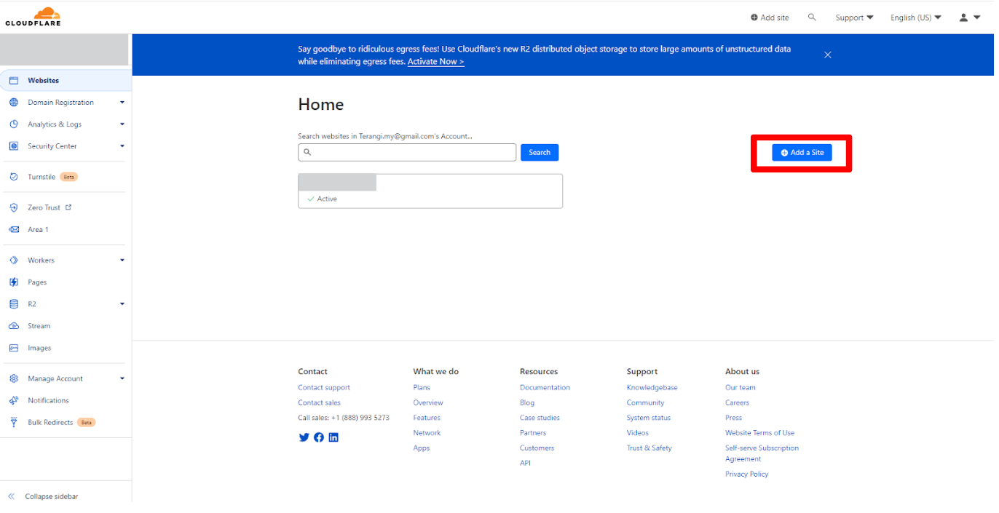<figcaption></figcaption></figure>

4. Masukkan **nama domain yang telah anda beli** dan **tekan butang Add Site**.

<figure>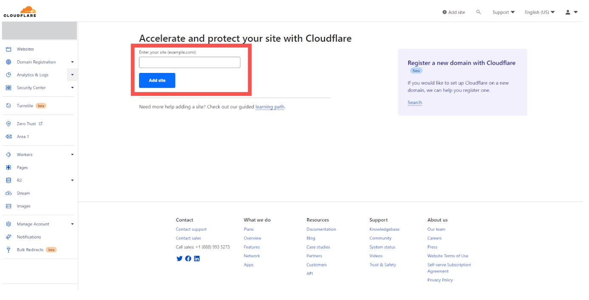<figcaption></figcaption></figure>

5. Selepas itu, anda perlu **tekan pada nama domain** anda **pilih Free** pada Plan seperti gambar dibawah.

<figure>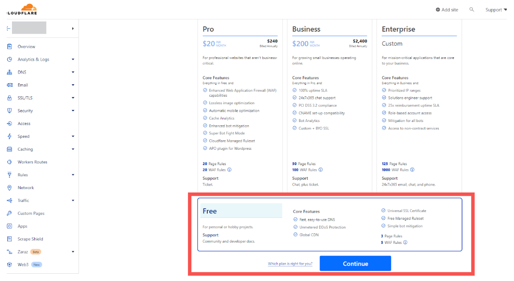<figcaption></figcaption></figure>

6. Selepas itu anda perlu lakukan penetapan **DNS** didalam Cloudflare. Anda hanya perlu tekan **DNS pada sebelah kiri** dan tekan pada bahagian **Record.**

### 1 : Penetapan CNAME Record:&#x20;

1. Penetapan CNAME **record**, anda boleh **pilih dropdown CNAME** dan masukkan maklumat ada ruangan tersebut masukkan :&#x20;

   * **Type** : CNAME
   * **Name** : @ atau nama domain anda
   * **IPv4 Address** : shops.shoppego.my
   * **Proxy Status** : DNS Only (\*\*<mark style="color:red;">**Perhatian**</mark> : Pastikan **ikon awan** berwarna **kelabu**)
   * **TTL** : Automatik / 1 Jam

   Setelah selesai, tekang butang **Save**.

<figure><figcaption></figcaption></figure>

### 2 : Penetapan CNAME Record www(tidak diwajibkan):&#x20;

2. Penetapan **CNAME Record**, anda boleh **pilih dropdown CNAME** masukkan maklumat ada ruangan tersebut masukkan :

   * **Type** : CNAME
   * **Name** : www
   * **Target** : shops.shoppego.my
   * **Proxy Status** : DNS Only (\*\*<mark style="color:red;">**Perhatian**</mark> : Pastikan **ikon awan** berwarna **kelabu**)
   * **TTL** : Automatik / 1 Jam

   Setelah selesai, tekang butang **Save**.

<figure><figcaption></figcaption></figure>

3. Setelah selesai membuat penetapan, paparan bagi DNS anda adalah seperti dibawah :&#x20;

<figure><figcaption></figcaption></figure>

### 3 : Dapatkan Nameserver dari Cloudflare

1. Pada halaman **Overview** anda, anda boleh skrol ke bawah sehingga ke bahagian **Replace with Cloudflare's Nameserver.** **Salin kedua-dua nameserver** untuk diletakkan didalam **akaun MYNIC.**

<figure>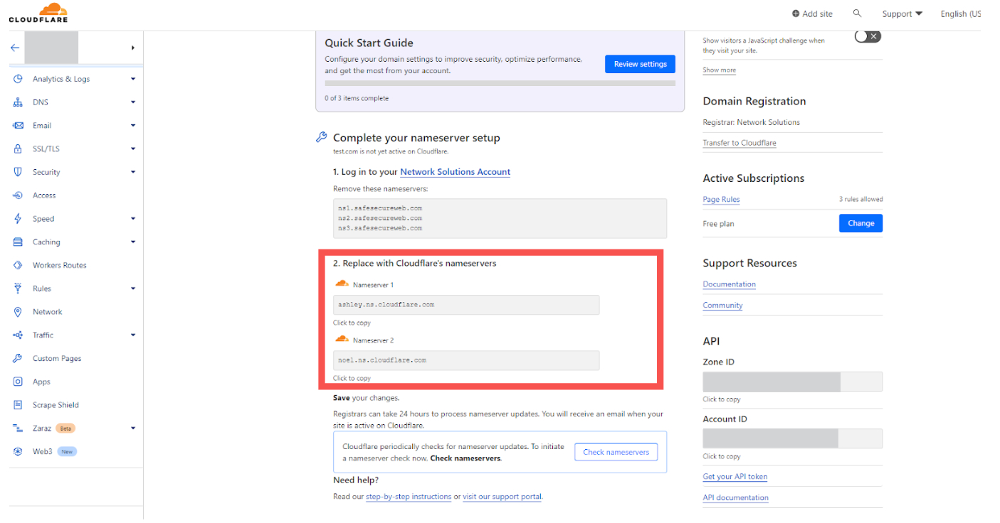<figcaption></figcaption></figure>

## Bahagian 5 : Penetapan **Nameserver Cloudflare** ke **Mynic**

1. Anda **perlu log masuk** kedalam <https://selfcare.ichoose.my/login> menggunakan maklumat yang telah diberi.

<figure><figcaption></figcaption></figure>

2. Setelah itu, anda perlu tekan butang **Manage**.

<figure>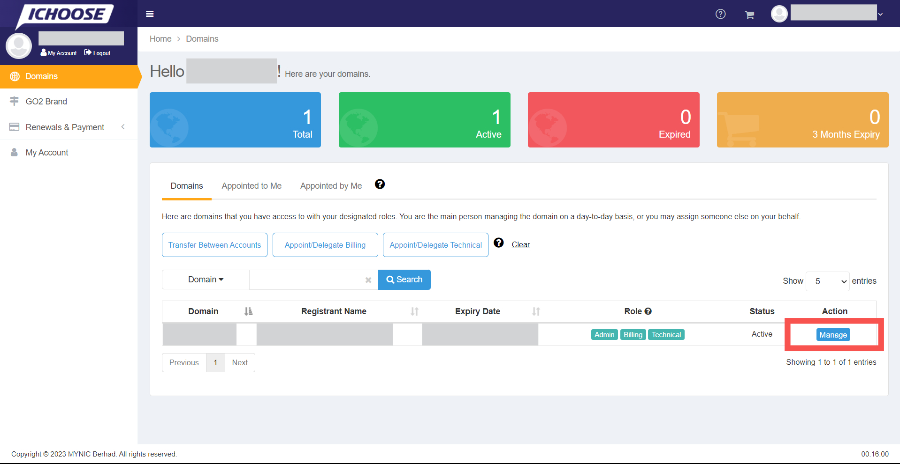<figcaption></figcaption></figure>

3. Kemudian, pergi ke **Nameservers (1)**, tekan **Edit(2)** dan **masukkan kedua-dua Nameserver(3)** yang telah disalin dari Cloudflare. Anda perlu tekan butang **Save** untuk menyimpan penetapan yang telah dibuat.

<figure>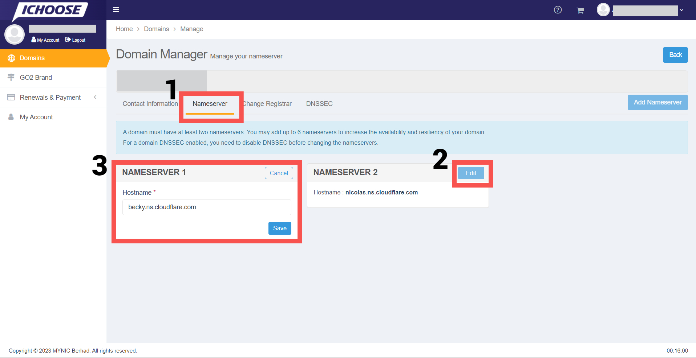<figcaption></figcaption></figure>

## Tempoh propagation

Anda hanya perlu <mark style="color:red;">**tunggu dalam tempoh 48 jam**</mark> untuk penetapan tersebut dapat dibaca dan domain anda boleh digunakan sebelum anda lakukan penetapan Custom domain di Shoppego.

**Tempoh paling cepat** domain anda boleh digunakan ialah **dalam 1 jam**. Jika tidak, anda perlu tunggu dalam <mark style="color:red;">**tempoh 48 jam hingga ke 72 jam**</mark> tersebut.

Anda boleh semak status propagation domain anda melalui link yang telah kami berikan (<https://www.whatsmydns.net/>)

## **Info Tambahan**

Bagi memastikan DNS anda telah dituju ke Shoppego anda boleh [Semak DNS anda Disini](https://www.whatsmydns.net/) dan pastikan DNS yang terpapar ialah **penetapan yang anda telah tetapkan**

Bagi menyemak DNS anda:

1. Anda boleh klik Link ini : [Semak DNS anda Disini](https://www.whatsmydns.net/) atau <https://www.whatsmydns.net/>


Anda boleh **masukkan nama domain anda** (**beserta www** dan tanpa www) ke dalam ruangan yang disediakan. Pastikan anda telah lakukan perubahan kepada semakan CNAME record.


<figure><figcaption></figcaption></figure>

## Bahagian 6 : Penetapan pada Shoppego

1. Pada Dashboard Shoppego, anda boleh tekan **Settings (1)** dan skrol ke bawah sehingga ke **Custom Domain (2).**

<figure><figcaption></figcaption></figure>

2. Selepas itu, tekan **Add Existing Domain**.

<figure><figcaption></figcaption></figure>

3. **Masukkan nama domain** yang telah anda beli tadi.

<figure><figcaption></figcaption></figure>

4. Apabila anda telah berjaya masukkan domain anda, paparan akan bertukar seperti di bawah :&#x20;

 <mark style="color:red;">\*\*Perhatian</mark>: Jika **tiada isu**, sistem hanya akan mengambil masa **5-10 minit** untuk mengaktifkan domain anda. Jika domain anda masih tidak diaktifkan dalam tempoh masa ini, sila hubungi kami.


<figure><figcaption></figcaption></figure>

5. Sekiranya **Custom Domain** anda telah sedia dan boleh digunakan, paparan contoh seperti berikut akan keluar.&#x20;


Perkataan **Connected** dan **SSL activated** akan menjadi <mark style="color:green;">**hijau**</mark>. Keadaan ini hanya akan berlaku jika segala tetapan yang telah dilakukan adalah betul.&#x20;


<figure><figcaption></figcaption></figure>
