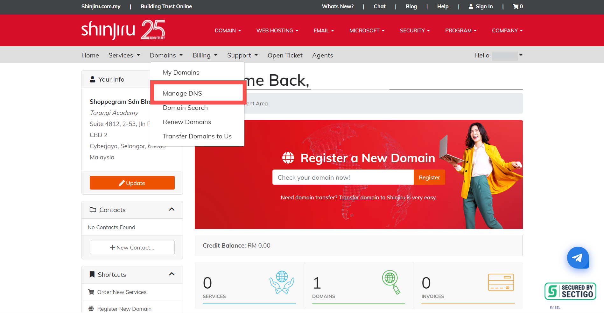
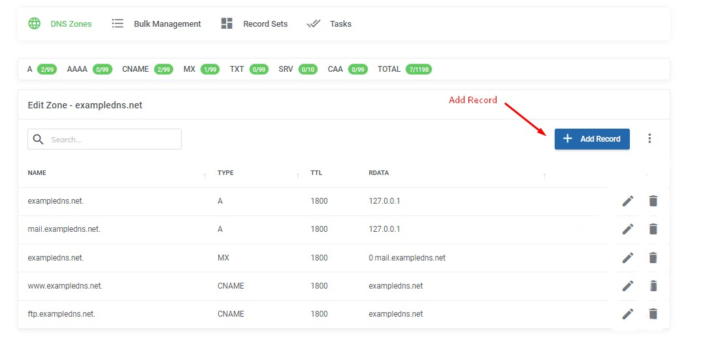
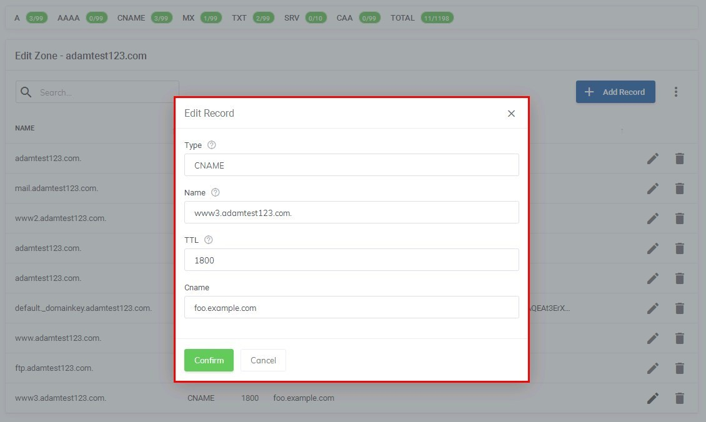
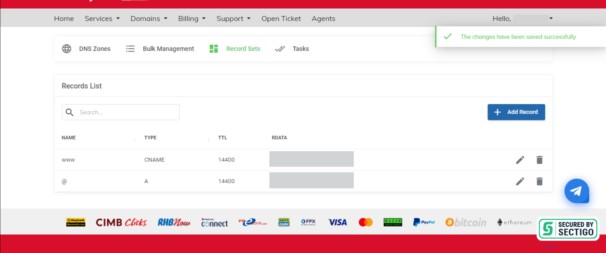
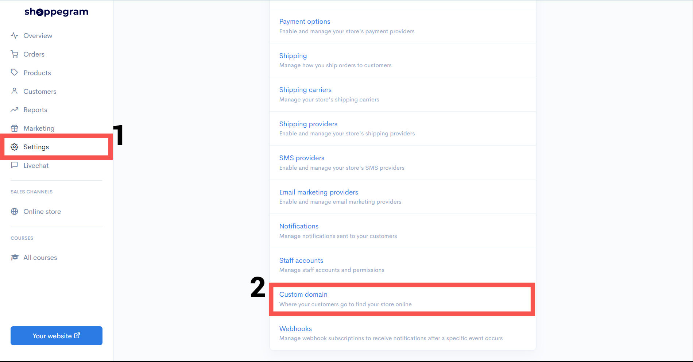
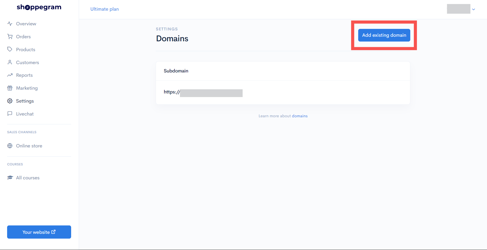
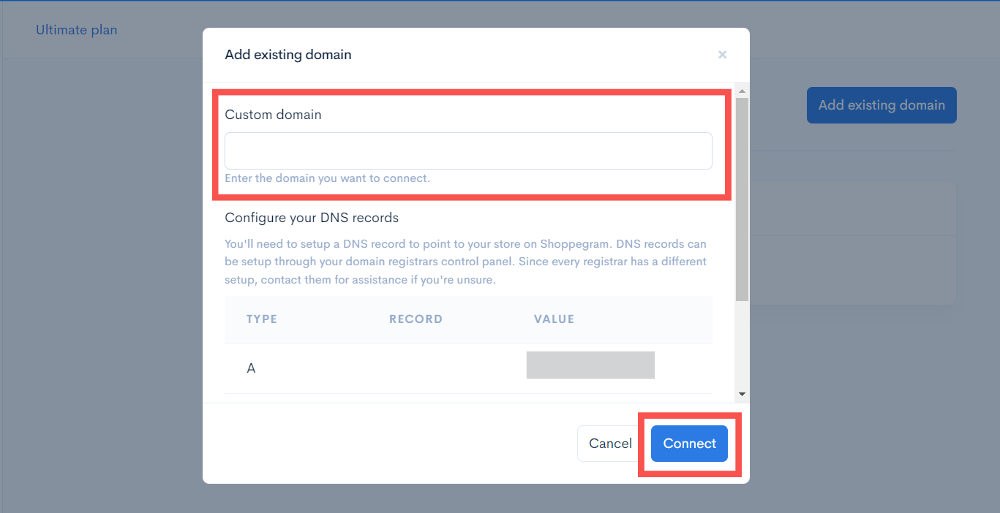
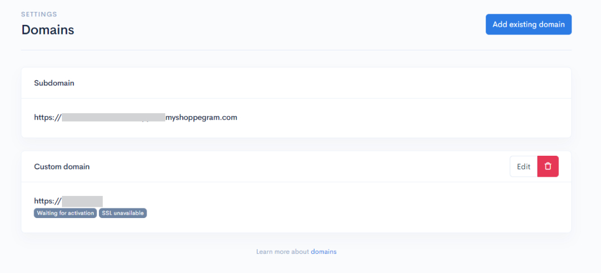
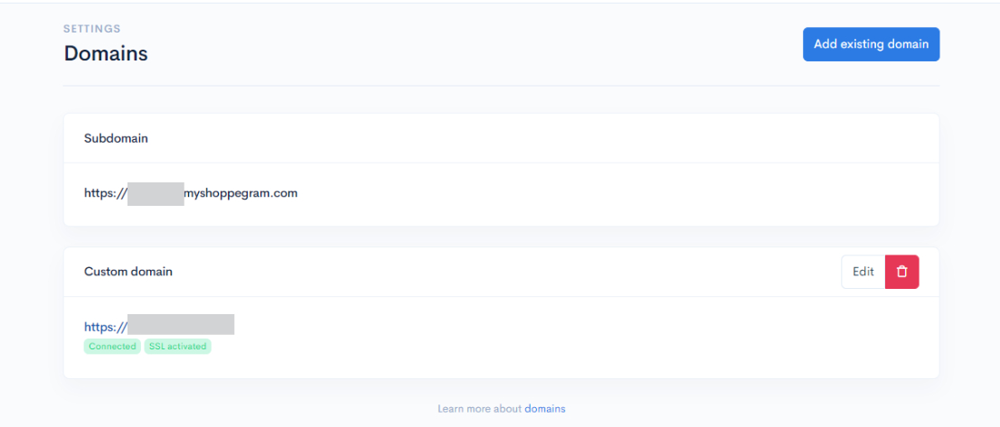

# Shinjiru

Terdapat 3 bahagian untuk lakukan penetapan ini:

* **Bahagian 1** : Dapatkan value untuk CNAME record
* **Bahagian 2** : Penetapan di Shinjiru
* **Bahagian 3** : Penetapan di Shoppego


Pastikan **domain anda sudah dibeli dan sudah boleh digunakan untuk setup**. Jika anda **membeli domain ".com", anda boleh terus ikut tutorial ini**.&#x20;


Jika **domain Malaysia** seperti **".my, .com.my, .net.my"** anda perlu lakukan penetapan **DNS records** ini didalam akaun **MYNIC** anda yang tersendiri atau anda boleh hubungi pihak **domain provider** anda untuk lakukan penetapan tersebut.

**Bermula 26 Februari 2026 setiap pengguna Shoppego hanya perlu lakukan CNAME record sahaja dan setiap store/website akan mempunyai value/penetapan CNAME record yang sama.**

## **Bahagian 1 :** Nilai CNAME Record 

1\. Anda boleh log masuk kedalam dashboard Shoppego

2\. Klik pada **Settings**

3\. Klik pada **Custom domain.**

4\. Klik pada **Add existing domain.**

5\. Nanti anda akan dapat lihat paparan yang mempunyai **value untuk CNAME record anda**.


**Penetapan CNAME di dalam domain provider.**

**1 :** Jika **nilai CNAME** adalah **@**, masukkan **nama domain anda** atau "**@**" didalam **ruang CNAME** dalam domain provider.



Anda perlu **simpan Value** untuk **CNAME record** tersebut untuk anda masukkan didalam **DNS record domain** anda didalam sistem domain provider nanti.


## Bahagian 2 : Penetapan Shinjiru

1\. Log masuk ke dalam akaun Shinjiru anda dan klik pada **Domain** -> **Manage DNS**

<figure><figcaption></figcaption></figure>

2\. Dalam halaman **Manage DNS**, klik butang **Add Record**

<figure><figcaption></figcaption></figure>

3. Satu paparan akan keluar untuk anda lakukan penetapan bagi **CNAME Record** dalam bahagian ini.

<figure><figcaption></figcaption></figure>


**Sekiranya domain provider anda ini tidak boleh lakukan penetapan CNAME record untuk host ke main domain atau @ anda boleh lakukan pemindahan pengurusan DNS ke sistem Cloudflare. Boleh rujuk di link ini untuk contoh penetapan:** [**https://docs.shoppego.com/ms/settings/custom-domain/cloudflare**](cloudflare.md)


### 1 : Penetapan CNAME Record

1. Penetapan CNAME Record :&#x20;
   * **Type** : **CNAME**
   * **Name** : **@** atau nama domain anda
   * **TTL** : **Default**
   * **CNAME** : **shops.shoppego.my**
2. Penetapan CNAME Record www (tidak diwajibkan):&#x20;
   * **Type** : **CNAME**
   * **Name** : **www**
   * **TTL** : **Default**
   * **CNAME** : **shops.shoppego.my**

Setelah selesai membuat kedua-dua penetapan, paparan yang keluar adalah seperti dibawah :&#x20;

<figure><figcaption></figcaption></figure>

Proses untuk domain siap sedia untuk dimasukkan pada website anda mengambil masa lebih kurang **12 - 48 jam.**


Sekiranya **anda mengalami sebarang isu** untuk penetapan DNS record ini, anda boleh **hubungi pihak domain provider** untuk mereka bantu anda dalam lakukan penetapan ini.


## **Info Tambahan**

Bagi memastikan DNS anda telah dituju ke Shoppego anda boleh [Semak DNS anda Disini](https://www.whatsmydns.net/) dan pastikan DNS yang terpapar ialah **penetapan yang anda telah tetapkan**

Bagi menyemak DNS anda:

1. Anda boleh klik Link ini : [Semak DNS anda Disini](https://www.whatsmydns.net/) atau <https://www.whatsmydns.net/>


Anda boleh **masukkan nama domain anda** (**beserta www** dan tanpa www) ke dalam ruangan yang disediakan. Pastikan anda telah lakukan perubahan kepada semakan CNAME record.


<figure><figcaption></figcaption></figure>

### Tempoh propagation

Anda hanya perlu <mark style="color:red;">**tunggu dalam tempoh 48 jam**</mark> untuk penetapan tersebut dapat dibaca dan domain anda boleh digunakan sebelum anda lakukan penetapan Custom domain di Shoppego.

**Tempoh paling cepat** domain anda boleh digunakan ialah **dalam 1 jam**. Jika tidak, anda perlu tunggu dalam <mark style="color:red;">**tempoh 48 jam hingga ke 72 jam**</mark> tersebut.

Anda boleh semak status propagation domain anda melalui link yang telah kami berikan (<https://www.whatsmydns.net/>)

## Bahagian 3 : Penetapan di Shoppego

1. Pada Dashboard Shoppego, anda boleh tekan **Settings (1)** dan skrol ke bawah sehingga ke **Custom Domain (2).**

<figure><figcaption></figcaption></figure>

2. Selepas itu, tekan **Add Existing Domain**.

<figure><figcaption></figcaption></figure>

3. **Masukkan nama domain** <mark style="color:red;">**tanpa**</mark>**&#x20;www** yang telah anda beli tadi.

<figure><figcaption></figcaption></figure>

4. Apabila anda telah berjaya masukkan domain anda, paparan akan bertukar seperti di bawah :&#x20;

 <mark style="color:red;">\*\*Perhatian</mark>: Jika **tiada isu**, sistem hanya akan mengambil masa **5-10 minit** untuk mengaktifkan domain anda. Jika domain anda masih tidak diaktifkan dalam tempoh masa ini, sila hubungi kami.


<figure><figcaption></figcaption></figure>

5. Sekiranya **Custom Domain** anda telah sedia dan boleh digunakan, paparan contoh seperti berikut akan keluar.&#x20;


Perkataan **Connected** dan **SSL activated** akan menjadi <mark style="color:green;">**hijau**</mark>. Keadaan ini hanya akan berlaku jika segala tetapan yang telah dilakukan adalah betul.&#x20;


<figure><figcaption></figcaption></figure>

Untuk sistem pengurusan DNS yang lebih stabil kami galakkan pengguna kami menggunakan Cloudflare. Untuk contoh penetapan boleh rujuk di link ini:


[Cloudflare](cloudflare.md)


Sekiranya anda sudah menggunakan Nameserver dari pihak Cloudflare itu, anda boleh rujuk contoh penetapan di link ini untuk penukaran Nameserver tersebut:


[Penukaran Nameserver](shinjiru/penukaran-nameserver.md)

