# Mailerlite

Untuk penetapan integration email marketing providers menggunakan Mailerlite, anda perlu dapatkan API key dan Subscriber group ID didalam akaun Mailerlite anda.

Untuk makluman, Mailerlite mempunyai 2 jenis versi iaitu **Mailerlite classic V1** dan **Mailerlite V2**. Didalam tutorial penetapan ini, kami hanya akan ajar berkenaan penetapan menggunakan **Mailerlite V2 sahaja.**

## Penetapan di akaun Mailerlite

### Cipta Group di Mailerlite

1\. Anda boleh log masuk [akaun Mailerlite](https://accounts.mailerlite.com/)

<figure>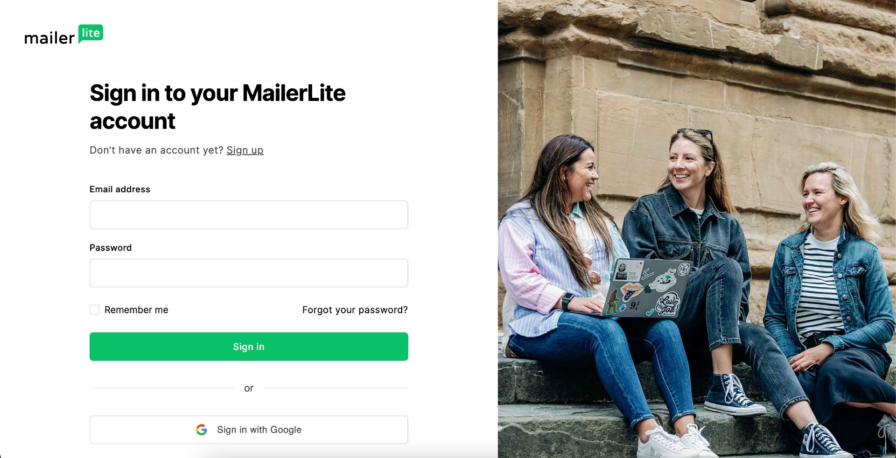<figcaption></figcaption></figure>

2\. Klik pada **butang atau teks Subscribers**

<figure>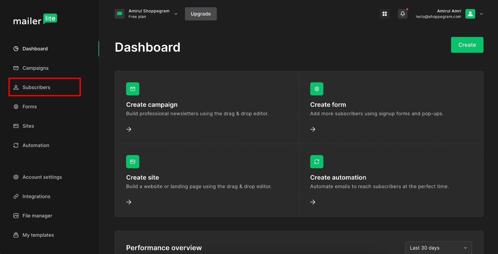<figcaption></figcaption></figure>

3\. Klik pada **butang atau teks Groups**

<figure>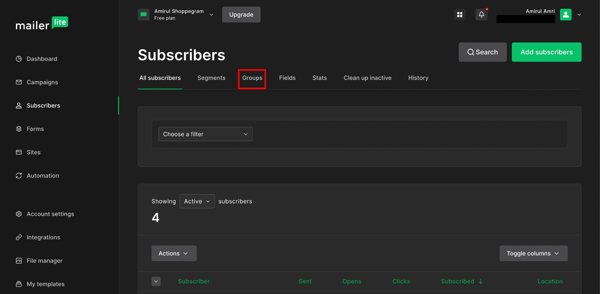<figcaption></figcaption></figure>

4\. Klik pada **butang Create group**

<figure>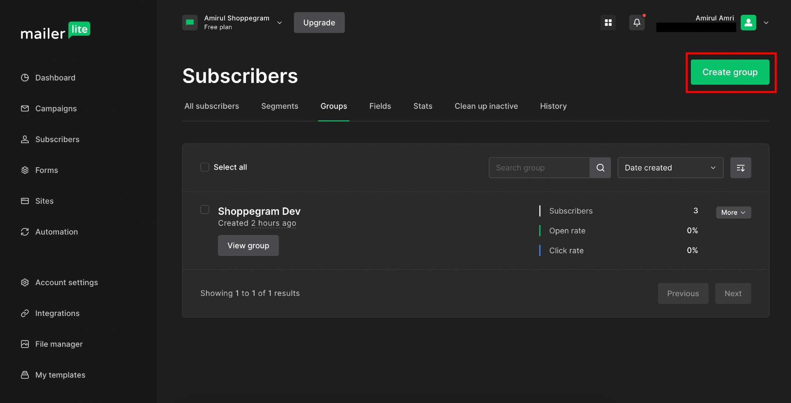<figcaption></figcaption></figure>

5\. Kemudian, didalam pop up ini anda boleh masukkan nama group bagi subscriber list anda ini di ruangan yang telah disediakan untuk dijadikan sebagai rujukan anda nanti.

<figure>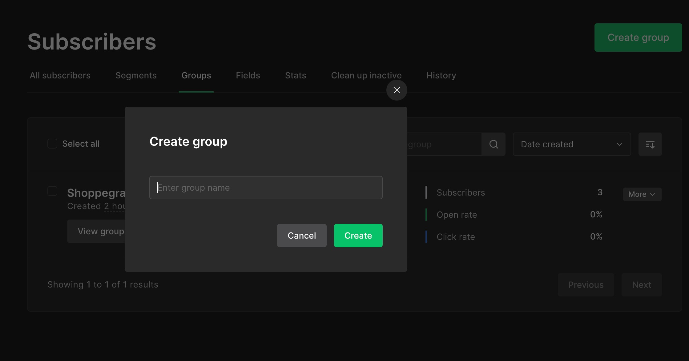<figcaption></figcaption></figure>

6\. Setelah selesai, anda boleh klik pada **butang Create**

<figure>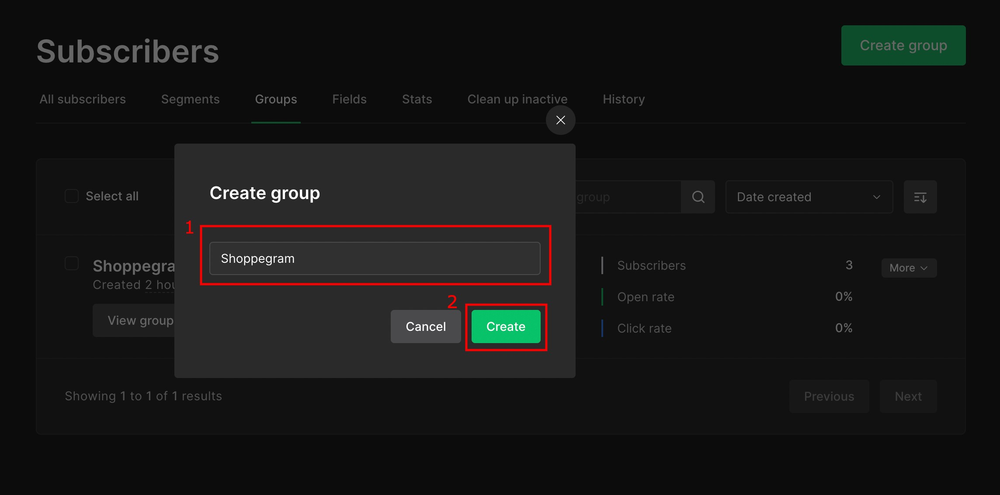<figcaption></figcaption></figure>

### Dapatkan kesemua key

1\. Anda boleh log masuk akaun Mailerlite atau pergi ke dashboard akaun Mailerlite anda semula

<figure>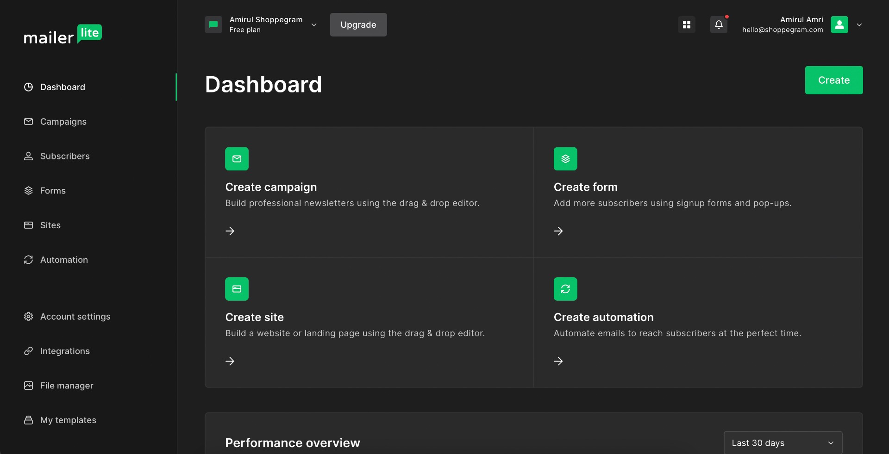<figcaption></figcaption></figure>

2\. Klik pada **butang atau teks Integrations**

<figure>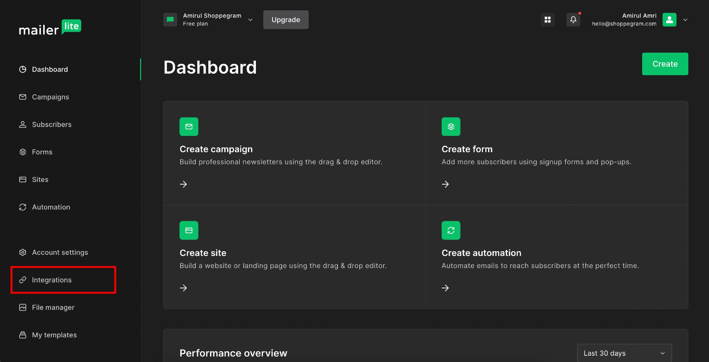<figcaption></figcaption></figure>

3\. Klik pada **butang Use yang berada didalam kotak API**

<figure>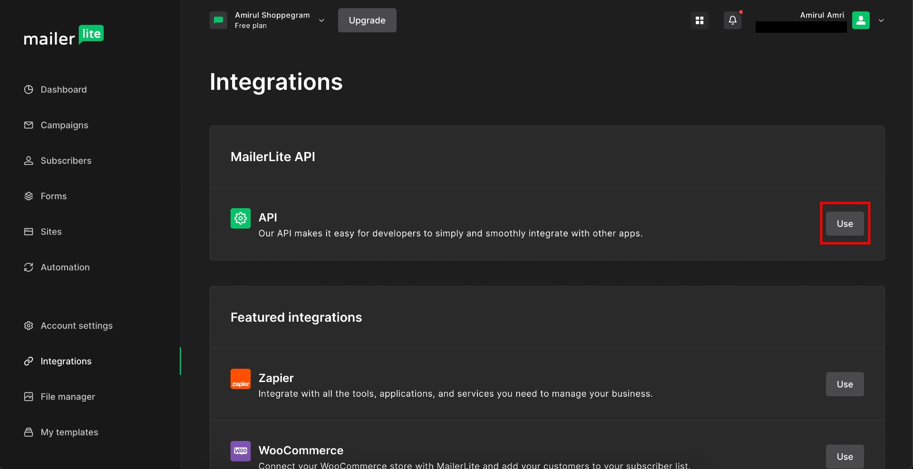<figcaption></figcaption></figure>

4\. Kemudian, anda boleh klik pada **butang Generate new token**

<figure>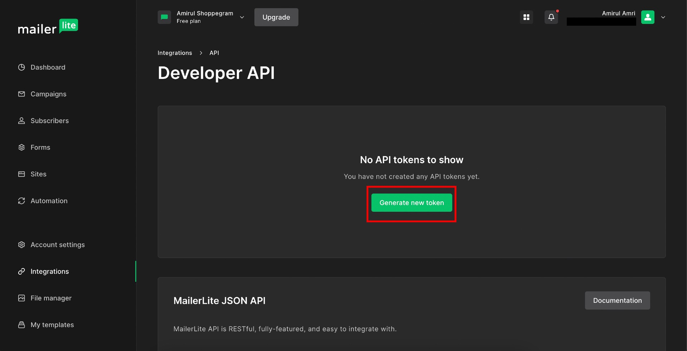<figcaption></figcaption></figure>

5\. Didalam pop up yang terpapar itu nanti, anda boleh masukkan nama yang anda ingin tetapkan pada token anda didalam ruangan yang disediakan untuk dijadikan sebagai rujukan anda dan **tick juga pada checkbox yang tersedia**.

<figure>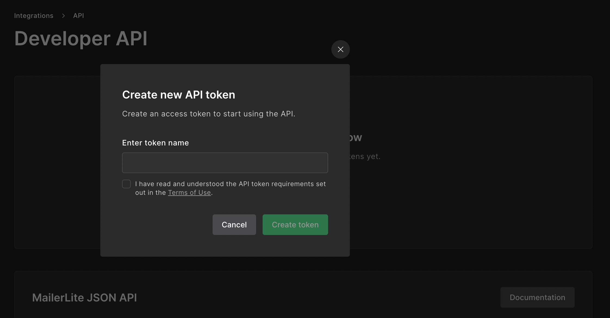<figcaption></figcaption></figure>

6\. Setelah selesai, anda boleh klik pada **butang Create token**

<figure>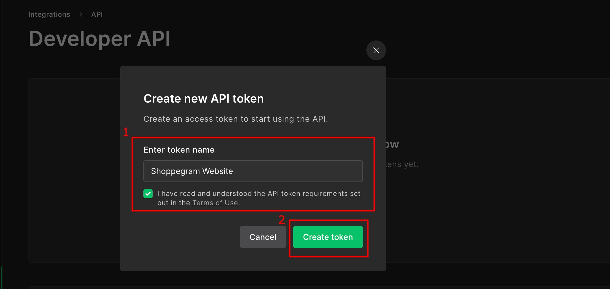<figcaption></figcaption></figure>

7\. Kemudian, anda boleh klik pada **butang Copy atau Download** untuk simpan token anda bagi kegunaan penetapan di Shoppego nanti. **Pastikan anda telah simpan token ini kerana ianya tidak akan dipaparkan lagi selepas ini**.

<figure>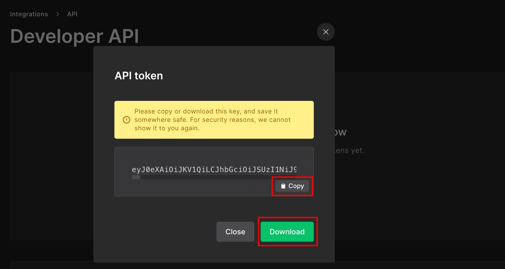<figcaption></figcaption></figure>

8\. Didalam halaman yang sama nanti setelah anda tutup pop up tersebut, anda boleh skroll ke bawah untuk dapatkan Subscriber Group ID anda.

<figure>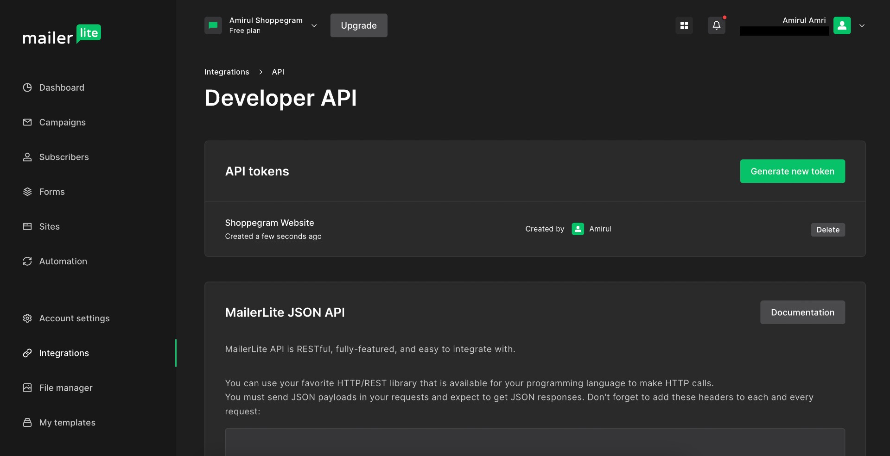<figcaption></figcaption></figure>

9\. Anda boleh **simpan Subscriber Group ID** tersebut untuk digunakan pada penetapan di Shoppego.

<figure>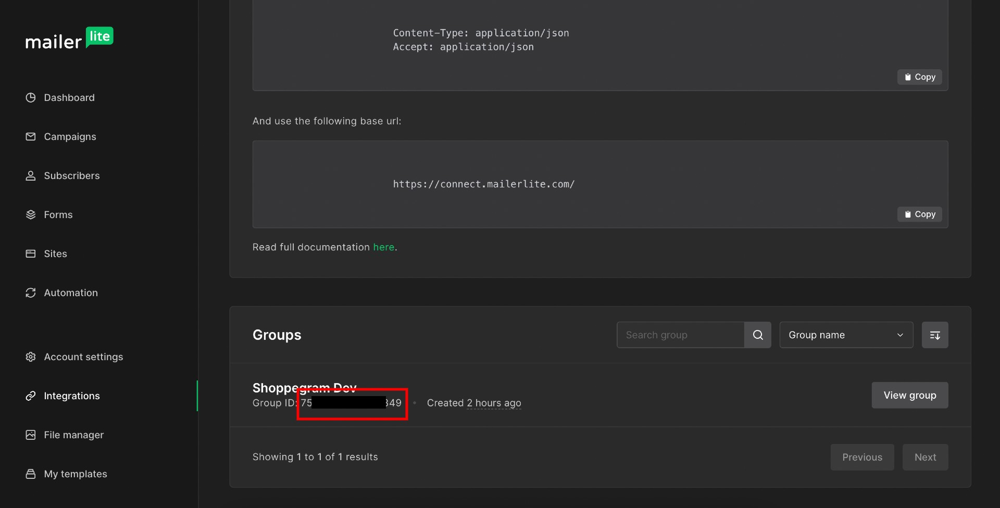<figcaption></figcaption></figure>

## Penetapan di Shoppego

1\. Log masuk dalam akaun Shoppego

<figure><figcaption></figcaption></figure>

2\. Klik pada **Settings**

<figure><figcaption></figcaption></figure>

3\. Klik pada **Email marketing providers**

<figure>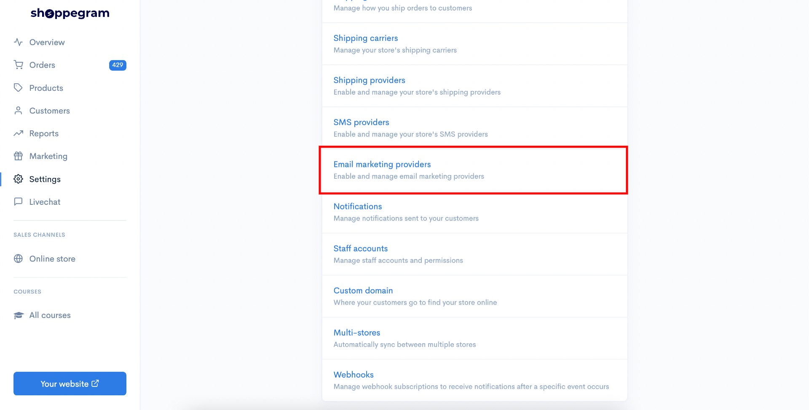<figcaption></figcaption></figure>

4\. Klik pada **butang Edit/Activate didalam kotak Mailerlite**

<figure>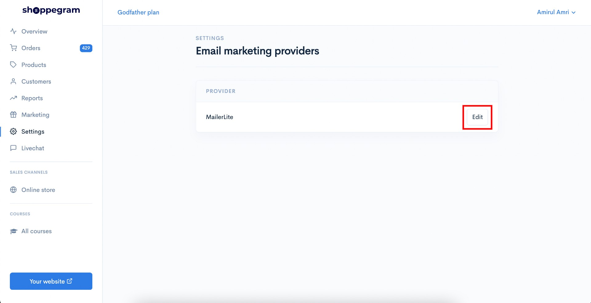<figcaption></figcaption></figure>

5\. Kemudian, anda boleh masukkan kesemua key-key yang anda telah dapatkan didalam ruangan yang disediakan. Pastikan pada kotak API version anda telah pilih Version 2.

<figure>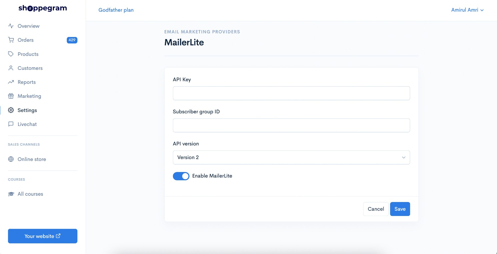<figcaption></figcaption></figure>

6\. Setelah selesai, klik pada **butang Save**

<figure>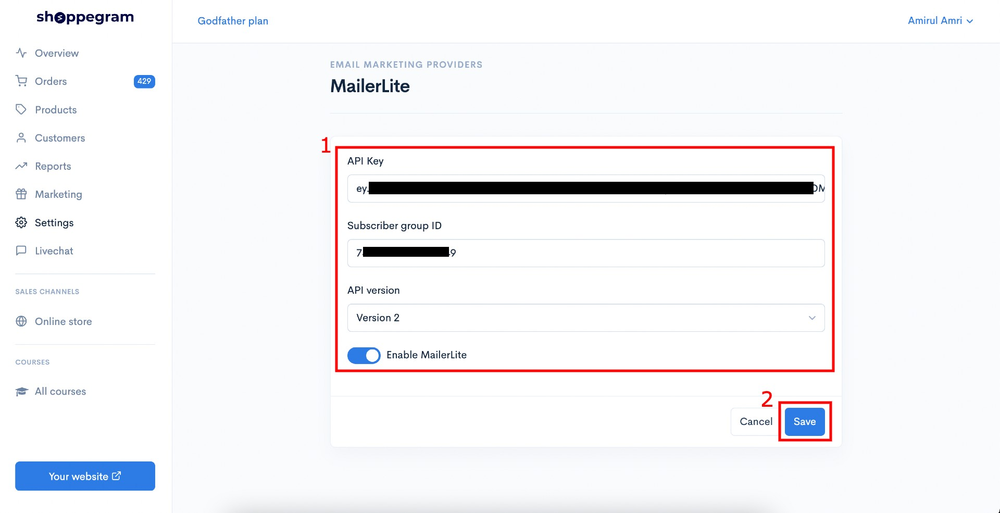<figcaption></figcaption></figure>

Kini penetapan anda sudah selesai, anda akan dapat lihat data pelanggan anda yang baru nanti dibawa masuk kedalam Group Subscriber list yang anda cipta tersebut di Mailerlite.
