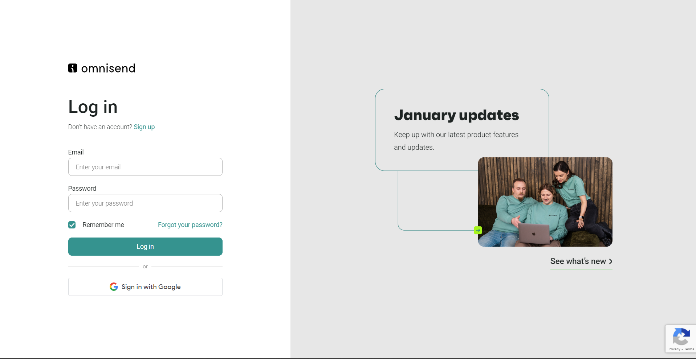
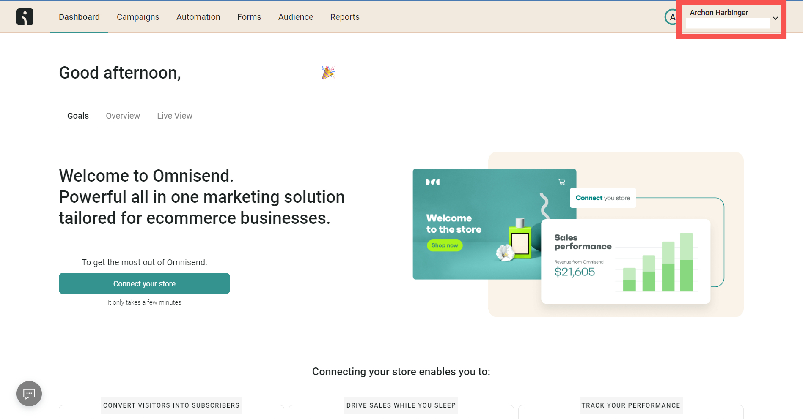
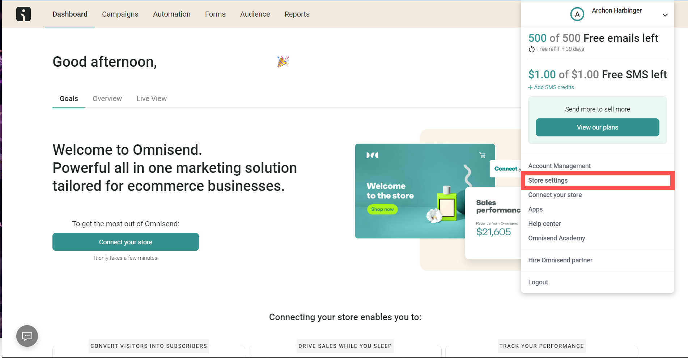
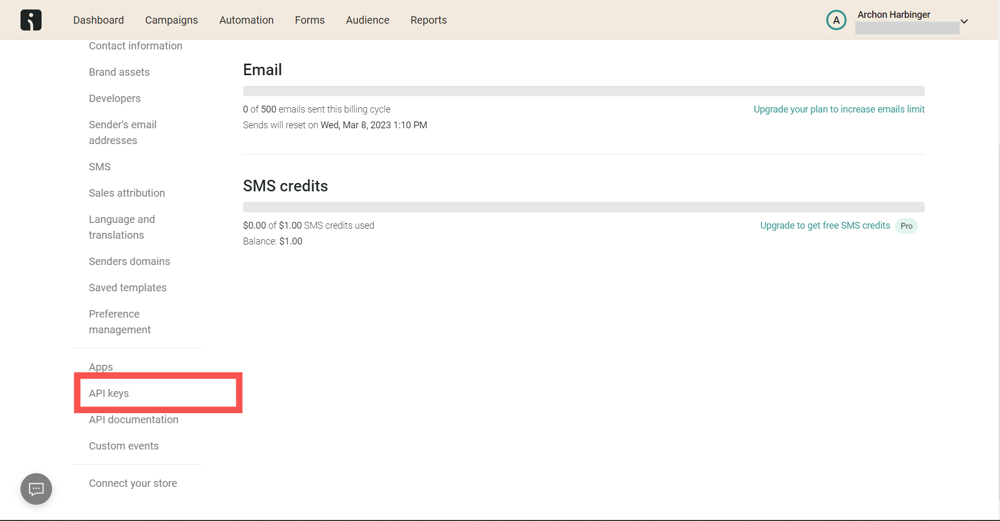
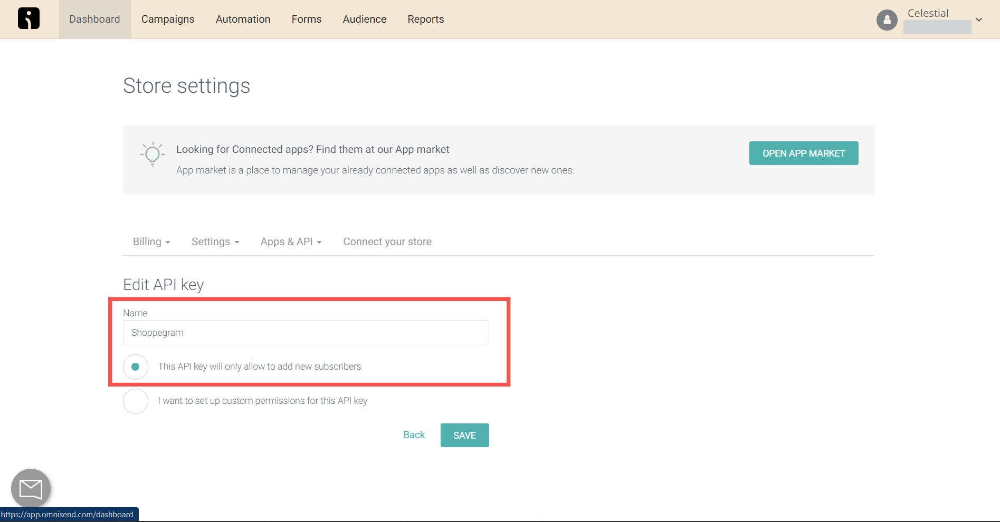
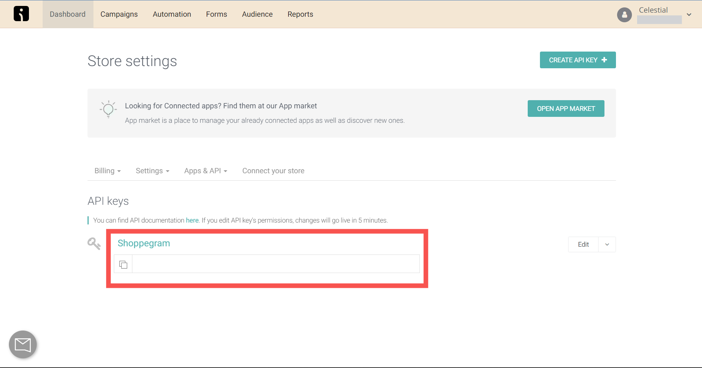
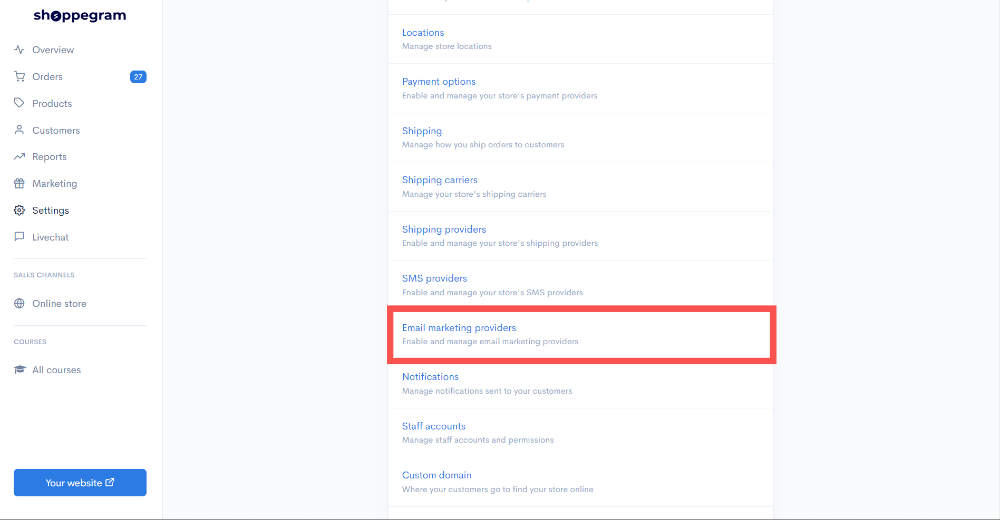
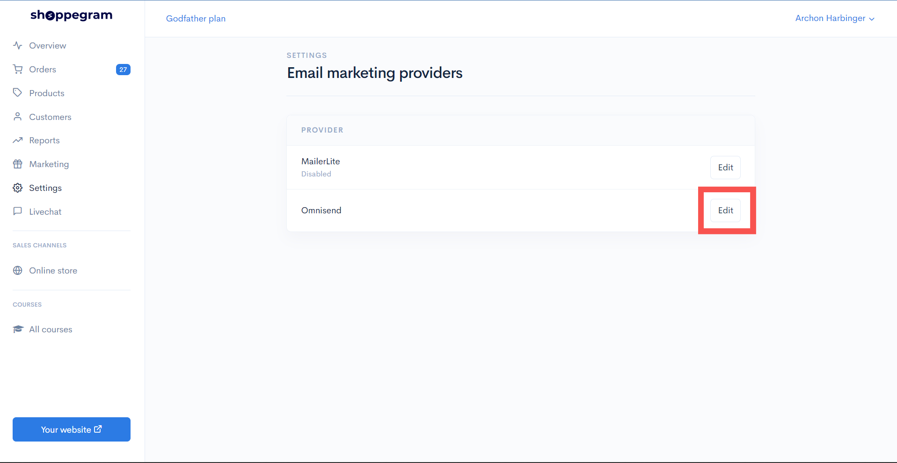
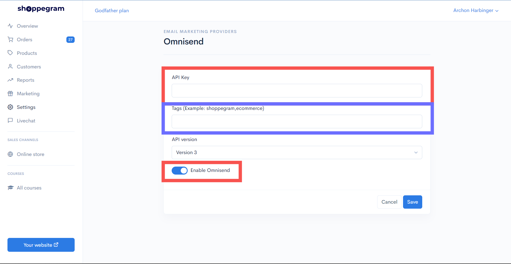

# Omnisend

Untuk buat penetapan **Omnisend**, anda perlu dapatkan **API Key** dari **Omnisend** dan **masukkan key** yang telah anda dapatkan masuk kedalam sistem Shoppego.

## Log masuk akaun Omnisend

1. Anda boleh log masuk kedalam akaun Omnisend [<mark style="color:blue;">**di sini**</mark>](https://app.omnisend.com/login) atau pada link ini: <https://app.omnisend.com/login>

<figure><figcaption></figcaption></figure>

## Dapatkan API key Omnisend

1. Anda akan dibawa ke halaman **Dashboard Omnisend**, anda perlu **tekan pada bahagian atas kanan** dan **dropdown** yang ada disitu.

<figure><figcaption></figcaption></figure>

2. Anda boleh tekan pada **Store Settings**.

<figure><figcaption></figcaption></figure>

2. Setelah itu, anda boleh **tekan** pada **API keys.**

<figure><figcaption></figcaption></figure>

4. Pada ruangan ini, anda letakkan **nama** bagi **API anda** dan **pilih "This API key will only allow to add new customers"**.

<figure><figcaption></figcaption></figure>

5. Setelah itu, anda boleh tekan pada **ikon kertas** untuk salin **API Key** untuk dimasukkan dalam sistem Shoppego.

<figure><figcaption></figcaption></figure>

## Penetapan di Shoppego

1. Pada **Dashboard Overview**, anda boleh pergi ke **Settings**.

<figure><figcaption></figcaption></figure>

2. Selepas itu, anda boleh tekan pada **Email Marketing Provider**.

<figure><figcaption></figcaption></figure>

3. Pada halaman ini, anda akan perlu tekan butang **Activate** untuk **mengaktifkan Omnisend** dan tekan **Edit**.

<figure><figcaption></figcaption></figure>

4. Anda perlu masukkan **API key** yang anda telah dapat dari **Omnisend** kedalam ruang yang disediakan. Anda juga boleh letakkan **Tag**.&#x20;


\*\*<mark style="color:red;">**Perhatian**</mark> :&#x20;

* **Tag** - Digunakan untuk meletakkan pelanggan yang berdaftar kedalam kumpulan yang anda mahukan.&#x20;
* Jika anda ingin memasukkan **Tag** lebih dari satu, anda boleh letakkan **koma** pada **Tag** tersebut.\
  **Contoh** : Marketing&#x31;**,**&#x4D;arketing2
  

5. Pastikan anda hidupkan toggle **Enable** untuk menggunakan **Omnisend**.

<figure><figcaption></figcaption></figure>

<mark style="color:blue;">**Tahniah**</mark>! Penetapan **Omnisend** anda telahpun berjaya.
