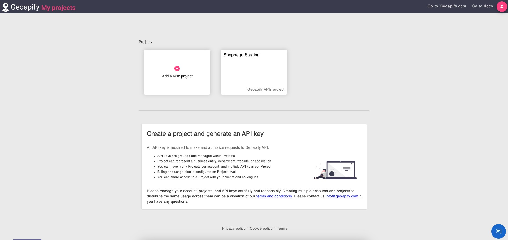
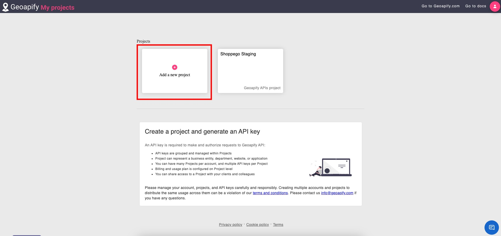
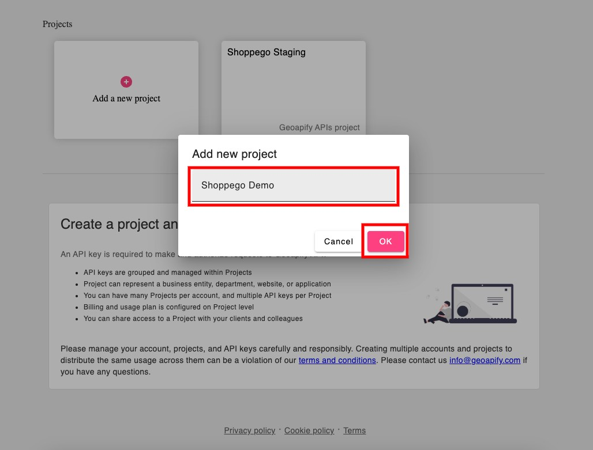
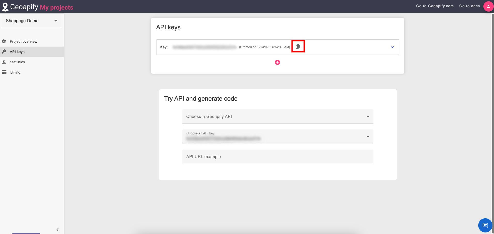
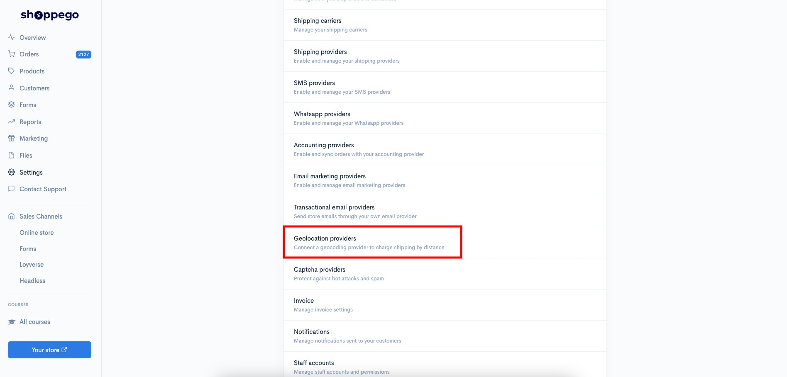
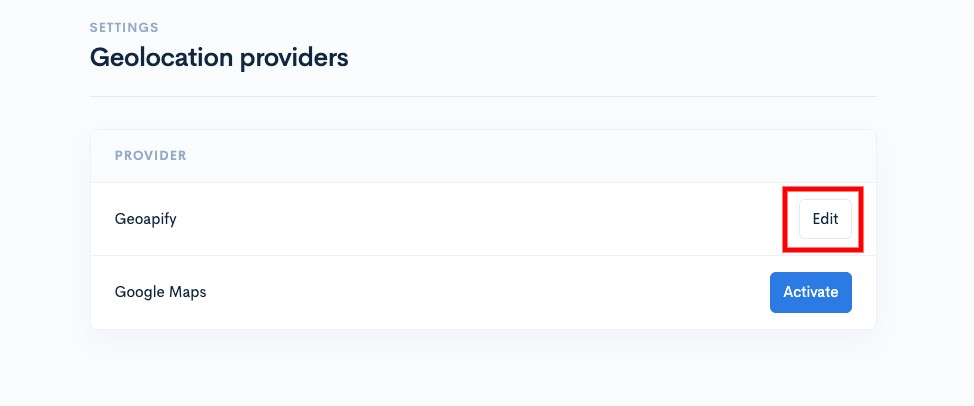
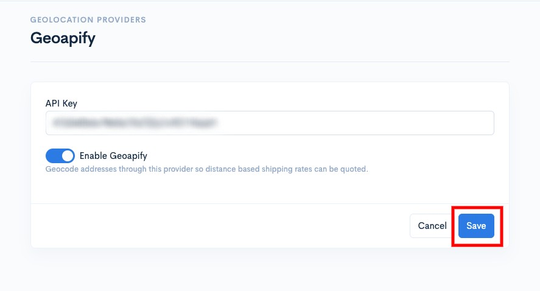

# Google Maps


Fungsi ini tersedia untuk **plan** **Ultimate** sahaja.


## Pada halaman ini:

* [Penetapan yang perlu dilakukan](google-maps.md#penetapan-yang-perlu-dilakukan)
* [Penetapan di Go](google-maps.md#penetapan-di-geoapify)ogle Maps
* [Penetapan di Shoppego](google-maps.md#penetapan-di-shoppego)

## Penetapan yang perlu dilakukan:

* Pastikan anda sudah mempunyai akaun Google Cloud
* [Pastikan anda sudah lakukan penetapan shipping rates by distance](../shipping.md#penetapan-distance-based-rates)
* [Pastikan maklumat lokasi store anda telah ditetapkan dengan betul](../locations.md)
* Dapatkan API key dari akaun Google Cloud anda
* Lakukan penetapan di dashboard Shoppego

## Penetapan di Google Maps

Sekiranya anda masih belum mempunyai akaun Google Cloud, anda boleh daftar di link ini: <https://myprojects.geoapify.com/register>

1. Log masuk akaun Google Cloud anda

<figure><figcaption></figcaption></figure>

2. Klik pada butang **Create a new project/Add a new project**

<figure><figcaption></figcaption></figure>

3. **Masukkan maklumat projek anda** untuk dijadikan sebagai rujukan nanti

<figure><figcaption></figcaption></figure>

4. Anda boleh **copy API key** yang diberi

<figure><figcaption></figcaption></figure>

## Penetapan di Shoppego

1. Log masuk akaun Shoppego

<figure><figcaption></figcaption></figure>

2. Klik pada **Setttings**

<figure><figcaption></figcaption></figure>

3. Klik pada **Geolocation providers**

<figure><figcaption></figcaption></figure>

4. Klik **Activate/Edit pada Geoapify**

<figure><figcaption></figcaption></figure>

5. **Masukkan API key yang anda baru copy dari akaun Geoapify** dan klik **Save**

<figure><figcaption></figcaption></figure>

test
