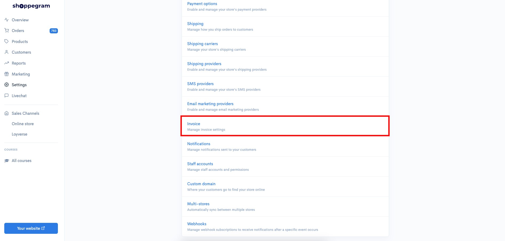
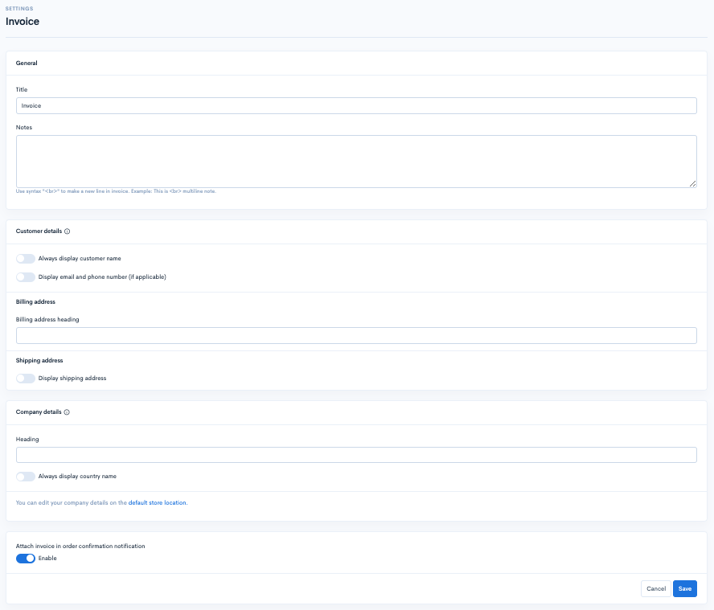
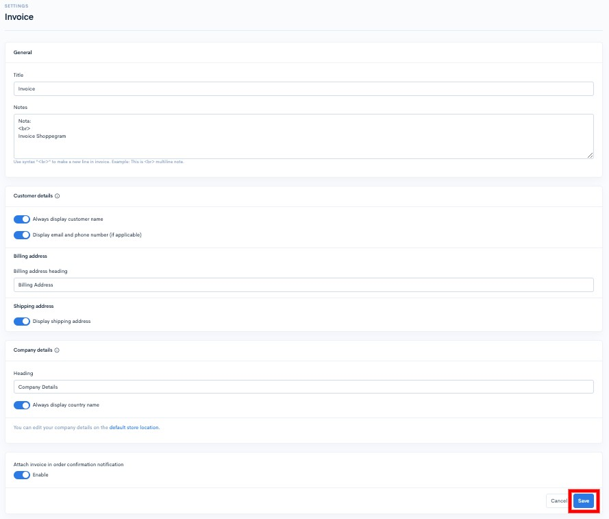
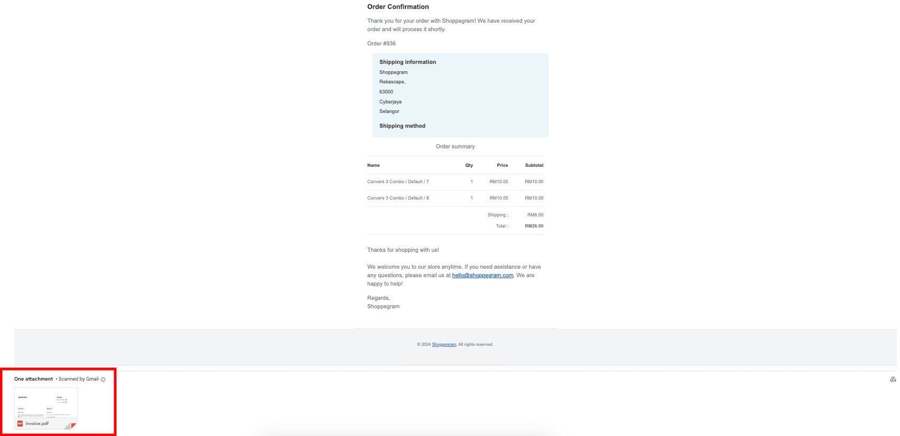
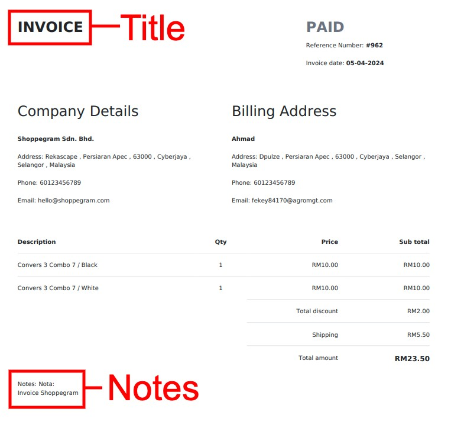
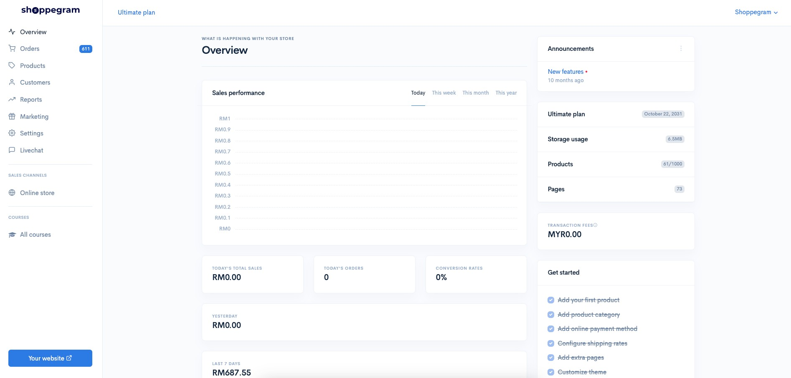
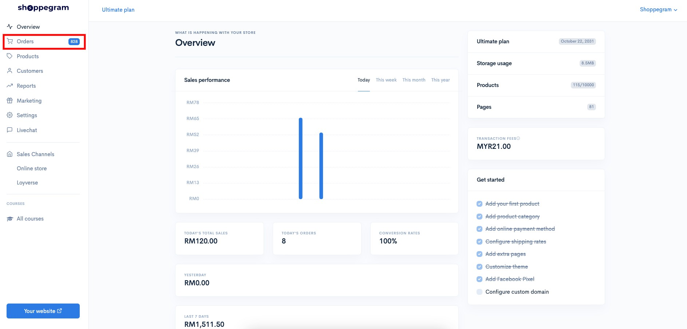
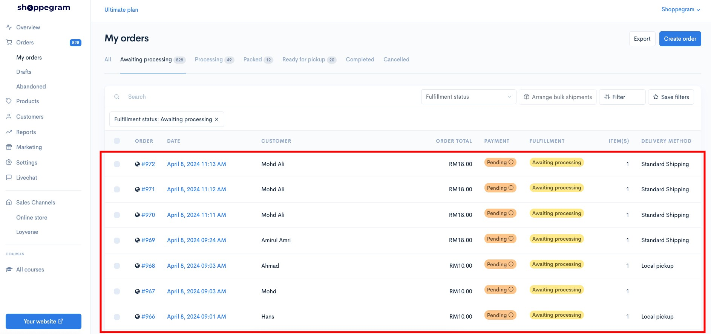
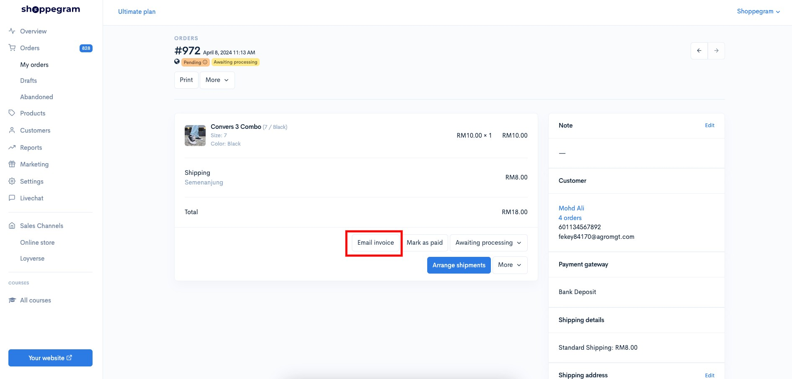
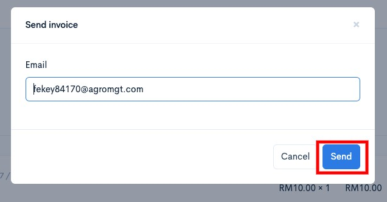

# Invoice

Didalam Commerce anda mempunyai akses untuk pastikan pelanggan terima invoice bagi order mereka.\
\
Untuk akses ke bahagian penetapan tersebut, anda boleh pergi pada :

1. Dashboard Commerce

2. Klik **Settings**

3. Klik **Invoice**

4. &#x20;Seterusnya anda akan dapat lihat paparan untuk anda lakukan penetapan bagi Invoice anda itu.

| Parameter                                     | Penerangan                                                                                                                               |
| --------------------------------------------- | ---------------------------------------------------------------------------------------------------------------------------------------- |
| Title                                         | Anda boleh masukkan teks untuk tajuk kepada fail anda itu sendiri.                                                                       |
| Notes                                         | Anda boleh masukkan nota didalam fail invoice pelanggan anda.                                                                            |
| Always display customer name                  | Anda boleh tick pada toggle ini jika ingin paparkan nama pelanggan pada invoice tersebut.                                                |
| Display email and phone number(if applicable) | Anda boleh tick pada toggle ini jika ingin paparkan email dan phone number pelanggan pada invoice tersebut.                              |
| Billing address heading                       | Anda boleh masukkan teks yang anda inginkan pada heading details pelanggan anda di invoice tersebut.                                     |
| Display shipping address                      | Anda boleh tick pada toggle ini jika ingin paparkan alamat shipping pelanggan pada invoice tersebut.                                     |
| Company details > Heading                     | Anda boleh masukkan teks yang anda inginkan pada heading details syarikat anda di invoice tersebut.                                      |
| Always display country name                   | Anda boleh tick pada toggle ini jika ingin paparkan nama negara pada setiap alamat pada invoice tersebut.                                |
| Enable                                        | Anda boleh tick pada toggle ini untuk pastikan setiap notifikasi "Order Confirmation" pelanggan anda, mereka akan terima sekali Invoice. |

5. Setelah anda membuat perubahan yang anda inginkan anda boleh klik **Save**

Setelah anda aktifkan penetapan Invoice tersebut, ia bermakna setiap email notifikasi "Order Confirmation" pelanggan anda, mereka akan terima sekali fail Invoice yang dilampirkan dalam email tersebut.

&#x20;Ini adalah contoh paparan invoice yang akan dapat dilihat oleh pelanggan anda.

<figure><figcaption></figcaption></figure>

## Info Tambahan

Anda juga boleh menghantar secara manual invoice itu kepada pelanggan anda melalui halaman order pelanggan itu sendiri dengan pergi pada:

1. Dashboard Shoppego

<figure><figcaption></figcaption></figure>

2. Klik pada **Orders**

<figure><figcaption></figcaption></figure>

3. Klik pada order pelanggan itu

<figure><figcaption></figcaption></figure>

4. Klik pada butang **Email invoice**

<figure><figcaption></figcaption></figure>

5. Seterusnya, setelah anda **pastikan email yang dimasukkan itu betul**, anda boleh klik pada butang **Send** dan pelanggan itu akan terima invoice tersebut di email mereka.


**Info: Anda boleh hantar kepada&#x20;**<mark style="color:red;">**3 email sekaligus**</mark>**&#x20;dengan cara asingkan setiap email itu dengan&#x20;**<mark style="color:red;">**simbol koma**</mark>**&#x20;"**<mark style="color:red;">**,**</mark>**" atau&#x20;**<mark style="color:red;">**tekan Enter pada keyboard**</mark>**&#x20;anda bagi setiap email yang telah dimasukkan.**


<figure><figcaption></figcaption></figure>

Untuk makluman, bagi prefilled email yang dimasukkan auto oleh sistem ia akan mementingkan email yang datang dari:

1. Checkout
2. Customer information
3. Shipping address
