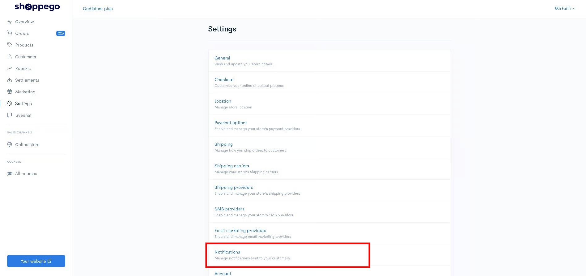
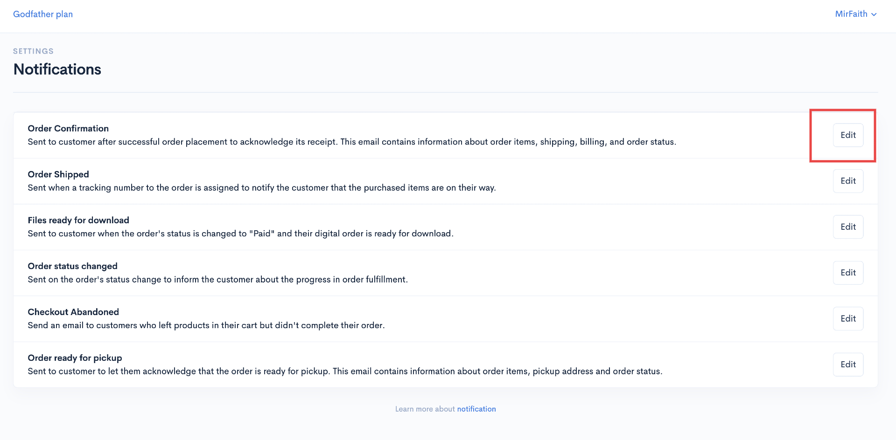
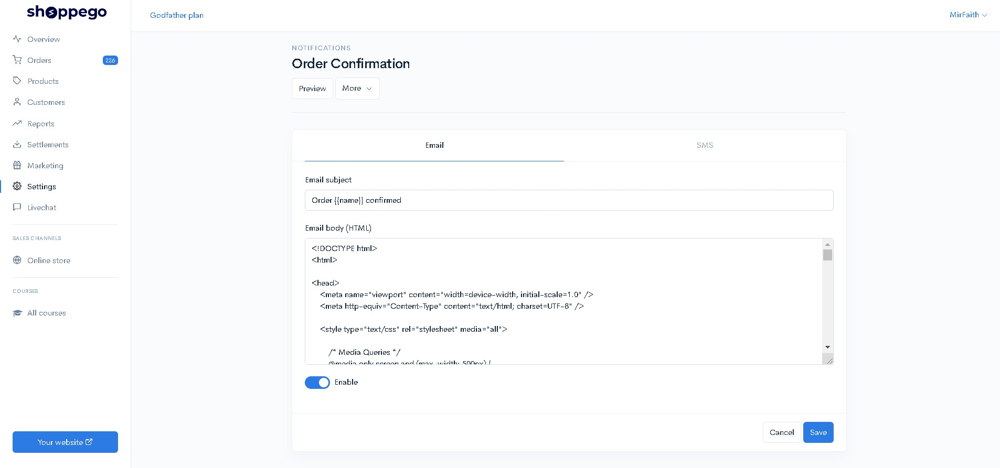
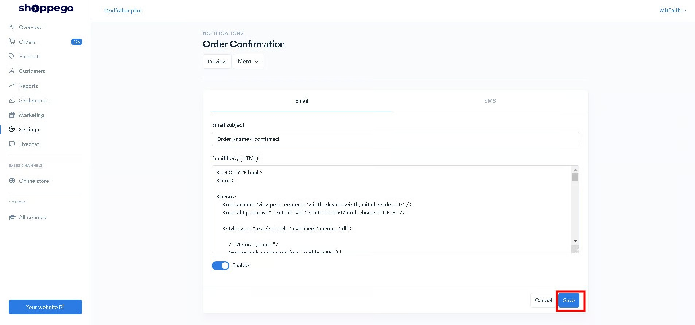
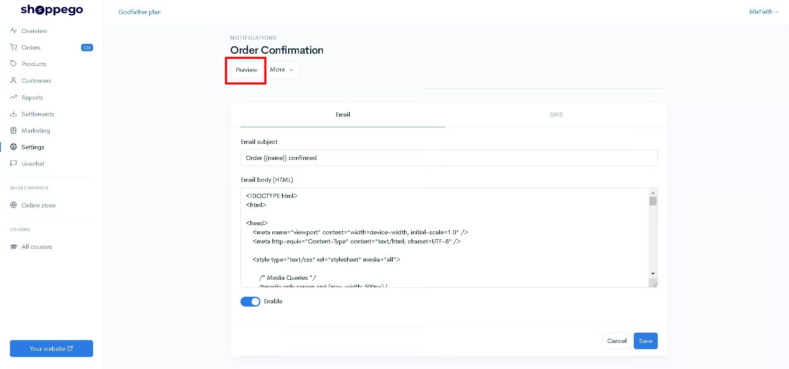
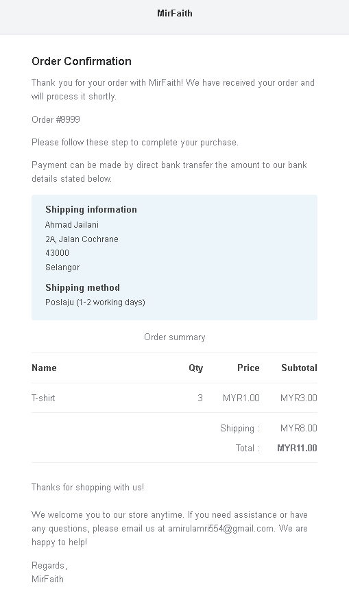
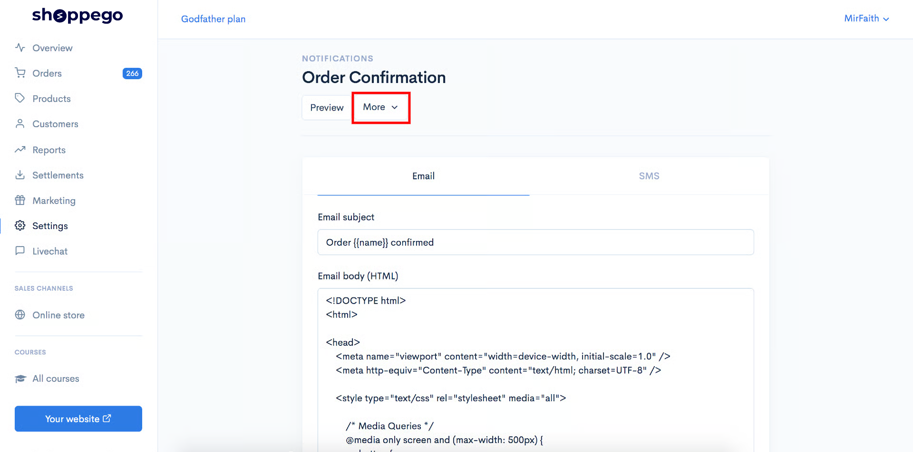
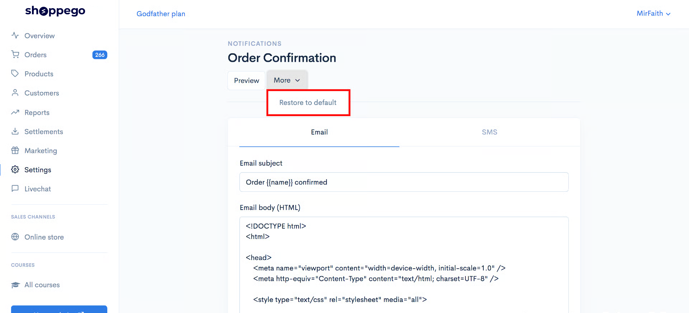

# Notifications

Didalam Shoppego anda mempunyai akses untuk ubah email template untuk notifikasi store anda tersendiri. Antara email template yang anda boleh ubah ialah :

1. Order Confirmation
2. Order Shipped
3. Files ready for download
4. Order status changed
5. Checkout Abandoned(Tersedia untuk **plan&#x20;**<mark style="color:red;">**Premium**</mark> dan <mark style="color:red;">**Ultimate**</mark> sahaja).

Untuk notifikasi email Checkout Abandoned ini, ia sudah tidak dihantar secara auto oleh sistem Shoppego. Sekiranya, anda ingin menghantar notifikasi ini, ia hanya boleh dilakukan melalui penetapan [webhook](webhook.md) sahaja.

6. Order ready to pickup(Tersedia untuk **plan** <mark style="color:red;">**Ultimate**</mark> sahaja)
7. Order review
8. Order packed


[Notifications Parameter](notifications/notifications-parameter.md)


Perubahan email template tersebut boleh dilakukan jika anda mempunyai **kemahiran dalam coding HTML/CSS.**\
\
Untuk akses ke bahagian email template tersebut, anda boleh pergi pada :

1\. Dashboard Shoppego

2\. Klik **Settings**

3\. Klik **Notifications**

4\. Klik **Edit** pada mana-mana email yang anda ingin ubah template mereka

<figure><figcaption></figcaption></figure>

5\. Seterusnya anda akan dapat lihat paparan untuk anda ubah email template bagi notifikasi Order Confirmation.

Anda boleh buat perubahan pada **Email body (HTML)** untuk perubahan layout/styling email template anda dengan menggunakan coding HTML/CSS

6\. Setelah anda membuat perubahan yang anda inginkan anda boleh klik **Save**

Sekiranya anda ingin Preview perubahan yang anda telah lakukan, anda boleh klik **Preview**

Setelah anda klik butang Preview tersebut, anda akan dapat lihat paparan email yang akan dapat dilihat oleh pelanggan anda nanti

## Info tambahan

Untuk pengguna lama Commerce, anda perlu membuat penetapan tambahan pada Email notifications anda untuk pastikan anda mendapat template email notifications yang terbaru.

1\. Pada penetapan email anda, anda boleh klik butang **More**

2\. Seterusnya anda boleh pilih butang **Restore to default**

Dengan penetapan ini, ianya membolehkan anda mendapatkan template email yang terbaru daripada kami.
