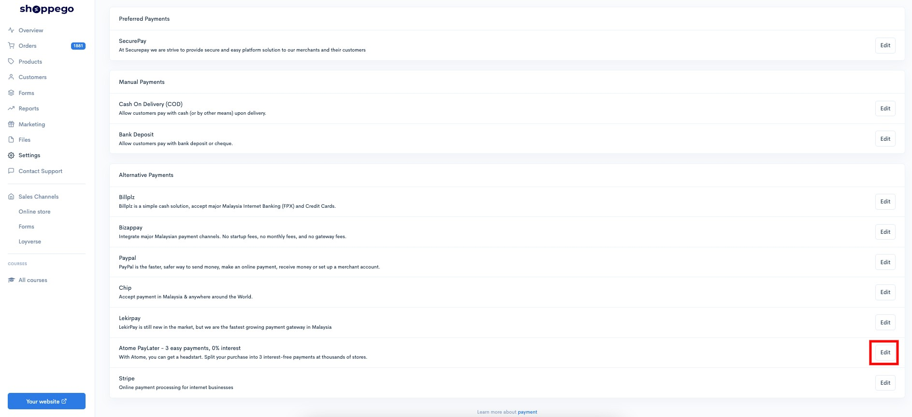
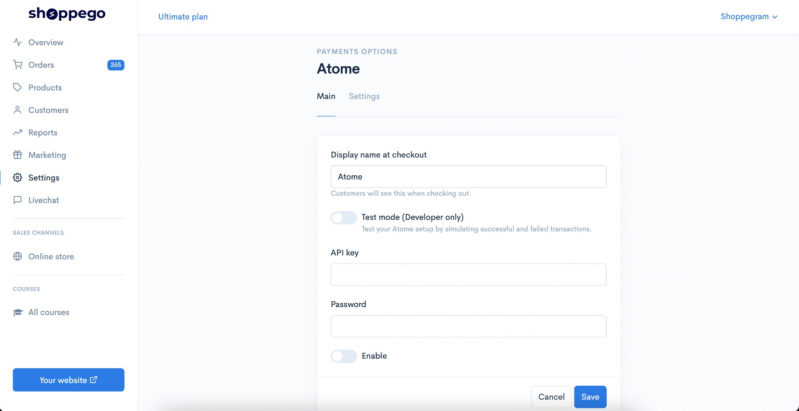
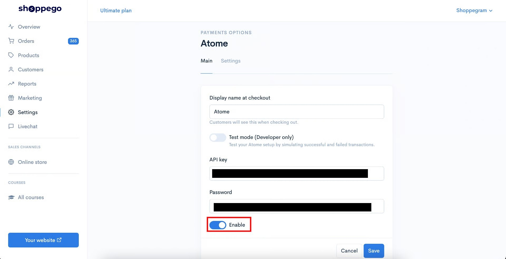
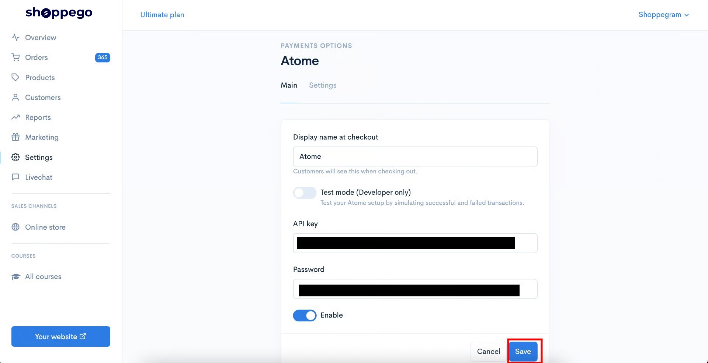
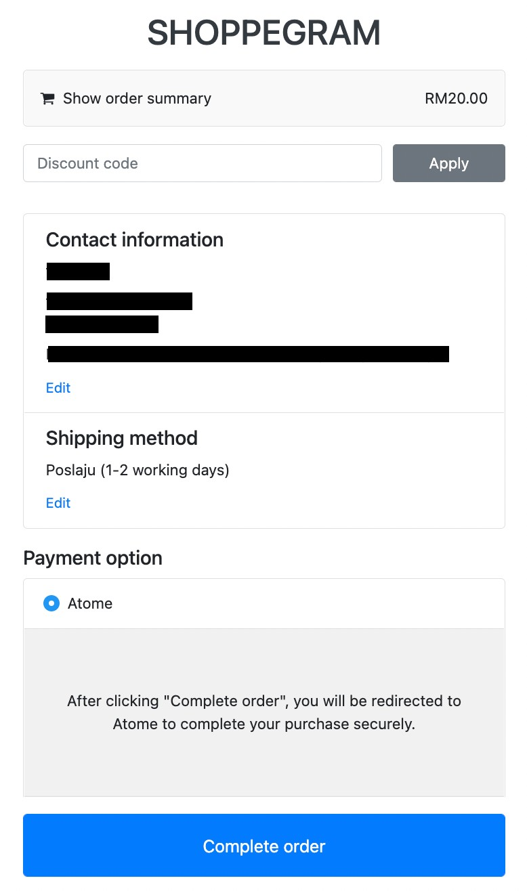

# Atome

## Pendaftaran Atome


**Shoppego X Atome Promo Package**

**MDR (Transaction fee)**: 6% + RM 1 Fixed Fee

**Refund Fee**: 2% + RM 1 Fixed Fee

**Cards acceptance**: All Banks + Visa/Master/Diners/UnionPay/ApplePay

**Credit Approval Rate**: Debit RM1500 / Credit RM5000

**Credit Terms**: 3 Months

**Payment cadence**: T+3 Business Day

**Online integration fee**: Waived

**Category accepted**: Fashion, Beauty, FnB, Home n Living, the rest are subjected to approval\
\
\*6% SST is applicable


Hanya sah melalui borang ini :&#x20;

<https://forms.gle/C76DLaz8SA1pMWNE7>


**Urusan pengesahan akaun, caj dan wang transaksi** adalah **diuruskan sepenuhnya oleh pihak Atome**.


## Penetapan di Shoppego

Setelah anda mendapatkan maklumat API key dan Password bagi integration payment gateway Atome dengan akaun Shoppego.&#x20;

Anda boleh pergi pada bahagian ini untuk memasukkan maklumat tersebut:

1\. Log masuk kedalam dashboard Shoppego

<figure><figcaption></figcaption></figure>

2\. Klik pada **Settings**

<figure><figcaption></figcaption></figure>

3\. Klik pada **Payment options**

<figure><figcaption></figcaption></figure>

4\. Kemudian, anda perlu skroll kebawah pada halaman Payment options tersebut untuk klik pada butang **Edit/Activate** pada kotak Atome

<figure><figcaption></figcaption></figure>

5\. Seterusnya, anda akan dapat lihat halaman ini

<figure><figcaption></figcaption></figure>

6\. Anda boleh masukkan maklumat yang diminta pada ruangan mereka yang tersendiri dan pastikan anda sudah klik pada toggle **Enable**(Pastikan ia bewarna biru)


Sekiranya anda ingin **memulakan transaksi sebenar**, diminta untuk anda <mark style="color:red;">**mematikan**</mark> toggle **Test Mode** itu.


<figure><figcaption></figcaption></figure>

7\. Setelah selesai, anda boleh klik **Save**

<figure><figcaption></figcaption></figure>

Kini pemilihan pembayaran jenis Atome akan dapat dilihat pada halaman Checkout website anda.

<figure><figcaption></figcaption></figure>
