# Billplz

## Pendaftaran akaun Billplz

Klik di link ini <https://sso.billplz.com/users/sign_up> untuk mula daftar **akaun Billplz** anda.&#x20;


Bagi proses pendaftaran **akaun Billplz** anda perlu pastikan anda sudah:

* Mempunyai SSM
* Akaun bank semasa
  


**Urusan pengesahan akaun, caj dan wang transaksi** adalah **diuruskan sepenuhnya oleh pihak Billplz**.


## Dapatkan kesemua key yang diperlukan dari akaun Billplz

Untuk menghubungkan Billplz dengan website Shoppego, anda memerlukan beberapa key untuk proses pengesahan. Antara key yang diperlukan ialah **Collection ID,** **Secret Key** dan **X Signature**. Untuk memulakan proses penetapan payment gateway Billplz anda boleh ikut langkah penetapan ini :

1\. Log masuk ke akaun **Billplz/Plzlogin** anda.

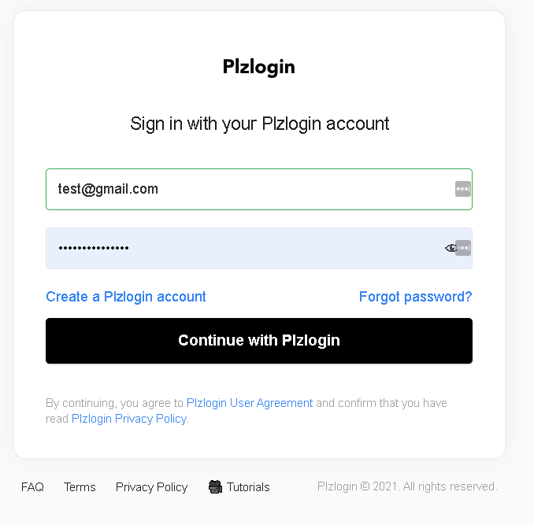

### Dapatkan Collection ID

1\. Pada bahagian dashboard **Billplz**, anda boleh klik pada **Billing**

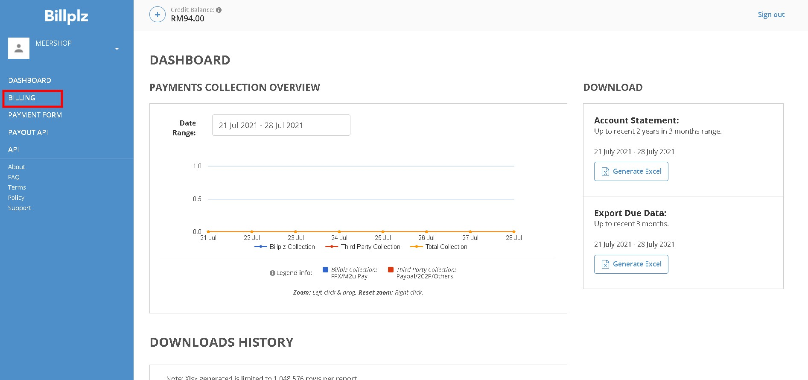

2\. Di page **Billing**, anda boleh klik pada butang **Create Collection**

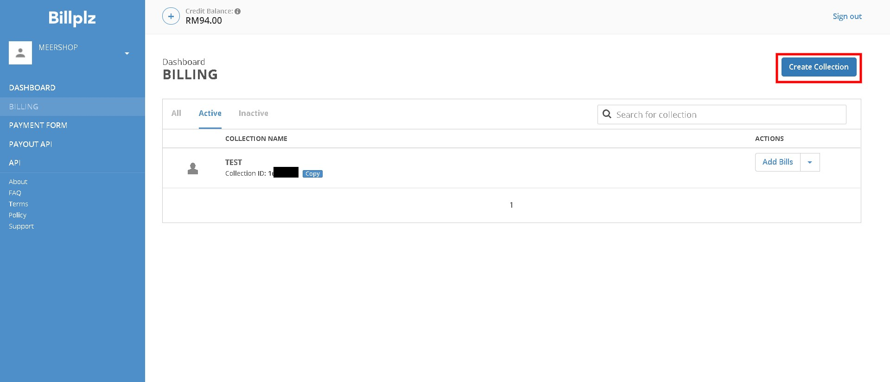

3\. Setelah anda klik butang tersebut, anda akan diminta untuk isi ruangan **Collection title**(Nama yang anda ingin gunakan sebagai rujukan untuk payment yang masuk pada billing anda). Setelah selesai anda boleh **tick pada I understand how reload credit works as stated below** dan klik **Submit**

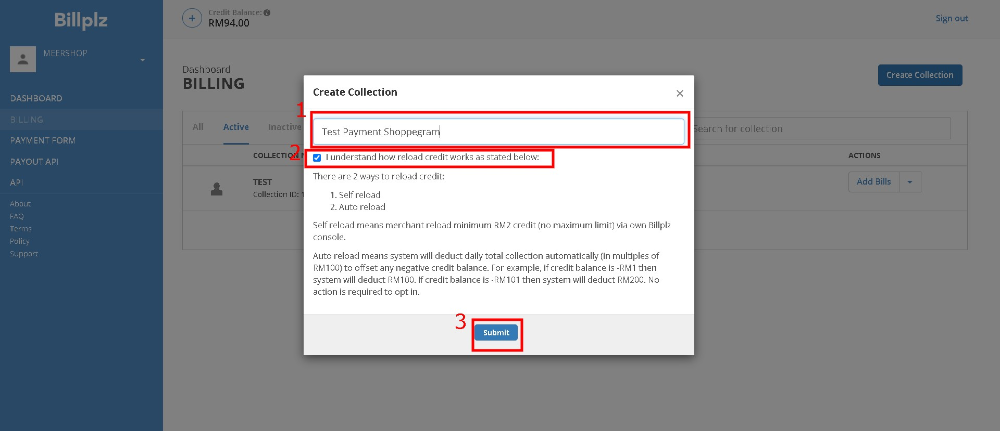

4\. Setelah selesai anda akan dapat lihat Collection yang anda baru anda cipta sebentar tadi. Anda boleh klik pada butang **Copy** dan simpan terlebih dahulu atau anda boleh sahaja terus masukkan didalam Shoppego dengan rujuk langkah penetapan Shoppego dibawah.

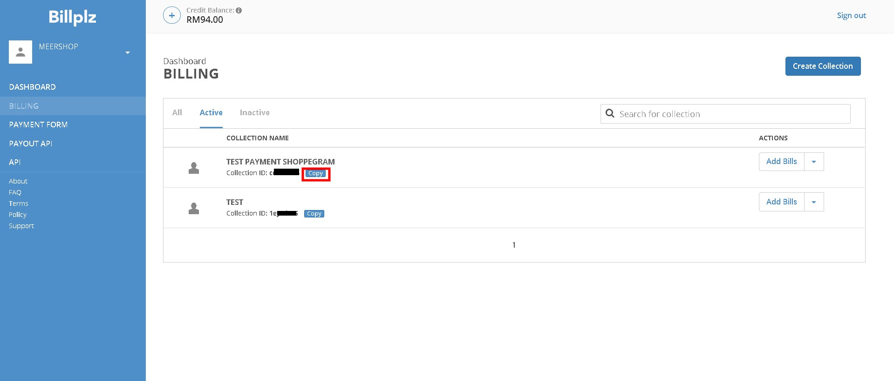

### Dapatkan Secret key

1\. Pada bahagian dashboard Billplz, anda boleh klik pada ikon **anak panah bawah** dan **klik Settings**

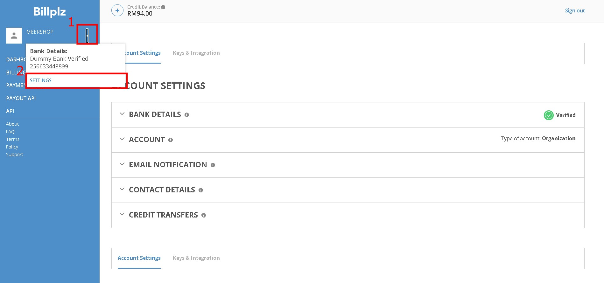

2\. Seterusnya anda akan dibawa ke halamanSettings, anda boleh klik pada **BILLPLZ SECRET KEY**

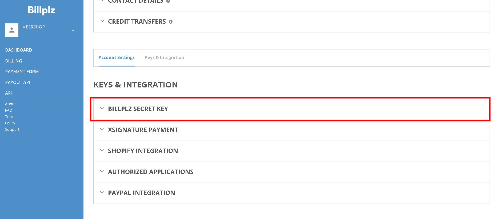

3\. Setelah anda klik pada tab **BILLPLZ SECRET KEY** tersebut, anda akan dapat lihat API key anda untuk anda masukkan didalam sistem Shoppego. Anda boleh klik button **Copy Billplz key** tersebut dan simpan terlebih dahulu atau anda boleh sahaja terus masukkan didalam **Shoppego** dengan rujuk langkah penetapan Shoppego dibawah.

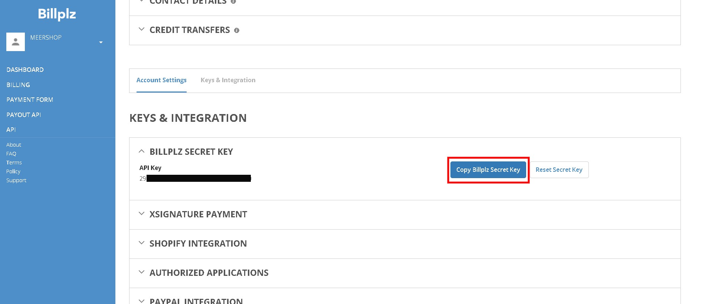

### Dapatkan X Signature

1\. Pada bahagian dashboard Billplz, anda boleh klik pada icon **anak panah bawah** dan **klik Settings**

2\. Seterusnya anda akan dibawa ke halaman Settings, anda boleh klik pada **XSIGNATURE PAYMENT**

3\. Setelah anda klik pada tab **XSIGNATURE PAYMENT** tersebut, anda akan dapat lihat **XSignature** key anda untuk anda masukkan didalam sistem Shoppego. Anda boleh klik button **Save & Copy XSignature Key** tersebut dan simpan terlebih dahulu atau anda boleh sahaja terus masukkan didalam Shoppego dengan rujuk langkah penetapan Shoppego dibawah.

 <mark style="color:red;">**Perhatian**</mark>**:**&#x20;

1. Pastikan penetapan **XSignature anda sama seperti paparan dibawah** untuk memastikan **tiada sebarang isu berlaku** semasa penetapan anda.&#x20;
2. Pastikan anda **tick pada Enable XSignature Payment Completion** sahaja.
   

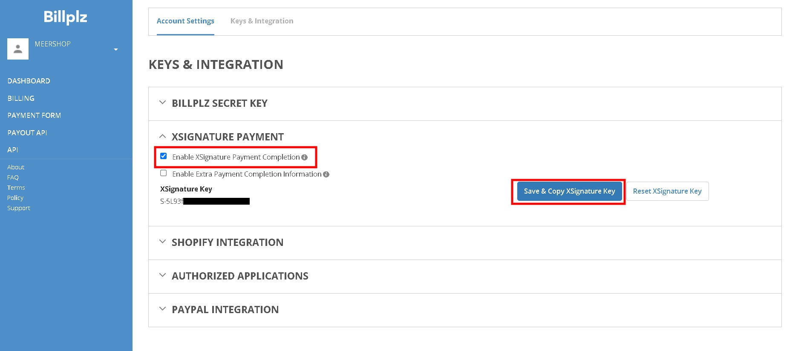

Anda boleh simpan **ketiga - tiga key** tersebut untuk kegunaan di langkah seterusnya. Key yang anda perlu simpan ialah :

* Collection ID
* Secret key
* X Signature

## Penetapan di Shoppego

Untuk proses penetapan payment gateway **Billplz** di Shoppego anda perlu aktifkan terlebih dahulu payment gateway tersebut dan masukkan ketiga-tiga key tersebut kedalam penetapan payment gateway anda.&#x20;

Untuk memulakan penetapan payment gateway tersebut, anda boleh ikut langkah penetapan ini.

1\. Log masuk akaun Shoppego anda.

2\. Seterusnya anda boleh klik pada tab **Settings**

3\. Anda akan dibawa ke halaman Settings dan anda boleh klik pada butang **Payment options**

6\. Pada bahagian halaman Payment options, anda boleh klik butang **Activate/Edit** pada tab payment gateway Billplz.

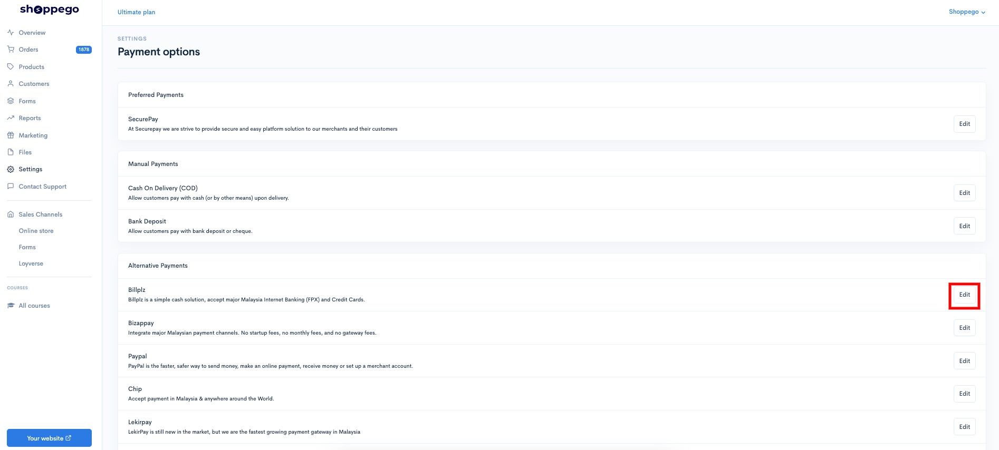

7\. Seterusnya, anda akan dibawa ke halaman penetapan untuk payment gateway Billplz.

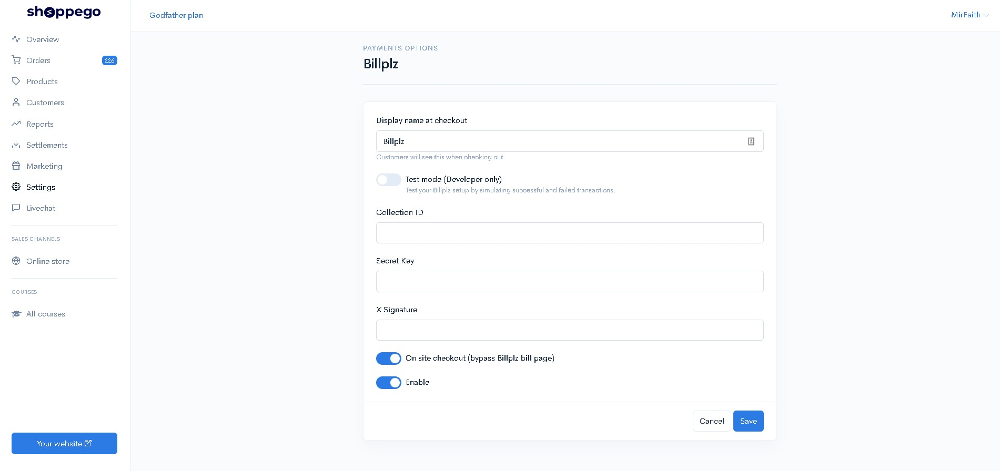

8\. Dengan menggunakan key yang anda sudah simpan pada langkah mendapatkan key tersebut, anda boleh masukkan kesemua key tersebut pada ruangan mereka.

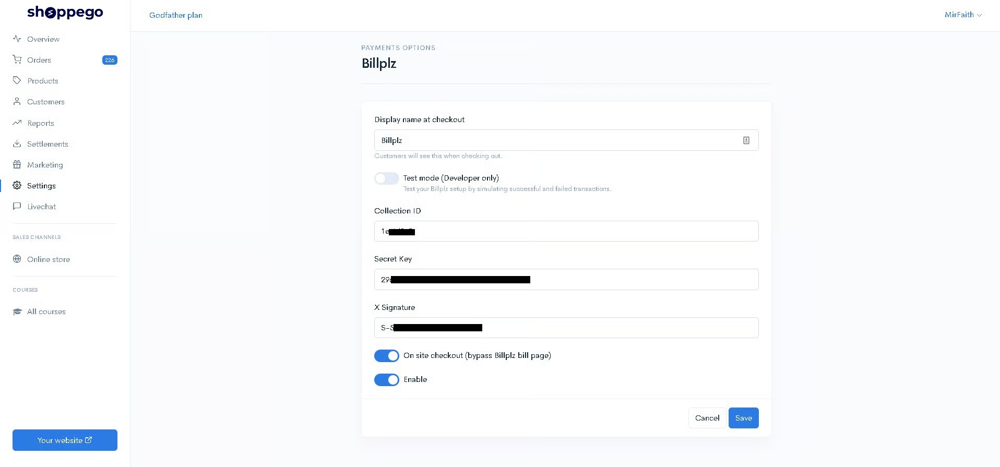

9\. Setelah selesai anda boleh klik **Save** untuk simpan penetapan tersebut.&#x20;


Sekiranya anda ingin **memulakan transaksi sebenar**, diminta untuk anda <mark style="color:red;">**mematikan**</mark> toggle **Test Mode** itu.


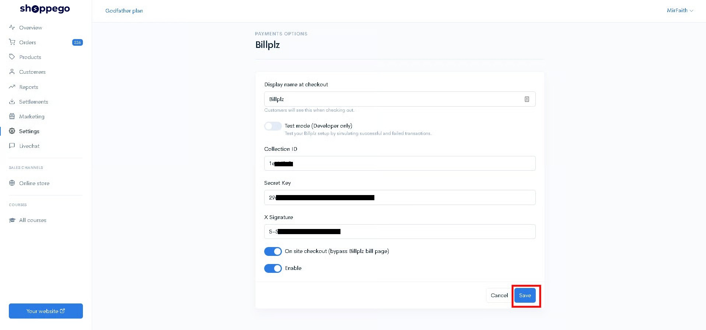

## Contoh di Website

Setelah selesai proses penetapan tersebut, anda boleh cuba membuat pembelian di website Shoppego anda untuk melihat hasilnya.

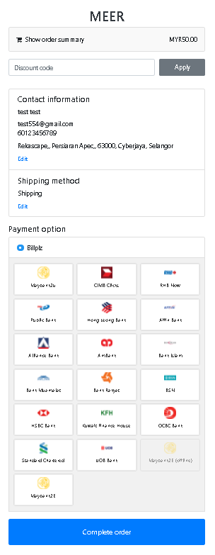
