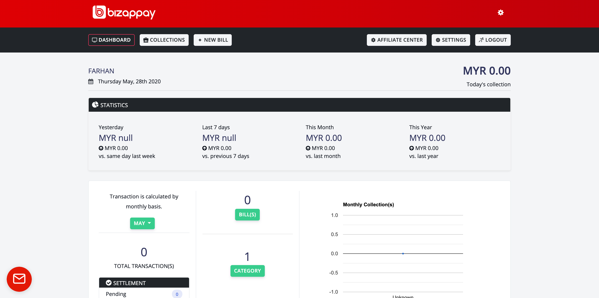
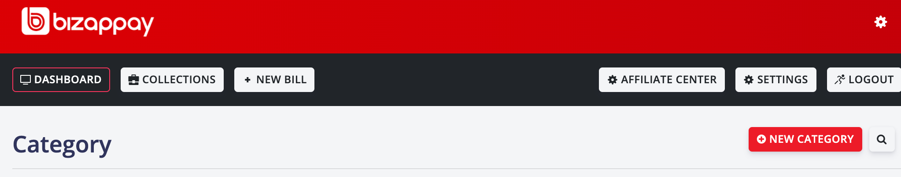
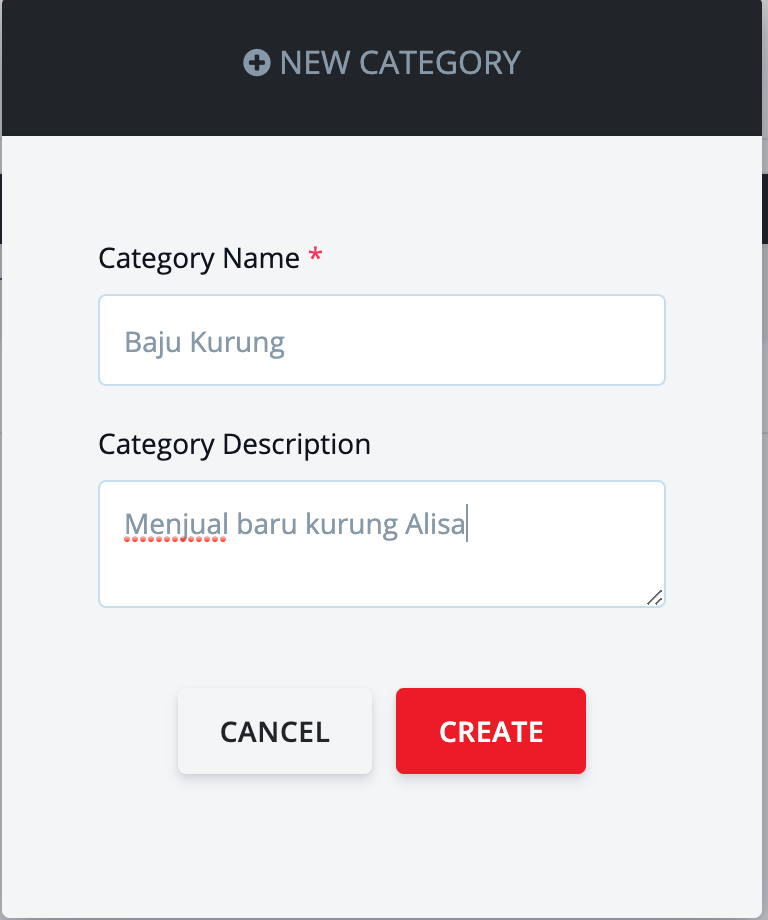
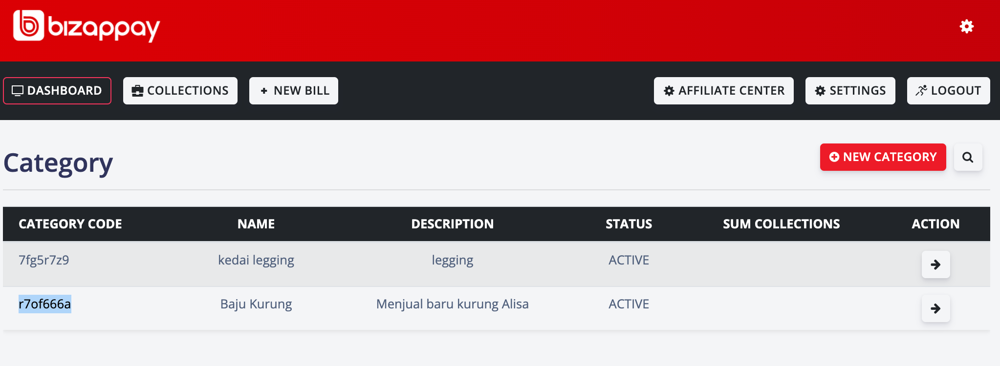
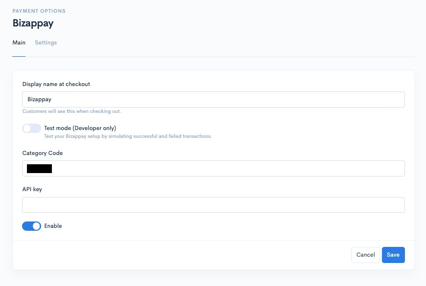
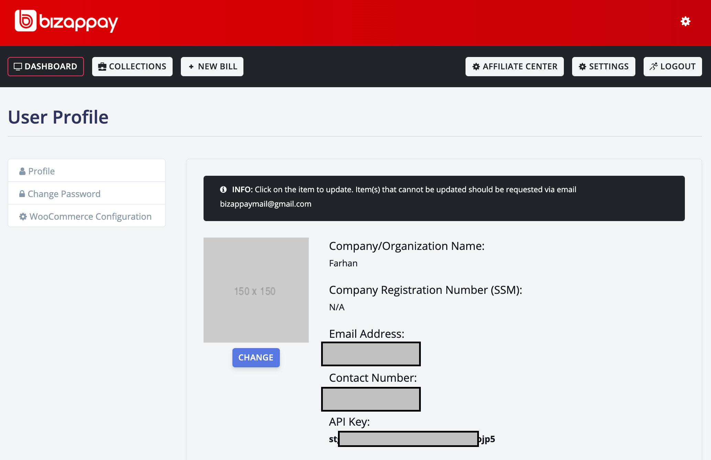
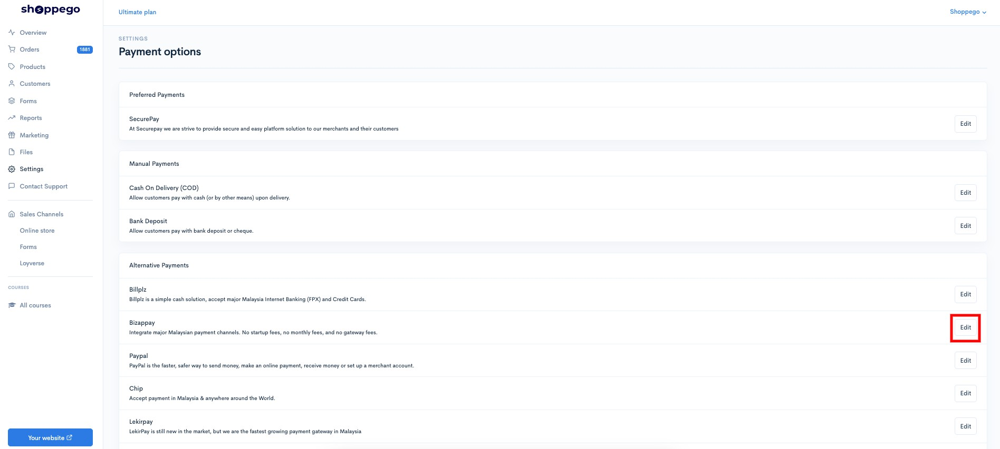
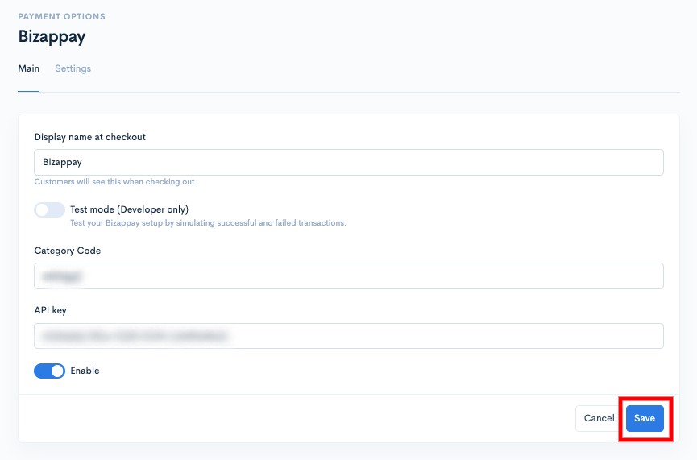
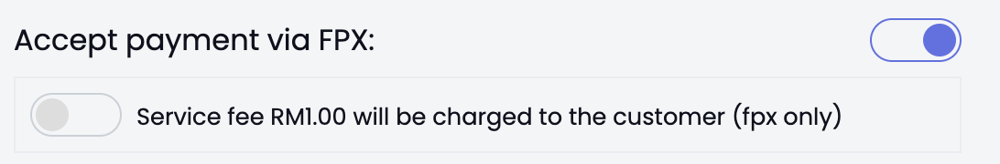

# Bizappay

Klik di link berikut untuk mendaftar **Bizappay** secara percuma <https://www.bizappay.my>



* Pendaftaran **akaun individu** Bizappay **tidak memerlukan SSM** <mark style="color:red;">**tetapi memerlukan**</mark> **akaun semasa**.&#x20;
* Pendaftaran **akaun syarikat memerlukan SSM**.&#x20;
* Anda boleh menggunakan **akaun peribadi** dan terus membuat jualan serta merta.&#x20;
  


**Urusan pengesahan akaun, caj dan wang transaksi** adalah **diuruskan sepenuhnya oleh pihak Bizappay**.


Selepas pendaftaran **akaun Bizzappay** pastikan anda **sudah membuat pengesahan** pada akaun anda untuk **memastikan tiada isu** semasa proses menggunakannya.&#x20;

## **Mencipta Bizappay Category Code**

1\. Daftar dan log masuk ke **akaun Bizappay** anda dahulu. \
\
2\. Klik pada butang **Category** yang bewarna hijau.&#x20;

3\. Seterusnya klik butang **New Category**&#x20;

&#x20;Akan terbit satu Pop up untuk isikan maklumat \
\
4\. Isikan **nama kategori produk anda** pada ruangan **Category Name**. Ruangan ini adalah bebas, anda boleh juga letakkan nama brand anda sendiri.  \
\
Pada ruangan **Category Description** masukkan sahaja sedikit maklumat mengenai produk yang anda jual. \
\
5\. Seterusnya klik butang **Create**.

6.Seterusnya pada bahagian **Category Code** anda akan lihat satu gabungan nombor dan huruf secara rawak. \
\
Simpan **Category Code** yang baru dicipta tersebut.&#x20;

## Masukkan Category Code di penetapan Shoppego

1\. Log masuk ke akaun Shoppego -> **Settings** -> **Payment Options** -> **Bizappay** \
<https://my.shoppego.com/settings/payment>\
\
2\. Masukkan kod yang telah anda simpan tadi pada ruangan **Category Code**

## **Mendapatkan Bizappay API key**

1\. Di dalam dashboard Bizappay anda klik pada butang **Settings**\
\
2\. Sekali lagi pada **bahagian API Key** anda akan lihat nombor dan huruf rawak dibawahnya. \
**Simpan API key tersebut**

### Masukkan API key di penetapan Shoppego

1. Log masuk semula ke dashboard Shoppego

<figure><figcaption></figcaption></figure>

2. Klik pada **Settings**

<figure><figcaption></figcaption></figure>

3. Klik pada **Payment Options**

<figure><figcaption></figcaption></figure>

4. Klik Edit/Activate pada tab Bizappay

<figure><figcaption></figcaption></figure>

5. Masukkan **API Key** yang telah di simpan tadi pada ruangan **API key**


Sekiranya anda ingin **memulakan transaksi sebenar**, diminta untuk anda <mark style="color:red;">**mematikan**</mark> toggle **Test Mode** itu. Toggle Test Mode itu hanya boleh digunakan sekiranya anda mempunyai akaun developer pihak payment gateway sahaja.


\*Pastikan pada kotak **Enable Bizappay** ditandakan \
\
Seterusnya klik butang **Save**

Kini proses penetapan integrasi **Bizappay** anda telah pun selesai. Sekiranya, ada sebarang isu sewaktu anda ingin lakukan pembayaran menggunakan Bizappay, anda boleh rujuk contoh penetapan di [Maklumat Tambahan](bizappay.md#maklumat-tambahan).

## Maklumat Tambahan

 <mark style="color:red;">**Perhatian:**</mark> Untuk mengelakkan sebarang rala&#x74;**,** sila <mark style="color:red;">**NYAH-AKTIFKAN SERVICE FEE RM1**</mark> pada **platform Bizappay.**


**PLATFORM BIZAPPAY > SETTINGS > SERVICE FEE.**

