# Chip

Bagi menggunakan Chip sila pastikan anda **sudah cipta** terlebih dahulu **akaun Chip.**


Anda perlu pastikan anda sudah:

* Mempunyai SSM&#x20;
* Akaun bank semasa.
  


**Urusan pengesahan akaun, caj dan wang transaksi** adalah **diuruskan sepenuhnya oleh pihak Chip**.


## Penetapan di Chip

Untuk lakukan integration payment gateway Chip dengan Shoppego, anda perlu dapatkan **Brand ID**, **Secret key.**\
\
Jika anda masih belum mendaftar akaun Chip, anda boleh menggunakan link ini:\
<https://onboarding.chip-in.asia/>

### Dapatkan Brand ID

1. Log masuk dalam akaun Chip anda.

<figure>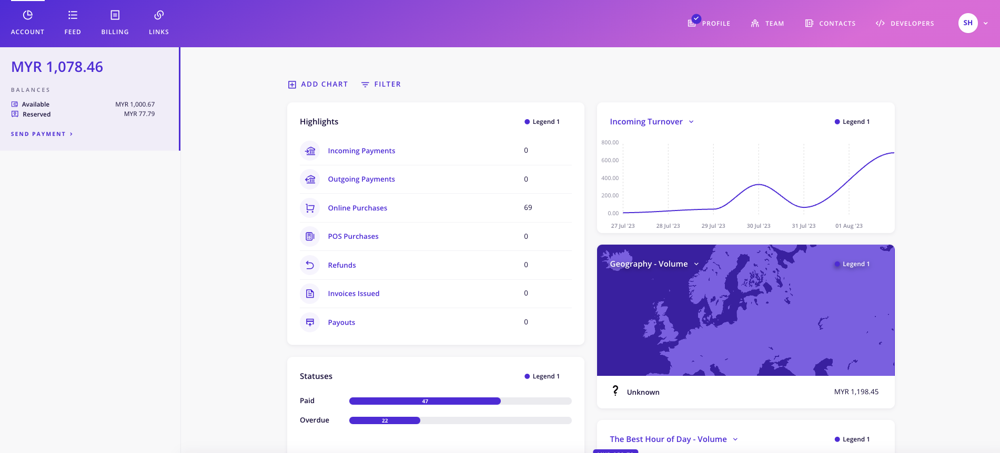<figcaption></figcaption></figure>

2. Klik pada butang/teks **Developers**

<figure>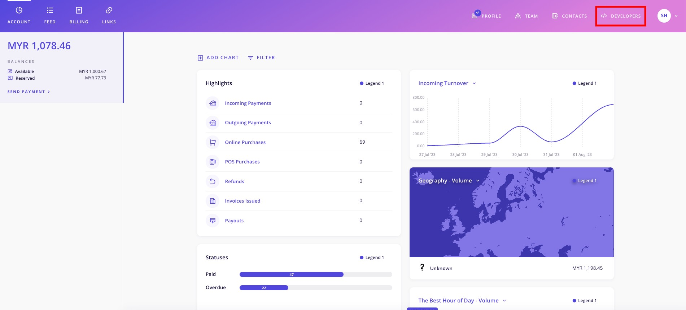<figcaption></figcaption></figure>

3. Klik pada butang/teks **Brands**

<figure>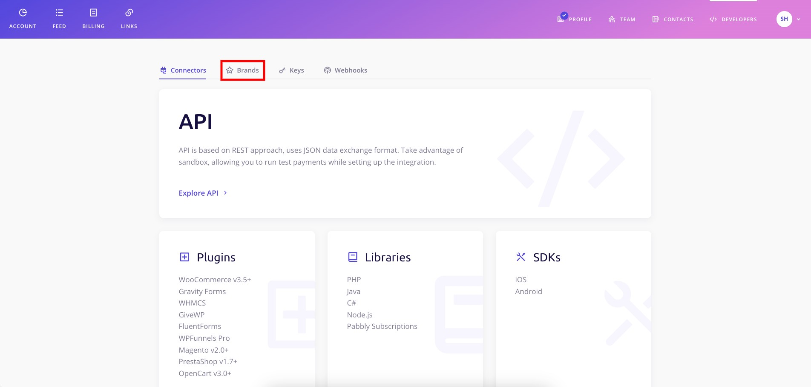<figcaption></figcaption></figure>

4. Kemudian, anda boleh **copy Brand ID** anda seperti yang dalam paparan dibawah. **Brand ID ini anda perlu simpan untuk penetapan di Shoppego pula nanti**.

<figure>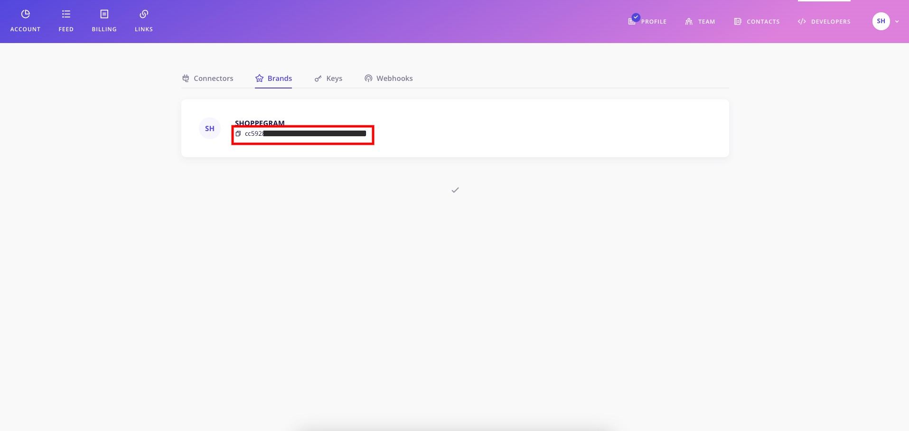<figcaption></figcaption></figure>

### Dapatkan Secret Key

1. Dari halaman **Developers**, anda boleh klik pula pada butang/teks **Keys**.

<figure>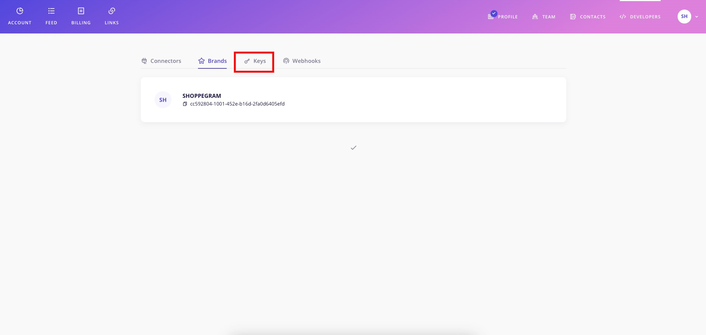<figcaption></figcaption></figure>

2. Kemudian, pastikan **toggle View/Viewing test data tersebut dalam keadaan nyah aktif(berwarna kelabu)**.

<figure>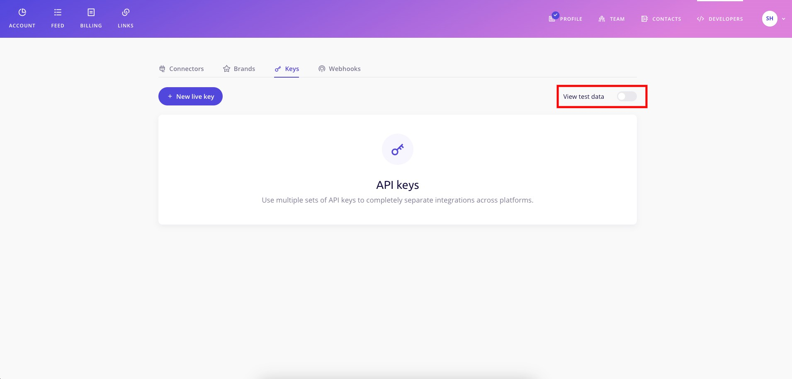<figcaption></figcaption></figure>

3. Seterusya, anda boleh klik pada butang **New live key**

<figure>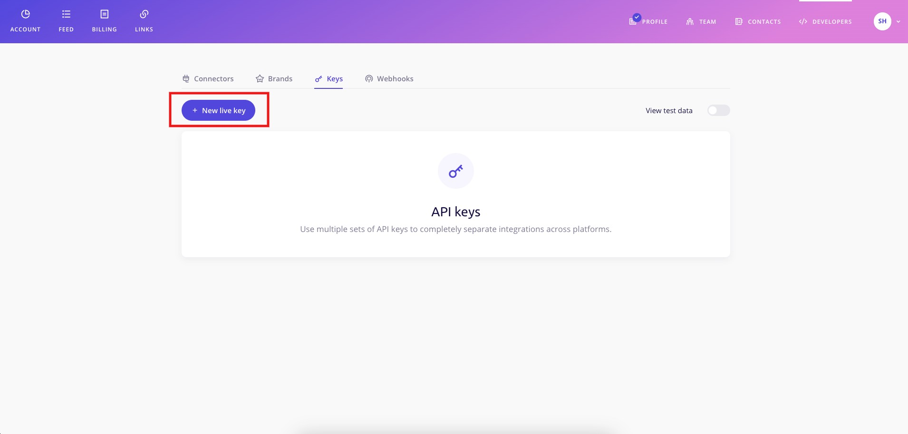<figcaption></figcaption></figure>

3. Kemudian, anda akan diminta untuk **masukkan Key title pada ruangan yang telah disediakan**. Key title ini bertindak sebagai rujukan untuk anda kenali key ini digunakan dimana nanti. Sebagai contoh kami masukkan Shoppego dan setelah itu klik **Create**.

<figure>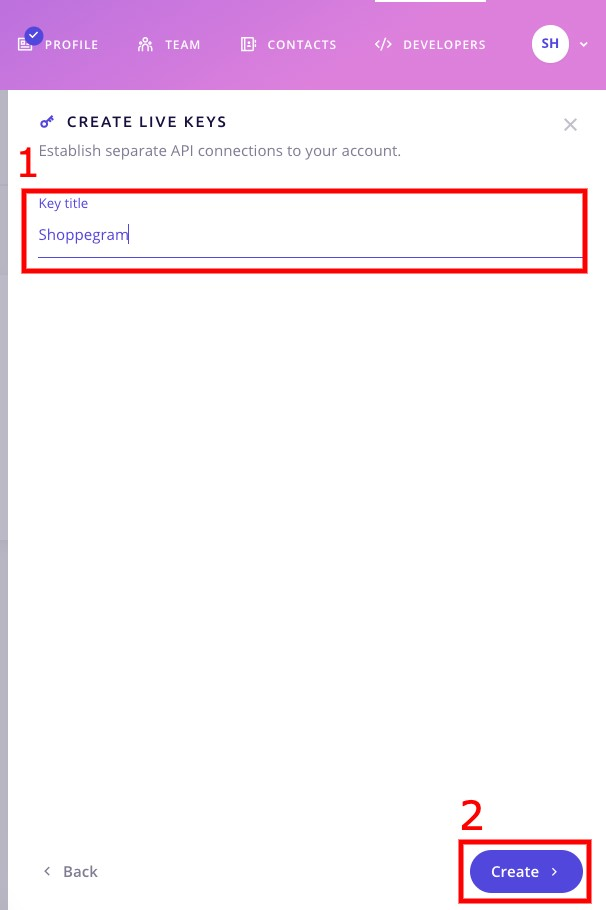<figcaption></figcaption></figure>

4. Setelah anda cipta key tersebut, anda boleh **klik semula pada key itu** dan anda boleh klik pada butang/teks **Copy**. **Anda perlu simpan key ini untuk lakukan penetapan di Shoppego pula nanti**.

<figure>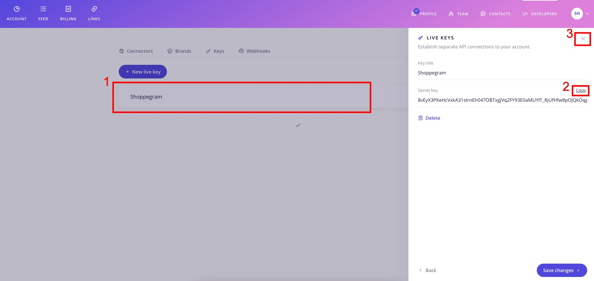<figcaption></figcaption></figure>

## Penetapan di Shoppego

1\. Log masuk ke dalam akaun Shoppego anda.

2\. Klik pada **Settings**

3\. Klik pada **Payment options**

4\. Jika anda belum aktifkan payment option untuk Chip. Klik butang **Activate** pada bahagian **Alternative Payments** untuk Chip. Jika anda sudah aktifkan payment option untuk Chip klik butang **Edit.**

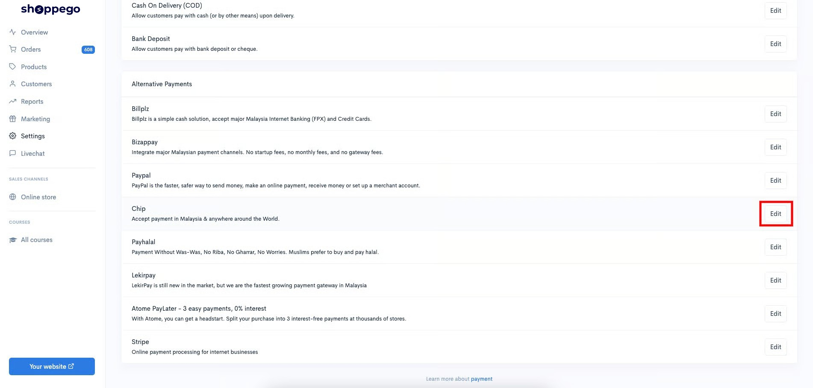

5\. Seterusnya akan keluar paparan seperti dibawah, anda boleh isi maklumat tersebut :&#x20;

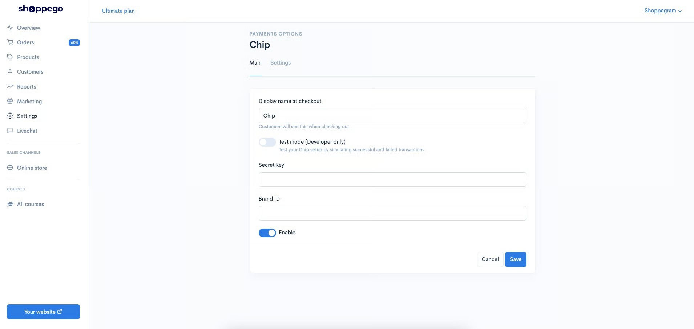

* **Display name at checkout : Masukkan nama payment yang anda inginkan (Contoh Chip)**
* **Secret key : Masukkan Secret key yang anda sudah dapatkan di akaun Chip anda.**
* **Brand ID : Masukkan Brand ID yang anda sudah dapatkan di akaun Chip anda.**

6\. Setelah selesai pastikan anda sudah klik **Enable** dan klik button **Save**.


**Untuk makluman,&#x20;**<mark style="color:red;">**toggle Test mode**</mark>**&#x20;hanya digunakan oleh pihak Developer sahaja. Untuk pengguna Shoppego, sila pastikan anda&#x20;**<mark style="color:red;">**nyah aktifkan**</mark>**&#x20;toggle tersebut.**


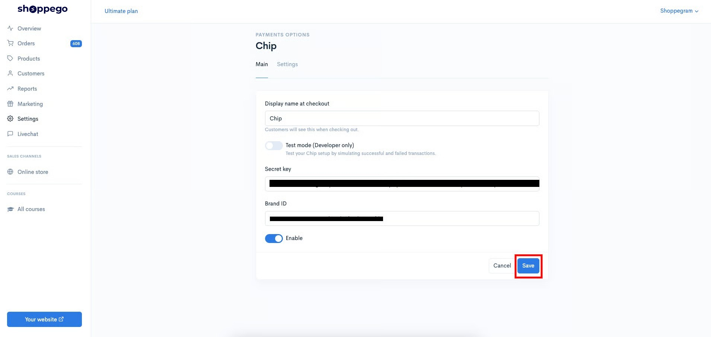

Setelah **Save** anda boleh membuat percubaan pembelian pada website anda untuk lihat payment option Chip tersebut semasa checkout untuk penetapan yang anda baru tetapkan sebentar tadi.
