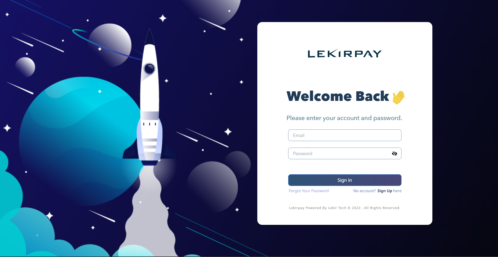
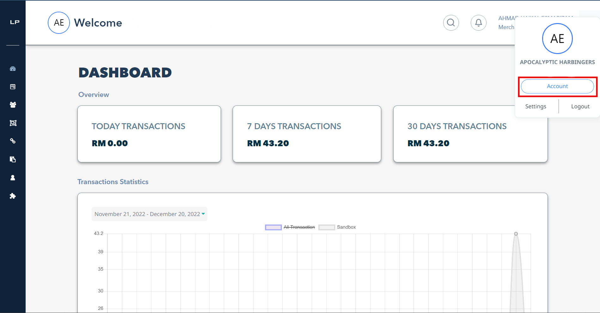
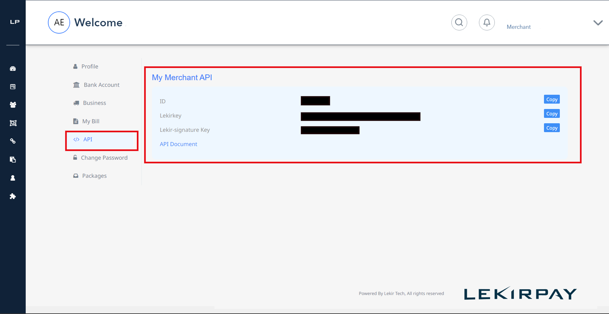
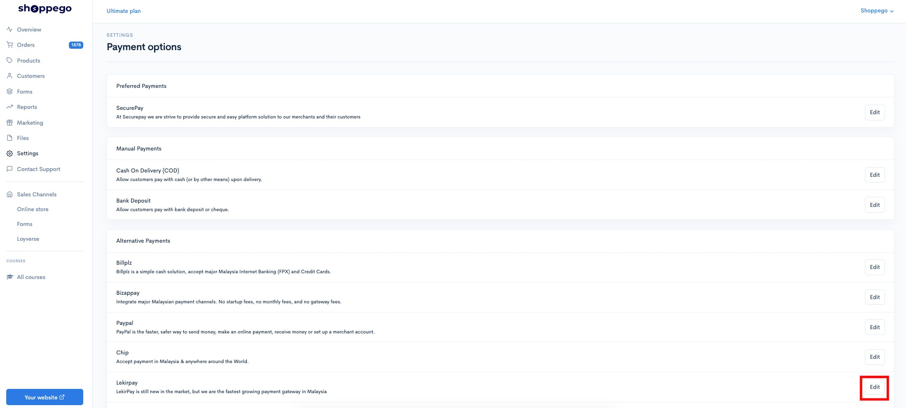
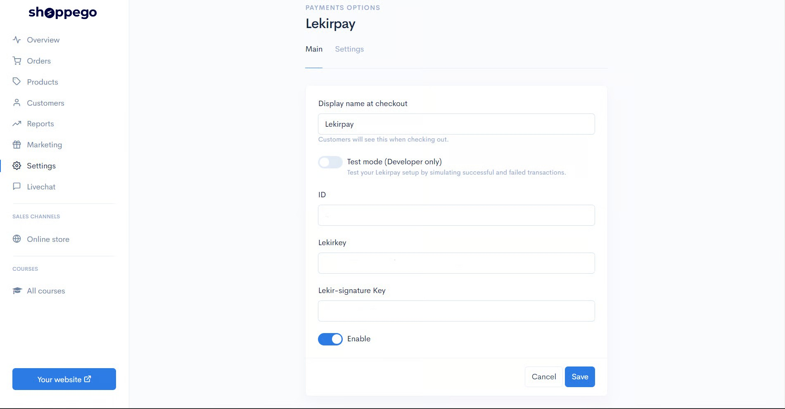
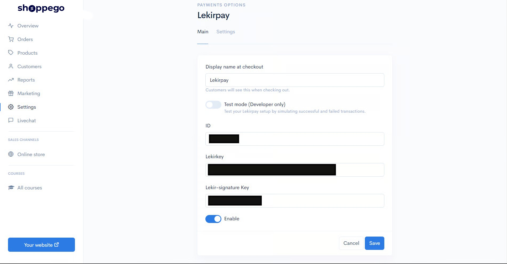
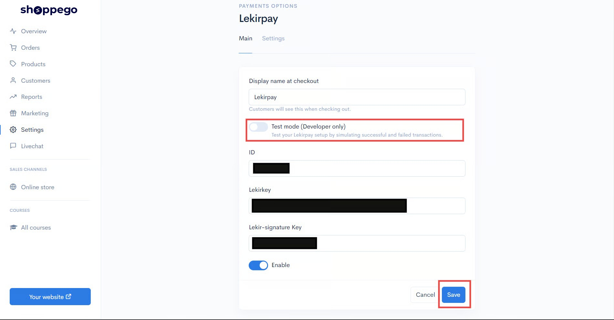
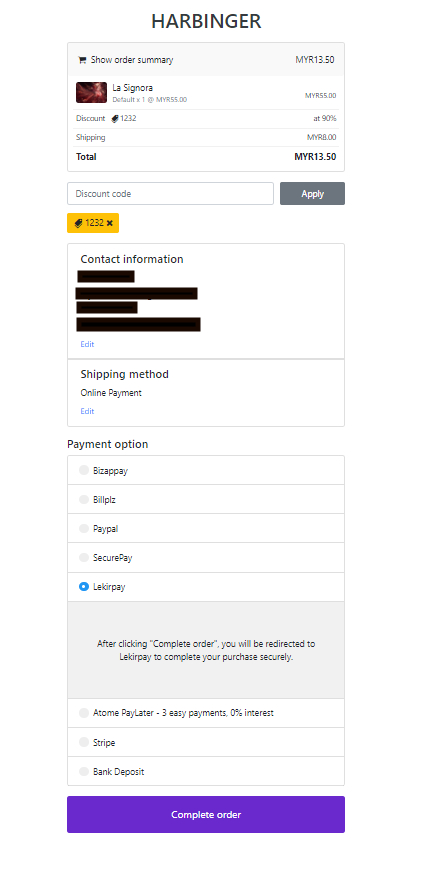

# Lekirpay

## Pendaftaran akaun Lekirpay

Klik di link ini \[http://app.lekirpay.com/validate?referralid=RL000316]\(\<http://app.lekirpay.com/validate?referralid=RL000316

> ) untuk mula daftar akaun Lekirpay anda.


Bagi proses pendaftaran akaun Lekirpay anda perlu pastikan anda sudah :

* Mempunyai SSM
* Akaun semasa.



**Urusan pengesahan akaun, caj dan wang transaksi** adalah **diuruskan sepenuhnya oleh pihak Lekirpay**.


## Dapatkan kesemua key yang diperlukan dari akaun Lekirpay

Untuk menghubungkan Lekirpay dengan website Shoppego, anda memerlukan beberapa key untuk proses pengesahan. Antara key yang diperlukan ialah **ID,** **Lekirkey** dan **Lekir-signature Token**.

Untuk memulakan proses penetapan payment gateway Lekirpay anda boleh ikut langkah penetapan ini :

1\. Log masuk ke akaun Lekirpay anda

<figure><figcaption></figcaption></figure>

2\. Seterusnya pada bahagian Dashboard Lekirpay, anda boleh klik pada Tab **Account**

<figure><figcaption></figcaption></figure>

3\. Seterusnya anda akan dapat lihat API anda disitu anda boleh klik pada text **API** tersebut, anda akan lihat ketiga tiga key yang akan diperlukan iaitu **ID**, **Lekirkey** dan **Lekir-signature Key**.

<figure><figcaption></figcaption></figure>

Anda boleh simpan ketiga-tiga key tersebut untuk kegunaan pada langkah seterusnya. Key yang anda perlu simpan ialah :

* **ID**
* **Lekirkey**
* **Lekir-signature Key**

## **Penetapan di Shoppego**

Untuk proses penetapan payment gateway Lekirpay di Shoppego anda perlu aktifkan terlebih dahulu payment gateway tersebut dan masukkan ketiga-tiga key tersebut kedalam setting payment gateway anda.

Untuk memulakan penetapan payment gateway tersebut, anda boleh ikut langkah penetapan ini.

1\. Log masuk kedalam akaun Shoppego anda.

<figure><figcaption></figcaption></figure>

2\. Seterusnya anda boleh klik pada tab **Settings**

<figure><figcaption></figcaption></figure>

3\. Seterusnya, pada halaman **Settings,** anda boleh klik pada butang **Payment options**

<figure><figcaption></figcaption></figure>

4\. Pada bahagian halaman **Payment options**, anda boleh klik butang **Activate/Edit** pada tab payment gateway **Lekirpay**

<figure><figcaption></figcaption></figure>

5\. Seterusnya, anda akan dibawa ke halaman penetapan untuk payment gateway **Lekirpay**.

<figure><figcaption></figcaption></figure>

6\. Anda perlu masukkan ketiga-tiga key yang telah disimpan iaitu **ID**, **Lekirpay** dan **Lekir-signature Key**

<figure><figcaption></figcaption></figure>

7\. Setelah selesai anda boleh klik **Save** untuk simpan penetapan tersebut.


Sekiranya anda ingin **memulakan transaksi sebenar**, diminta untuk anda <mark style="color:red;">**mematikan**</mark> toggle **Test Mode** itu.


<figure><figcaption></figcaption></figure>

## Contoh di Website

Setelah selesai proses penetapan tersebut, anda boleh cuba membuat pembelian di website Shoppego anda untuk melihat hasilnya.

<figure><figcaption></figcaption></figure>

Tahniah, proses penetapan **Lekirpay** anda telah pun selesai. 
