# Payhalal

## Pendaftaran akaun Payhalal

Klik di link ini <https://payhalal.my/merchant-register> untuk mula daftar akaun **Payhalal** anda.&#x20;


Bagi proses pendaftaran akaun **Payhalal** anda perlu pastikan anda :&#x20;

* Mempunyai **SSM**&#x20;
* Akaun Bank semasa.
  


**Urusan pengesahan akaun, caj dan wang transaksi** adalah **diuruskan sepenuhnya oleh pihak Payhalal**.


## Dapatkan kesemua key yang diperlukan dari akaun Payhalal

Untuk menghubungkan Payhalal dengan website Shoppego, anda memerlukan beberapa key untuk proses pengesahan. Antara key yang diperlukan ialah **App key** dan **Secret Key**.

Untuk memulakan proses penetapan payment gateway Payhalal anda boleh ikut langkah penetapan ini :

1\. Log masuk ke dalam akaun **Payhalal** anda.

<figure>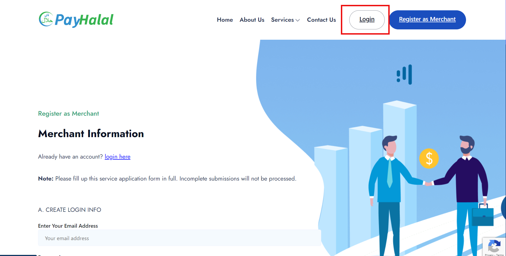<figcaption></figcaption></figure>

2\. Masukkan **emel** dan **kata laluan** yang digunakan semasa pendaftaran.

<figure>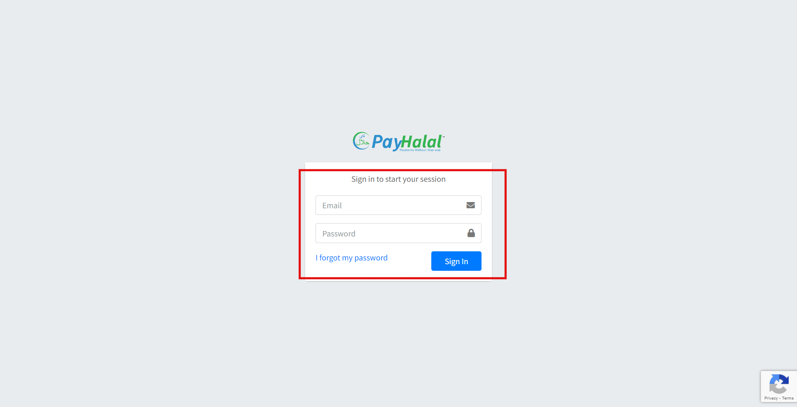<figcaption></figcaption></figure>

3\. Kemudian, pada Dashboard Payhalal, anda akan lihat menu di bar sisi. Klik pada **General**.

<figure>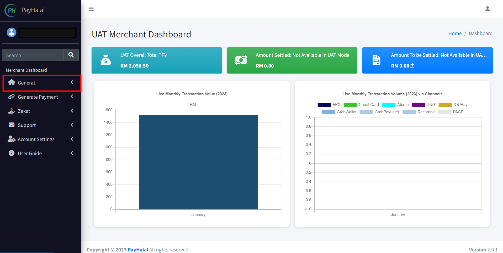<figcaption></figcaption></figure>

4\. Selepas itu, anda perlu pergi ke **Developer Tools** untuk **Create App** untuk mendapatkan **App key** dan **Secret Key.**

<figure>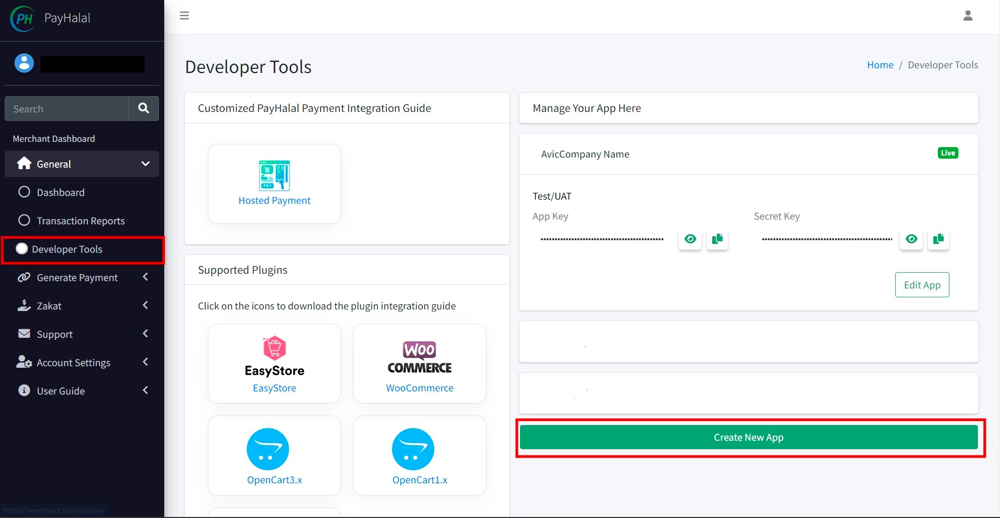<figcaption></figcaption></figure>

5\. Selepas itu, anda boleh masukkan maklumat yang diminta.

* App Name : Anda boleh masukkan sebagai contoh App Saya
* Website : Ini adalah Optional (Tidak wajib untuk diisi)

Pada bahagian penetapan App seperti dibawah anda perlu **pastikan anda menggunakan URL <https://subdomain> .myshoppegram.com website Shoppego anda yang telah diberikan secara percuma oleh pihak Shoppego sewaktu pendaftaran akaun Shoppego** tersebut.

Anda boleh dapati URL subdomain anda pada bahagian berikut:\
Dashboard Overview Shoppego -> **Settings** -> **Custom domain** -> **Subdomain**

<figure><figcaption></figcaption></figure>

Sebagai **contoh link subdomain yang anda akan gunakan nanti adalah seperti ini: <https://hartamas.myshoppegram.com>**. Pastikan setiap ruang penetapan URL yang tersedia menggunakan link subdomain tersebut dan mengikut format yang diberikan. Anda boleh **salin link di bawah** dan **letakkan di dalam App** yang telah anda cipta.

* Success URL : \
  <https://hartamas.myshoppegram.com/checkouts/payments/redirect/payhalal>
* Callback URL: <https://hartamas.myshoppegram.com/webhooks/payments/callback/checkouts/payhalal>
* Return URL: \
  <https://hartamas.myshoppegram.com/checkouts/payments/redirect/payhalal>
* Cancel URL: \
  [https://hartamas.myshoppegram.com/checkouts/payments/redirect/payhalal](https://kedaianda.com/checkouts/payments/redirect/payhalal)

<figure>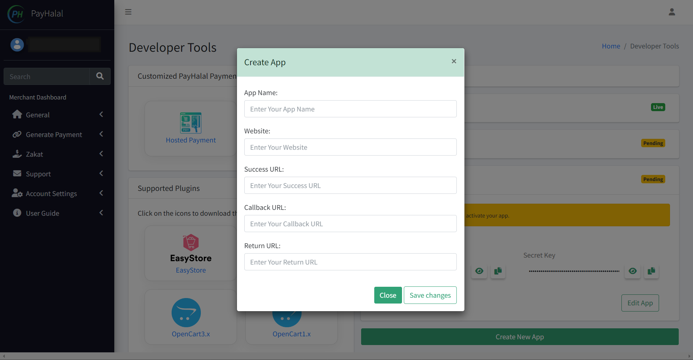<figcaption></figcaption></figure>

6\. Setelah anda selesai, klik **Save changes.**

<figure>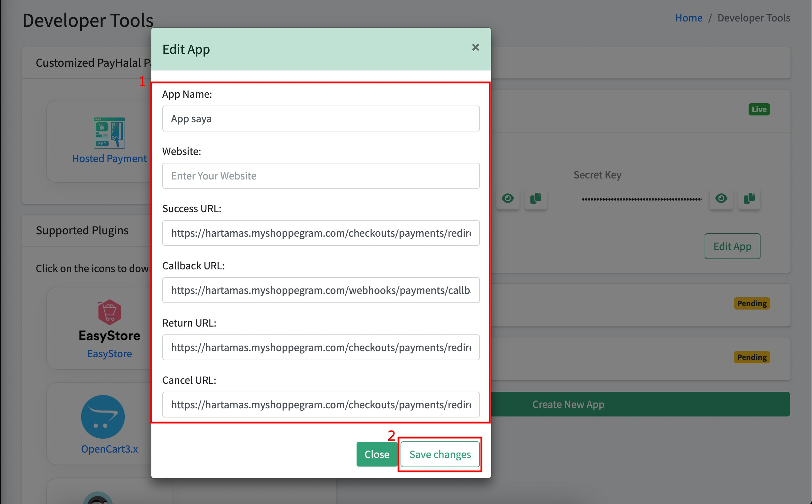<figcaption></figcaption></figure>

7\. Kemudian , anda akan dapat lihat beberapa maklumat penting antaranya adalah **App Key** dan **Secret Key**. Anda boleh tekan pada **dua ikon di dalam kotak merah** untuk **lihat** dan **salin key** tersebut untuk dimasukkan ke dalam penetapan di Shoppego.

<figure>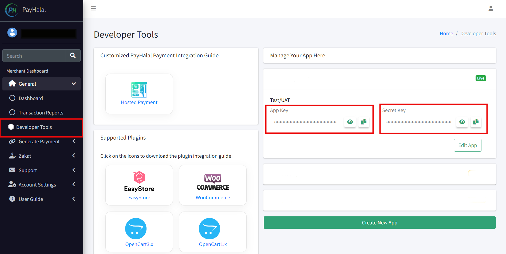<figcaption></figcaption></figure>

## **Penetapan di Shoppego**

Untuk proses penetapan payment gateway **Payhalal** di Shoppego anda perlu aktifkan terlebih dahulu payment gateway tersebut dan masukkan kedua dua key tersebut kedalam setting payment gateway anda.

Untuk memulakan penetapan payment gateway tersebut, anda boleh ikut langkah penetapan ini.

1\. Log masuk kedalam akaun Shoppego anda.

<figure><figcaption></figcaption></figure>

2\. Selepas itu, anda boleh pergi ke **Settings** dan memilih bahagian **Payment Options**.

<figure>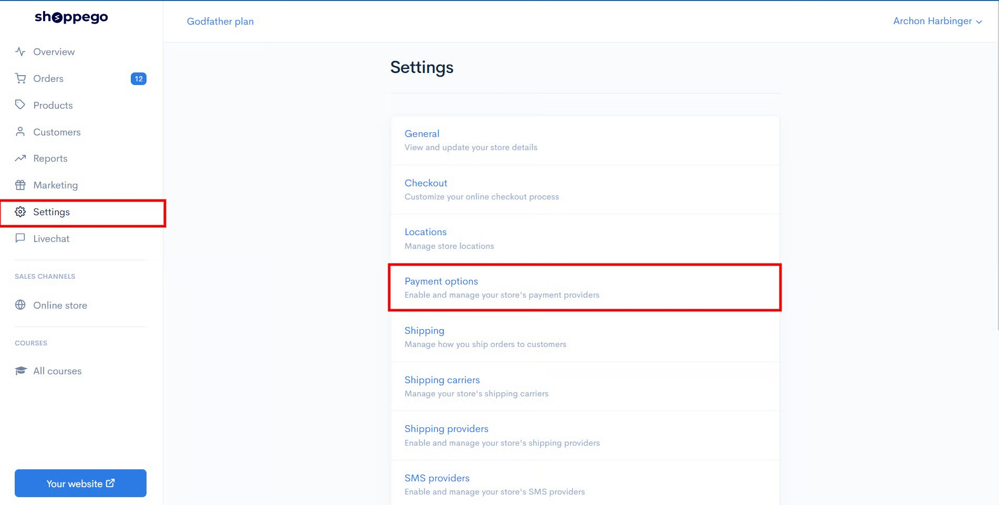<figcaption></figcaption></figure>

3\. Anda boleh tekan **Activate / Edit** pada jenis pembayaran **Payhalal**.

<figure>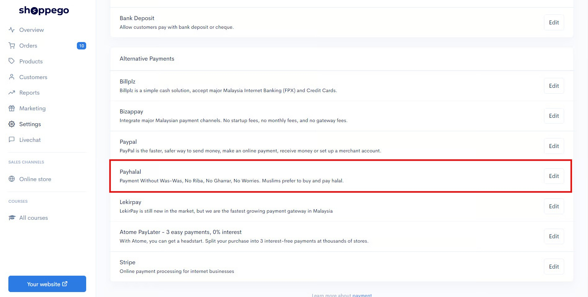<figcaption></figcaption></figure>

4\. Selepas itu, anda dikehehendaki memasukkan nilai **App Key** dan juga **Secret Key** yang telah disalin daripada Payhalal.&#x20;


Sekiranya anda ingin **memulakan transaksi sebenar**, diminta untuk anda <mark style="color:red;">**mematikan**</mark> toggle **Test Mode** itu.


<figure>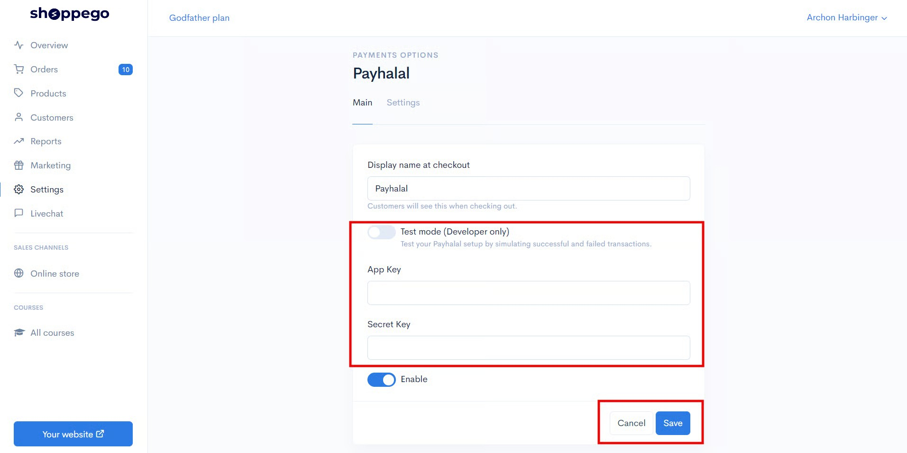<figcaption></figcaption></figure>

## Contoh di Website

Setelah selesai proses penetapan tersebut, anda boleh cuba membuat pembelian di website Shoppego anda untuk melihat hasilnya.

1. Anda boleh pilih pembayaran Payhalal sebagai medium pembayaran.

<figure>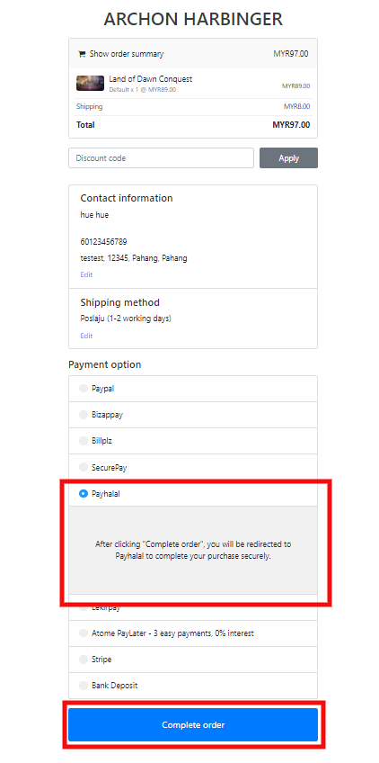<figcaption></figcaption></figure>

Tahniah penetapan bagi pembayaran **Payhalal** telah selesai dan berjaya!
