# Paypal


**Urusan pengesahan akaun, caj dan wang transaksi** adalah **diuruskan sepenuhnya oleh pihak Paypal**.


## Pendaftaran akaun Paypal

Klik di link ini <https://www.paypal.com/my/webapps/mpp/account-selection> untuk mula daftar  akaun Paypal anda. Bagi proses pendaftaran akaun Paypal pastikan anda memilih sebagai Business Account.

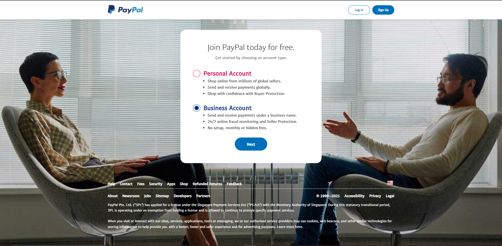

## Dapatkan kesemua key yang diperlukan dari akaun Paypal

Untuk menghubungkan Paypal dengan website Shoppego, anda memerlukan beberapa key untuk proses pengesahan. Antara key yang diperlukan ialah **Client ID** dan **Client Secret**. Untuk memulakan proses penetapan payment gateway Paypal anda boleh ikuti langkah penetapan ini :

1\. Log masuk ke akaun Paypal anda melalui link ini <https://developer.paypal.com/developer/applications>

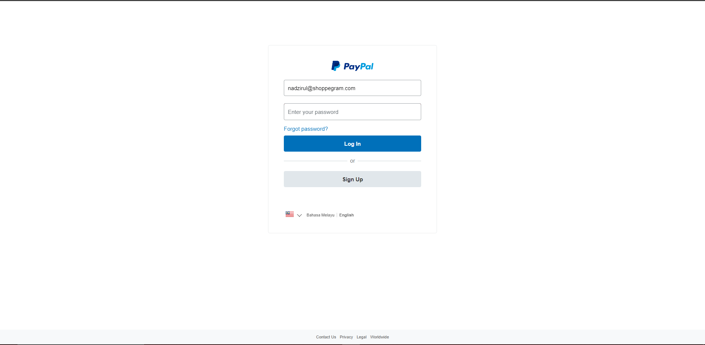

2\.  Seterusnya pada bahagian dashboard Paypal, anda boleh klik pada tab **LIVE**

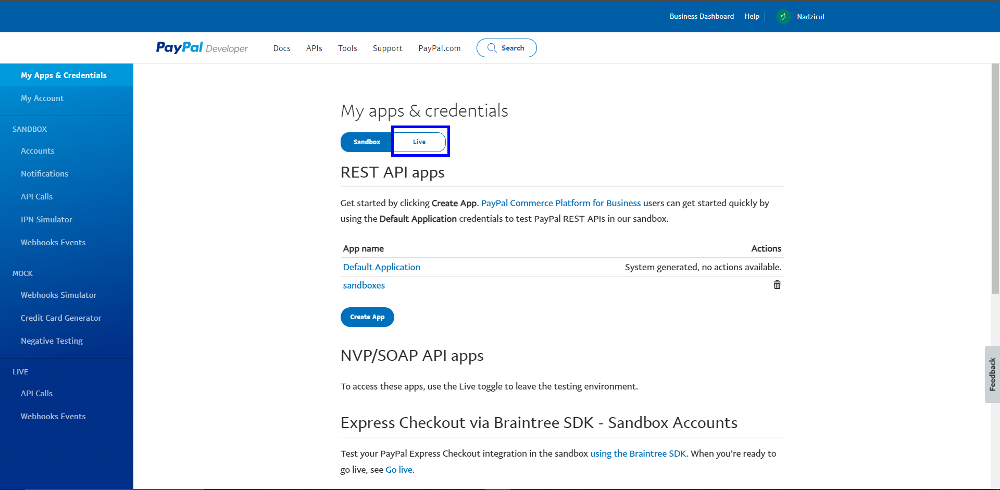

3\. Seterusnya anda akan dapat lihat butang **Create App** anda disitu. Anda boleh klik pada butang tersebut.

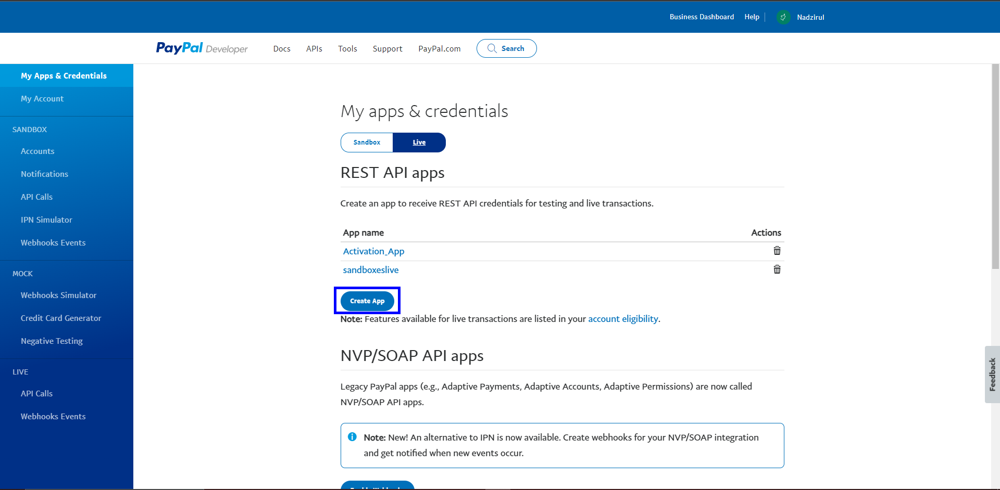

4\. Pada paparan ini, anda dikehendaki untuk memasukan nama **App Name.** Disarankan untuk memasukkan nama bisnes anda sendiri. Seterusnya, tekan butang **Create App**.

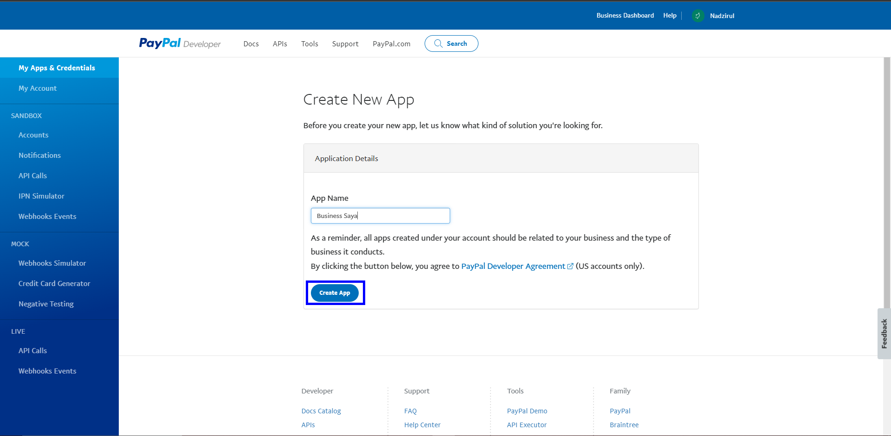

5\. Seterusnya, setelah anda klik pada **Create app** satu paparan baru akan muncul. Pada paparan ini anda dikehendaki untuk membuat penetapan webhook.&#x20;

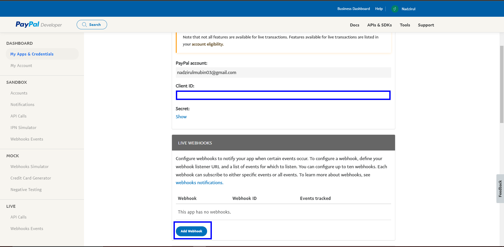

6\. Pada paparan ini anda **diwajibkan untuk memasukkan nama URL <https://subdomain.myshoppegram.com> akaun Shoppego anda yang telah diberikan secara percuma sewaktu pendaftaran akaun Shoppego** anda ke dalam **ruangan Webhook URL**.

Anda boleh dapati URL subdomain anda pada bahagian berikut:\
Dashboard Overview Shoppego -> **Settings** -> **Custom domain** -> **Subdomain**

<figure>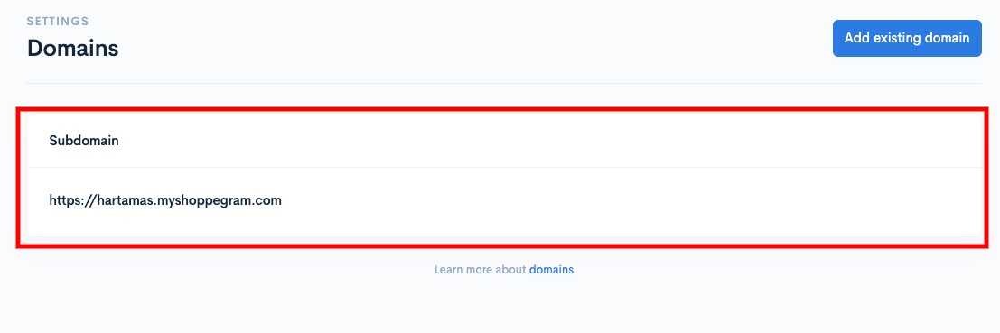<figcaption></figcaption></figure>

Sebagai contoh :\
**<https://hartamas.myshoppegram.com/webhooks/payments/callback/checkouts/paypal>** dan **tick** pada **Checkout** > **Checkout order approved**

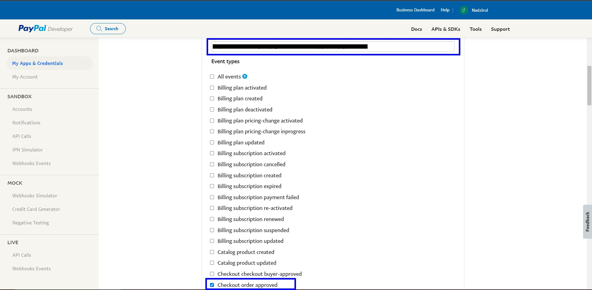

## Penetapan di Shoppego

Untuk proses penetapan payment gateway Paypal di Shoppego anda perlu aktifkan terlebih dahulu payment gateway tersebut dan masukkan kedua-dua key tersebut kedalam setting payment gateway anda.&#x20;

Untuk memulakan penetapan payment gateway tersebut, anda boleh ikut langkah penetapan ini.

1\. Log masuk akaun Shoppego anda.

2\. Seterusnya anda boleh klik pada tab **Settings**

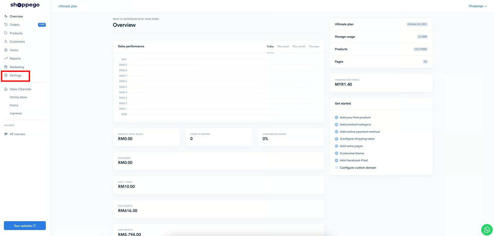

3\. Anda akan dibawa ke halaman Settings dan anda boleh klik pada butang **Payment options**

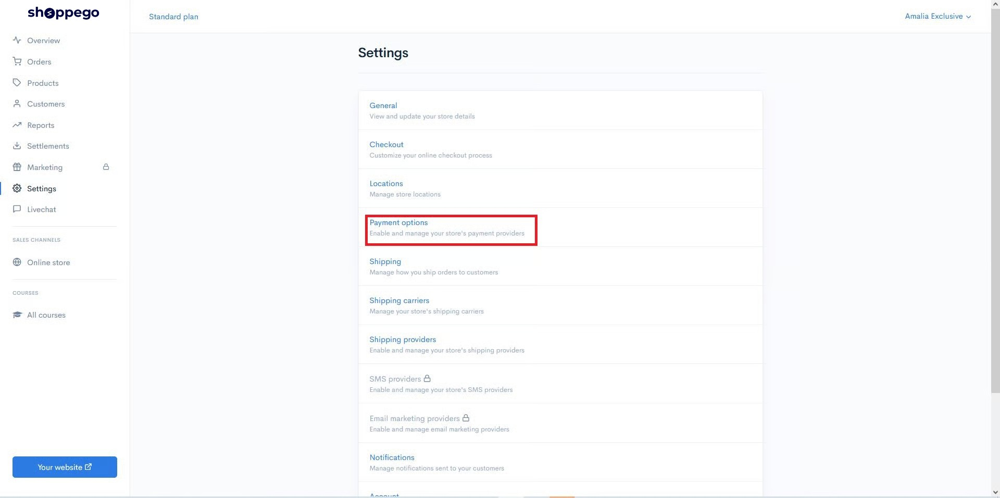

4\. Pada bahagian halaman Payment options, anda boleh klik butang **Activate/Edit** pada tab payment gateway Paypal.

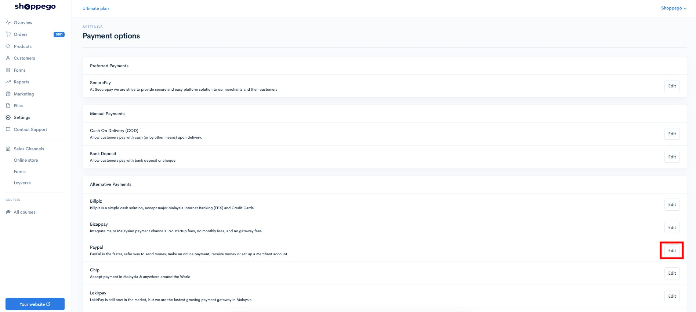

5\.  Dengan menggunakan key yang diberikan pada **Paypal Dashboard** -> **My App & Credentials** -> **LIVE** -> Pilih **App Name** yang anda cipta. Copy **Client ID** dan **Secret Key** , masukkan pada ruang Paypal di Shoppego. **Tick pada butang toggle Enable** dan klik butang **Save.**


Sekiranya anda ingin **memulakan transaksi sebenar**, diminta untuk anda <mark style="color:red;">**mematikan**</mark> toggle **Test Mode** itu.


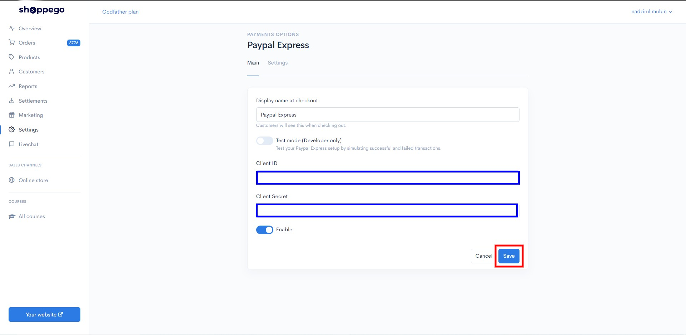

## Contoh di Website

Setelah selesai proses penetapan tersebut, anda boleh cuba membuat pembelian di website Shoppego anda untuk melihat hasilnya.

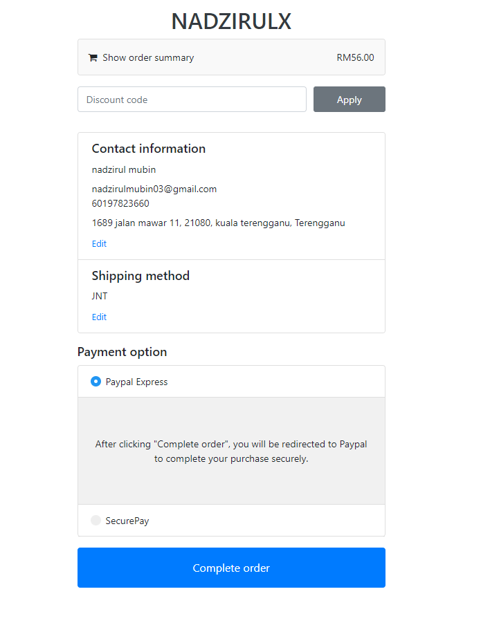
