# Securepay

## Pendaftaran akaun Securepay

Klik di link ini <https://securepay.my/p/6WSC78CY> untuk mula daftar **akaun Securepay** anda. Bagi proses **pendaftaran akaun Securepay.**&#x20;


Anda perlu pastikan anda sudah:

* Mempunyai SSM&#x20;
* Akaun Bank Syarikat
  


**Urusan pengesahan akaun, caj dan wang transaksi** adalah **diuruskan sepenuhnya oleh pihak Securepay**.


## Dapatkan Key yang diperlukan dari akaun Securepay

Untuk menghubungkan Securepay dengan website Shoppego, anda memerlukan beberapa key untuk proses pengesahan. Antara key yang diperlukan ialah **UID,** **Authentication token** dan **Checksum token**.&#x20;

Untuk memulakan proses penetapan payment gateway Securepay anda boleh ikut langkah penetapan ini :

1\. Log masuk ke akaun **Securepay** anda.

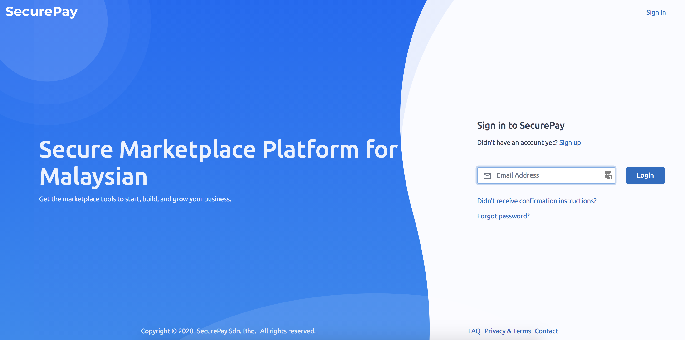

2\. Seterusnya pada bahagian Dashboard Securepay, anda boleh klik pada Tab **< > API**

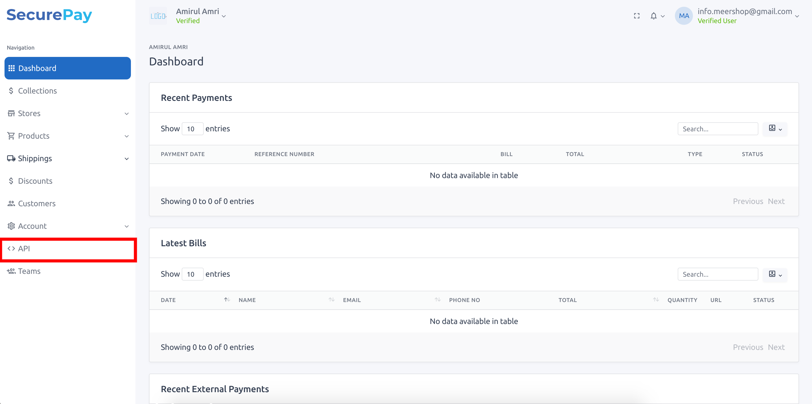

3\. Seterusnya anda akan dapat lihat API anda disitu anda boleh klik pada text **Default** tersebut

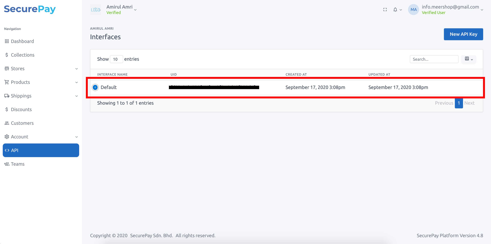

4\. Setelah anda klik pada API default tersebut anda akan jumpa ketiga-tiga key yang anda perlukan untuk penetapan payment gateway Securepay anda.

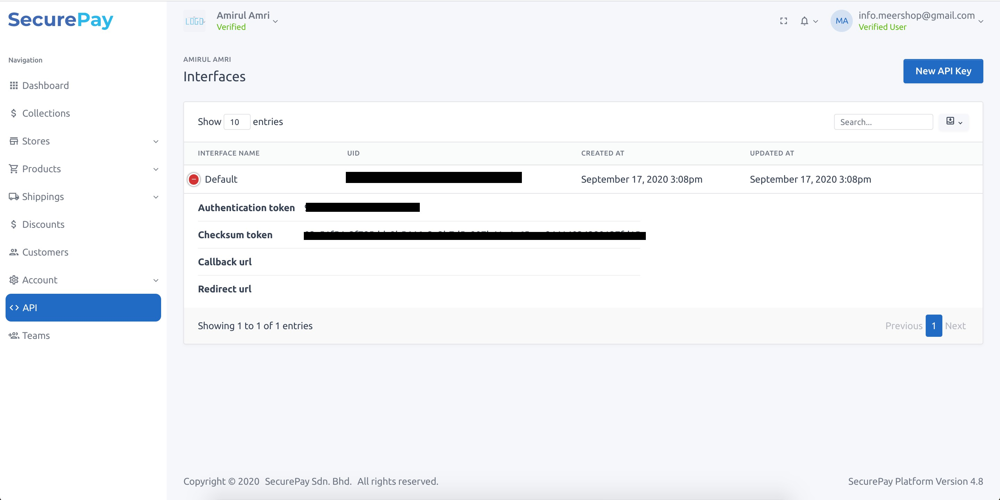

Anda boleh simpan ketiga-tiga key tersebut untuk kegunaan di langkah seterusnya. Key yang anda perlu simpan ialah :

* **UID**
* **Authentication token**
* **Checksum token**

6\. Setelah selesai mencipta API securepay. Klik show button pada API anda **"kotak berwarna merah"**.&#x20;

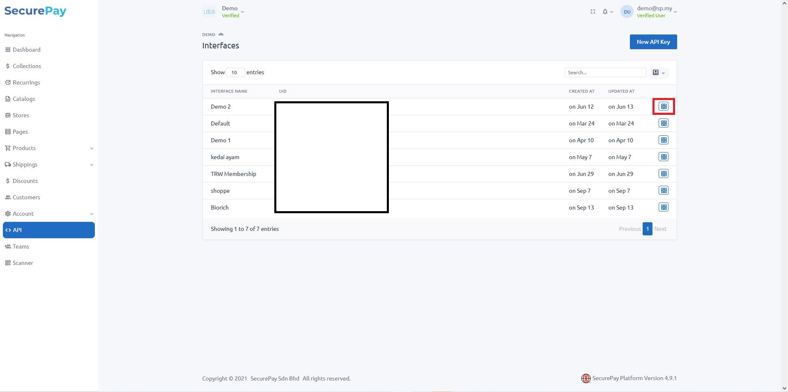

7\. Tekan pada butang **EDIT** di atas.

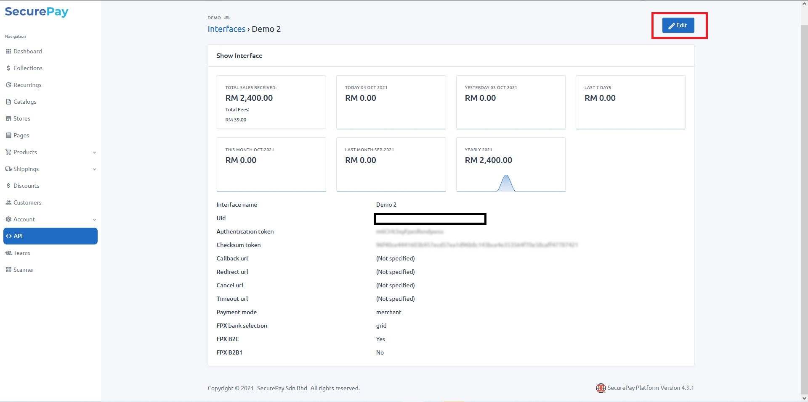

8\. Tick pada checkbox **FPX B2B1** dan tekan butang **UPDATE**

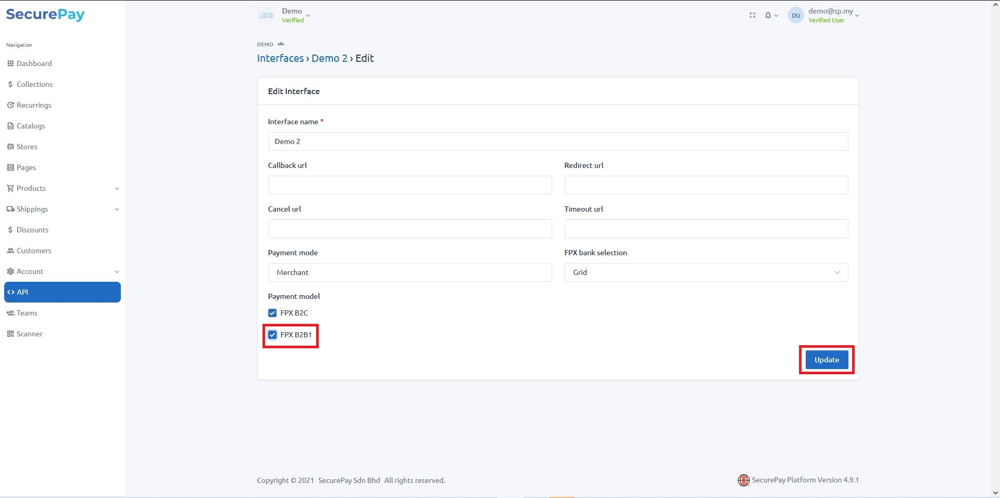

9\. . Pastikan **FPX B2B1** memaparkan status **YES**

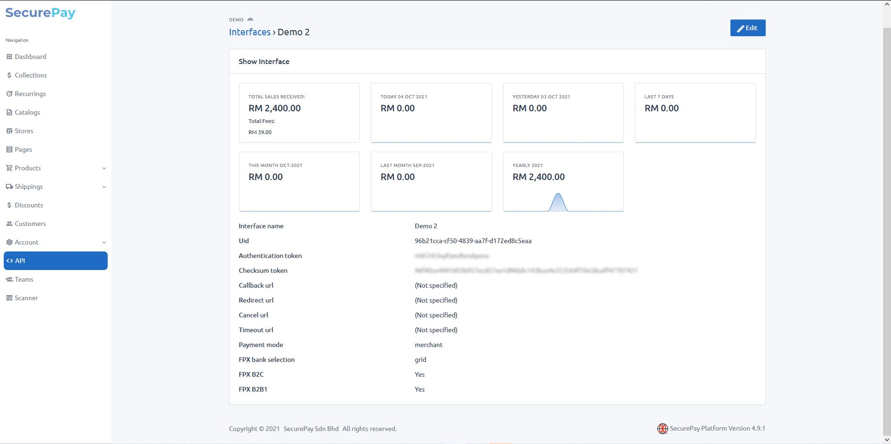

## **Penetapan di Shoppego**

Untuk proses penetapan payment gateway Securepay di Shoppego anda perlu aktifkan terlebih dahulu payment gateway tersebut dan masukkan ketiga-tiga key tersebut kedalam setting payment gateway anda. Untuk memulakan penetapan payment gateway tersebut, anda boleh ikut langkah penetapan ini.

1\. Log masuk kedalam akaun Shoppego anda.

2\. Seterusnya anda boleh klik pada tab **Settings**

3\. Anda akan dibawa ke halaman **Settings** dan anda boleh klik pada butang **Payment options**

4\. Pada bahagian halaman Payment options, anda boleh klik butang **Activate/Edit** pada tab payment gateway Securepay

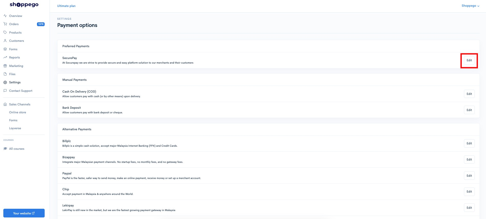

5\. Seterusnya, anda akan dibawa ke halaman penetapan untuk payment gateway Securepay.

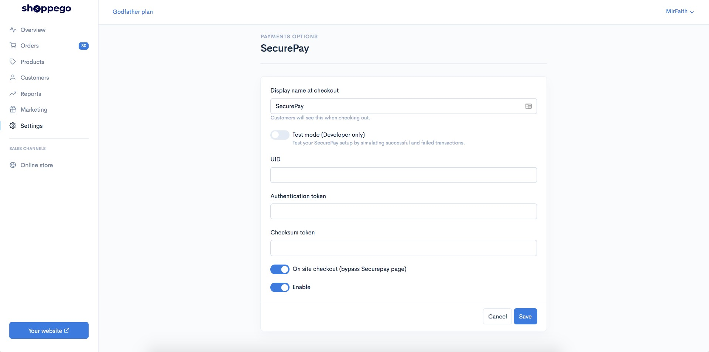

6\. Dengan menggunakan key yang anda sudah simpan pada langkah mendapatkan key tersebut, anda boleh masukkan kesemua key tersebut pada ruangan mereka.

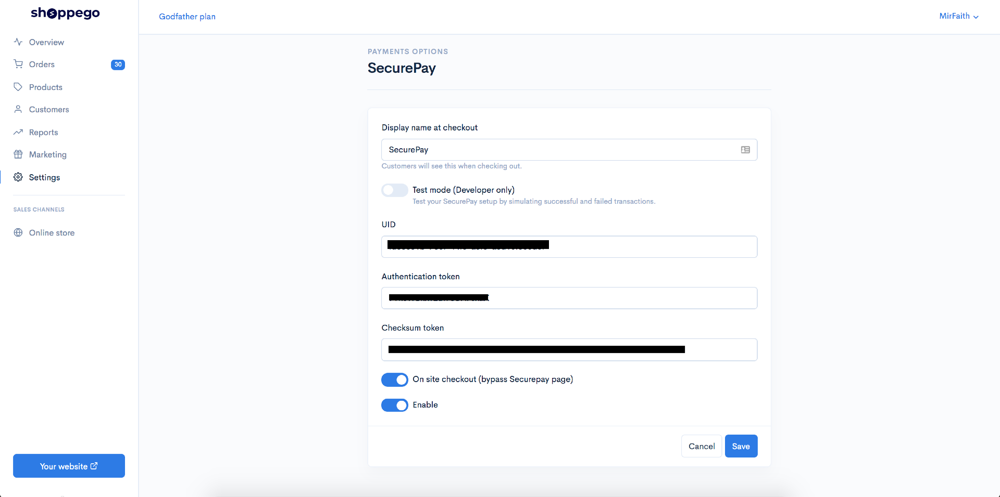

7\. Setelah selesai anda boleh klik **Save** untuk simpan setting tersebut.&#x20;


Sekiranya anda ingin **memulakan transaksi sebenar**, diminta untuk anda <mark style="color:red;">**mematikan**</mark> toggle **Test Mode** itu.


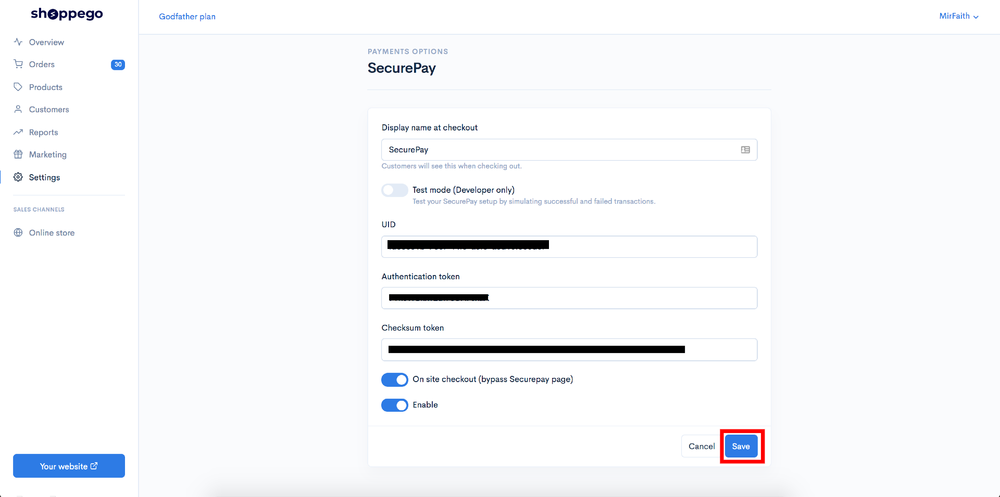

## Contoh di Website

Setelah selesai proses penetapan tersebut, anda boleh cuba membuat pembelian di website Shoppego anda untuk melihat hasilnya.

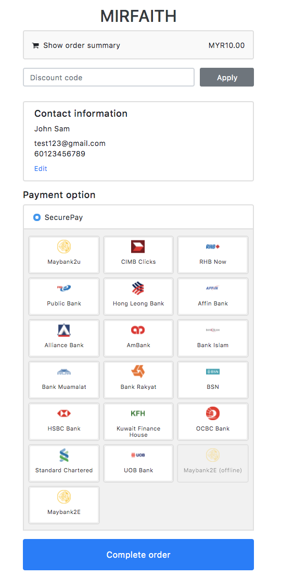

## Info Tambahan

 <mark style="color:red;">**Perhatian**</mark>: Jika anda ingin menggunakan **payment gateway Securepay** ini kepada **2 store** yang berbeza. Anda boleh **cipta 2 API key** di dalam akaun Securepay anda dan tetapkan details **API key** tersebut kepada setting payment gateway store anda.


Untuk memulakan penetapan ini, anda boleh ikut langkah penetapan ini :

1\. Log masuk ke akaun **Securepay** anda

2\. Klik pada **< >** **API**

3\. Klik pada butang **New API Key**

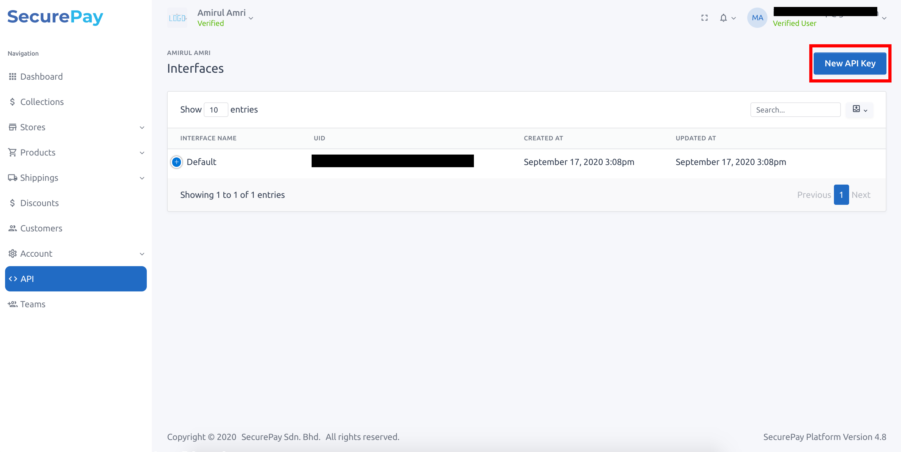

4\. Pada bahagian **Interface name** anda boleh masukkan nama untuk **API** tersebut supaya senang untuk anda monitor data tersebut. Sebagai contoh anda ingin menggunakan **API** tersebut untuk monitor store gadget.myshoppegram.com, jadi anda boleh letak diruangan itu gadget.myshoppegram.com.

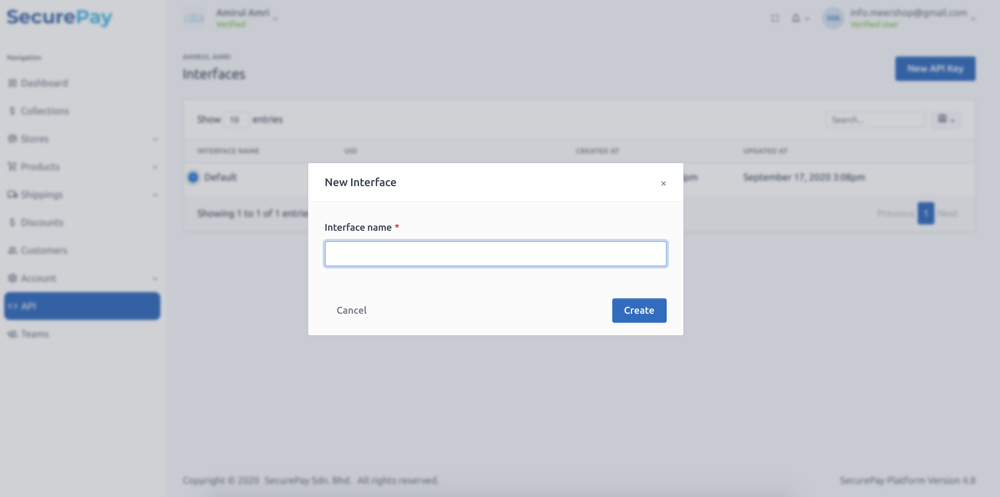

5\. Setelah selesai anda boleh klik **Save**

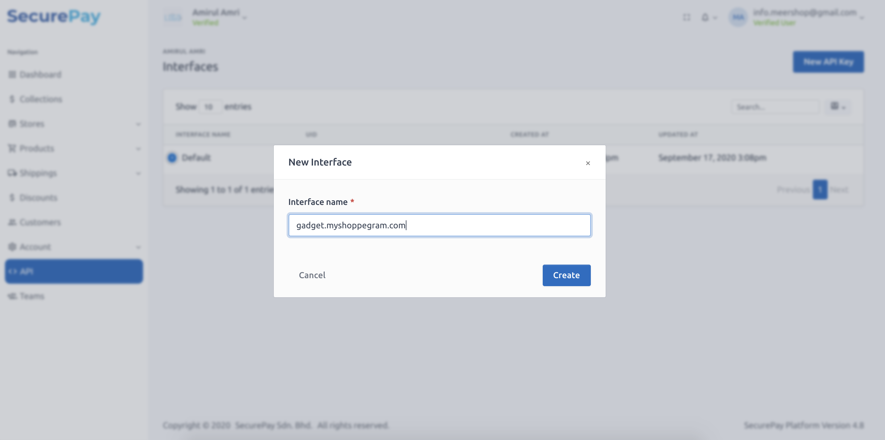

6\. Seterusnya, anda boleh klik pada API tersebut dan simpan maklumat yang anda perlukan untuk membuat tetapan di Shoppego pula.

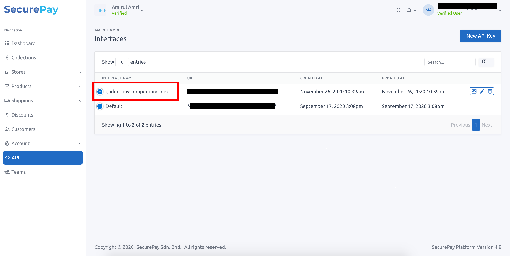
