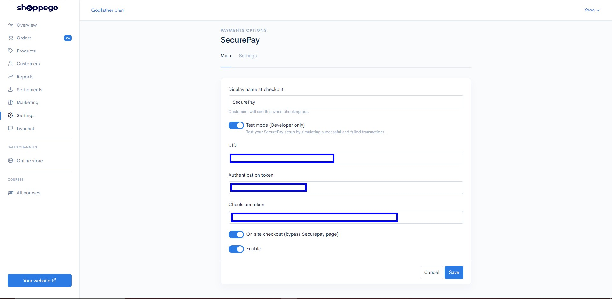
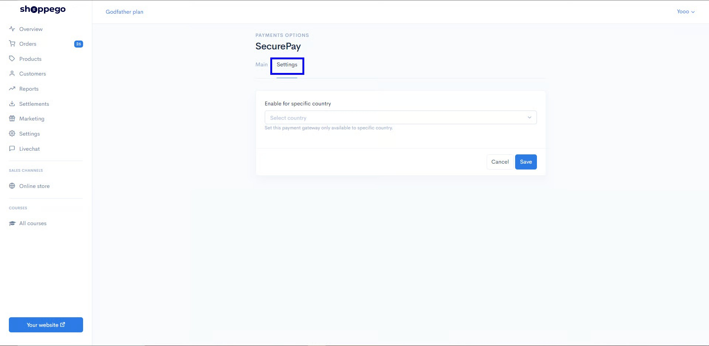
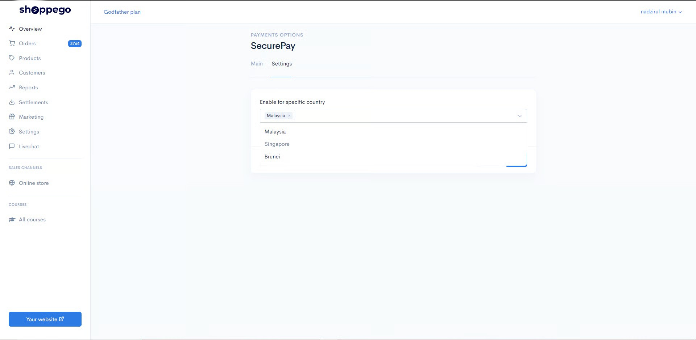

# Settings

Bahagian Settings pada Payment options adalah penetapan untuk **membenarkan negara yang terpilih sahaja** untuk menggunakan payment tersebut.


Features ini hanya boleh **digunakan pada produk fizikal** dan khas untuk <mark style="color:red;">**plan Ultimate**</mark> sahaja.


1. Log masuk ke dashboard Shoppego

2\. Klik pada **Settings**

3\. Klik pada **Payment options**

4\. Pilih mana-mana pilihan sistem payment gateway atau pembayaran yang anda ingin tambah penetapan ini dengan klik pada butang **Edit** pada ruangan mereka.&#x20;

 <mark style="color:red;">**Nota**</mark>: Untuk tutorial kali ini kami menggunakan **SecurePay.**


5\. Klik pada **Settings**

6\. Pilih **negara yang anda ingin benarkan payment tersebut digunakan** dan klik **Save**

