# Xendit

Bagi menggunakan Xendit sila pastikan anda **sudah cipta** terlebih dahulu **akaun Xendit.**


Anda perlu pastikan anda sudah:

* Mempunyai SSM/TIN
* Akaun bank semasa.



**Urusan pengesahan akaun, caj dan wang transaksi** adalah **diuruskan sepenuhnya oleh pihak Xendit.**


## Penetapan di Xendit


**Sebelum anda ikuti tutorial ini, pastikan akaun Xendit anda sudah di Verify terlebih dahulu dan pastikan anda tidak menggunakan Test account.**


Untuk lakukan integration payment gateway Xendit dengan Shoppego, anda perlu dapatkan **Secret API Key dan Webhook Verification Token. Anda juga perlu lakukan penetapan Webhook pada akaun Xendit anda.**\
\
Jika anda masih belum mendaftar akaun Xendit, anda boleh menggunakan link ini:\
[https://dashboard.xendit.co/register/1](https://dashboard.xendit.co/register/1)

### Dapatkan Secret API Key

1. Log masuk dalam akaun Xendit anda.

<figure>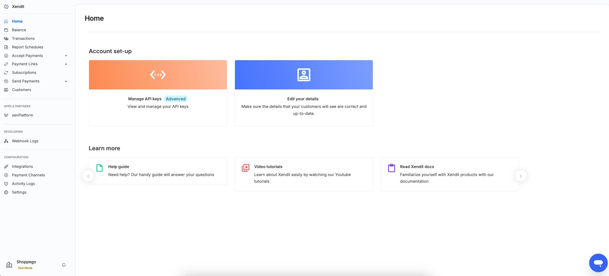<figcaption></figcaption></figure>

2. Klik pada butang/teks **Settings**

<figure>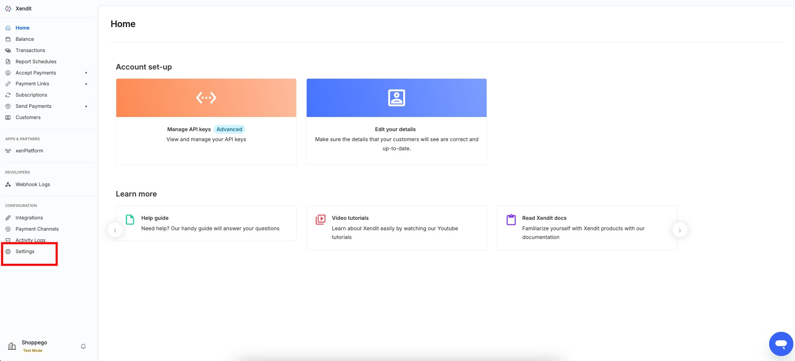<figcaption></figcaption></figure>

3. Klik pada butang/teks **API keys**

<figure>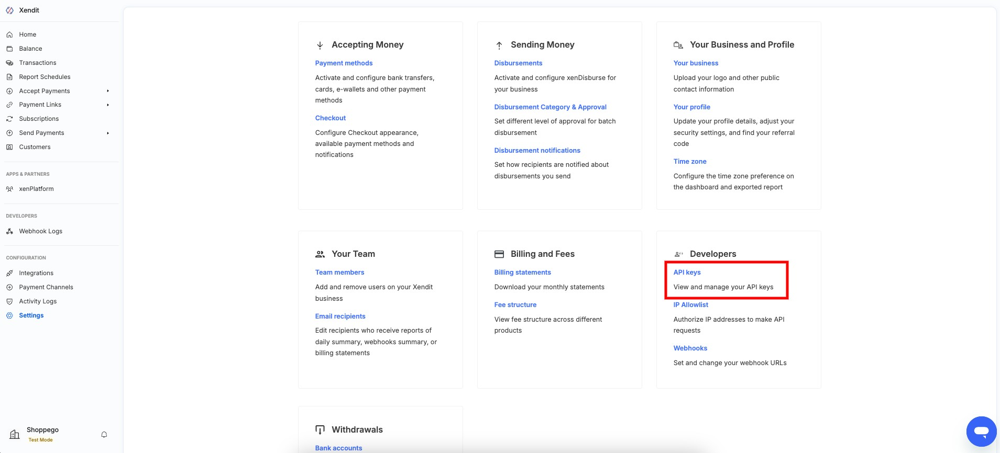<figcaption></figcaption></figure>

4. Kemudian, anda boleh **klik pada Generate secret key**

<figure>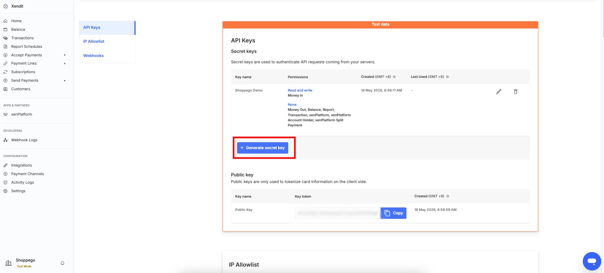<figcaption></figcaption></figure>

5. Anda boleh **masukkan nama Secret key anda sebagai rujukan** dan **tick penetapan yang lain seperti yang tertera pada gambar di bawah**.

<figure>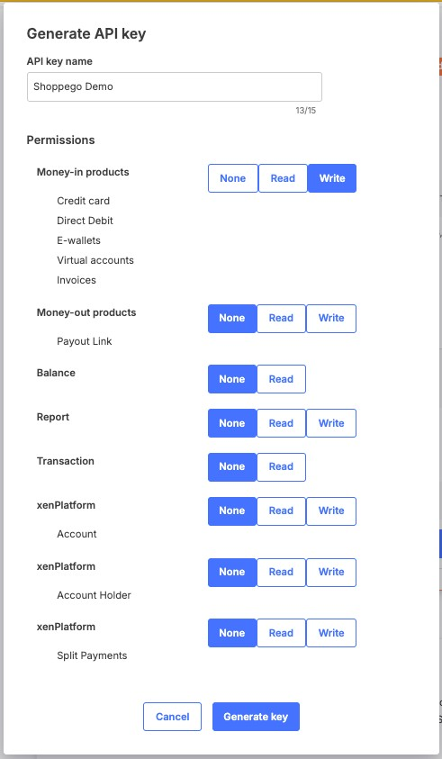<figcaption></figcaption></figure>

6. Setelah selesai klik **Generate key**

<figure>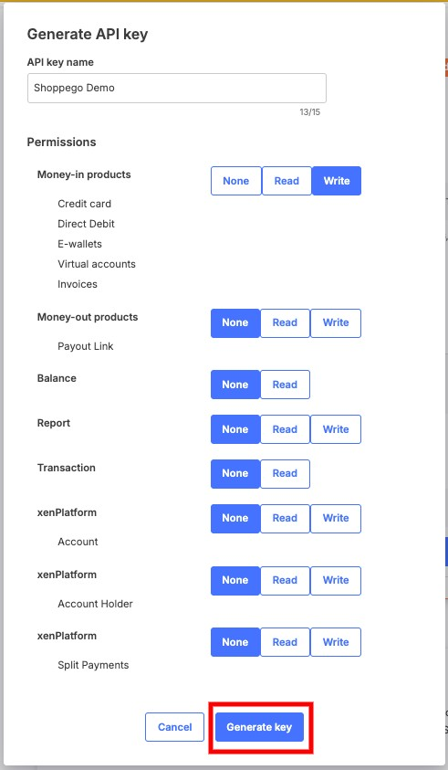<figcaption></figcaption></figure>

7. Kemudian, anda boleh **copy** dan **Save Secret key** anda itu untuk **digunakan pada penetapan di Shoppego**.

<figure>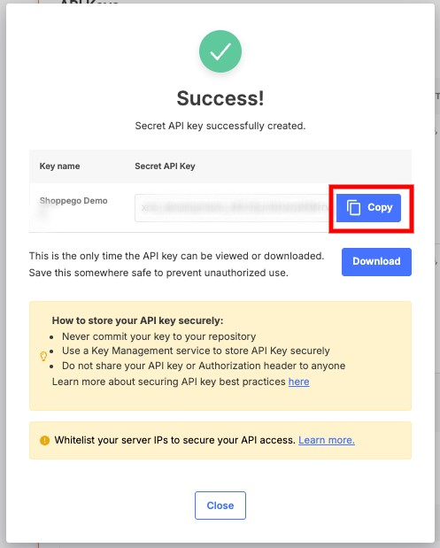<figcaption></figcaption></figure>

### Dapatkan Webhook Verification Token

1. Dari halaman **API Keys,** anda boleh klik pada butang/teks **Webhooks**

<figure>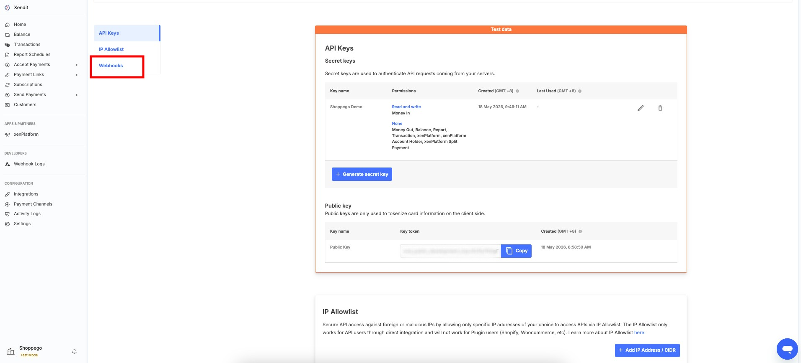<figcaption></figcaption></figure>

2. Kemudian, klik pada butang **View Webhook Verification Token**

<figure>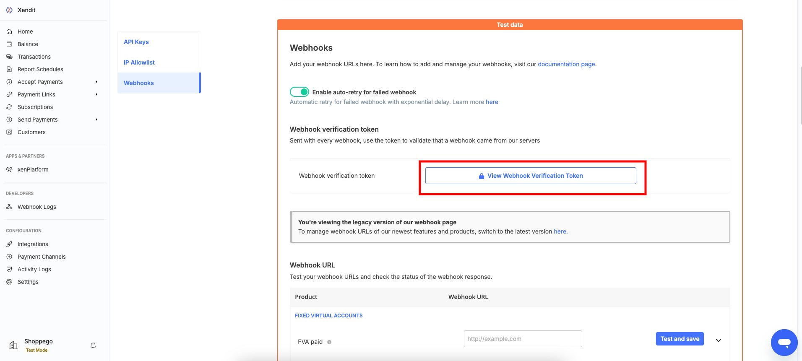<figcaption></figcaption></figure>

3. Seterusya, anda boleh **copy Webhook Verification Token** anda itu **untuk digunakan pada penetapan di Shoppego.**

<figure>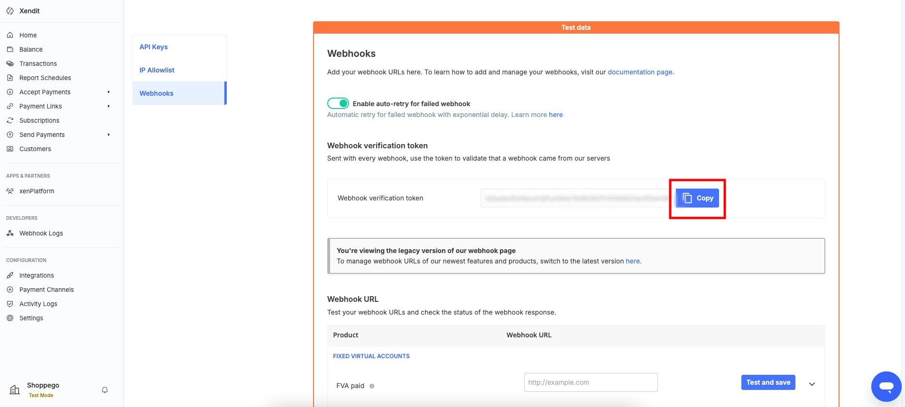<figcaption></figcaption></figure>

### Penetapan Webhook

#### Dapatkan Link Webhook

1. Log masuk ke dalam akaun Shoppego anda

<figure><figcaption></figcaption></figure>

2. Klik pada **Settings**

<figure><figcaption></figcaption></figure>

3. Klik pada **Payment options**

<figure><figcaption></figcaption></figure>

4. Klik **Activate/Edit** pada **Xendit**

<figure>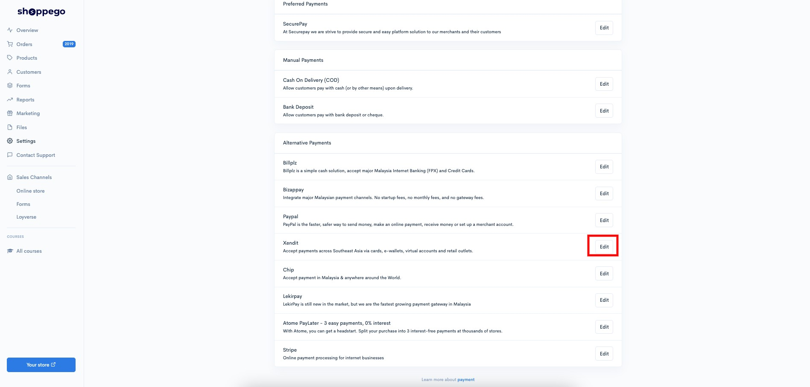<figcaption></figcaption></figure>

5. Kemudian, anda boleh **Copy Webhook URL** anda itu untuk **dimasukkan pada penetapan di Xendit**.

<figure>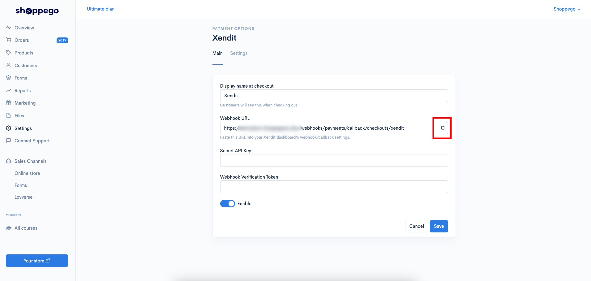<figcaption></figcaption></figure>

#### Masukkan Link Webhook di Xendit

1. Pada **halaman penetapan Webhooks**, anda boleh **skroll ke bawah** untuk **lihat penetapan** "**Invoices paid**". Anda boleh **masukkan Webhook URL** yang anda baru copy itu kedalam ruang penetapan tersebut.

<figure>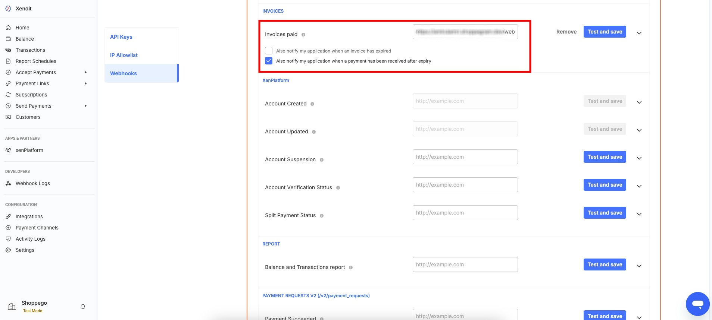<figcaption></figcaption></figure>

2. Setelah selesai, klik pada butang **Test and save**

<figure>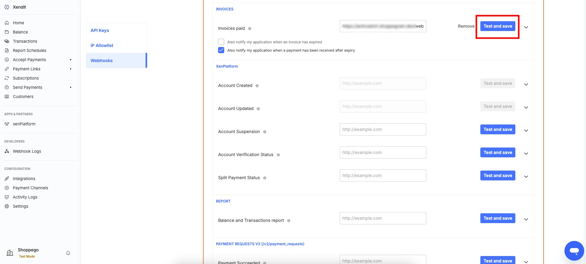<figcaption></figcaption></figure>

## Penetapan di Shoppego

1\. Log masuk ke dalam akaun Shoppego anda.

2\. Klik pada **Settings**

3\. Klik pada **Payment options**

4\. Jika anda belum aktifkan payment option untuk Xendit. Klik butang **Activate** pada bahagian **Alternative Payments** untuk Xendit. Jika anda sudah aktifkan payment option untuk Xendit klik butang **Edit.**

5\. Seterusnya akan keluar paparan seperti dibawah, anda boleh isi maklumat tersebut :

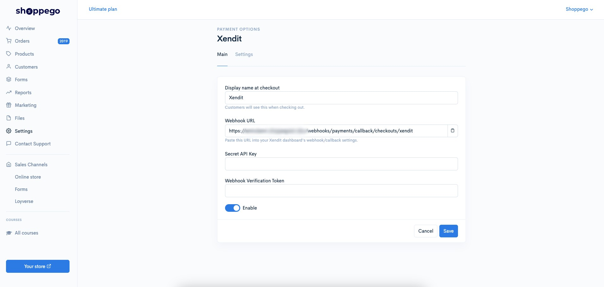

* **Display name at checkout : Masukkan nama payment yang anda inginkan (Contoh Xendit)**
* **Webhook URL :** **Hanya digunakan untuk anda copy bagi lakukan penetapan webhook di akaun Xendit anda.**
* **Secret API Key : Masukkan Secret API key yang anda sudah dapatkan di akaun Xendit anda.**
* **Webhook Verification Token : Masukkan Webhook Verification Token yang anda sudah dapatkan di akaun Xendit anda.**

6\. Setelah selesai pastikan anda sudah klik **Enable** dan klik button **Save**.

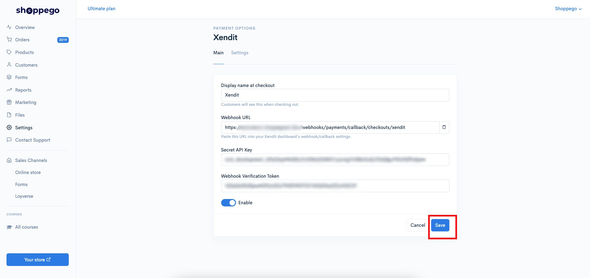

Setelah **Save** anda boleh membuat percubaan pembelian pada website anda untuk lihat payment option Xendit tersebut semasa checkout untuk penetapan yang anda baru tetapkan sebentar tadi.
