# Easyparcel

Penetapan ini mengandungi 3 bahagian iaitu:


Fungsi ini tersedia untuk **plan Premium** dan **Ultimate**.


* **Bahagian 1**: Di platform Easyparcel
* **Bahagian 2** : Di platform Shoppego
* **Bahagian 3** : Cara penggunaan


\*\*Untuk shipping provider Easyparcel anda **tidak boleh gunakan fungsi Pickup** semasa **proses Arrange shipment**.


## Bahagian 1 : Dapatkan API Key di Easyparcel

1. Pastikan anda sudah daftar akaun Easyparcel anda terlebih dahulu.&#x20;


Anda boleh daftar akaun anda di sini : <https://easyparcel.com/my/en/signup/>


2. Setelah anda berjaya daftar anda boleh lihat dashboard anda seperti paparan dibawah.

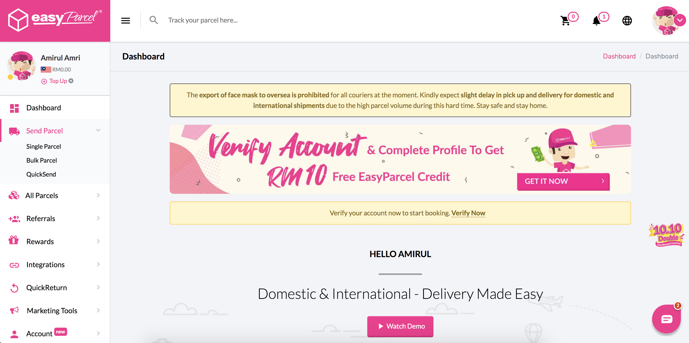

3. Untuk mendapatkan **Integration ID** anda boleh klik pada **Integrations** -> **Add New Store.**

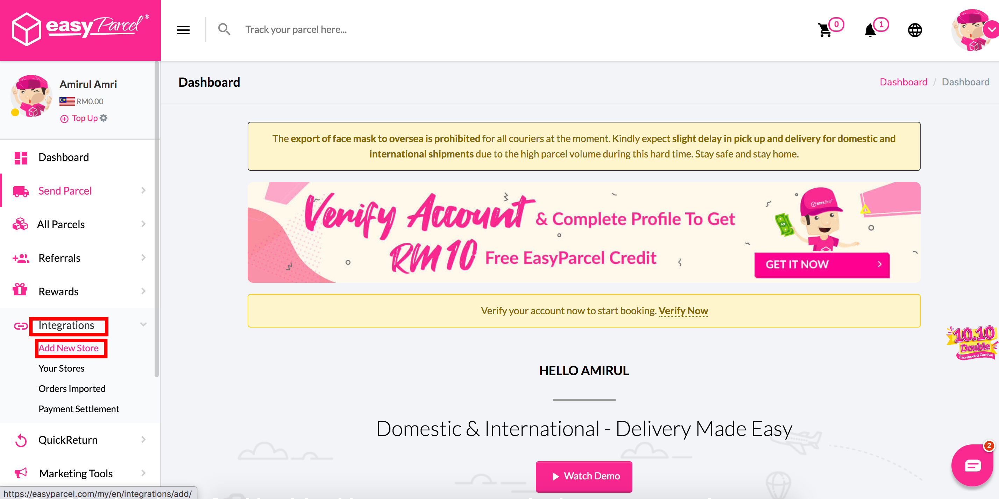

4. Anda akan dibawa ke halaman Integration tersebut. Di halaman tersebut anda boleh skrol kebawah untuk klik pada ikon **Shoppego.**

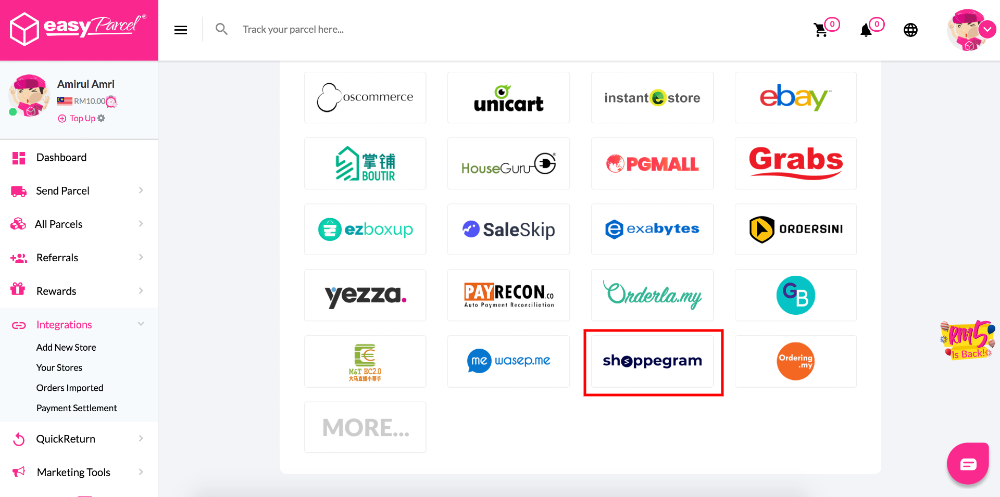

5. Seterusnya, di halaman yang sama anda akan diminta untuk masukkan maklumat seperti paparan dibawah.

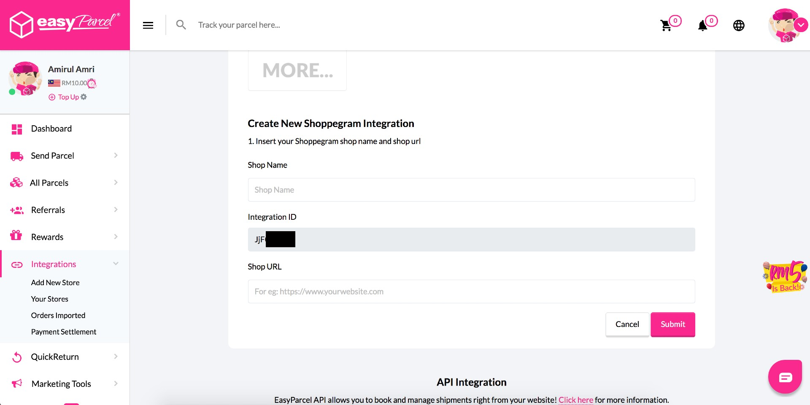

<table><thead><tr><th width="157">Ruangan</th><th>Penerangan</th></tr></thead><tbody><tr><td><strong>Shop Name</strong></td><td> Masukkan nama kedai Shoppego anda</td></tr><tr><td><strong>Integration ID</strong></td><td>Simpan teks dalam ruangan ini untuk dimasukkan pada penetapan integrasi Easyparcel anda di Shoppego pada ruangan API key nanti.</td></tr><tr><td><strong>Shop URL</strong></td><td>Masukkan link kedai Shoppego anda</td></tr></tbody></table>


Anda perlu **simpan Integration ID** tersebut untuk kegunaan langkah seterusnya.


6. Setelah anda masukkan kesemua maklumat tersebut, anda boleh klik **Submit.**

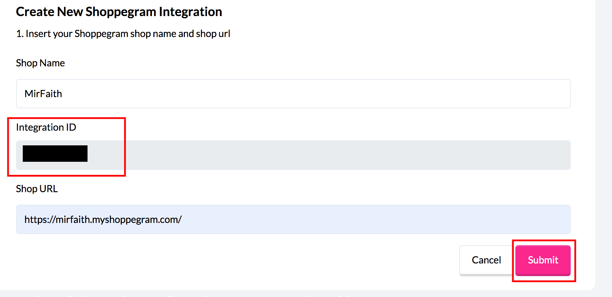

7. Setelah klik butang tersebut, anda akan dibawa kehalaman seperti paparan dibawah. Penetapan akaun Easyparcel anda sudah berjaya.

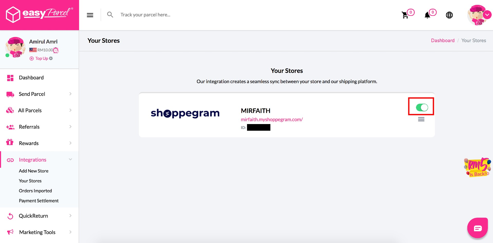

8. Anda perlu pastikan toggle pada penetapan anda bewarna hijau ia menandakan penetapan ini dalam keadaan aktif.

## **Bahagian 2 : Penetapan di Shoppego**

1. Log masuk ke **Dashboad Shoppego** -> **Settings** -> **Shipping Providers.**.&#x20;

<figure>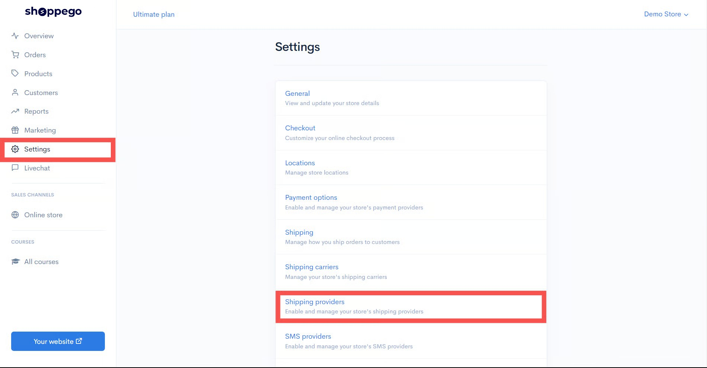<figcaption></figcaption></figure>

2\. Klik butang **Activate/Edit** pada ruangan **Shipping Provider Easyparcel.**

<figure>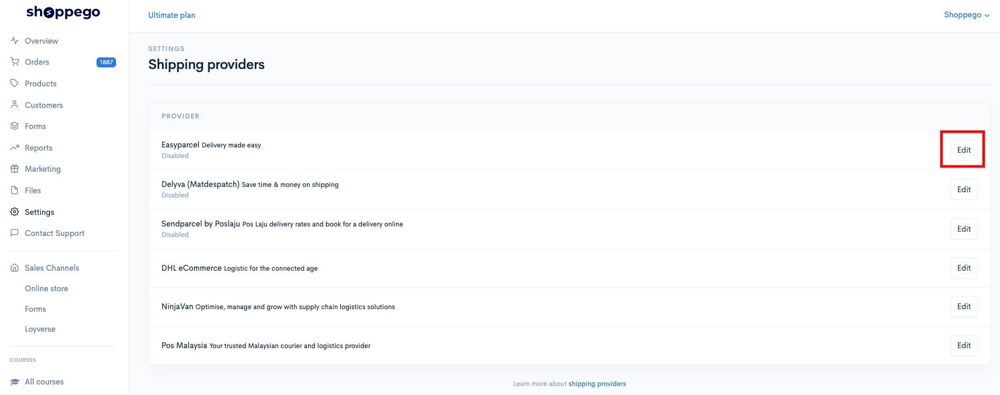<figcaption></figcaption></figure>

3. Masukkan **Integration ID** yang anda baru sahaja dapatkan pada [langkah di bahagian 1](easyparcel.md#bahagian-1-mendapatkan-api-key-di-easyparcel) sebelum ini. Anda boleh masukkan Integration ID tersebut dibahagian **API Key.**&#x20;


Anda juga boleh tick pada **Enable content** untuk pastikan dibahagian AWB anda terdapat nama produk yang dibeli oleh pelanggan anda.&#x20;


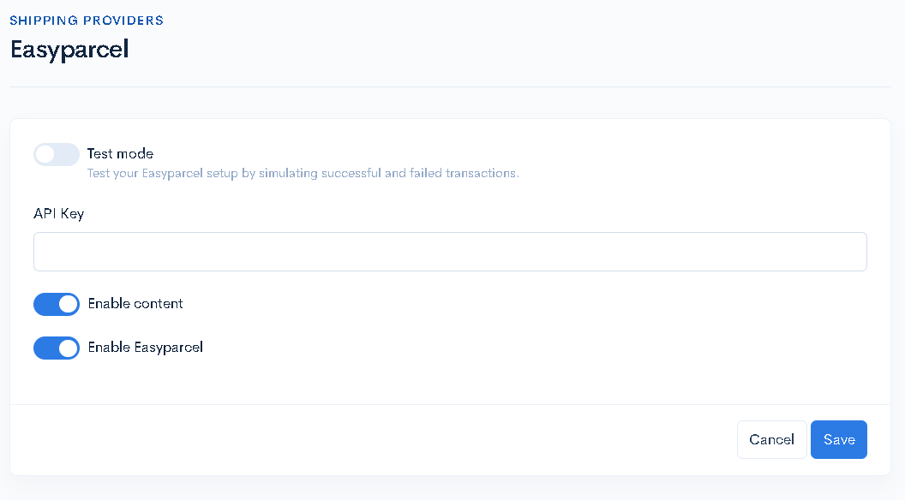

<table><thead><tr><th width="193">Ruang</th><th>Penerangan</th></tr></thead><tbody><tr><td><strong>Test mode</strong></td><td>Nyahtanda penetapan ini untuk pastikan anda boleh gunakan shipping provider Easyparcel. Penetapan ini boleh digunakan jika anda ialah developer.</td></tr><tr><td><strong>API Key</strong></td><td>Anda boleh masukkan <strong>Integration ID</strong> yang anda sudah dapatkan dari akaun Easyparcel anda.</td></tr><tr><td><strong>Enable content</strong></td><td>Anda boleh aktifkan toggle ini untuk pastikan details produk yang dibeli oleh pelanggan berada pada AWB order tersebut.</td></tr><tr><td><strong>Enable Easyparcel</strong></td><td>Anda perlu aktifkan toggle ini untuk pastikan anda boleh gunakan shipping provider Easyparcel ini.</td></tr></tbody></table>

4. Setelah anda masukkan kesemua data tersebut, anda boleh klik **Save** dan proses penetapan shipping provider Easyparcel anda kini sudah berjaya.

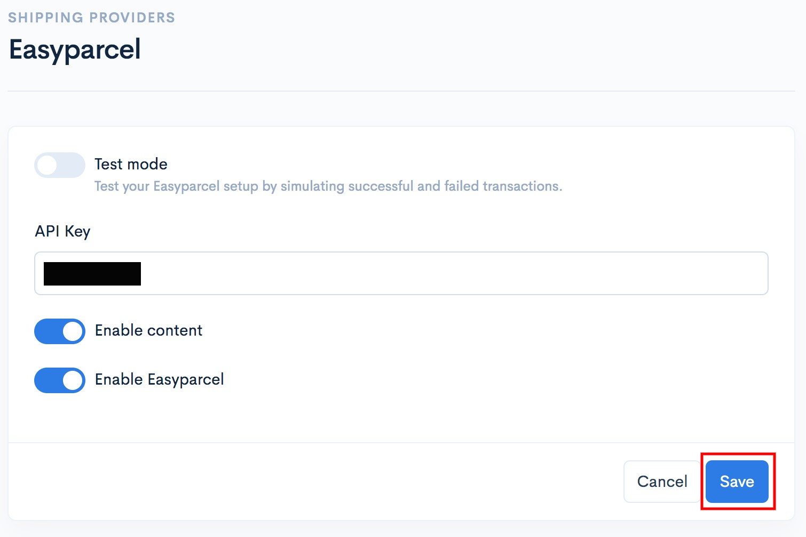

## Bahagian 3 : Cara Penggunaan

1. Anda boleh pergi semula pada bahagian **Dashboard Shoppego** anda.

2. Klik pada **Orders.**

3. Klik pada **order** yang anda ingin arrange shipment tersebut.

4. Klik pada butang **Arrange shipment.**

5. Klik pada **Create shipment.**

6. Seterusnya anda akan dapat lihat modal/pop up seperti paparan dibawah.

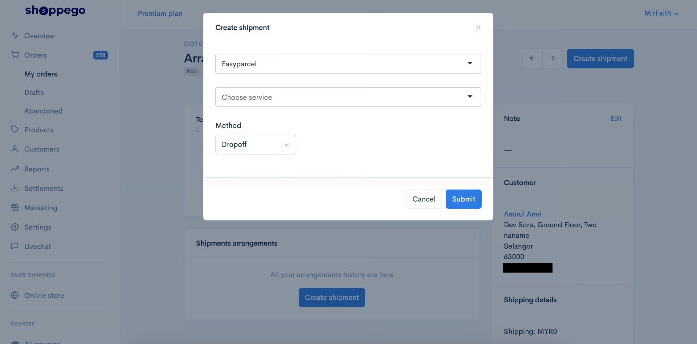

7. Anda boleh pilih Shipping courier yang anda ingin gunakan **pada ruangan Choose service tersebut.**

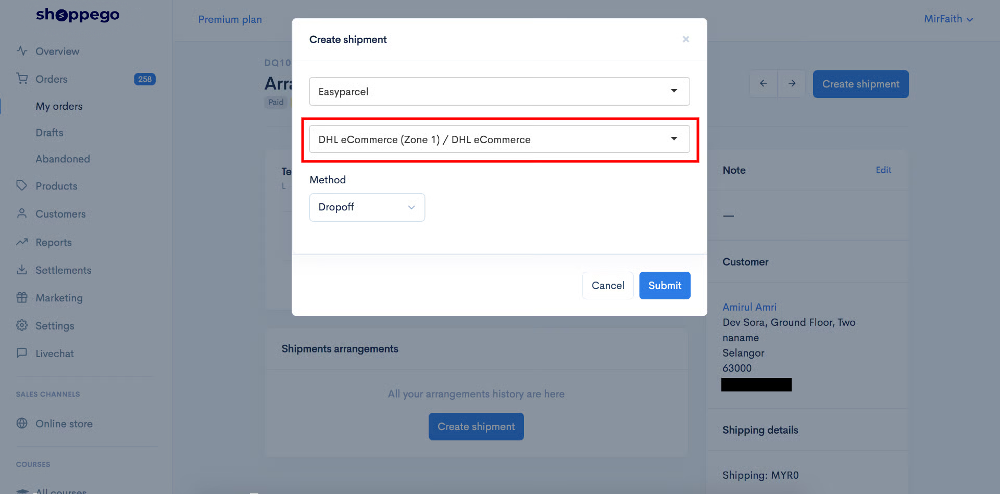

8. Setelah selesai klik **Submit.**

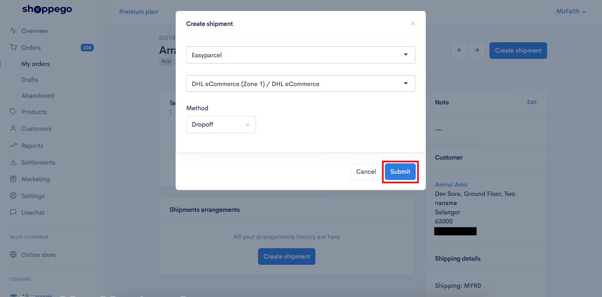

9. Jika anda ingin hantar nombor tracking kepada pelanggan tersebut, anda boleh klik pada butang **Add tracking** tersebut.

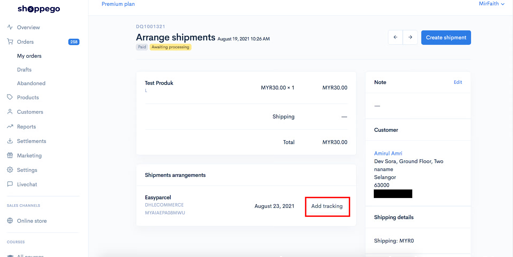

## Info Tambahan

Untuk plan **Ultimate**, penetapan shipping provider anda akan ada 2 input tambahan untuk anda tetapkan.&#x20;

Anda boleh rujuk paparan dibawah untuk maklumat yang anda boleh isikan dan cara penetapan.

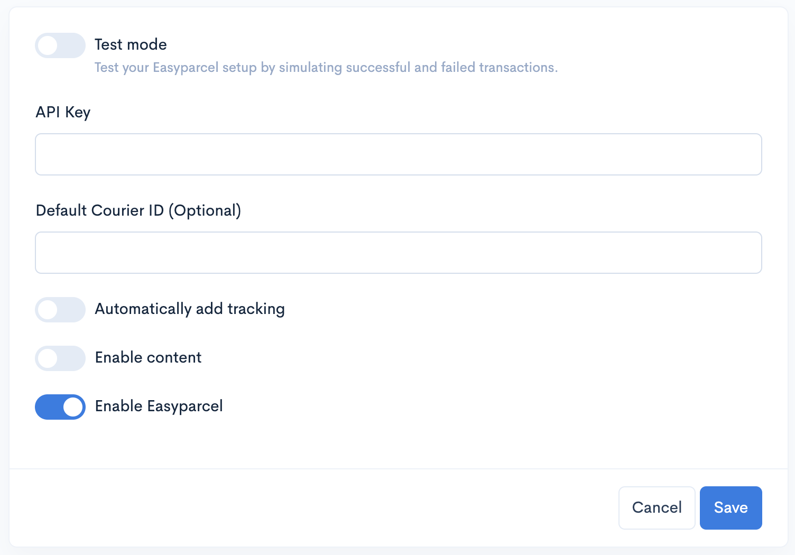

<table data-header-hidden><thead><tr><th width="232.6999364904824"></th><th></th></tr></thead><tbody><tr><td></td><td></td></tr><tr><td><strong>Default Courier</strong> </td><td>
Anda boleh masukkan Courier ID untuk shipping courier yang anda ingin gunakan untuk proses penghantaran order pelanggan tersebut. Antara Courier ID yang anda boleh gunakan : 
<ol><li>EP-CR0X untuk SF Global Express</li><li>EP-CR0B untuk EMS (Pos Malaysia Berhad)</li><li>EP-CR0A untuk Poslaju National Courier</li><li>EP-CR05 untuk Skynet Express (M) Sdn. Bhd.</li><li>EP-CR0Z untuk CJ Century Logistics Sdn Bhd.</li><li>EP-CR0DE untuk ZTO</li><li>EP-CR0H untuk ABX Express (M) Sdn Bhd.</li><li>EP-CR0DP untuk J&#x26;T Express (Malaysia) Sdn. Bhd.</li></ol></td></tr><tr><td><strong>Auto add tracking code</strong></td><td>Anda boleh aktifkan toggle ini untuk pastikan semasa anda Arrange shipment bagi order pelanggan tersebut, <strong>tracking number bagi order tersebut akan auto dihantar kepada pelanggan</strong> anda <strong>tanpa anda perlu klik pada butang Add tracking.</strong></td></tr></tbody></table>
