# Myparcel Asia

Penetapan ini mengandungi 3 Bahagian iaitu :

* **Bahagian 1**: Di platform MyparcelAsia (MPA)
* **Bahagian 2**: Di platform Shoppego
* **Bahagian 3**: Cara Fulfill Order

## Bahagian 1: Penetapan MyParcelAsia (MPA)

Pastikan anda sudah mempunyai akaun MPA.


[Klik sini](http://myparcelasia.com/) untuk pendaftaran [MyParcelAsia](https://myparcelasia.com/) . Pendaftaran MPA adalah **percuma**.


1\. Log masuk ke akaun MPA anda. Di panel sebelah kiri, klik pada **Integrations -> API Docs.**

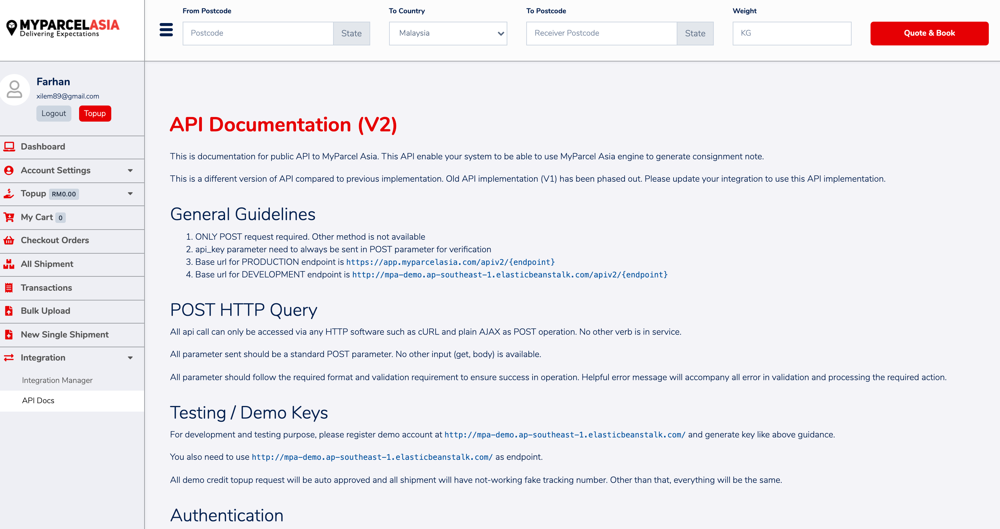

2\. Skrol ke bawah sehingga bahagian **Authentication.**&#x50;ada bahagian Authentication ini klik butang **Create New** yang bewarna hijau. Seterusnya masukkan singkatan untuk produk anda pada kotak **Label.** Klik butang **Submit.**

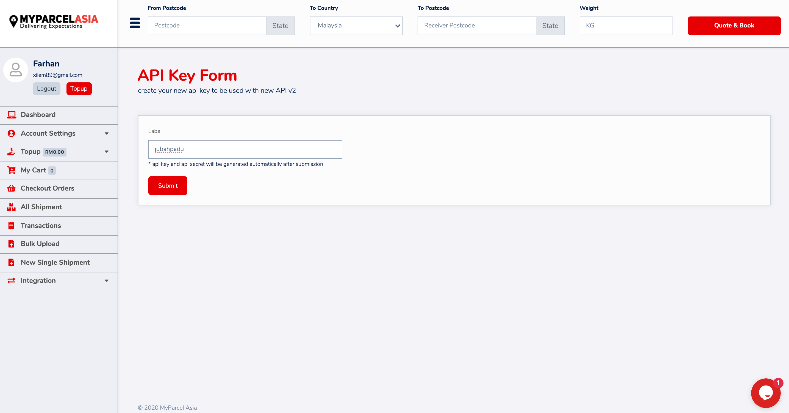

3\. Pada bahagian **Authentication** akan terbit satu **API key** yang baru untuk digunakan. Key dan secret ini adalah gabungan huruf dan nombor secara rawak untuk digunakan di Shoppego.\
\
Pastikan anda tidak memaparkan API key dan Secret ini di mana-mana medium online.\
\
Simpan API KEY dan API SECRET ini.

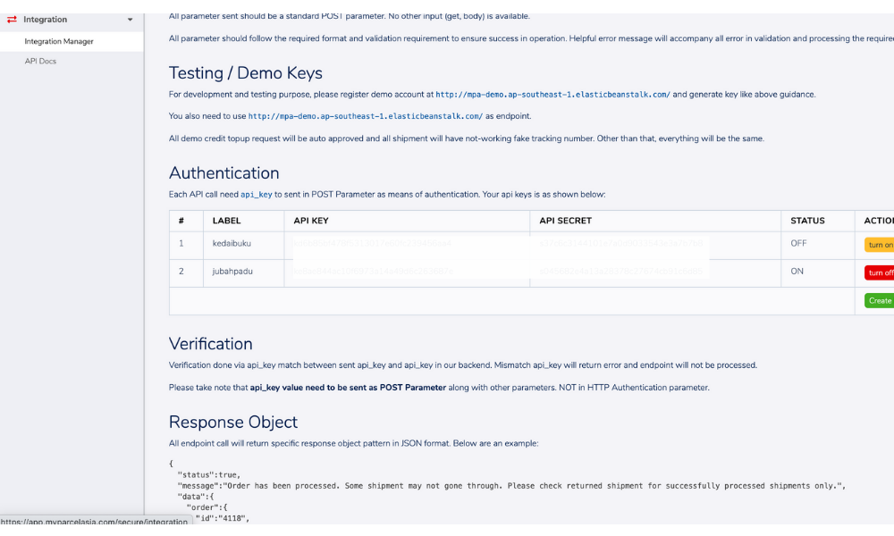

## Bahagian 2: Penetapan di Shoppego

1\. Seterusnya terus log masuk ke dashboad Shoppego anda

2\. Klik **Settings**

3\. Klik **Shipping Providers**

4\. Klik pada butang **Edit/Activate** untuk Myparcelasia.

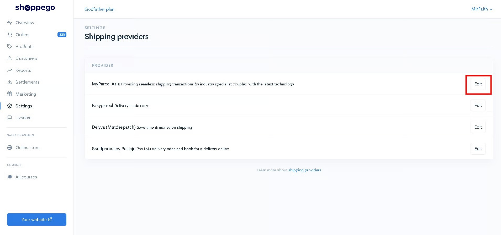

5\. Seterusnya anda akan dapat lihat paparan seperti dibawah. Anda boleh masukkan **API KEY** dan **API SECRET** yang telah di dapatkan dari website MPA sebentar tadi.

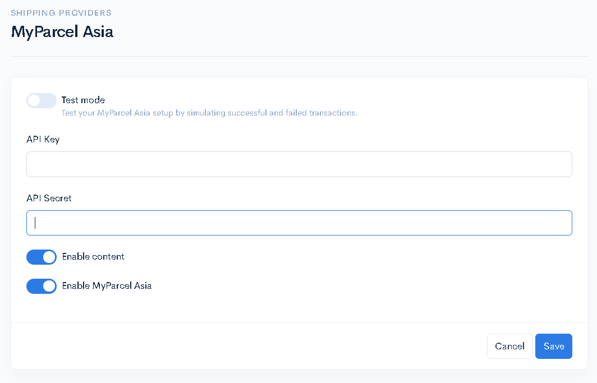

|                          |                                                                                                                                                             |
| ------------------------ | ----------------------------------------------------------------------------------------------------------------------------------------------------------- |
| **Test mode**            | Anda boleh untick penetapan ini untuk pastikan anda boleh gunakan shipping provider Myparcel Asia. Penetapan ini boleh digunakan jika anda ialah developer. |
| **API Key**              | Anda boleh masukkan API key yang anda sudah dapatkan dari akaun Myparcel Asia anda.                                                                         |
| **API Secret**           | Anda boleh masukkan API secret yang anda sudah dapatkan dari akaun Myparcel Asia anda.                                                                      |
| **Enable content**       | Anda boleh aktifkan toggle ini untuk pastikan details produk yang dibeli oleh pelanggan berada pada AWB order tersebut.                                     |
| **Enable MyParcel Asia** | Anda perlu aktifkan toggle ini untuk pastikan anda boleh gunakan shipping provider MyParcel Asia ini.                                                       |

6\. Setelah anda selesai membuat penetapan yang anda inginkan, anda boleh klik butang **Save**

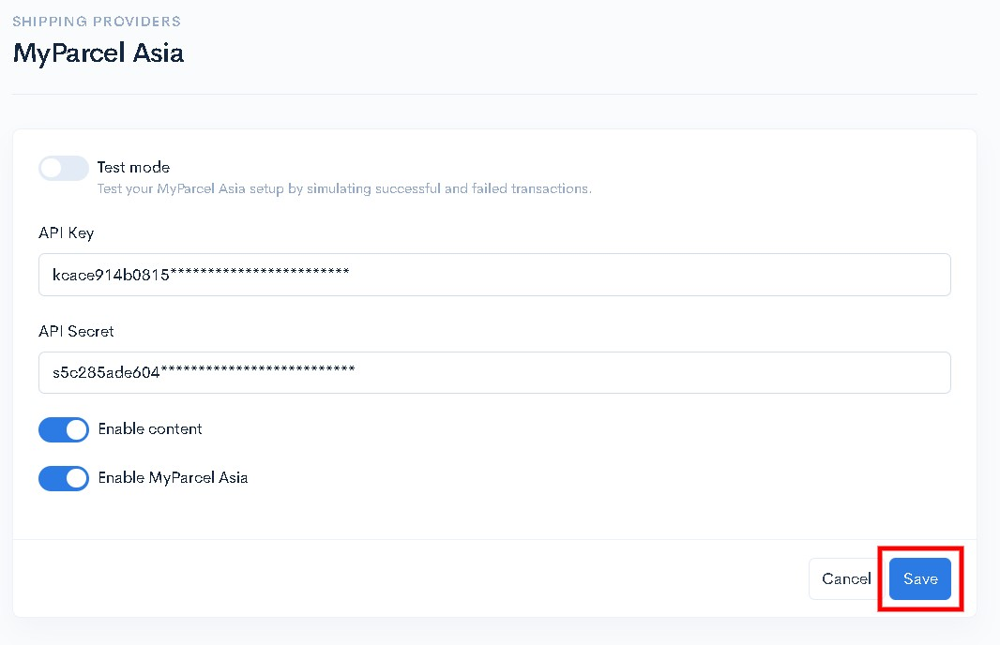

Kini Shoppego anda telah siap di link kan dengan platform MPA. **Pastikan akaun MPA anda mempunyai kredit untuk mula gunakannya.**

## Bahagian &#x33;**:** Cara Fulfill Order

Bahagian ini akan ditunjukkan cara-cara untuk fulfill order supaya terus dapat generate airwaybill di platform MyParcel Asia tanpa perlu log masuk, hanya menggunakan platform Shoppego sahaja.\
\
1\. Log masuk ke dashboard Shoppego pergi ke **Settings** -> klik tab **Orders** di panel kiri.

Pilih dan klik pada mana-mana order yang hendak dibuat penghantaran menggunakan MPA dan paparan akan keluar seperti dibawah.\
\
4\. Klik butang **Arrange Shipment**

5\. Klik butang **Create Shipment**

6\. Klik untuk pilihan courier anda dan terus klik butang **Submit**

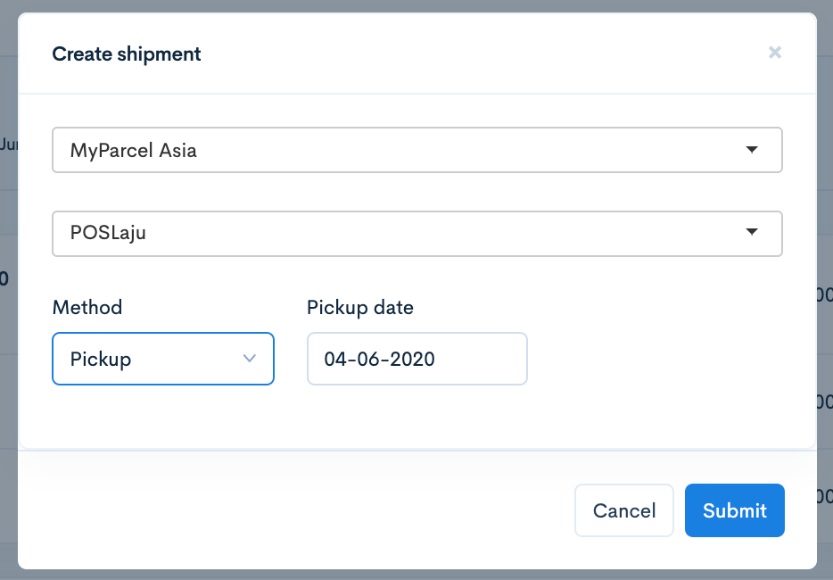

Pada order tersebut anda akan dapat lihat shipment yang telah tersedia.\
\
Order anda juga akan mendapat tracking number seperti gambar dibawah.\
\
Ini bermaksud, kini order anda hanya perlu menunggu kenderaan dari courier untuk mengambilnya.\
\
Ketika ini juga satu AWB (Airwaybill) terhadap order ini telah pun dijana secara automatik ini bermaksud anda hanya perlu print sahaja AWB ni dari platform Myparcel Asia.\
Sangat mudah!

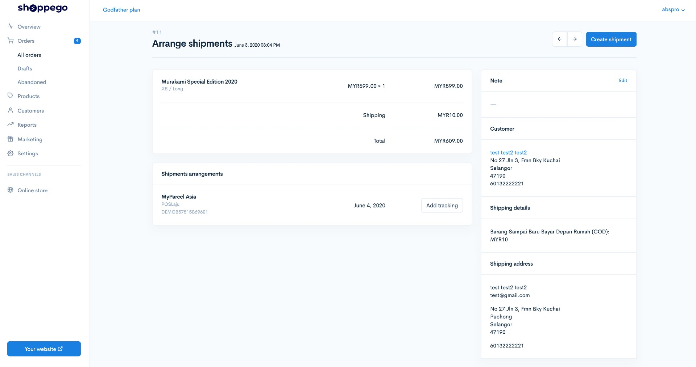

Update Tracking kepada pelanggan setelah pihak courier datang mengambil barang klik pada **Add Tracking** dan klik butang **Save** sekiranya maklumat yang dipaparkan adalah betul.

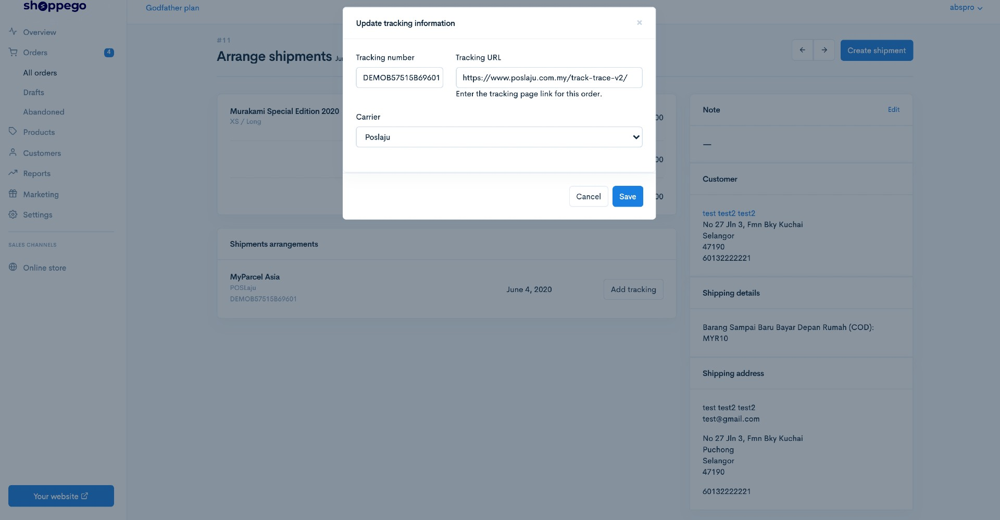

Selepas butang Save ditekan ini bermakna pelanggan anda akan mendapat email tentang nombor tracking mereka secara automatik dari sistem Shoppego.\
\
Nombor tracking ini juga akan keluar di sebelah kanan tab order selepas di save.

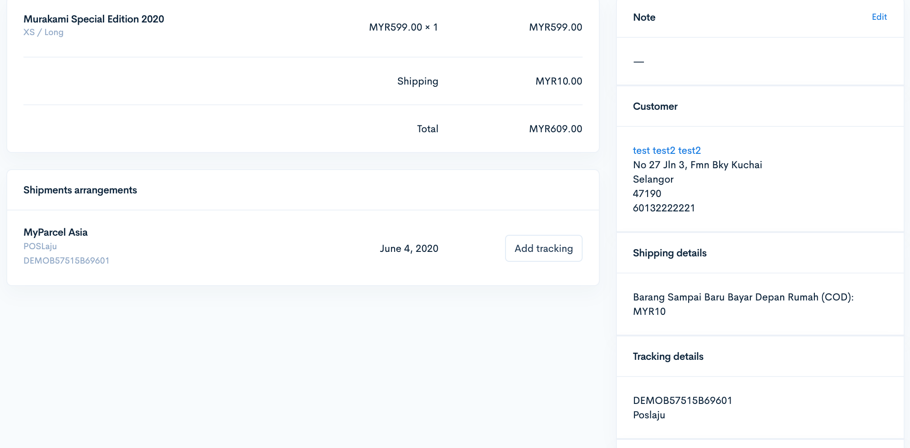

Anda juga boleh perhatikan pada orders list untuk lihat bahawa order tersebut telah diletakkan tracking terhadapnya.\
\
Akan keluar butang ikon i untuk anda periksa secara pantas tracking number order tersebut di dalam ruangan **Fulfillment**.

## Info Tambahan

Untuk plan **Ultimate**, penetapan shipping provider anda akan menjadai seperti paparan dibawah. Anda akan mempunyai 2 input tambahan yang anda boleh tetapkan.

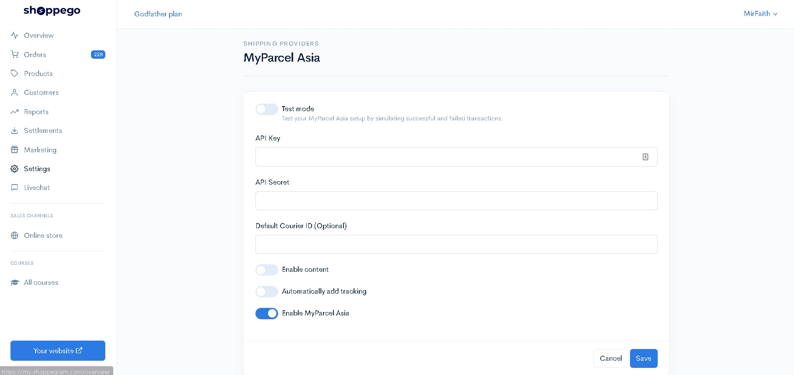

<table data-header-hidden><thead><tr><th width="191"></th><th width="557"></th></tr></thead><tbody><tr><td><strong>Default Courier ID (Optional)</strong></td><td>
Anda boleh masukkan Courier ID untuk shipping courier yang anda ingin gunakan untuk proses penghantaran order pelanggan tersebut. Antara Courier ID yang anda boleh gunakan :
<ol><li>poslaju</li><li>nationwide</li><li>jnt</li><li>dhle</li><li>cjc</li><li>aramex</li></ol></td></tr><tr><td><strong>Automatically add tracking</strong></td><td>Anda boleh aktifkan toggle ini untuk pastikan semasa anda Arrange shipment bagi order pelanggan tersebut, tracking number bagi order tersebut akan auto dihantar kepada pelanggan anda tanpa anda perlu klik pada butang Add tracking.</td></tr></tbody></table>
