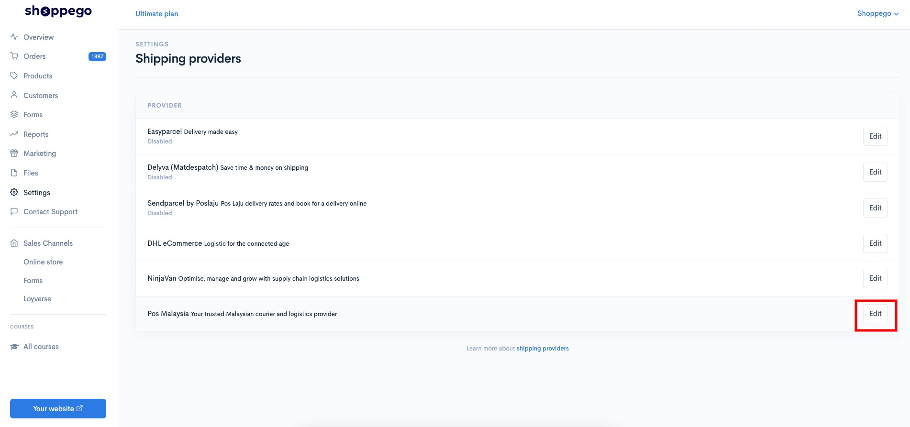
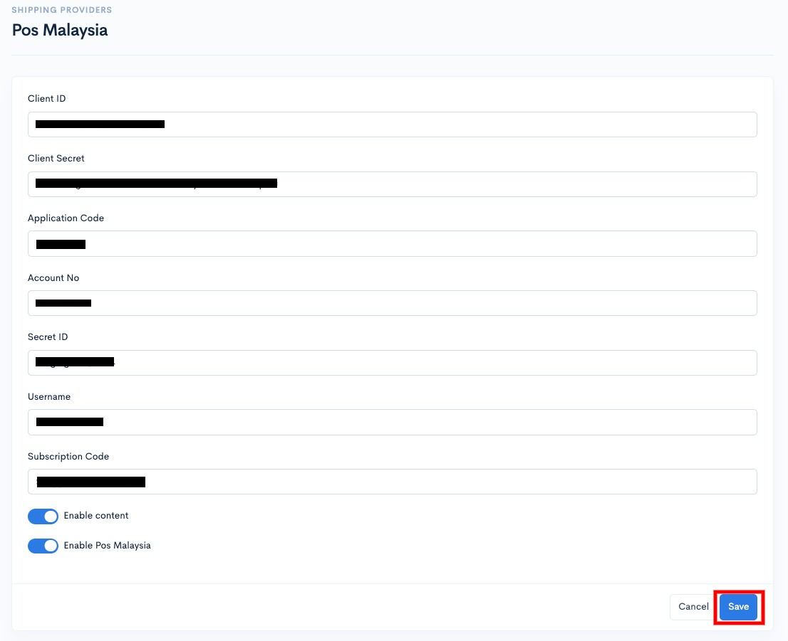
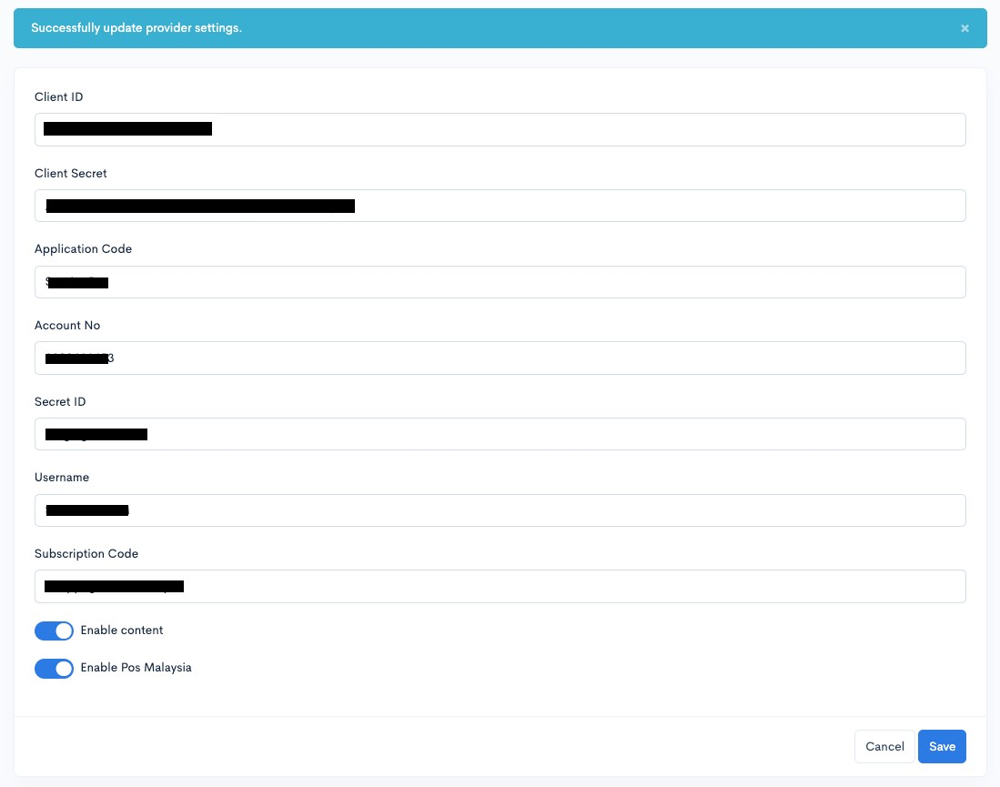
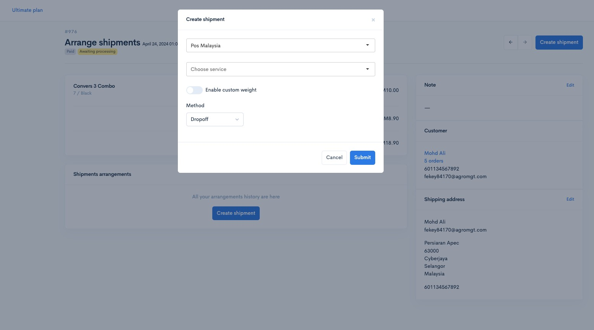
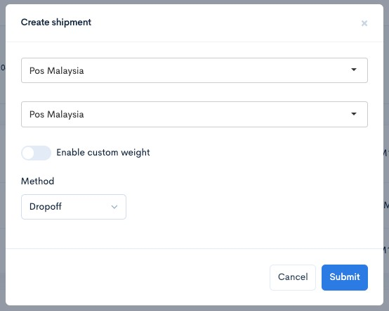
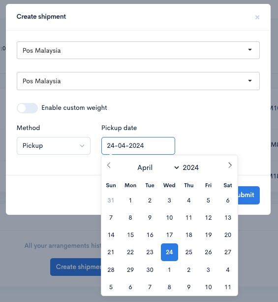
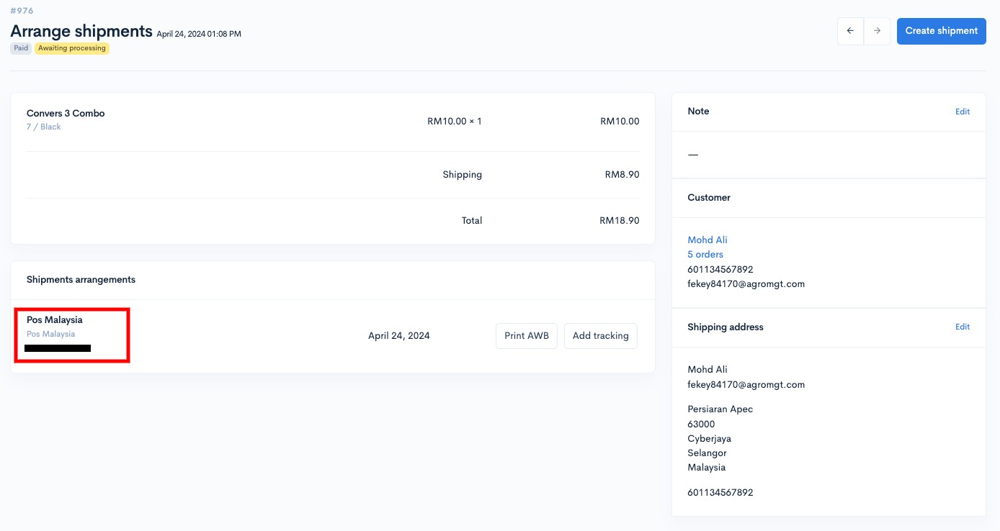

# Pos Malaysia


Fungsi ini tersedia untuk **plan Premium** dan **Ultimate** sahaja.


Untuk makluman, bagi penetapan integration ini, anda perlu mempunyai:

* Application Code
* Account No
* Secret ID
* Username


**Kesemua maklumat diatas ini anda boleh dapatkan dengan berhubung dengan sales/akaun manager Pos Malaysia anda.**


Setelah anda mempunyai kesemua maklumat yang diperlukan untuk integration tersebut, anda boleh ikuti langkah dibawah untuk tetapkan ia di akaun Shoppego anda.

1. Log masuk akaun Shoppego anda.

<figure><figcaption></figcaption></figure>

2. Klik pada **Settings**

<figure><figcaption></figcaption></figure>

3. Klik pada **Shipping provider**

<figure><figcaption></figcaption></figure>

4. Klik **Edit/Activate** pada **shipping provider Pos Malaysia**

<figure><figcaption></figcaption></figure>

5. Kemudian, anda boleh masukkan kesemua maklumat itu diruangan yang tersedia dan klik **Save**.

<table><thead><tr><th width="193">Ruang</th><th>Penerangan</th></tr></thead><tbody><tr><td><strong>Application Code</strong></td><td>Anda boleh masukkan <strong>Application Code</strong> yang anda sudah dapatkan dari sales/akaun manager Pos Malaysia anda.</td></tr><tr><td><strong>Account No</strong></td><td>Anda boleh masukkan <strong>Account No</strong> yang anda sudah dapatkan dari sales/akaun manager Pos Malaysia anda.</td></tr><tr><td><strong>Secret ID</strong></td><td>Anda boleh masukkan <strong>Secret ID</strong> yang anda sudah dapatkan dari sales/akaun manager Pos Malaysia anda.</td></tr><tr><td><strong>Username</strong></td><td>Anda boleh masukkan <strong>Username</strong> yang anda sudah dapatkan dari sales/akaun manager Pos Malaysia anda.</td></tr><tr><td><strong>Enable content</strong></td><td>Anda boleh aktifkan toggle ini untuk pastikan details produk yang dibeli oleh pelanggan berada pada AWB order tersebut.</td></tr><tr><td><strong>Enable Pos Malaysia</strong></td><td>Anda perlu aktifkan toggle ini untuk pastikan anda boleh gunakan shipping provider Pos Malaysia ini.</td></tr></tbody></table>

<figure><figcaption></figcaption></figure>

6. Setelah selesai kini proses penetapan shipping provider Pos Malaysia anda kini sudah berjaya.

<figure><figcaption></figcaption></figure>

## **Cara Fulfill Order**

Tutorial penetapan pada bahagian untuk cara urus order bagi menjana Airway Bill di platform Pos Malaysia tanpa perlu log masuk dan hanya menggunakan platform Shoppego sahaja.

1. Log masuk ke **Dashboard Shoppego** -> **Orders** di panel kir&#x69;**.**&#x20;

2. Pilih dan **klik** pada **order** yang anda ingin buat penghantaran menggunakan Pos Malaysia dan paparan akan keluar seperti dibawah. Klik butang **Arrange shipment.**

3. Tekan butang **Create Shipment** bewarna biru di sebelah penjuru kanan.

4\. Seterusnya satu popup akan keluar, anda boleh klik pada **Select Shipment Provider** dan pilih **Pos Malaysia.** Kemudian klik pada **Choose Services** dan klik pada mana-mana courier service yang anda mahu gun&#x61;**.** Harga telah ditentukan mengikut alamat yang ada pada order.&#x20;

5\. Seterusnya klik pada method dan pilih **Dropoff** atau **Pickup.**


**Method** :&#x20;

* **Dropoff -** Anda sendiri akan pergi ke pejabat pos berhampiran dan hantarkan barang.&#x20;
* **Pickup** - Pihak courier akan menghantar kenderaan untuk mengambil barang yang telah di pesan di alamat yang telah ditetapkan pada penetapan Location anda.
  


Biasanya Method **Pickup** akan dipilih bagi memudahkan para penjual.&#x20;


6. Apabila **Method Pickup** dipilih, **jadual** akan dipaparkan untuk pilihan tarikh pengambilan oleh pihak courier. Klik pada tarikh yang anda mahukan dan kemudian klik butang **Submit**. Rujuk gambar dibawah.&#x20;

<figure><figcaption></figcaption></figure>

7. Setelah klik butang **Submit**, order anda akan automatik mendapat tracking number seperti gambar dibawah.&#x20;


Satu **Airwaybill (AWB)** terhadap order ini telah pun **dijana secara automatik** dan anda hanya perlu **cetak AWB ini.**


<figure><figcaption></figcaption></figure>

Setelah proses **Add Shipment** dibuat, semak di dalam Dashboard Pos Malaysia untuk pastikan maklumat yang dipaparkan adalah sama.&#x20;
