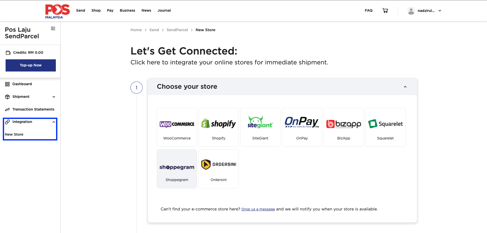
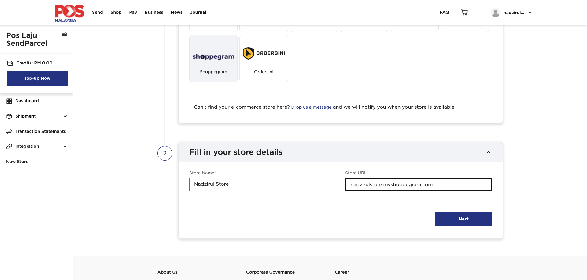
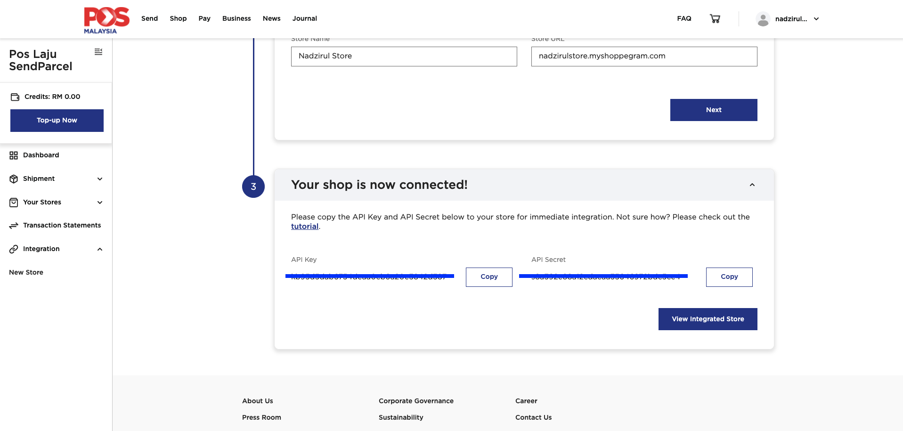
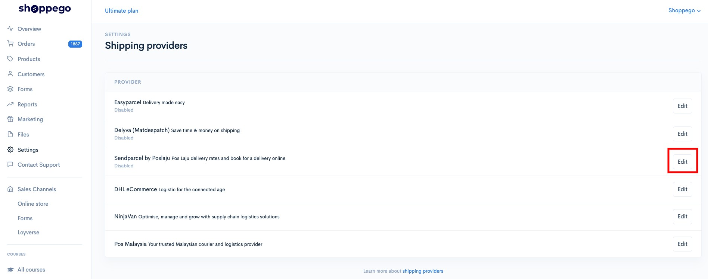
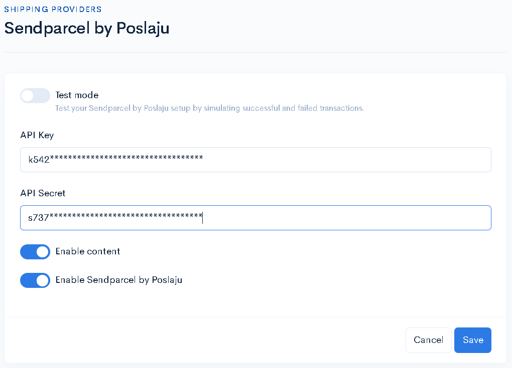
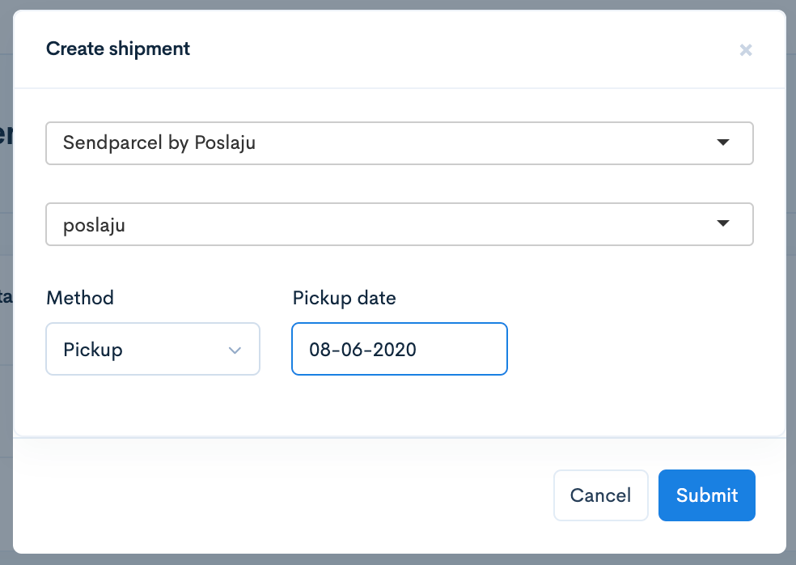
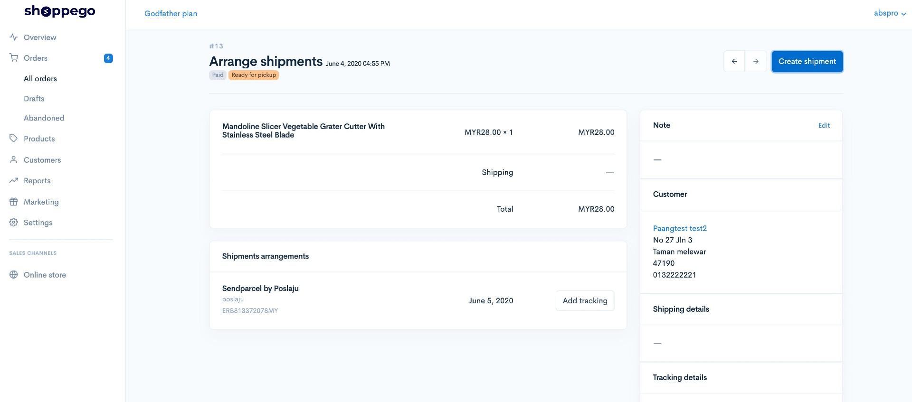
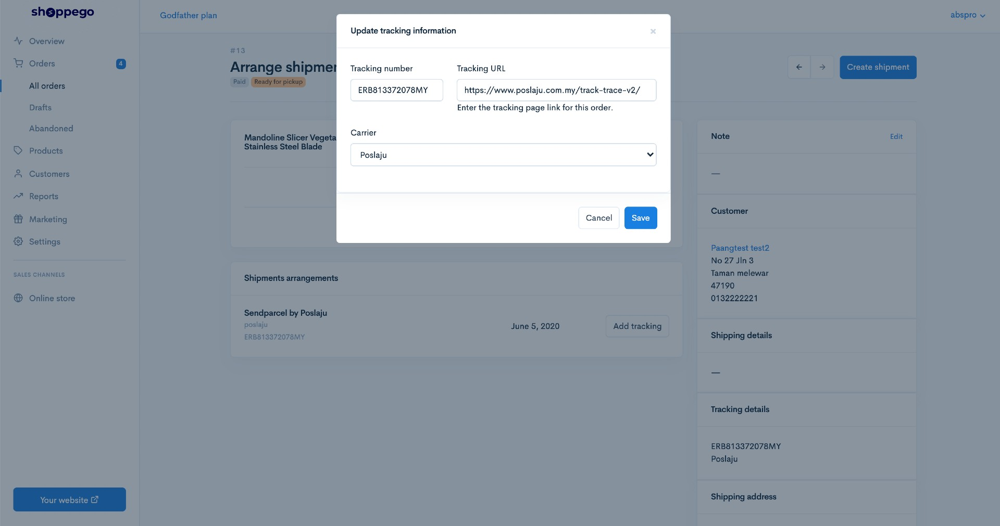
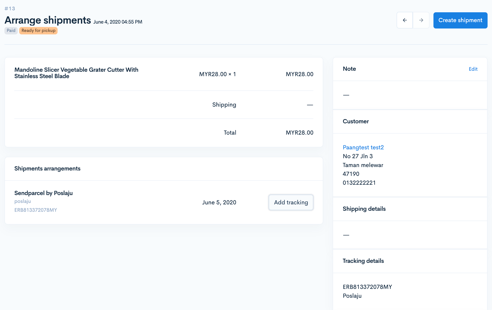
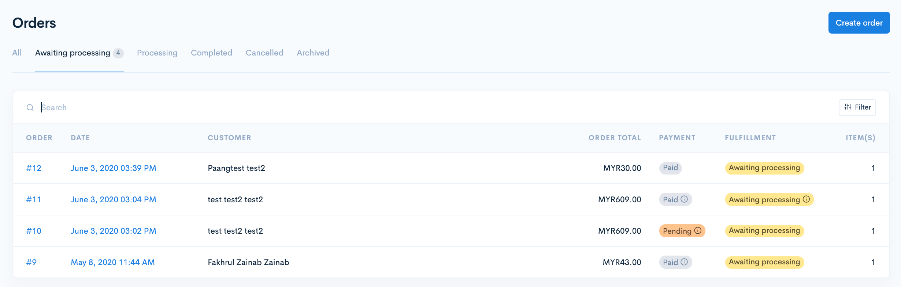

# Sendparcel

Penetapan ini mengandungi 3 bahagian iaitu:


Fungsi ini tersedia untuk **plan Premium** dan **Ultimate**.


* **Bahagian 1**: Di platform Sendparcel
* **Bahagian 2**: Di platform Shoppego
* **Bahagian 3**: Cara Fulfill Order

## Bahagian 1: Penetapan Sendparcel&#x20;

Pastikan anda sudah mempunyai akaun Sendparcel.&#x20;


[Klik sini](https://www.pos.com.my/send/sendparcel.html) untuk pendaftaran [Sendparcel](https://www.pos.com.my/send/sendparcel.html). Pendaftaran Sendparcel adalah **percuma**.&#x20;


1\. Log masuk ke akaun Sendparcel anda. Di panel sebelah kiri, klik pada **Integration** -> **New Store.**

2\. Pilih **Shoppego** sebagai **Store** dan masukkan **nama store serta URL** dan klik **Next**.

3\. Salin **API key** dan **API secret.**

## Bahagian 2: Penetapan di Shoppego

1. Log masuk ke **Dashboad Shoppego** -> **Settings** -> **Shipping Providers** dan klik pada butang **Activate Sendparcel**.&#x20;

<figure><figcaption></figcaption></figure>

2. Klik butang **Edit pada Sendparcel**.&#x20;

<figure><figcaption></figcaption></figure>

3. Masukkan **API KEY** dan **API SECRET** yang telah di dapatkan dari website Sendparcel. Klik butang **Save.**


Tick pada **Enable content** untuk pastikan dibahagian AWB anda terdapat nama produk yang dibeli oleh pelanggan anda. &#x20;


Kini Shoppego anda telah siap di hubungkan dengan platform Sendparcel.&#x20;


Pastikan akaun Sendparcel anda **mempunyai kredit** yang mencukupi untuk mula gunakannya.&#x20;


## Bahagian 3: Cara Fulfill Order

Tutorial penetapan pada bahagian untuk cara urus order bagi menjana Airway Bill di platform Sendparcel tanpa perlu log masuk dan hanya menggunakan platform Shoppego sahaja.&#x20;

1. Log masuk ke **Dashboard Shoppego** -> **Orders.**

2. Pilih dan klik pada order yang hendak dibuat penghantaran menggunakan Sendparcel dan paparan akan keluar seperti dibawah. Klik butang **Arrange Shipment.**

3. Klik butang **Create Shipment.**

4. Klik untuk pilihan courier anda dan terus klik butang **Submit.**

5. Pada order tersebut anda akan dapat lihat shipment yang telah tersedia. Order anda juga akan mendapat tracking number seperti gambar dibawah.&#x20;


**Method**&#x20;

* **Pickup** - Pihak courier akan menghantar kenderaan untuk mengambil barang yang telah di pesan di alamat yang telah ditetapkan pada penetapan Location anda.
* **Dropoff -** Anda sendiri akan pergi ke pejabat pos berhampiran dan hantarkan barang.&#x20;

\
Ketika ini juga satu AWB (Airwaybill) terhadap order ini telah pun **dijana secara automatik**, anda hanya perlu **cetak sahaja AWB** ni dari **platform Sendparcel.**&#x20;


6. Kemaskini Tracking Number dengan klik pada butang **Add tracking** dan paparan seperti gambar di bawah akan keluar. Klik pada butang **Save.**

7. Apabila butang **Save** ditekan, pelanggan anda akan mendapat **email** tentang **nombor tracking** mereka **secara automatik** dari sistem Shoppego. Nombor tracking ini juga akan keluar di sebelah kanan tab Order selepas di simpan.&#x20;

8. Anda juga boleh lihat Orders list untuk memastikan bahawa order tersebut telah diletakkan tracking kepada order tersebut..&#x20;


Ikon **i** untuk anda semak secara pantas **tracking number order** tersebut di dalam ruangan **Fulfillment**.


