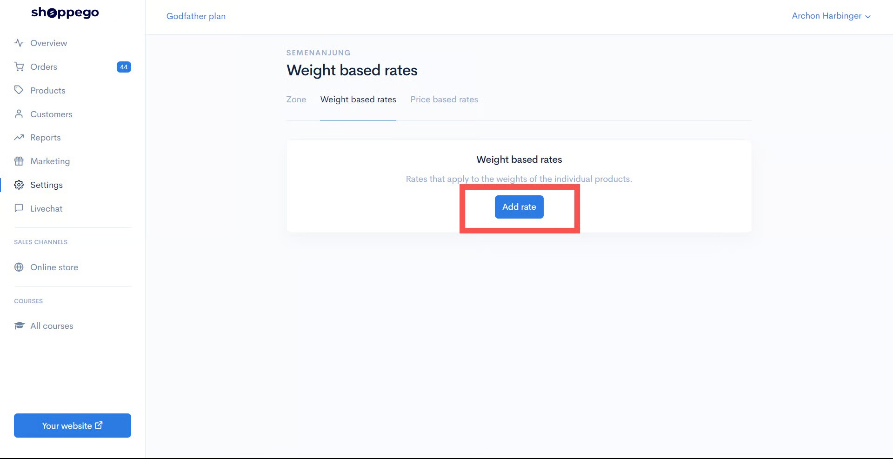
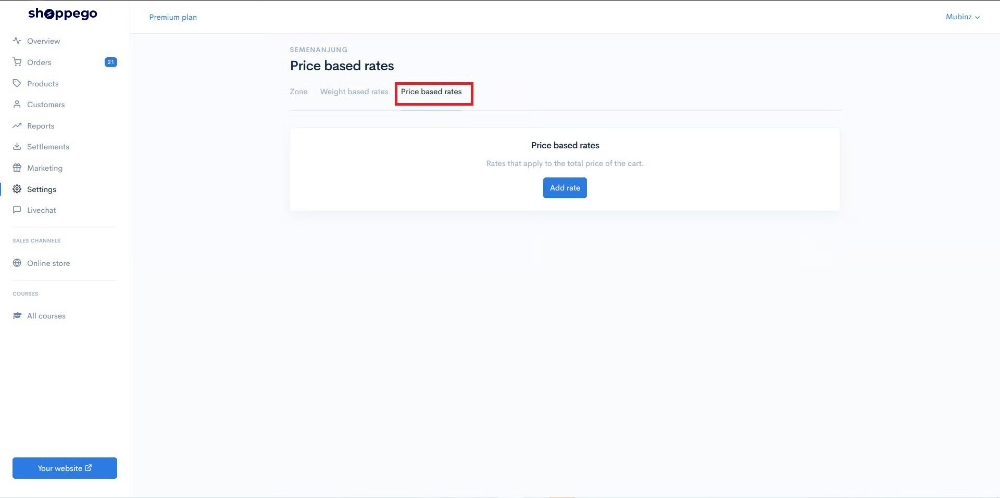
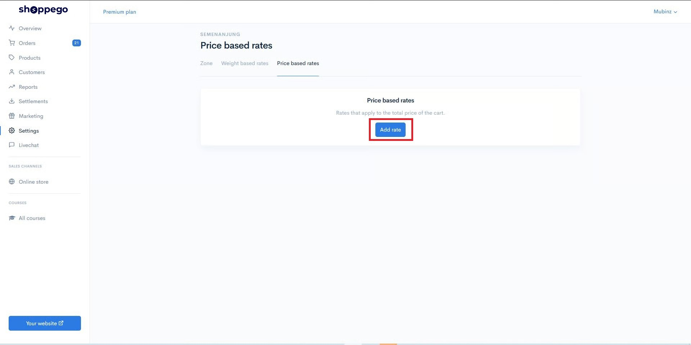

# Shipping

## Penetapan Shipping

1\. Login ke akaun Shoppego anda.

2\. Klik pada **Settings**

3\. Klik pada **Shipping**

4. By default kami sudah sediakan **Shipping mengikut zone** iaitu **:**&#x20;

   * **Semenanjung(West Malaysia)**
   * **Sabah & Sarawak(East Malaysia).**&#x20;

   Klik Butang **Edit** pada mana - mana zone yang anda ingin lakukan penetapan **Shipping**.

5\. Klik pada mana-mana rates yang anda ingin tetapkan.

* **Weight Based Rates -** Caj Shipping anda akan berdasarkan **berat produk** anda. Untuk tutorial boleh tekan Page dibawah.

( **Contoh** : Berat item pelanggan anda 1kg jadi shipping rates mereka ialah RM8 by default. )

* **Price Based Rates** - Caj Shipping anda akan berdasarkan **jumlah pembelian pelanggan.** Untuk tutorial boleh tekan Page dibawah.

( **Contoh** : Jumlah pembelian dari pelanggan ialah RM50.00 jadi shipping rates akan mengikut seperti mana yang anda tetapkan.

* **Distance Based Rates** - Caj Shipping anda akan berdasarkan **jarak penetapan lokasi store anda dengan lokasi pelanggan.** Untuk tutorial boleh tekan Page dibawah. **Fungsi ini hanya boleh digunakan untuk langganan plan Ultimate sahaja dan ia perlu digunakan sekali dengan penetapan Geolocation provider.**

( **Contoh** : Jarak lokasi pelanggan dan lokasi anda ialah 10KM jadi shipping rates akan mengikut seperti mana yang anda tetapkan.

 <mark style="color:red;">**Perhatian**</mark>: Bagi **Weight Based Rates, Price Based Rates dan Distance Based Rates&#x20;**<mark style="color:blue;">**boleh diubah**</mark> oleh anda sendiri mengikut caj shipping semasa.


## **Penetapan Weight Based Rates**

Secara asasnya, kami sudah sediakan rates mengikut berat didalam store anda. Jika anda ingin add rates baru anda.&#x20;

1. Anda boleh sahaja tekan butang **Add rate** pada Tab **Weight Based Rates** tersebut ya.

<figure><figcaption></figcaption></figure>

2. Kemudian akan keluar paparan seperti paparan dibawah.

<figure><figcaption></figcaption></figure>

3. Anda boleh masukkan maklumat yang anda inginkan mengikut seperti promo anda.&#x20;

<table><thead><tr><th width="278">Ruang</th><th>Penerangan</th></tr></thead><tbody><tr><td><strong>Name</strong></td><td>Nama Shipping (Contoh : Online Payment).</td></tr><tr><td><strong>Minimum Order Weight (KG)</strong></td><td>Masukkan berat produk yang customer perlu capai untuk dapat Shipping rates tersebut. </td></tr><tr><td><strong>Maximum Order Weight (KG)</strong></td><td>Masukkan nilai maksimum untuk Shipping Rates tersebut.</td></tr><tr><td><strong>Price</strong></td><td>Harga Shipping tersebut.</td></tr><tr><td><strong>Cash On Delivery (COD)</strong></td><td><strong>Hidupkan</strong> jika Shipping anda menggunakan COD.</td></tr></tbody></table>

 <mark style="color:red;">**Perhatian**</mark>: Jika anda ingin lakukan <mark style="color:red;">**Free Shipping**</mark> tetapi menggunakan **Weight Based Rates**. Boleh rujuk tutorial ini:&#x20;



[Weight Based Rates](shipping/free-shipping/weight-based-rates.md)


### Paparan Weight Based Rates

Setelah selesai paparan yang akan keluar pada bahagian checkout anda akan jadi seperti paparan dibawah.

<figure><figcaption></figcaption></figure>

## **Penetapan Price Based Rates**

Secara asasnya, kami sudah sediakan **rates mengikut harga** didalam store anda. Jika anda ingin add rates baru anda.&#x20;

1. Anda boleh sahaja tekan butang **Add rate** pada Tab **Price Based Rates** tersebut ya.

2. Klik pada butang **Add Rate.**

3. Nanti akan keluar popup seperti paparan dibawah.

<figure><figcaption></figcaption></figure>

4. Anda boleh masukkan details yang anda inginkan mengikut seperti promo anda.&#x20;

<table><thead><tr><th width="262">Ruang</th><th>Penerangan </th></tr></thead><tbody><tr><td><strong>Name</strong> </td><td>Nama Shipping (Contoh : Online Payment)</td></tr><tr><td><strong>Minimum Order Price (RM)</strong></td><td>Masukkan jumlah yang pelanggan perlu capai untuk dapatkan Shipping rates tersebut</td></tr><tr><td><strong>Maximum Order Price (RM)</strong></td><td>Masukkan nilai maksimum untuk rates tersebut</td></tr><tr><td><strong>Price</strong> </td><td>Harga Shipping tersebut.</td></tr><tr><td><strong>Cash On Delivery (COD)</strong></td><td><strong>Hidupkan</strong> jika Shipping anda menggunakan COD.</td></tr></tbody></table>

 <mark style="color:red;">**Perhatian**</mark>: Jika anda ingin lakukan <mark style="color:red;">**Free Shipping**</mark> tetapi menggunakan **Price Based Rates**. Boleh rujuk tutorial ini:&#x20;



[Price Based Rates](shipping/free-shipping/price-based-rates.md)


### Paparan Price Based Rates

Setelah selesai paparan yang akan keluar pada bahagian checkout anda akan jadi seperti paparan dibawah.

<figure><figcaption></figcaption></figure>

## **Penetapan Distance Based Rates**


**Fungsi "Distance by rates" ini hanya boleh digunakan untuk langganan plan Ultimate sahaja dan ia perlu digunakan sekali dengan penetapan Geolocation provider.**


Secara asasnya, kami sudah sediakan **rates mengikut harga** didalam store anda. Jika anda ingin add rates baru:

1. Anda boleh sahaja tekan butang **Add rate** pada Tab **Distance Based Rates** tersebut ya.

2. Klik pada butang **Add Rate.**

3. Nanti akan keluar popup seperti paparan dibawah.

<figure><figcaption></figcaption></figure>

4. Anda boleh masukkan details yang anda inginkan mengikut seperti promo anda.&#x20;

<table><thead><tr><th width="262">Ruang</th><th>Penerangan </th></tr></thead><tbody><tr><td><strong>Name</strong> </td><td>Nama Shipping (Contoh : Grab)</td></tr><tr><td><strong>Minimum distance (RM)</strong></td><td>Masukkan jumlah yang pelanggan perlu capai untuk dapatkan Shipping rates tersebut</td></tr><tr><td><strong>Maximum distance (RM)</strong></td><td>Masukkan nilai maksimum untuk rates tersebut</td></tr><tr><td><strong>Price</strong> </td><td>Harga Shipping tersebut.</td></tr><tr><td><strong>Cash On Delivery (COD)</strong></td><td><strong>Hidupkan</strong> jika Shipping anda menggunakan COD.</td></tr></tbody></table>

### Paparan Distance Based Rates

Setelah selesai paparan yang akan keluar pada bahagian checkout anda akan jadi seperti paparan dibawah.

<figure><figcaption></figcaption></figure>

## Penetapan COD Shipping&#x20;

Untuk tutorial **penetapan COD shipping** dan **cara pembayaran**, boleh klik rujuk pada halaman dibawah.


[COD Shipping](shipping/cod-shipping.md)


### Soalan Lazim:

1. Kenapa saya tidak dapat lihat pemilihan shipping di checkout website saya?\
   Jawapan: Untuk isu itu anda perlu pastikan penetapan "Shipping" untuk produk anda sudah ditetapkan dengan betul. Anda boleh pergi pada bahagian: Dashboard Shoppego(Overview) > Klik pada Products > Klik pada produk tersebut > Klik pada tab Shipping > Pastikan anda tick pada toggle "Requires Shipping or Pickup" dan toggle "Global rates" > Setelah selesai klik Save. Anda juga boleh ulang langkah diatas untuk produk lain yang memerlukan pemilihan shipping.
2. Kenapa form checkout website saya tiada ruang untuk pelanggan masukkan maklumat shipping?\
   Jawapan: Untuk itu anda perlu pastikan penetapan "Shipping" untuk produk anda sudah ditetapkan dengan betul. Anda boleh pergi pada bahagian: Dashboard Shoppego(Overview) > Klik pada Products > Klik pada produk tersebut > Klik pada tab Shipping > Pastikan anda tick pada toggle "Requires Shipping or Pickup" > Setelah selesai klik Save. Anda juga boleh ulang langkah diatas untuk produk lain yang memerlukan penghantaran.
3. Kenapa shipping rates yang saya sudah cipta tidak dipaparkan di pemilihan shipping halaman checkout website saya?\
   Jawapan: Untuk itu anda perlu semak semula penetapan Shipping rates anda. Pastikan penetapan minimum/maksimum price/weight/distance based rates shipping anda itu dapat merangkumi keseluruhan order yang boleh dilakukan didalam website anda itu. Untuk penerangan lanjut berkenaan penetapan shipping, anda boleh rujuk pada link ini: <https://my.shoppego.com/courses/ecommerce-game-on-fashion-founders-edition/125>
