# Based on Country

Di dalam Shoppego mempunyai fungsi berbentuk country yang anda boleh gunakan bagi membuat cara penghantaran untuk negara yang luar daripada Malaysia.

Untuk membuat penetapan shipping bagi setiap negara tersebut, ianya boleh dilakukan dengan menambah Shipping Zone yang baru.&#x20;

## Penetapan Shipping Zone

1\. Login ke akaun Shoppego anda.

2\. Klik pada **Settings**

3\. Klik pada **Shipping**

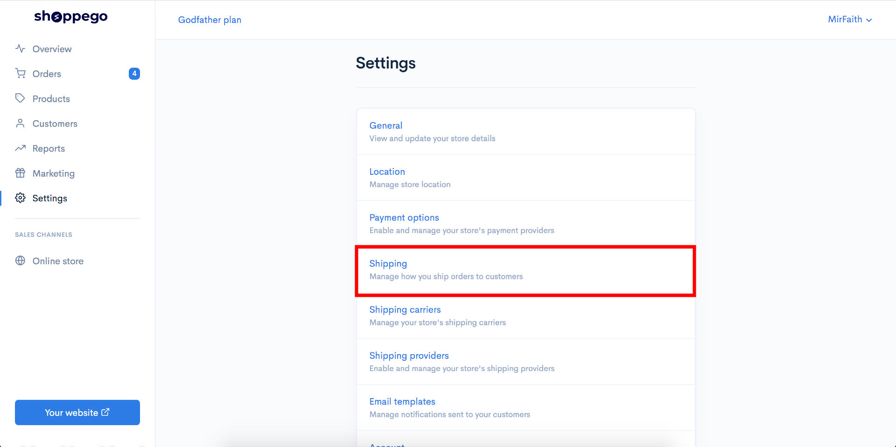

4\. Klik pada butang **Add Shipping Zones**

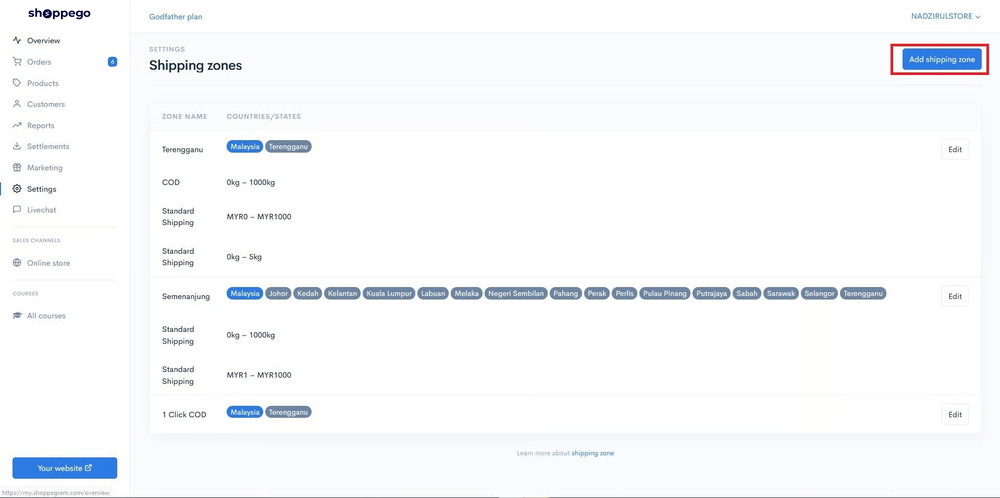

5\. Masukkan sebarang nama yang melambangkan Zone Name anda.  Sebagai contoh anda boleh  masukkan nama negara.

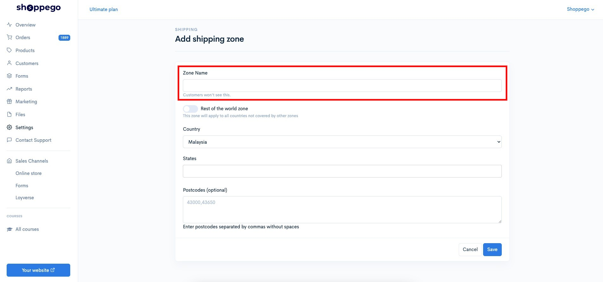

6. Pilih negara yang anda inginkan:

### Pemilihan Negara secara auto

Jika anda ingin terus cipta shipping zone untuk kesemua negara lain yang masih tiada penetapan Shipping zone mereka yang tersendiri, anda boleh tick sahaja pada toggle "Rest of the world zone"

<figure>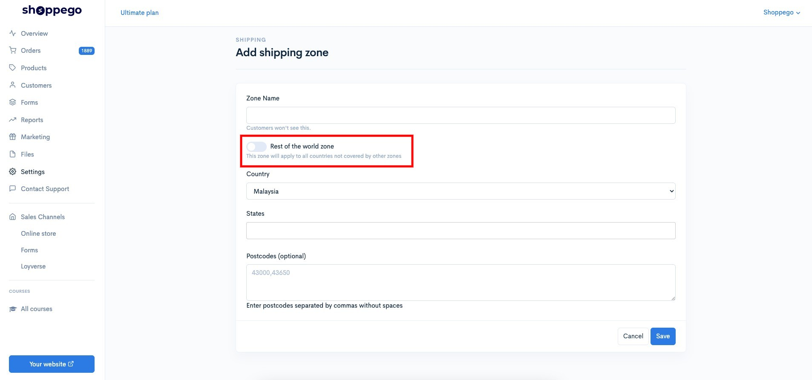<figcaption></figcaption></figure>

Setelah, anda tick nanti, anda sudah tidak perlu lakukan pemilihan penetapan "Country, States, Postcode".

<figure>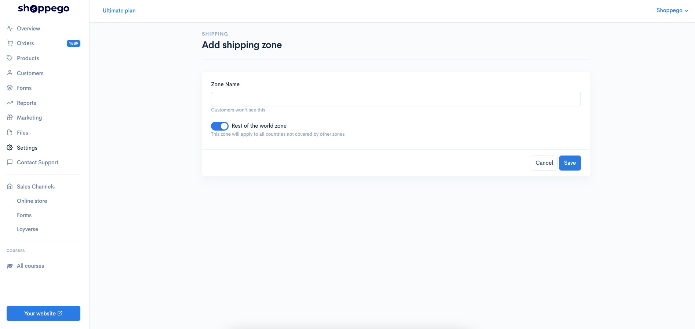<figcaption></figcaption></figure>

### Pemilihan Negara secara 1 per 1

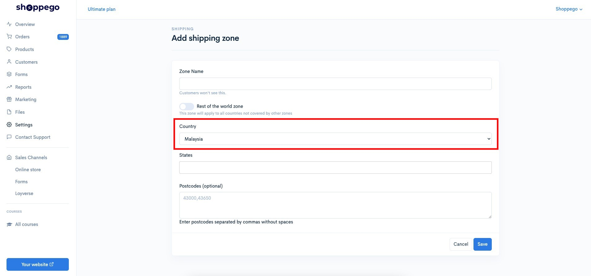

7\. Klik butang **Save**

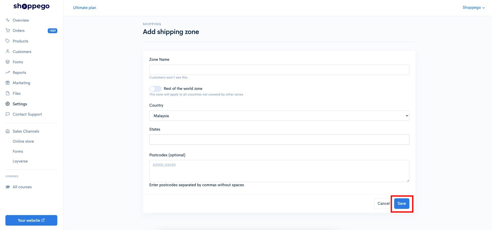

**\*\* Untuk penetapan shipping bagi negara yang mempunyai daerah anda boleh membuat pemilihan daerah sekali.**

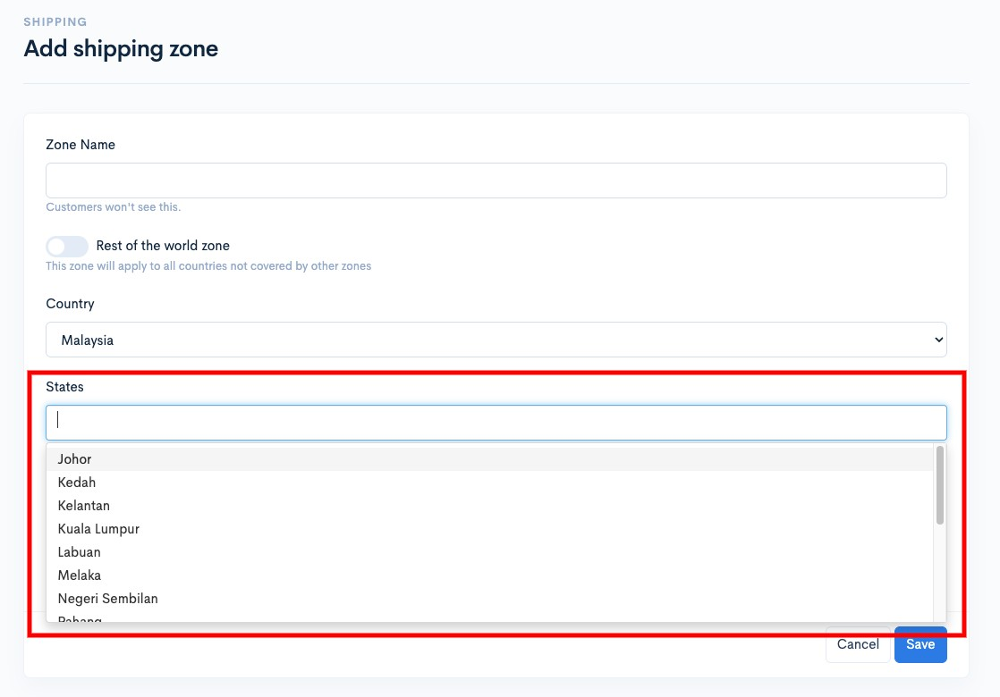

Kini zon anda telah berjaya dicipta dan klik butang **Edit** pada zon khas tersebut.&#x20;

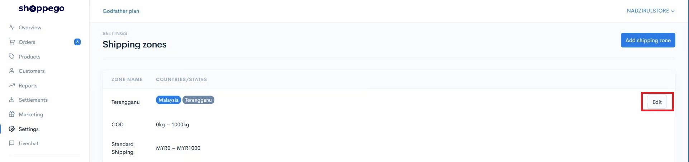

## Penetapan Shipping Rates

1. Seterusnya klik pada tab **Weight based rates**&#x20;

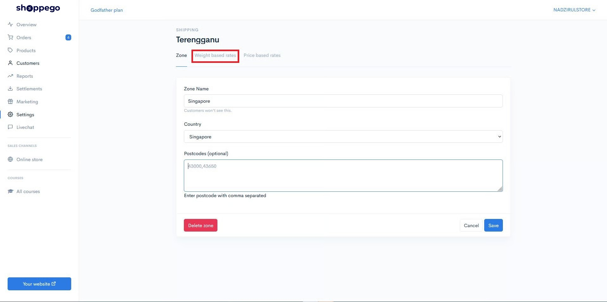

2. Klik **Add rate**

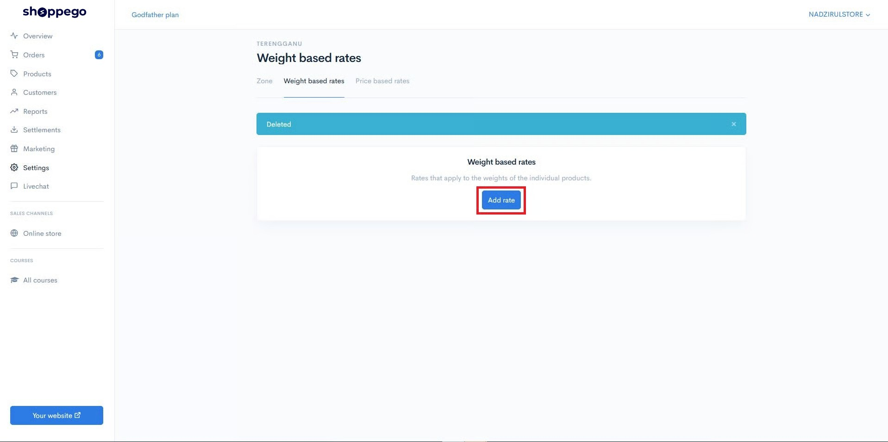

Isikan maklumat penghantaran khas anda pada ruangan ini:

* Pada bahagian **Name** ini kalau boleh isikan lebih detail sedikit, kerana maklumat ini akan dipaparkan semasa pelanggan membuat pilihan penghantaran nanti.
* Pada bahagian **Minimum weight** dan **Maximum Weight** anda boleh masukkan berat minimum dan maksimum untuk rates tersebut.
* Masukkan harga yang anda mahukan pada bahagian **Price**.&#x20;
* Setelah selesai, anda boleh klik butang **Save**

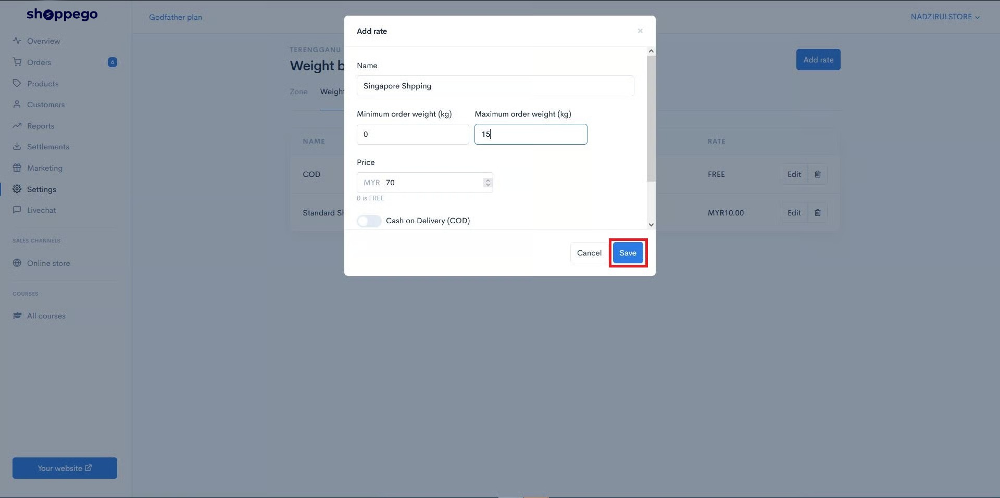

## **Contoh**&#x20;

Penetapan yang telah ditetapkan tadi adalah:

* Semasa proses checkout dibahagian pengisian maklumat shipping. Pelanggan akan dapat lihat pemilihan country bagi shipping yang anda sudah tetapkan di bahagian atas sekali.

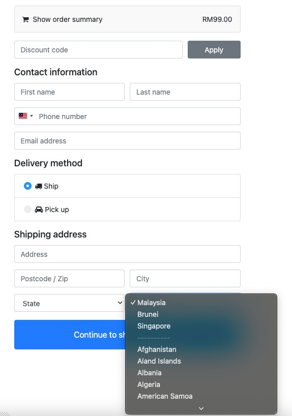

* Jika Shipping untuk negara tersebut anda tidak tetapkan, maka semasa pemilihan shipping rates nanti pelanggan tidak akan dapat lihat sebarang pemilihan shipping rates.

<figure>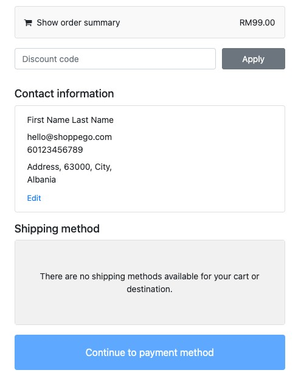<figcaption></figcaption></figure>
