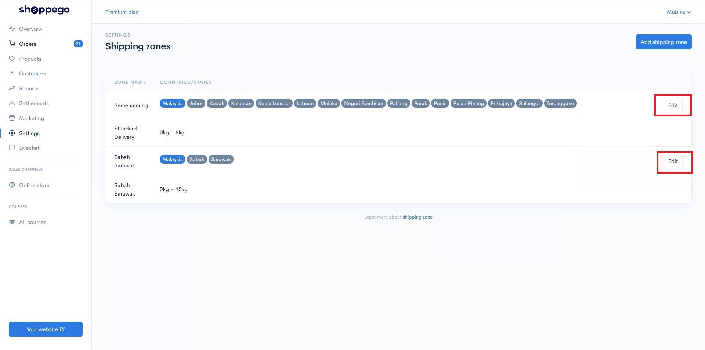
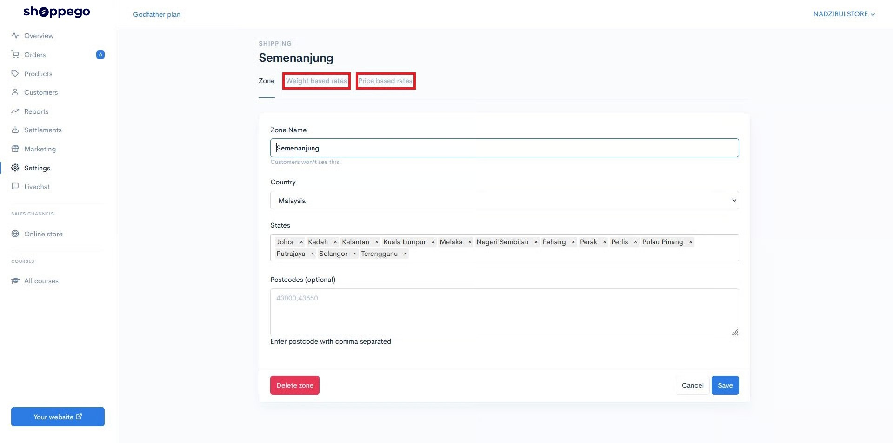
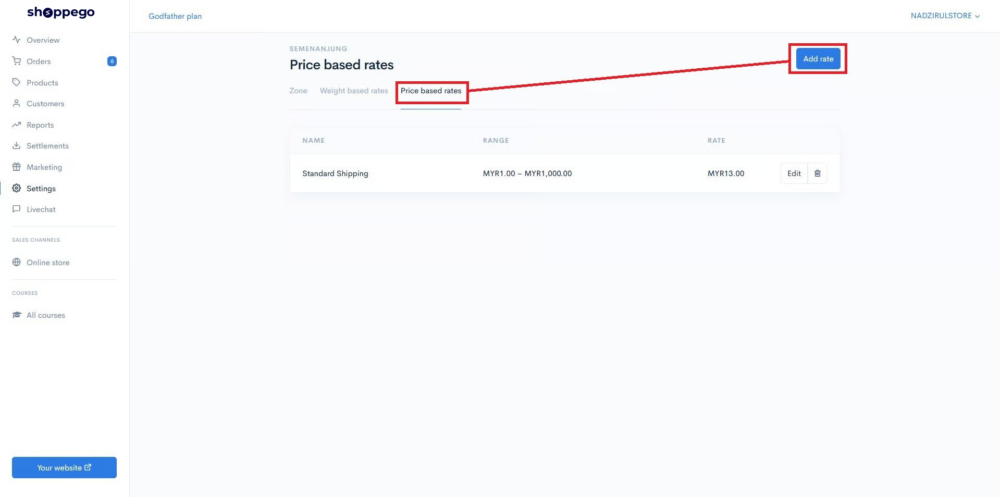
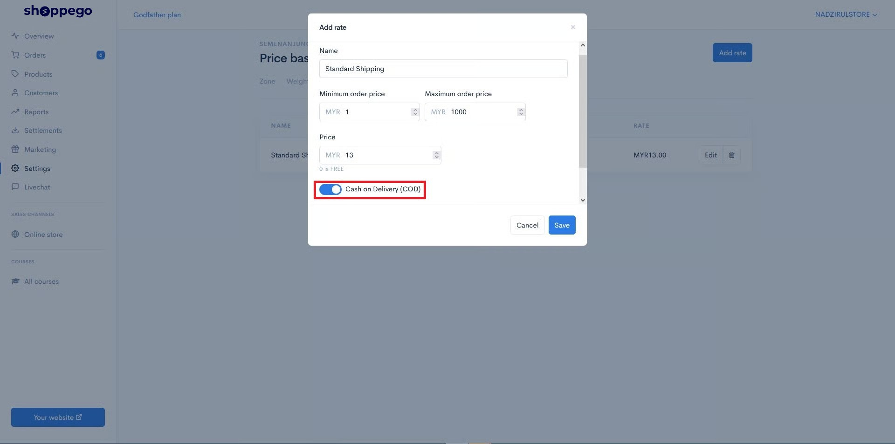
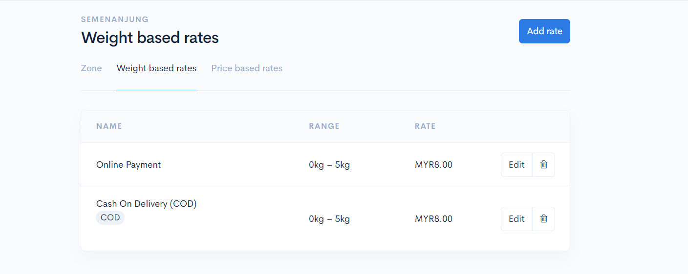
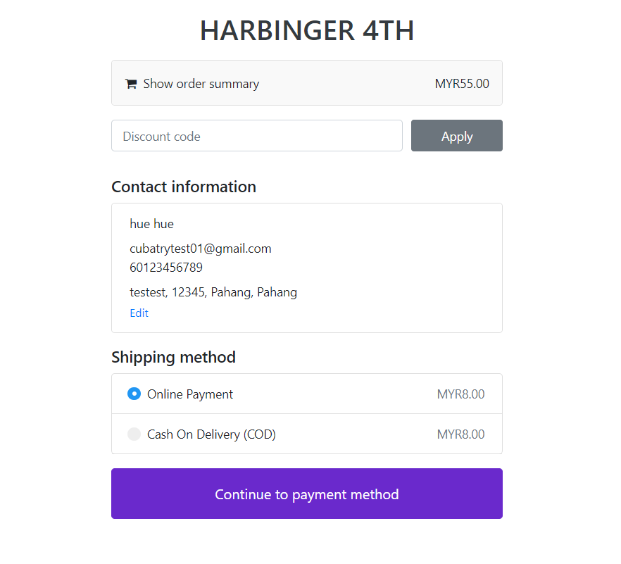

# COD Shipping

## Penetapan COD Shipping

1\. Klik pada Settings -> Shipping

2. Selepas klik butang **Shipping** akan terdapat **2 Zone** yang tersedia untuk **Edit** iaitu :&#x20;

   * **Zone Semenanjung Malaysia**&#x20;
   * **Zone Sabah Sarawak**.&#x20;

   Kedua-dua zone boleh digunakan untuk edit.

‌3. Pilih **Semenanjung** atau **Sabah Sarawak** dan klik butang **Edit** dan akan keluar paparan seperti berikut.

Anda boleh tentukan harga COD berdasarkan 2 cara iaitu :

* **Weight Based Rates** kadar **kos shipping berdasarkan Berat.**
* **Price Based Rates** kadar **kos shipping berdasarkan Harga.**

### Contoh Penetapan Price Based Rates.

1. Klik tab Price based rates -> Add rate.&#x20;

2. Satu **paparan** akan keluar untuk diisikan maklumat.

<table><thead><tr><th width="263">Ruang</th><th>Penerangan</th></tr></thead><tbody><tr><td><strong>Name</strong></td><td>Nama Shipping (Contoh : Online Payment).</td></tr><tr><td><strong>Minimum Order Price (RM)</strong></td><td>Masukkan jumlah yang pelanggan perlu capai untuk dapatkan Shipping rates tersebut.</td></tr><tr><td><strong>Maximum Order Price (RM)</strong></td><td>Masukkan nilai maksimum untuk Shipping Rates tersebut.</td></tr><tr><td><strong>Price</strong></td><td>Harga Shipping tersebut.</td></tr><tr><td><strong>Cash On Delivery (RM)</strong></td><td><strong>Hidupkan</strong> jika Shipping anda menggunakan COD.</td></tr></tbody></table>

3. Teruskan tekan butang **Add** dan hidupkan toggle **Cash On Delivery (COD)**.

## Toggle Cash On Delivery (COD)

Untuk penetapan **2 jenis Shipping Method**, anda boleh lakukan penetapan pada toggle **Cash On Delivery.**

 <mark style="color:red;">**Perhatian**</mark>: Jika tanda **Cash On Delivery** <mark style="color:red;">**tidak dihidupkan**</mark>, pelanggan anda akan melihat **senarai pembayaran** selain dari **COD** seperti **Securepay, Bizzapay,** dan **lain lain**


Sekiranya anda ingin mempunyai 2 jenis cara pembayaran, anda perlu **cipta 2 jenis rate** iaitu :&#x20;

* **Online Payment.**
* **Cash On Delivery.**


**Nama rate** adalah **mengikut kreativiti** masing masing.


<figure><figcaption></figcaption></figure>

Paparan yang akan keluar pada page anda ialah dibawah ini.

<figure><figcaption></figcaption></figure>

### Soalan Lazim:

1. Kenapa saya sudah aktifkan payment COD, tetapi dekat checkout tiada pemilihan tersebut?\
   Jawapan: Untuk itu, anda perlu pastikan anda sudah cipta shipping rates jenis COD di website anda itu.
2. Boleh ke saya nak ada pemilihan jenis bayaran selain dari COD juga di checkout?\
   Jawapan: Boleh sahaja, cuma anda perlu pastikan anda sudah cipta 2 jenis shipping rates iaitu Shipping biasa(bukan COD) dan Shipping COD. Sekiranya, pelanggan pilih Shipping biasa, mereka hanya akan dapat lihat pemilihan bayaran selain dari COD. Manakala, jika pelanggan pilih Shipping biasa, meraka hanya akan dapat lihat pemilihan bayaran COD sahaja.
