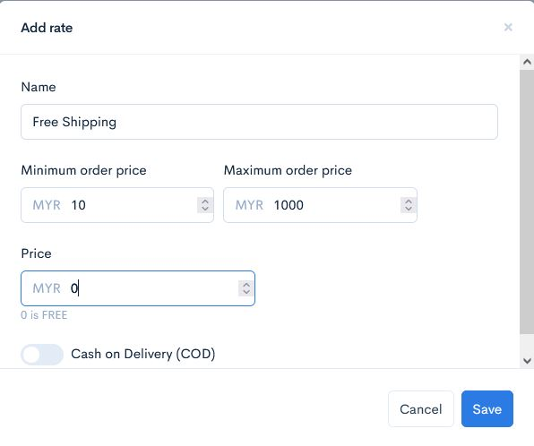
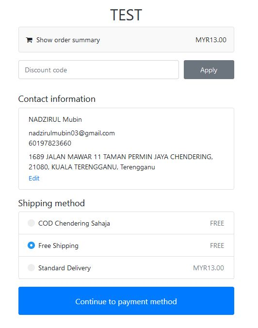
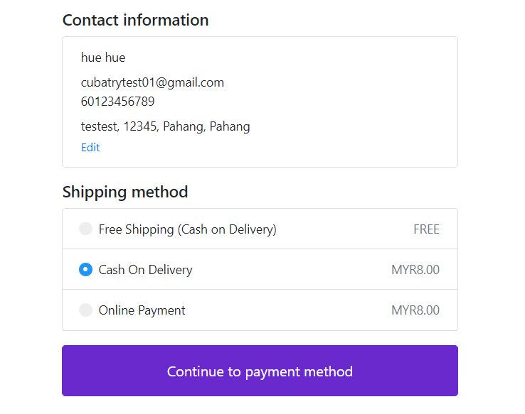

# Price Based Rates

## Setup Free Shipping Based on Price Based Rates

1\. Login ke akaun **Shoppego anda**.

2\. Klik pada **Settings**

3\. Klik pada **Shipping**

4\. Klik Butang **Edit** pada mana - mana zone yang anda ingin apply setting **Free Shipping** ini.

5\. Klik pada **Price Based Rates.**

6\. Klik pada butang **Add rate.**

7\. Nanti akan keluar **popup** seperti paparan dibawah.

8\. Anda boleh masukkan details yang anda inginkan mengikut seperti promo anda. \
Pada bahagian:&#x20;

* <mark style="color:red;">**Name**</mark>**&#x20;= Masukkan&#x20;**<mark style="color:red;">**nama promosi**</mark>**&#x20;anda**
* <mark style="color:red;">**Minimum order price**</mark>**&#x20;= Masukkan nilai yang customer perlu capai untuk dapat&#x20;**<mark style="color:red;">**Free Shipping**</mark>**&#x20;tersebut**
* <mark style="color:red;">**Maximum order price**</mark>**&#x20;= Masukkan nilai max (100000)**
* <mark style="color:red;">**Price**</mark>**&#x20;= Biarkan nilainya 0**

9\. Setelah selesai anda boleh klik butang **Add** dan semak promosi Free Shipping yang anda sudah tetapkan tadi.

## Contoh

Setelah selesai paparan yang akan keluar pada bahagian checkout anda akan jadi seperti paparan dibawah.

## Info Tambahan

 <mark style="color:red;">**Perhatian**</mark>: Pastikan penetapan anda pada **Price Based Rate** adalah <mark style="color:red;">**tidak sama**</mark> dengan **Weight Based Rate** untuk mengelakkan <mark style="color:red;">**nilai yang bertindan**</mark> pada Shipping Method Page anda seperti gambar di bawah.


<figure><figcaption></figcaption></figure>
