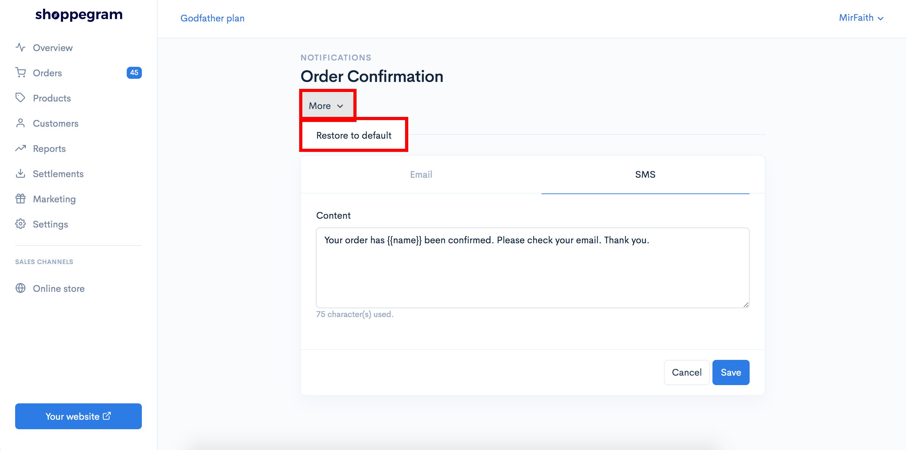
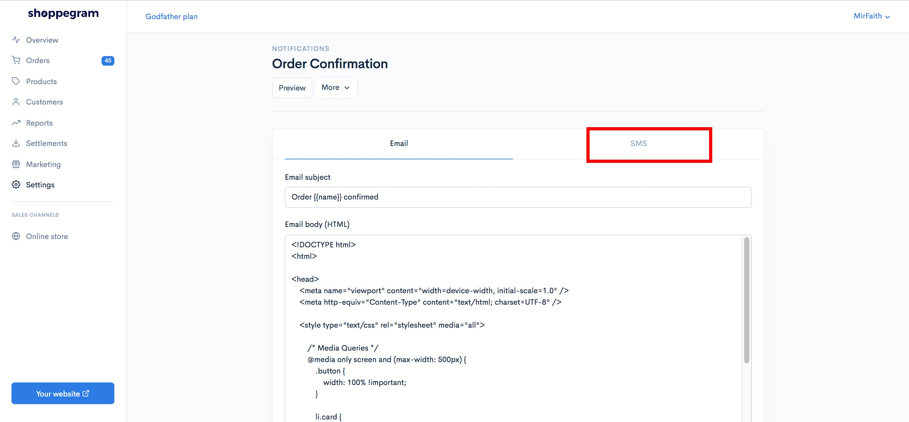
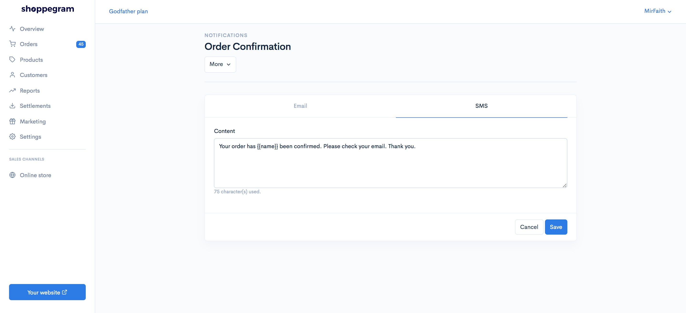
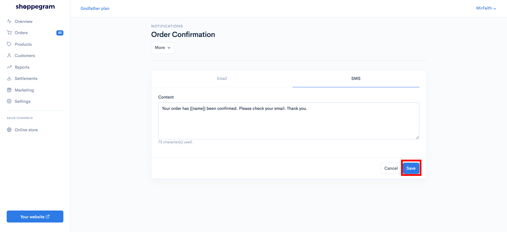
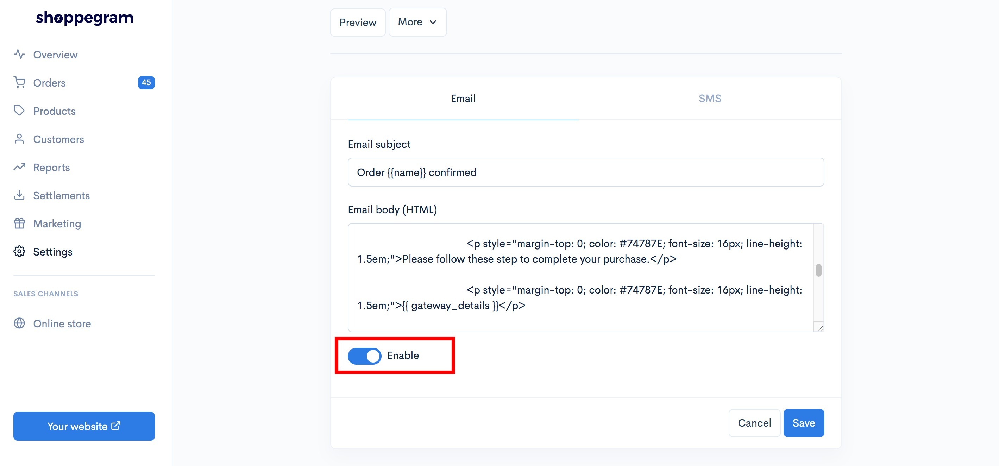

# SMS Provider

Di Commerce, anda boleh hubungkan website anda dengan sistem SMS Provider seperti:


[Twilio](sms-provider/twilio.md)



[AdaSMS](sms-provider/adasms.md)



[KlasikSMS](sms-provider/klasiksms.md)


Sebelum memulakan penetapan berikut, anda perlu membuat penetapan notification SMS message yang akan dihantar terlebih dahulu.



* Features ini hanya available untuk **plan&#x20;**<mark style="color:red;">**Premium**</mark> dan <mark style="color:red;">**Ultimate**</mark> sahaj&#x61;**.**
* SMS notifications yang boleh dihantar kepada pelanggan hanyalah <mark style="color:red;">**Order confirmation, Order shipped, Order review, Order packed**</mark> dan <mark style="color:red;">**Order ready for pickup**</mark> sahaja buat masa sekarang.
  

## **Info tambahan**

**Untuk pengguna yang sudah lama menggunakan sistem Commerce anda perlu klik membuat tetapan Restore to default** terlebih dahulu untuk menggunakan fungsi ini.

**Pada page Order Confirmation** -> **SMS**, anda boleh klik button **More** -> **Restore to default**

## **Penetapan di Shoppego**

1\. Log masuk ke akaun Shoppego anda.

2\. Klik pada tab **Settings**

3\. Klik pada tab **Notifications**

4\. Klik butang **Edit** pada tab Order Confirmation

5\. Klik pada tab **SMS**

6\. Pada ruangan **Content**, anda boleh masukkan text/message yang anda ingin dihantar kepada customer setelah mereka membuat pembayaran diwebsite anda.&#x20;

7\. Setelah selesai anda boleh klik **Save**

8\. Anda perlu pastikan Order Confirmation tersebut berada dalam keadaan **Enable**. ( Pastikan ia bewarna biru )

Setelah selesai, anda boleh membuat penetapan sistem SMS notification yang anda pilih.
